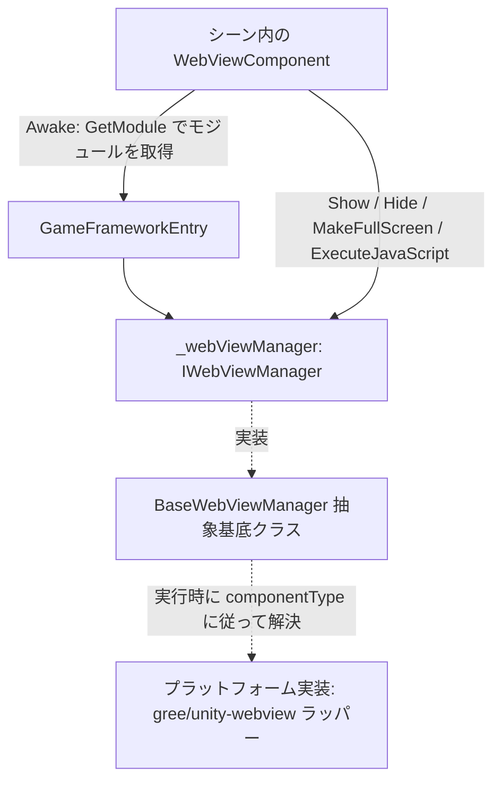

# 動作原理:コンポーネントがどのように WebView を駆動するか

`WebViewComponent` はシーンにアタッチされる GameFrameworkComponent のシェルであり、`Awake` 内で `GameFrameworkEntry.GetModule<IWebViewManager>()` を通じてマネージャーを取得し、`Show` / `Hide` / `MakeFullScreen` / `ExecuteJavaScript` をすべてマネージャーへ転送します。本パッケージはインターフェース(`IWebViewManager`)、抽象基底クラス(`BaseWebViewManager`)、およびコンポーネントシェルのみを定義しており、具体的なプラットフォーム実装は [gree/unity-webview](https://github.com/gree/unity-webview) のラッパーで、実行時に `componentType` に従って解決・組み立てられます。

## コンポーネントの階層構造

| 層 | 実際の型 | 所在ファイル | 役割 |
|----|----------|----------|------|
| コンポーネントシェル | `WebViewComponent : GameFrameworkComponent` | `Runtime/WebViewComponent.cs` | Unity シーンのエントリーポイント。モジュールの組み立てと呼び出しの転送を担当 |
| インターフェース | `IWebViewManager` | `Runtime/IWebViewManager.cs` | `Initialize` / `Show` / `MakeFullScreen` / `ExecuteJavaScript` / `Hide` の5つのメソッドを定義 |
| 抽象基底クラス | `BaseWebViewManager : GameFrameworkModule, IWebViewManager` | `Runtime/BaseWebViewManager.cs` | プラットフォーム実装の基底クラス。5つのメソッドはすべて `abstract` |
| 具象実装 | 実行時に `componentType` に従って解決(このリポジトリには含まれない) | — | gree/unity-webview に基づくプラットフォーム Web View 機能 |

## 呼び出しチェーン



## 起動シーケンス

1. `Awake` で実装型とインターフェース型を設定し、その後 `GameFrameworkEntry` からモジュールを取得します。取得できない場合は Fatal ログを記録し、以降の初期化を中止します:

```csharp
protected override void Awake()
{
    ImplementationComponentType = Utility.Assembly.GetType(componentType);
    InterfaceComponentType = typeof(IWebViewManager);
    base.Awake();
    if (!IsRuntimeComponentReady)
    {
        return;
    }

    _webViewManager = GameFrameworkEntry.GetModule<IWebViewManager>();
    if (_webViewManager == null)
    {
        Log.Fatal("Web View manager is invalid.");
        return;
    }
}
```

出典： [WebViewComponent.cs](https://github.com/GameFrameX/com.gameframex.unity.webview/blob/main/Runtime/WebViewComponent.cs#L22-L38)

2. `Start` 内で `_webViewManager.Initialize()` を一度呼び出し、マネージャーの初期化を完了します。`Awake` でモジュールを取得できなかった場合は、ここで即座にリターンします:

```csharp
private void Start()
{
    if (_webViewManager == null)
    {
        return;
    }

    _webViewManager.Initialize();
}
```

出典： [WebViewComponent.cs](https://github.com/GameFrameX/com.gameframex.unity.webview/blob/main/Runtime/WebViewComponent.cs#L40-L48)

## 公開 API の転送方法

コンポーネントの4つの公開メソッドはすべて一行での転送であり、プラットフォーム固有のロジックは一切含まれていません:

```csharp
public void Show(string url)
{
    _webViewManager.Show(url);
}

public void MakeFullScreen()
{
    _webViewManager.MakeFullScreen();
}

public void ExecuteJavaScript(string javaScript)
{
    _webViewManager.ExecuteJavaScript(javaScript);
}

public void Hide()
{
    _webViewManager.Hide();
}
```

出典： [WebViewComponent.cs](https://github.com/GameFrameX/com.gameframex.unity.webview/blob/main/Runtime/WebViewComponent.cs#L51-L83)

マネージャー側の契約(`BaseWebViewManager` はこれらを `abstract` として宣言し、プラットフォームのサブクラスが実装します):

```csharp
public interface IWebViewManager
{
    void Initialize();
    void Show(string url);
    void MakeFullScreen();
    void ExecuteJavaScript(string javaScript);
    void Hide();
}
```

出典： [IWebViewManager.cs](https://github.com/GameFrameX/com.gameframex.unity.webview/blob/main/Runtime/IWebViewManager.cs#L12-L40)

## ユーザーコードからコンポーネントへのアクセス方法

README に記載されている使用方法に従い、シーンに `WebViewComponent` を配置した後、直接呼び出します:

```csharp
using GameFrameX.WebView.Runtime;
using UnityEngine;

public class Example : MonoBehaviour
{
    void Start()
    {
        var webView = FindObjectOfType<WebViewComponent>();
        webView.Show("https://gameframex.doc.alianblank.com");
    }
}
```

出典： [README.zh-CN.md](https://github.com/GameFrameX/com.gameframex.unity.webview/blob/main/README.zh-CN.md#L102-L116)

## ソースファイル早見表

| ファイル | 説明 |
|------|------|
| [WebViewComponent.cs](https://github.com/GameFrameX/com.gameframex.unity.webview/blob/main/Runtime/WebViewComponent.cs) | コンポーネントシェル:モジュールの組み立て、初期化、4つの公開メソッドの転送。`[DisallowMultipleComponent]` + `[AddComponentMenu("Game Framework/WebView")]` |
| [IWebViewManager.cs](https://github.com/GameFrameX/com.gameframex.unity.webview/blob/main/Runtime/IWebViewManager.cs) | マネージャーインターフェース。5つのメソッドの契約 |
| [BaseWebViewManager.cs](https://github.com/GameFrameX/com.gameframex.unity.webview/blob/main/Runtime/BaseWebViewManager.cs) | 抽象基底クラス。`GameFrameworkModule` を継承しインターフェースを実装 |
| [WebViewComponentInspector.cs](https://github.com/GameFrameX/com.gameframex.unity.webview/blob/main/Editor/WebViewComponentInspector.cs) | Editor ディレクトリ内のコンポーネント Inspector(このページではその実装の詳細は扱いません) |
| [WebViewCloseEventArgs.cs](https://github.com/GameFrameX/com.gameframex.unity.webview/blob/main/Runtime/EventArgs/WebViewCloseEventArgs.cs) / [WebViewReceivedMessageEventArgs.cs](https://github.com/GameFrameX/com.gameframex.unity.webview/blob/main/Runtime/EventArgs/WebViewReceivedMessageEventArgs.cs) | Runtime/EventArgs 配下のクローズ / メッセージ受信イベント引数定義(フィールドの詳細はソースコードを参照してください) |
| [GameFrameXWebViewCroppingHelper.cs](https://github.com/GameFrameX/com.gameframex.unity.webview/blob/main/Runtime/GameFrameXWebViewCroppingHelper.cs) | Runtime ディレクトリ配下のクロッピングヘルパークラス(このページではその実装の詳細は扱いません) |

## 関連リンク

- [README.zh-CN.md](https://github.com/GameFrameX/com.gameframex.unity.webview/blob/main/README.zh-CN.md) — インストール方法、使用例、依存関係の説明(`com.gameframex.unity` 1.0.0 に依存)
- [Game Frame X 公式ドキュメント](https://gameframex.doc.alianblank.com)
- [gree/unity-webview](https://github.com/gree/unity-webview) — 本コンポーネントがラップする基盤となる Web View 実装。Android と iOS に対応