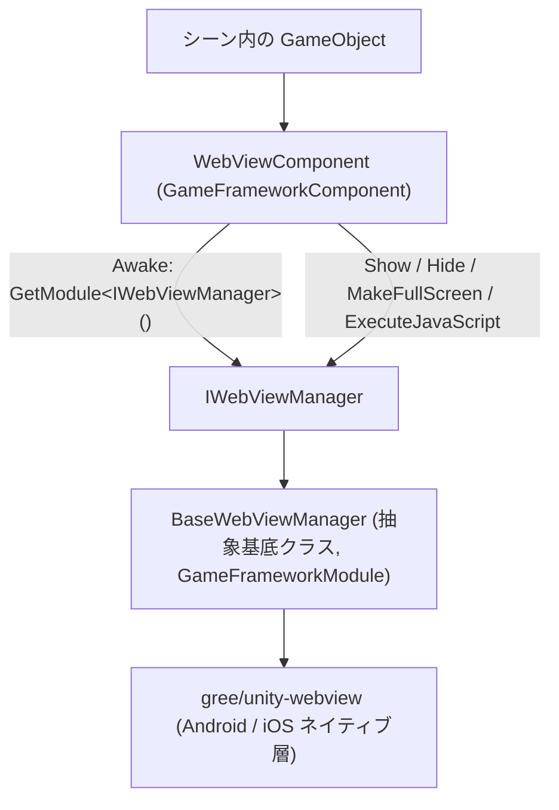

# プロジェクト概要:Unity 埋め込み Web コンポーネント

Game Frame X Web View は、Game Frame X フレームワーク向けの Unity 埋め込み Web コンポーネントです。[gree/unity-webview](https://github.com/gree/unity-webview) をラップしており、Android / iOS ゲームにおいて一つのコンポーネントで Web ページの表示や JavaScript の実行ができ、統一インターフェース `IWebViewManager` を通じてフレームワークのモジュール体系に組み込めます。

## クイックスタート

### 1. パッケージのインストール

以下のいずれかの方法で `com.gameframex.unity.webview` を Unity プロジェクトに追加します:

**方法 A:scoped registry(推奨)** —— `Packages/manifest.json` を編集します:

```json
{
  "scopedRegistries": [
    {
      "name": "GameFrameX",
      "url": "https://gameframex.upm.alianblank.uk",
      "scopes": [
        "com.gameframex"
      ]
    }
  ],
  "dependencies": {
    "com.gameframex.unity.webview": "1.0.0"
  }
}
```

**方法 B:Git URL** —— `manifest.json` の `dependencies` に直接記述します:

```json
{
  "dependencies": {
    "com.gameframex.unity.webview": "https://github.com/gameframex/com.gameframex.unity.webview.git"
  }
}
```

出典:[README.md](https://github.com/GameFrameX/com.gameframex.unity.webview/blob/main/README.md#L43-L70)

Unity の **Package Manager** で **Add package from git URL** を使って `https://github.com/gameframex/com.gameframex.unity.webview.git` を入力することもできますし、リポジトリを `Packages` ディレクトリに直接クローンすれば自動的に読み込まれます。

> 依存関係:`com.gameframex.unity` 1.0.0 が同時に利用可能である必要があります([README.md](https://github.com/GameFrameX/com.gameframex.unity.webview/blob/main/README.md#L126-L131) を参照)。

### 2. コンポーネントのアタッチ

シーン内の GameFramework オブジェクト(または任意のオブジェクト)に対して、**Add Component → Game Framework → WebView** で `WebViewComponent` を追加します。コンポーネントは `Start` のタイミングでマネージャーの初期化を自動的に行います:

```csharp
private void Start()
{
    if (_webViewManager == null)
    {
        return;
    }

    _webViewManager.Initialize();
}
```

出典:[WebViewComponent.cs](https://github.com/GameFrameX/com.gameframex.unity.webview/blob/main/Runtime/WebViewComponent.cs#L40-L48)

### 3. Web ページの表示

```csharp
using GameFrameX.WebView.Runtime;
using UnityEngine;

public class Example : MonoBehaviour
{
    void Start()
    {
        var webView = FindObjectOfType<WebViewComponent>();
        webView.Show("https://gameframex.doc.alianblank.com");
    }
}
```

出典:[README.md](https://github.com/GameFrameX/com.gameframex.unity.webview/blob/main/README.md#L102-L116)

### 4. よく使う API 一覧

| 名称 | シグネチャ | 説明 |
|------|------|------|
| Web ページ表示 | `Show(string url)` | WebView を表示し、指定された URL を読み込みます |
| 非表示 | `Hide()` | WebView を非表示にします |
| 全画面 | `MakeFullScreen()` | WebView を全画面に設定します |
| スクリプト実行 | `ExecuteJavaScript(string javaScript)` | Web ページ内で JavaScript コードを実行します |

以上のメソッドはいずれも `WebViewComponent` 上の public メソッドであり、そのまま `IWebViewManager` の実装へ転送されます([WebViewComponent.cs](https://github.com/GameFrameX/com.gameframex.unity.webview/blob/main/Runtime/WebViewComponent.cs#L51-L83) および [IWebViewManager.cs](https://github.com/GameFrameX/com.gameframex.unity.webview/blob/main/Runtime/IWebViewManager.cs#L12-L40) を参照)。

## 動作原理の概要

コンポーネントの階層はシンプルです:シーン内の `WebViewComponent`(`GameFrameworkComponent` を継承)は転送のみを行い、実際の動作は `IWebViewManager` を実装するマネージャー(`BaseWebViewManager` が抽象基底クラス)が担い、その下層ではラップされた gree/unity-webview がネイティブ WebView のレンダリングを受け持ちます。



重要な呼び出しチェーン(ソースコードで確認済み):

1. `WebViewComponent.Awake()` は `GameFrameworkEntry.GetModule<IWebViewManager>()` でモジュールインスタンスを取得し、失敗した場合は `Log.Fatal("Web View manager is invalid.")` を呼び出します([WebViewComponent.cs](https://github.com/GameFrameX/com.gameframex.unity.webview/blob/main/Runtime/WebViewComponent.cs#L22-L38))。
2. `Start()` 内で `_webViewManager.Initialize()` を呼び出して初期化を完了します([WebViewComponent.cs](https://github.com/GameFrameX/com.gameframex.unity.webview/blob/main/Runtime/WebViewComponent.cs#L40-L48))。
3. `BaseWebViewManager` は抽象メソッドとして `Initialize / Show / MakeFullScreen / ExecuteJavaScript / Hide` を宣言しています([BaseWebViewManager.cs](https://github.com/GameFrameX/com.gameframex.unity.webview/blob/main/Runtime/BaseWebViewManager.cs#L11-L39))。

リポジトリにはこのほか、`Runtime/EventArgs/` 配下のイベント引数 `WebViewCloseEventArgs`、`WebViewReceivedMessageEventArgs`、カスタム Inspector である `Editor/WebViewComponentInspector.cs`、クロッピング補助クラス `GameFrameXWebViewCroppingHelper.cs` が含まれており、メッセージコールバックとエディター拡張に使用されます。

## 次のステップ

- 使用方法の詳細とドキュメントサイト:[Game Frame X Documentation](https://gameframex.doc.alianblank.com)([README.md](https://github.com/GameFrameX/com.gameframex.unity.webview/blob/main/README.md#L132-L134))
- 各インターフェースの完全なシグネチャ:[IWebViewManager.cs](https://github.com/GameFrameX/com.gameframex.unity.webview/blob/main/Runtime/IWebViewManager.cs#L12-L40)
- コンポーネントのライフサイクルと転送の実装:[WebViewComponent.cs](https://github.com/GameFrameX/com.gameframex.unity.webview/blob/main/Runtime/WebViewComponent.cs#L13-L84)
- 抽象基底クラスの拡張ポイント:[BaseWebViewManager.cs](https://github.com/GameFrameX/com.gameframex.unity.webview/blob/main/Runtime/BaseWebViewManager.cs#L11-L39)
- バージョン履歴:[CHANGELOG.md](https://github.com/GameFrameX/com.gameframex.unity.webview/blob/main/CHANGELOG.md) と [Releases](https://github.com/GameFrameX/gameframex/com.gameframex.unity.webview/releases)