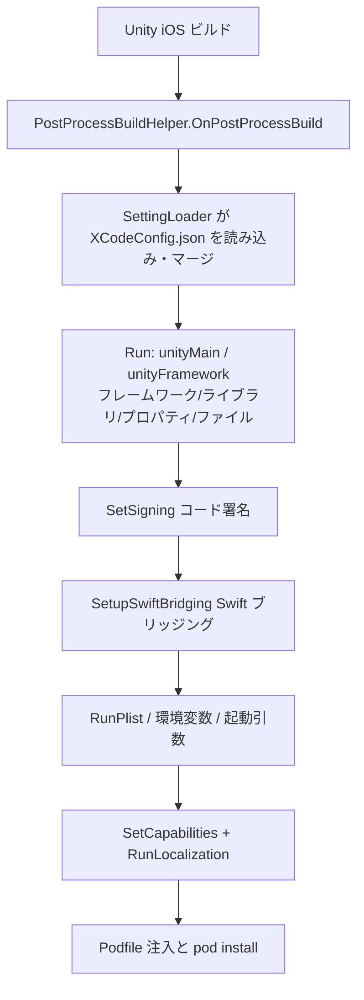

# Xcode ビルド設定パッケージ概要

GameFrameX Xcode 設定パッケージ(com.gameframex.unity.xcode)を使えば、1 つの `XCodeConfig.json` だけで iOS ビルド後の Xcode プロジェクト設定を自動的に完了できます:Info.plist、システムフレームワーク/ライブラリ、Build Settings、Capabilities、ローカライズ、CocoaPods、コード署名、Swift ブリッジングなど、すべて Xcode プロジェクトを手動で変更する必要がありません。Unity で iOS プラットフォームをビルドした後、`PostProcessBuild` コールバックを通じて自動的に実行され、ローカルおよび CI の自動ビルドに適しています。

## クイックスタート

### 1. パッケージのインストール

Unity プロジェクトの `Packages/manifest.json` を編集し、scoped registry を追加して依存関係を宣言します(現在のバージョン `1.11.1`):

```json
{
  "scopedRegistries": [
    {
      "name": "GameFrameX",
      "url": "https://gameframex.upm.alianblank.uk",
      "scopes": [
        "com.gameframex"
      ]
    }
  ],
  "dependencies": {
    "com.gameframex.unity.xcode": "1.11.1"
  }
}
```

出典： [README.zh-CN.md](https://github.com/GameFrameX/com.gameframex.unity.xcode/blob/main/README.zh-CN.md#L49-L63)

registry を作成せず、`dependencies` の下に直接 Git アドレス `https://github.com/gameframex/com.gameframex.unity.xcode.git` を記述することもできます。または Package Manager の `Git URL` 方式で追加する、もしくはリポジトリをダウンロードして `Packages` ディレクトリに配置することも可能です。

### 2. 設定ファイルの作成

プロジェクト内に `XCodeConfig.json` を新規作成します――ファイル名は固定で、プロジェクト内の任意の場所に配置でき、複数ファイルの共存に対応しています(自動で深い再帰マージ)。さらに `XCodeConfig.{チャネル名}.json` というチャネル専用設定による最終上書きマージにも対応しています。

```json
{
  "swiftBridging": true,
  "signing": {},
  "plist": {},
  "environmentVariables": {},
  "launcherArgs": [],
  "podSource": [],
  "podfile": "",
  "podInstall": true,
  "localizations": [],
  "capabilities": {},
  "unityFramework": {},
  "unityMain": {}
}
```

出典： [README.zh-CN.md](https://github.com/GameFrameX/com.gameframex.unity.xcode/blob/main/README.zh-CN.md#L81-L96)

| フィールド | 型 | 説明 |
| :--- | :--- | :--- |
| `swiftBridging` | bool | Swift ブリッジングヘッダファイルの自動生成(デフォルト `true`) |
| `signing` | object | コード署名：Team ID、Bundle ID、署名アイデンティティ、プロビジョニングプロファイル |
| `plist` | object | Info.plist のキーと値のペア。値は文字列/ブール/整数/配列/辞書に対応し、再帰的に書き込まれます |
| `environmentVariables` | object | XcScheme 環境変数 |
| `launcherArgs` | string[] | XcScheme 起動引数 |
| `podSource` | string[] | CocoaPods のソースアドレス。Podfile のデフォルトソースを置き換えます |
| `podfile` | string | カスタム Podfile のパス(`pods` フィールドより優先) |
| `podInstall` | bool | Podfile 処理完了後に自動で `pod install` を実行(デフォルト `true`) |
| `localizations` | array | `.lproj/InfoPlist.strings` を自動生成 |
| `capabilities` | object | アプリ内課金、Game Center、プッシュ通知、Sign In with Apple など 13 項目の機能 |
| `unityFramework` | object | UnityFramework target の設定 |
| `unityMain` | object | Unity-iPhone(メイン)target の設定 |

### 3. よく使う設定を記述

`unityMain` / `unityFramework` は同じ構造で、`libs` は `+`/`-` でシステムライブラリを追加・削除、`frameworks` はフレームワークを追加・削除、`properties` は `=`/`+`/`-` で Build Settings の設定・追加・削除を行います:

```json
{
  "unityMain": {
    "libs": {
      "+": ["libz.tbd", "libicucore.tbd"],
      "-": ["libstdc++.tbd"]
    },
    "frameworks": {
      "+": ["WebKit.framework", "UserNotifications.framework"],
      "-": []
    },
    "properties": {
      "=": { "ENABLE_BITCODE": "NO" },
      "+": { "OTHER_CFLAGS": ["-flag1", "-flag2"] },
      "-": { "UNUSED_FLAG": [""] }
    }
  },
  "signing": {
    "teamId": "XXXXXXXXXX",
    "bundleId": "com.company.app",
    "codeSignIdentity": "Apple Development",
    "codeSignStyle": "Automatic",
    "provisioningProfileSpecifier": ""
  }
}
```

出典： [README.zh-CN.md](https://github.com/GameFrameX/com.gameframex.unity.xcode/blob/main/README.zh-CN.md#L133-L140) · [README.zh-CN.md](https://github.com/GameFrameX/com.gameframex.unity.xcode/blob/main/README.zh-CN.md#L245-L255)

### 4. iOS をビルドして検証

Unity で iOS プラットフォームのビルドを実行します。ビルド終了時、パッケージ内の `PostProcessBuildHelper.OnPostProcessBuild`(`[PostProcessBuild(888)]`)が自動的に実行されます:設定ファイルが 1 つも見つからない場合は `未找到任何 XCodeConfig 相关配置文件, 跳过设置` と出力され、正常時はファイルごとに `[MergeConfig] 正在合并配置: {路径}` と出力された後、順に `[PBXProject] 正在应用最终合并配置...`、`[OtherSettings] 正在应用最终合并配置...` と出力されます。Console にこれらのログが表示されれば、設定が Xcode プロジェクトに書き込まれたことを意味します:

```csharp
[PostProcessBuild(888)]
public static void OnPostProcessBuild(BuildTarget target, string path)
{
    if (target != BuildTarget.iOS)
    {
        return;
    }
    //設定ファイルを読み込む
    var jsonPaths = SettingLoader.LoadSettingsData("XCodeConfig.json");
    // 一致するファイルが1つも見つからない場合はそのまま返す
    if (jsonPaths.Count == 0)
    {
        LogHelper.Error("未找到任何 XCodeConfig 相关配置文件, 跳过设置");
        return;
    }
```

出典： [Editor/PostProcessBuildHelper.cs](https://github.com/GameFrameX/com.gameframex.unity.xcode/blob/main/Editor/PostProcessBuildHelper.cs#L14-L31)

## 仕組みの概要

全体のフローは `OnPostProcessBuild` によって駆動されます:設定をマージ → PBXProject に書き込み → plist/scheme/capabilities/ローカライズを書き込み → Podfile を処理。



2 フェーズ処理の説明:`unityMain`/`unityFramework`/`signing`/`swiftBridging` が先に書き込まれて `project.pbxproj` として保存されます。その後、Plist、環境変数、起動引数、Capabilities、ローカライズ、Podfile が第 2 フェーズで適用されます。Capabilities は `ProjectCapabilityManager` によって独立してディスクに書き込まれるため、その変更が上書きされないよう、プロジェクトファイルを再読み込みしてから処理を続行します:

```csharp
// PBXProject を保存
File.WriteAllText(projectPath, project.WriteToString());
// 第2フェーズ:その他の設定を適用 (Plist, Env, Args, Pod, Capabilities)
LogHelper.Log("[OtherSettings] 正在应用最终合并配置...");
```

出典： [Editor/PostProcessBuildHelper.cs](https://github.com/GameFrameX/com.gameframex.unity.xcode/blob/main/Editor/PostProcessBuildHelper.cs#L103-L107)

設定マージの優先順位は次の通りです:チャネル設定(`XCodeConfig.{channel}.json`)> 通常の `XCodeConfig.json` > 空。複数の通常ファイルはスキャン順に順次深くマージされます。パッケージ内の実装は機能ごとに複数の partial ファイルに分割されており、必要に応じてソースコードを読みやすくなっています。

## よくあるエラー

| 症状 | 原因 | 修正 |
|------|------|------|
| Console に `未找到任何 XCodeConfig 相关配置文件, 跳过设置` と表示される | 設定ファイルが `XCodeConfig.json` という名前になっていない、またはプロジェクト内に存在しない | ファイル名と配置場所を確認してください。チャネルファイルは `XCodeConfig.{チャネル名}.json` とする必要があります |
| 特定の設定項目が反映されない | 複数の `XCodeConfig.json` が存在する、またはチャネルファイルが上書きしている | 後からマージされたものが同じキーの値を上書きします。マージログ `[MergeConfig]` で各ファイルの順序を確認してください |
| `folders` のコピーでエラーが発生 | コピー先フォルダが Xcode プロジェクト内に既に存在する(`folders` は上書きしない) | `files` による単一ファイルコピーに切り替えるか、先にビルド出力ディレクトリをクリアしてください |
| CI 上で Swift 混在ビルド時にダイアログが表示される | Swift ブリッジングが有効になっていない | `swiftBridging: true`(デフォルト)を維持してください。ブリッジングヘッダが自動作成され、`SWIFT_VERSION` が `5.0` に設定されます |

## 次のステップ

- 設定ファイルの全フィールドと各サブ項目の書き方については、リポジトリ [README.zh-CN.md](https://github.com/GameFrameX/com.gameframex.unity.xcode/blob/main/README.zh-CN.md#L75-L484) の「設定ファイル構造」の章を参照してください。
- バージョン履歴は [CHANGELOG.md](https://github.com/GameFrameX/com.gameframex.unity.xcode/blob/main/CHANGELOG.md) を参照してください。
- ソースコードの入口:`Editor/PostProcessBuildHelper.cs`(メインフロー)、`Editor/PostProcessBuildHelper.BuildProperties.cs`(Build Settings)、`Editor/PostProcessBuildHelper.Capabilities.cs`(Capabilities)、`Editor/PostProcessBuildHelper.File.cs`(ファイルコピー)。
- 公式ドキュメントとコミュニティグループは [README.zh-CN.md](https://github.com/GameFrameX/com.gameframex.unity.xcode/blob/main/README.zh-CN.md#L16) を参照してください。