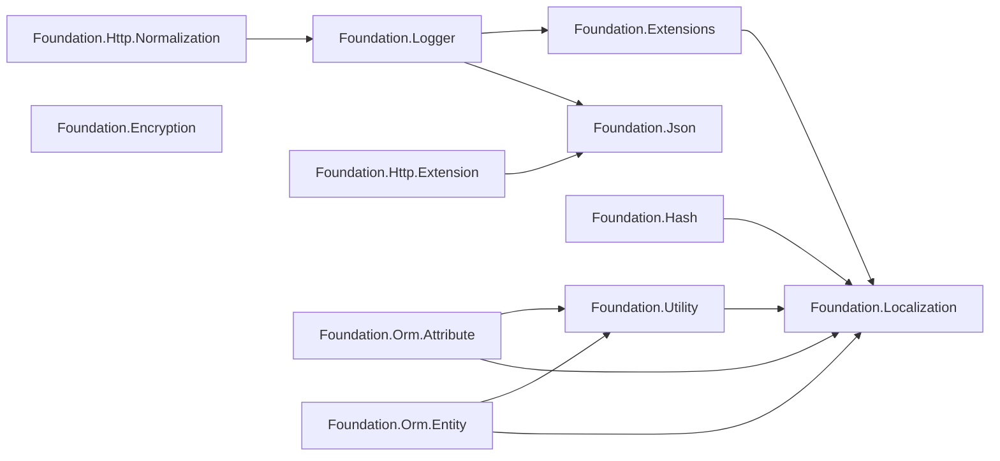

# パッケージ概要と依存関係

GameFrameX.Foundation は、責務ごとに分割された .NET クラスライブラリ群です。各サブディレクトリは独立した NuGet パッケージであり、パッケージ間は `ProjectReference` で連結されています。このページでは、すべてのパッケージの一覧、依存関係の方向性、およびどのパッケージから導入すべきかの判断基準を示します。

## パッケージ一覧

リポジトリのルートディレクトリにある各第一階層フォルダは 1 つの NuGet パッケージに対応し、すべてのパッケージは `../Version.props` のバージョン番号を統一的に使用し、`../gameframex.key.snk` で厳密名を付けます。

| パッケージ名 | 主な役割 | 主要なサードパーティ依存 |
|------|----------|----------------|
| GameFrameX.Foundation.Encryption | 暗号化・復号化（AES、RSA など） | — |
| GameFrameX.Foundation.Extensions | よく使われる拡張メソッドの集合 | Localization |
| GameFrameX.Foundation.Hash | ハッシュアルゴリズム（xxHash、BCrypt、BouncyCastle） | Standart.Hash.xxHash 4.0.5、BouncyCastle.Cryptography 2.7.0、BCrypt.Net-Next.StrongName 4.2.1 |
| GameFrameX.Foundation.Http.Extension | HTTP クライアントの統一インターフェース（GET/POST） | Json |
| GameFrameX.Foundation.Http.Normalization | HTTP リクエスト/レスポンスの正規化 | Logger |
| GameFrameX.Foundation.Json | JSON シリアライズ/デシリアライズの統一インターフェース | — |
| GameFrameX.Foundation.Localization | 多言語ローカライズ抽象 | Microsoft.Extensions.Localization.Abstractions 10.0.11 |
| GameFrameX.Foundation.Logger | Serilog 構造化ログ、Loki、MongoDB 対応 | MongoDB.Driver 3.11.0、Serilog.AspNetCore 10.0.0、Serilog.Sinks.Grafana.Loki 9.0.2、Serilog.Sinks.MongoDB 7.2.0 |
| GameFrameX.Foundation.Options | 構成オプション拡張 | — |
| GameFrameX.Foundation.Orm.Attribute | ORM エンティティ属性（Attribute） | Utility、Localization |
| GameFrameX.Foundation.Orm.Entity | ORM エンティティ基底クラス | Utility、Localization |
| GameFrameX.Foundation.Utility | 汎用ユーティリティクラス | Localization |

Source: [GameFrameX.Foundation.Http.Extension.csproj](https://github.com/GameFrameX/GameFrameX.Foundation/blob/main/GameFrameX.Foundation.Http.Extension/GameFrameX.Foundation.Http.Extension.csproj#L24-L26),[GameFrameX.Foundation.Json.csproj](https://github.com/GameFrameX/GameFrameX.Foundation/blob/main/GameFrameX.Foundation.Json/GameFrameX.Foundation.Json.csproj#L1-L26),[GameFrameX.Foundation.Hash.csproj](https://github.com/GameFrameX/GameFrameX.Foundation/blob/main/GameFrameX.Foundation.Hash/GameFrameX.Foundation.Hash.csproj#L14-L33),[GameFrameX.Foundation.Localization.csproj](https://github.com/GameFrameX/GameFrameX.Foundation/blob/main/GameFrameX.Foundation.Localization/GameFrameX.Foundation.Localization.csproj#L29-L32),[GameFrameX.Foundation.Logger.csproj](https://github.com/GameFrameX/GameFrameX.Foundation/blob/main/GameFrameX.Foundation.Logger/GameFrameX.Foundation.Logger.csproj#L26-L36)

## 依存関係図



Source: [GameFrameX.Foundation.Extensions.csproj](https://github.com/GameFrameX/GameFrameX.Foundation/blob/main/GameFrameX.Foundation.Extensions/GameFrameX.Foundation.Extensions.csproj#L15-L17),[GameFrameX.Foundation.Hash.csproj](https://github.com/GameFrameX/GameFrameX.Foundation/blob/main/GameFrameX.Foundation.Hash/GameFrameX.Foundation.Hash.csproj#L14-L16),[GameFrameX.Foundation.Utility.csproj](https://github.com/GameFrameX/GameFrameX.Foundation/blob/main/GameFrameX.Foundation.Utility/GameFrameX.Foundation.Utility.csproj#L15-L17),[GameFrameX.Foundation.Orm.Entity.csproj](https://github.com/GameFrameX/GameFrameX.Foundation/blob/main/GameFrameX.Foundation.Orm.Entity/GameFrameX.Foundation.Orm.Entity.csproj#L23-L32),[GameFrameX.Foundation.Logger.csproj](https://github.com/GameFrameX/GameFrameX.Foundation/blob/main/GameFrameX.Foundation.Logger/GameFrameX.Foundation.Logger.csproj#L34-L36),[GameFrameX.Foundation.Http.Extension.csproj](https://github.com/GameFrameX/GameFrameX.Foundation/blob/main/GameFrameX.Foundation.Http.Extension/GameFrameX.Foundation.Http.Extension.csproj#L24-L26),[GameFrameX.Foundation.Http.Normalization.csproj](https://github.com/GameFrameX/GameFrameX.Foundation/blob/main/GameFrameX.Foundation.Http.Normalization/GameFrameX.Foundation.Http.Normalization.csproj#L23-L25)

## クイックスタート

1. **必要な機能を特定し、対応するパッケージのみを導入する**——すべての Foundation パッケージを取り込まないようにしてください。例えば JSON シリアライズのみが必要な場合は、`GameFrameX.Foundation.Json` のみを参照します。
2. **拡張メソッド、ユーティリティクラス、ORM などを使用する場合、Localization が推移的依存として取り込まれる**——`Microsoft.Extensions.Localization.Abstractions 10.0.11` も同時に導入されるため、DI でローカライズサービスを登録する必要があります。
3. **ログパッケージを使用する場合**——Serilog のメインパッケージに加え、MongoDB.Driver 3.11.0 も導入されるため、MongoDB ドライバーのバージョンが業務側のものと競合しないことを確認してください。
4. **Hash パッケージを使用する場合**——xxHash、BouncyCastle、BCrypt の 3 つのサードパーティライブラリが一括で導入されるため、不要な `using` は必要に応じて削除できます。
5. **厳密名付きアセンブリを使用する**——すべてのパッケージは `gameframex.key.snk` で署名されているため、消費側のプロジェクトでは厳密名の使用を許可するか、プロジェクト自身の署名と一致させる必要があります。

## エントリーパッケージの選び方

| シナリオ | 推奨パッケージ |
|------|--------|
| JSON の読み書きのみ | GameFrameX.Foundation.Json |
| HTTP 呼び出しのみ | GameFrameX.Foundation.Http.Extension |
| 構造化ログ + リモート集約 | GameFrameX.Foundation.Logger |
| パスワード/データハッシュ | GameFrameX.Foundation.Hash |
| 暗号化/復号化 | GameFrameX.Foundation.Encryption |
| ORM エンティティと属性 | GameFrameX.Foundation.Orm.Entity + GameFrameX.Foundation.Orm.Attribute |
| 構成オプション拡張 | GameFrameX.Foundation.Options |

## バージョンと署名

すべてのパッケージはバージョン定義ファイルを共有します:

```xml
<Import Project="../Version.props" Label="バージョン番号定義"/>
<AssemblyOriginatorKeyFile>../gameframex.key.snk</AssemblyOriginatorKeyFile>
```

Source: [GameFrameX.Foundation.Http.Extension.csproj](https://github.com/GameFrameX/GameFrameX.Foundation/blob/main/GameFrameX.Foundation.Http.Extension/GameFrameX.Foundation.Http.Extension.csproj#L1-L7)

バージョンをアップグレードするには、`Version.props` を一度変更するだけで、各パッケージのビルド時に自動的に最新バージョン番号が適用されます。

## 関連リンク

- ローカライズについては、《Localization》を参照
- ログについては、《Logger》を参照
- JSON と HTTP については、《Http.Extension》を参照