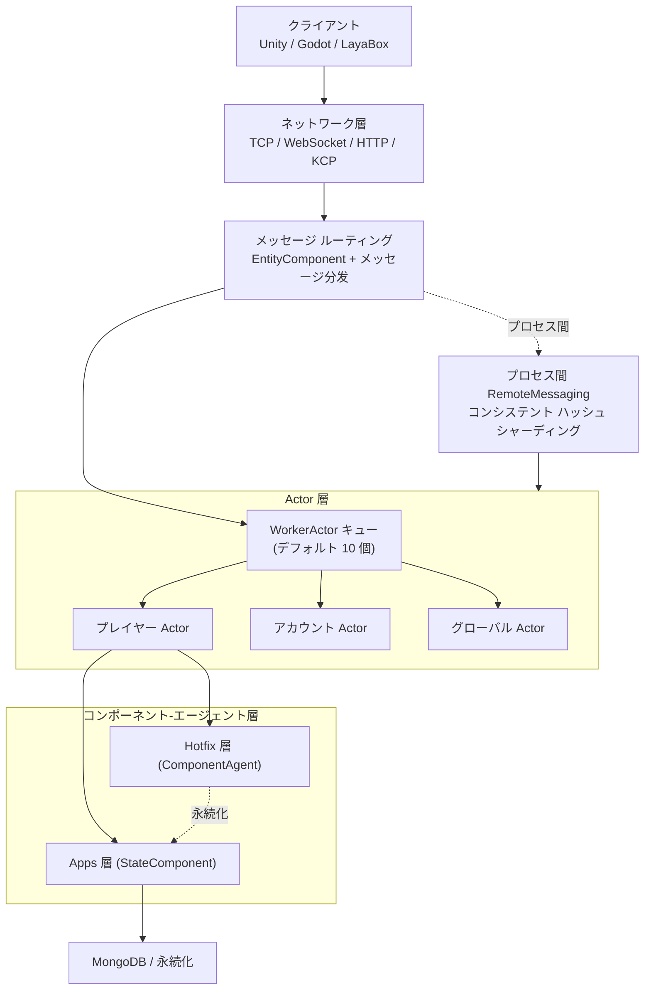

# アーキテクチャ概要:Actor モデルとマルチプロセス トポロジー

GameFrameX は Actor モデルを中核としてゲームサーバーのランタイム ユニットを編成し、Actor 間は共有状態ではなくメッセージ パッシングによって連携します。複数のゲーム プロセス間は一貫した ActorId 符号化と ActorType セグメントによってメッセージをルーティングし、水平方向にスケーラブルなマルチプロセス トポロジーを形成します。

## クイックスタート

1. `GameFrameX.Server.Start` のメイン プロセスを起動すると、`GameFrameX.Apps`(永続化ステート層)と `GameFrameX.Hotfix`(ホットリロード可能な業務層)の 2 つのアセンブリが読み込まれます。
2. クライアントは TCP / WebSocket / HTTP / KCP のいずれかでネットワーク層に接続し、メッセージは対応する Actor ハンドラーへルーティングされます。
3. サーバーは ActorId から所属プロセスを計算し、プロセスをまたぐ場合は `RemoteMessaging` で配信し、プロセス内の場合は `WorkerActor` キューへ配信します。

```csharp
// ActorId からプレイヤー コンポーネント エージェントを取得する(プロセス内の典型的な使用方法)
var agent = await ActorManager.GetComponentAgent<PlayerComponentAgent>(actorId);

[Actor.cs#L38-L100](https://github.com/GameFrameX/GameFrameX.Server.Source/blob/main/GameFrameX.Core/Actors/Actor.cs#L38-L100)
```

## 仕組みの概要

GameFrameX は「ゲーム エンティティ」を `IActor` に、「実行待ちメッセージ」を `IWorkerActor` にカプセル化し、TPL DataFlow を用いてロックフリーな直列化を実現します。プロセス間は `ActorId` の上位セグメント(`ActorType` + プロセス/データセンター識別子)によってコンシステント ハッシュ シャーディングを行います。



- **Actor = 状態コンテナ**:`IActor` は `Id`、`Type`、`ScheduleIdSet`、`WorkerActor` を保持し、各 Actor 内部のメッセージはその Actor 専用の `WorkerActor` によって直列に処理されるため、ロックは不要です。詳細は [IActor.cs](https://github.com/GameFrameX/GameFrameX.Server.Source/blob/main/GameFrameX.Core/Abstractions/IActor.cs#L38-L100) を参照してください。
- **WorkerActor = メッセージ ポンプ**:TPL DataFlow に基づき、受信メッセージをシリアライズ可能なタスク項目に変換して順次実行します。デフォルトでは `ActorManager` がシャーディングとして 10 個の `WorkerActor` を起動します。詳細は [ActorManager.cs](https://github.com/GameFrameX/GameFrameX.Server.Source/blob/main/GameFrameX.Core/Actors/ActorManager.cs#L53-L100) を参照してください。
- **プロセス内 vs プロセス間**:`ActorManager` は `ConcurrentDictionary<long, Actor>` を使用して本プロセスの Actor テーブルを保持します。プロセス間をまたぐ場合は `RemoteMessaging` + コンシステント ハッシュによって対象プロセスを特定します。
- **タイプ セグメント**:`ActorType` は `ushort` で符号化され、`Separator` 未満の値は「単一インスタンス グローバル型」、`Separator` 超の値は「複数インスタンス型」(プレイヤー、ギルドなど)を表し、スノーフレーク ID と ActorType を組み合わせて一意の ActorId を生成します。詳細は [ActorType.cs](https://github.com/GameFrameX/GameFrameX.Server.Source/blob/main/GameFrameX.Apps/ActorType.cs#L38-L60) を参照してください。

## 次へ

- 特定の Actor の内部詳細については、`GameFrameX.Core/Actors/Actor.cs` を参照してください。
- プロセス間のメッセージ送受信については、`GameFrameX.NetWork.Abstractions` および `NetWorkSenderFactory` を参照してください。
- ActorId 符号化とスノーフレーク アルゴリズムについては、`GameFrameX.Utility/ActorIdGenerator.cs` を参照してください。
- コンポーネント エージェントとホットリロードの境界については、『コンポーネント-エージェント層とホットリロード』のページを参照してください。

## 関連リンク

- [IActor.cs](https://github.com/GameFrameX/GameFrameX.Server.Source/blob/main/GameFrameX.Core/Abstractions/IActor.cs#L38-L100)
- [IWorkerActor.cs](https://github.com/GameFrameX/GameFrameX.Server.Source/blob/main/GameFrameX.Core/Abstractions/IWorkerActor.cs)
- [ActorManager.cs](https://github.com/GameFrameX/GameFrameX.Server.Source/blob/main/GameFrameX.Core/Actors/ActorManager.cs#L53-L100)
- [Actor.cs](https://github.com/GameFrameX/GameFrameX.Server.Source/blob/main/GameFrameX.Core/Actors/Actor.cs)
- [WorkActor.cs](https://github.com/GameFrameX/GameFrameX.Server.Source/blob/main/GameFrameX.Core/Actors/Impl/WorkActor.cs)
- [ActorType.cs](https://github.com/GameFrameX/GameFrameX.Server.Source/blob/main/GameFrameX.Apps/ActorType.cs#L38-L60)
- [ActorIdGenerator.cs](https://github.com/GameFrameX/GameFrameX.Server.Source/blob/main/GameFrameX.Utility/ActorIdGenerator.cs)
- [NetWorkSenderFactory.cs](https://github.com/GameFrameX/GameFrameX.Server.Source/blob/main/GameFrameX.NetWork/NetWorkSenderFactory.cs)