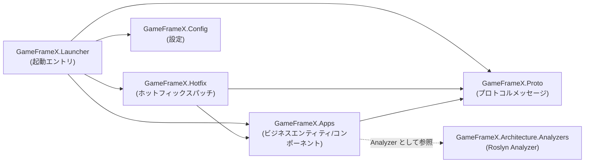

# プロジェクト構造とレイヤー分け(Apps / Hotfix / Proto / Config)概要

GameFrameX.Server ソリューションは、サーバープロジェクトを4つの責務が単一の C# クラスライブラリ(および Launcher、Analyzers、Hotfix.Tests)に分割し、「プロトコル → ビジネスロジック → ホットフィックスパッチ → 設定読み込み → 起動エントリ」をそれぞれ独立して保守できるようにしています。以下の画面で各プロジェクトの内容と参照関係を確認できます。

## クイックスタート

`Server.sln` を開くと、以下のプロジェクトが表示されます(いずれもリポジトリのルートディレクトリにあります):

| プロジェクト | csproj パス | ターゲットフレームワーク | 主要な責務 |
|------|-------------|----------|----------|
| `GameFrameX.Launcher` | [GameFrameX.Launcher/GameFrameX.Launcher.csproj](https://github.com/GameFrameX/GameFrameX.Server/blob/main/GameFrameX.Launcher/GameFrameX.Launcher.csproj) | — (未補充) | プログラム起動エントリ |
| `GameFrameX.Hotfix` | [GameFrameX.Hotfix/GameFrameX.Hotfix.csproj](https://github.com/GameFrameX/GameFrameX.Server/blob/main/GameFrameX.Hotfix/GameFrameX.Hotfix.csproj) | — (未補充) | ホットフィックス ビジネスロジックパッチ |
| `GameFrameX.Config` | [GameFrameX.Config/GameFrameX.Config.csproj](https://github.com/GameFrameX/GameFrameX.Server/blob/main/GameFrameX.Config/GameFrameX.Config.csproj) | — (未補充) | ランタイム設定項目 |
| `GameFrameX.Proto` | [GameFrameX.Proto/GameFrameX.Proto.csproj](https://github.com/GameFrameX/GameFrameX.Server/blob/main/GameFrameX.Proto/GameFrameX.Proto.csproj) | — (未補充) | ネットワークプロトコル / メッセージ定義 |
| `GameFrameX.Apps` | [GameFrameX.Apps/GameFrameX.Apps.csproj](https://github.com/GameFrameX/GameFrameX.Server/blob/main/GameFrameX.Apps/GameFrameX.Apps.csproj) | `net10.0` | ビジネスエンティティ、コンポーネント、状態(以下に参照関係の例あり) |
| `GameFrameX.Architecture.Analyzers` | [GameFrameX.Architecture.Analyzers/GameFrameX.Architecture.Analyzers.csproj](https://github.com/GameFrameX/GameFrameX.Server/blob/main/GameFrameX.Architecture.Analyzers/GameFrameX.Architecture.Analyzers.csproj) | — (未補充) | コンパイル時のアーキテクチャ制約アナライザー(Roslyn Analyzer として他のプロジェクトから参照される) |
| `GameFrameX.Hotfix.Tests` | [GameFrameX.Hotfix.Tests/GameFrameX.Hotfix.Tests.csproj](https://github.com/GameFrameX/GameFrameX.Server/blob/main/GameFrameX.Hotfix.Tests/GameFrameX.Hotfix.Tests.csproj) | — (未補充) | Hotfix レイヤーの単体テスト |

> 表中の「未補充」列は、当該 csproj の具体的な内容を今回は直接読み取っていないことを示しています。具体的な情報は各 csproj の実際のファイルに従ってください。

プロジェクト全体を実行するには、リポジトリのルートディレクトリで以下を実行します:

```bash
# ソリューション全体を復元してコンパイルする
dotnet restore Server.sln
dotnet build  Server.sln -c Debug
```

## 動作原理の概要

4つのコアプロジェクトはコンパイル時に `ProjectReference` を介して単方向の依存関係チェーンを形成し、循環参照を回避しています:



依存関係の方向はメインラインが1本だけ(Launcher → Hotfix/Apps → Proto)で、Config は Launcher 側に単独でぶら下がっており、Analyzer はコンパイル時の制約として Apps にぶら下がっており、ランタイム呼び出しチェーンには参加しません。

### 各レイヤーの責務

- **Proto(プロトコルレイヤー)**:`GameFrameX.Proto` プロジェクトには、クライアント-サーバー間、サーバー-サーバー間のメッセージ構造定義が集約され、Apps、Hotfix、Launcher から共通参照され、プロジェクト全体で同一のプロトコル契約が使用されることを保証します。
- **Apps(ビジネス実装レイヤー)**:`GameFrameX.Apps` プロジェクトは、アカウント、プレイヤー、ゲームルームなどのビジネスエンティティ(Entity)、コンポーネント(Component)、状態(State)、ドメインイベント(EventArgs)を保持します。その csproj は直接 Proto を参照しています:

  ```xml
  <ProjectReference Include="..\GameFrameX.Proto\GameFrameX.Proto.csproj" />
  <ProjectReference Include="..\GameFrameX.Architecture.Analyzers\GameFrameX.Architecture.Analyzers.csproj"
                    OutputItemType="Analyzer" ReferenceOutputAssembly="false" />
  ```

  `OutputItemType="Analyzer"` は、この参照が **コンパイル時の Roslyn アナライザー** であり、ランタイム依存関係には参加せず、`dotnet build` 時に Apps 配下のコードに対してアーキテクチャルールチェックを行うだけであることを示しています。

  Source: [GameFrameX.Apps/GameFrameX.Apps.csproj#L10-L11](https://github.com/GameFrameX/GameFrameX.Server/blob/main/GameFrameX.Apps/GameFrameX.Apps.csproj#L10-L11)

- **Hotfix(ホットフィックスレイヤー)**:`GameFrameX.Hotfix` は Apps と Proto に依存し、ランタイムでホットリプレース可能なビジネスパッチを保持します。`GameFrameX.Hotfix.Tests` はそれに対する単体テストを行います。
- **Config(設定レイヤー)**:`GameFrameX.Config` は、サーバー起動、接続、データベースなどの設定項目の読み取りと検証を一元管理します。
- **Launcher(起動エントリ)**:`GameFrameX.Launcher` はソリューションの実行可能エントリです(`.sln` では `Project("{9A19103F-16F7-4668-BE54-9A1E7A4F7556}")` としてリストされており、SDK スタイルの実行可能プロジェクトです)。起動時に Config を初期化し、Proto を読み込み、Hotfix にパッチを登録します。
- **Architecture.Analyzers(アーキテクチャ制約)**:`GameFrameX.Architecture.Analyzers` は Roslyn Analyzer として Apps から参照され、コンパイル時にコードが所定の階層構成に従うことを強制し、ビジネスロジックが誤ったレイヤーに書かれることを防ぎます。

### ソリューション構成(`Server.sln` から逐一照合)

以下の7つの `Project(...)` 行は `Server.sln` から直接取得したもので、プロジェクト階層の「権威ある清单」です:

| プロジェクト GUID | プロジェクト名 |
|-----------|--------|
| `{835335CB-D99B-4CB9-99D3-A7883306E723}` | GameFrameX.Launcher |
| `{E47F7B43-E435-4B9E-AD10-1FE0D19F45CF}` | GameFrameX.Hotfix |
| `{08B73D90-AB00-4B9D-AE3C-AB19E6D594F9}` | GameFrameX.Config |
| `{12AA7D1B-E3EB-4DC4-BEAA-0C7BC5047B0C}` | GameFrameX.Proto |
| `{EAA64025-FD7E-4E0F-92D1-AEBAC1A552BF}` | GameFrameX.Apps |
| `{B973B133-20C6-4E43-AE76-99D845F93E6E}` | GameFrameX.Architecture.Analyzers |
| `{B216586B-DCF1-4492-90E3-34F0BE57BCD9}` | GameFrameX.Hotfix.Tests |

Source: [Server.sln#L6-L26](https://github.com/GameFrameX/GameFrameX.Server/blob/main/Server.sln#L6-L26)

## Apps プロジェクトのディレクトリ規約

`GameFrameX.Apps/GameFrameX.Apps.csproj` では、3つのトップレベルの業務ディレクトリ(`Account\`、`Player\`、`Server\`)が明示的に宣言されており、ビジネスコードは必ずこれらのディレクトリの下に配置する必要があります:

```xml
<Folder Include="Account\" />
<Folder Include="Player\" />
<Folder Include="Server\" />
```

Source: [GameFrameX.Apps/GameFrameX.Apps.csproj#L15-L17](https://github.com/GameFrameX/GameFrameX.Server/blob/main/GameFrameX.Apps/GameFrameX.Apps.csproj#L15-L17)

実際のディレクトリの例(`GameFrameX.Apps/` 配下に既に存在するファイル。後続のコーディングの参考として):

| 第1階層ディレクトリ | サンプルファイル |
|----------|----------|
| `Account/` | [Login/Component/LoginComponent.cs](https://github.com/GameFrameX/GameFrameX.Server/blob/main/GameFrameX.Apps/Account/Login/Component/LoginComponent.cs)、[Login/Entity/LoginState.cs](https://github.com/GameFrameX/GameFrameX.Server/blob/main/GameFrameX.Apps/Account/Login/Entity/LoginState.cs) |
| `Game/` | [RockPaperScissors/Component/RockPaperScissorsGameComponent.cs](https://github.com/GameFrameX/GameFrameX.Server/blob/main/GameFrameX.Apps/Game/RockPaperScissors/Component/RockPaperScissorsGameComponent.cs)、[Room/Component/RoomComponent.cs](https://github.com/GameFrameX/GameFrameX.Server/blob/main/GameFrameX.Apps/Game/Room/Component/RoomComponent.cs) |
| `Common/Event/` | [EventAttribute.cs](https://github.com/GameFrameX/GameFrameX.Server/blob/main/GameFrameX.Apps/Common/Event/EventAttribute.cs)、[EventId.cs](https://github.com/GameFrameX/GameFrameX.Server/blob/main/GameFrameX.Apps/Common/Event/EventId.cs) |
| `Common/EventData/` | [AttributeChangedEventArgs.cs](https://github.com/GameFrameX/GameFrameX.Server/blob/main/GameFrameX.Apps/Common/EventData/AttributeChangedEventArgs.cs)、[PlayerSendItemEventArgs.cs](https://github.com/GameFrameX/GameFrameX.Server/blob/main/GameFrameX.Apps/Common/EventData/PlayerSendItemEventArgs.cs) |
| `Common/Session/` | [Session.cs](https://github.com/GameFrameX/GameFrameX.Server/blob/main/GameFrameX.Apps/Common/Session/Session.cs)、[SessionManager.cs](https://github.com/GameFrameX/GameFrameX.Server/blob/main/GameFrameX.Apps/Common/Session/SessionManager.cs) |
| ルートディレクトリ | [AppsHandler.cs](https://github.com/GameFrameX/GameFrameX.Server/blob/main/GameFrameX.Apps/AppsHandler.cs)、[ActorType.cs](https://github.com/GameFrameX/GameFrameX.Server/blob/main/GameFrameX.Apps/ActorType.cs)、[BsonClassMapHelper.cs](https://github.com/GameFrameX/GameFrameX.Server/blob/main/GameFrameX.Apps/BsonClassMapHelper.cs)、[CacheStateTypeManager.cs](https://github.com/GameFrameX/GameFrameX.Server/blob/main/GameFrameX.Apps/CacheStateTypeManager.cs) |

> 表中のファイルはすべて `GameFrameX.Apps/**/*.cs` 配下を `ListFiles` でスキャンして取得したものです。`Player/` と `Server/` の2つのディレクトリは csproj で宣言されていますが、今回はその配下のファイルは直接列举していません。

## 次に

- `Account/`、`Player/`、`Server/` 配下にビジネスロジックを追加したい場合は、『Apps レイヤーに新しい業務モジュールを追加する方法』(未補充)を参照してください。
- プロトコルメッセージを追加したい場合は、『Proto プロトコルメッセージ定義規範』(未補充)を参照してください。
- Hotfix にホットアップデート可能なパッチを追加したい場合は、『Hotfix ホットアップデート作成ガイド』(未補充)を参照してください。
- 設定項目を追加したい場合は、『Config 設定の読み込みと検証』(未補充)を参照してください。
- サーバー全体を起動したい場合は、『Launcher 起動フロー』(未補充)を参照してください。