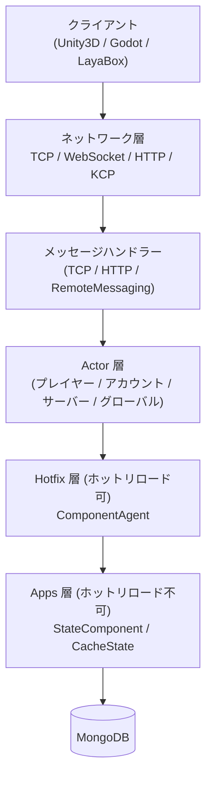

# 概要

GameFrameX Server は C# .NET 10.0 で開発された高性能・クロスプラットフォームのゲームサーバーフレームワークです。Actor モデルとロックフリーメッセージキューを採用し、ホットリロード機構をサポートしています。多人オンラインゲーム向けに設計されており、Unity3D、Godot、LayaBox などさまざまなクライアントと連携できます。

## クイックスタート

### 環境要件

- [.NET 10.0 SDK](https://dotnet.microsoft.com/download/dotnet/10.0)（.NET 8/9 はサポートされていません）
- MongoDB 4.x+
- Visual Studio 2022 または JetBrains Rider

### 起動フロー

1. MongoDB を起動します：

```bash
docker run -d -p 27017:27017 --name mongo mongo:8.2
```

Source: [README.zh-CN.md](https://github.com/GameFrameX/GameFrameX.Server.Source/blob/main/README.zh-CN.md#L192-L199)

2. プロジェクトを復元してビルドします：

```bash
dotnet restore
dotnet build
```

Source: [README.zh-CN.md](https://github.com/GameFrameX/GameFrameX.Server.Source/blob/main/README.zh-CN.md#L182-L189)

3. サーバーを起動します（例として Game タイプ）：

```bash
dotnet run --project GameFrameX.Launcher -- \
    --ServerType=Game \
    --ServerId=1000 \
    --OuterPort=29100 \
    --HttpPort=28080 \
    --DataBaseUrl=mongodb://127.0.0.1:27017 \
    --DataBaseName=gameframex
```

Source: [README.zh-CN.md](https://github.com/GameFrameX/GameFrameX.Server.Source/blob/main/README.zh-CN.md#L201-L210)

4. 起動を検証します：`http://localhost:28080/game/api/health` にアクセスしてヘルスチェックを確認し、コンソールログで `Actor` とリスニングポートの初期化が成功したことを確認してください。

Source: [README.zh-CN.md](https://github.com/GameFrameX/GameFrameX.Server.Source/blob/main/README.zh-CN.md#L212-L214)

## 動作原理の概要

GameFrameX Server は4層構成です：ネットワーク層がクライアントメッセージを受信し、Actor 層が TPL DataFlow によるロックフリーな直列処理を行い、ビジネスロジックはホットリロード可能な Hotfix 層で実装され、状態データはホットリロード不可の Apps 層で管理され、バッチ永続化によって MongoDB に書き込まれます。



Source: [README.zh-CN.md](https://github.com/GameFrameX/GameFrameX.Server.Source/blob/main/README.zh-CN.md#L92-L127)

### コア機能

| カテゴリ | 機能 |
|------|------|
| 並行処理モデル | Actor モデル + 完全非同期 async/await、ゼロロック設計、バッチ永続化、雪花 ID |
| ホットリロード | ゼロダウンタイムで新アセンブリをロード、状態とロジックの分離、旧アセンブリは10分間の猶予期間でアンロード、HTTP によるバージョン指定をサポート |
| ネットワークプロトコル | TCP（SuperSocket）、WebSocket、HTTP/HTTPS（Kestrel + Swagger）、KCP（実験的）、クロスプロセス RemoteMessaging |
| データベース | MongoDB メイン DB、ヘルスステートマシン、接続プール、OpenTelemetry メトリクスを含む |
| 可観測性 | OpenTelemetry Metrics/Tracing/Logging、Prometheus エクスポート、Serilog コンソール/ファイル/Loki 出力 |

Source: [README.zh-CN.md](https://github.com/GameFrameX/GameFrameX.Server.Source/blob/main/README.zh-CN.md#L50-L89)

### プロジェクト構造

```
Server/
├── GameFrameX.Launcher/              # アプリケーションエントリーポイント
├── GameFrameX.StartUp/               # 起動オーケストレーションと初期化
├── GameFrameX.Core/                  # コアフレームワーク（Actor、コンポーネント、イベント、ホットリロード管理）
├── GameFrameX.Apps/                  # 状態データ層（ホットリロード不可）
├── GameFrameX.Hotfix/                # ビジネスロジック層（ホットリロード可）
├── GameFrameX.Config/                # ゲーム設定テーブル（LuBan 生成）
├── GameFrameX.NetWork/               # ネットワークコア（メッセージオブジェクト、送信側、WebSocket）
├── GameFrameX.NetWork.HTTP/          # HTTP サーバー（Swagger、Kestrel）
├── GameFrameX.NetWork.Kcp/           # KCP プロトコルサポート
├── GameFrameX.NetWork.RemoteMessaging/ # クロスプロセスリモートメッセージ（サーキットブレーカー、一貫性ハッシュ）
├── GameFrameX.DataBase.Mongo/        # MongoDB 実装
├── GameFrameX.Monitor/               # OpenTelemetry + Prometheus 統合
├── GameFrameX.Utility/               # ユーティリティ集（ログ、圧縮、オブジェクトプール、Mapster）
├── GameFrameX.AppHost/               # .NET Aspire アプリケーションホスト
└── Tests/GameFrameX.Tests/           # xUnit テストスイート
```

Source: [README.zh-CN.md](https://github.com/GameFrameX/GameFrameX.Server.Source/blob/main/README.zh-CN.md#L131-L162)

## 次へ進む

- とりあえず動かしたい場合：上記の「クイックスタート」に沿って、クローン → ビルド → 起動まで進めてください。
- 各設定項目のデフォルト値を知りたい場合：《設定リファレンス》（`--ServerType` / `--OuterPort` / `--DataBaseUrl` などの軸でリスト）を参照してください。
- 最初のビジネス Handler を書きたい場合：《ビジネス Handler の実装方法》（`ComponentAgent` + `StateComponent` ベースのサンプル）を参照してください。
- 起動後にエラーが発生した場合：《起動失敗時の対処法》（MongoDB 接続、ポート占有、Actor タイムアウトなどの一般的な症状を含む）を参照してください。
- Actor とコンポーネントを理解したい場合：《コアコンセプト：Actor / コンポーネント / プロキシ》を参照してください。