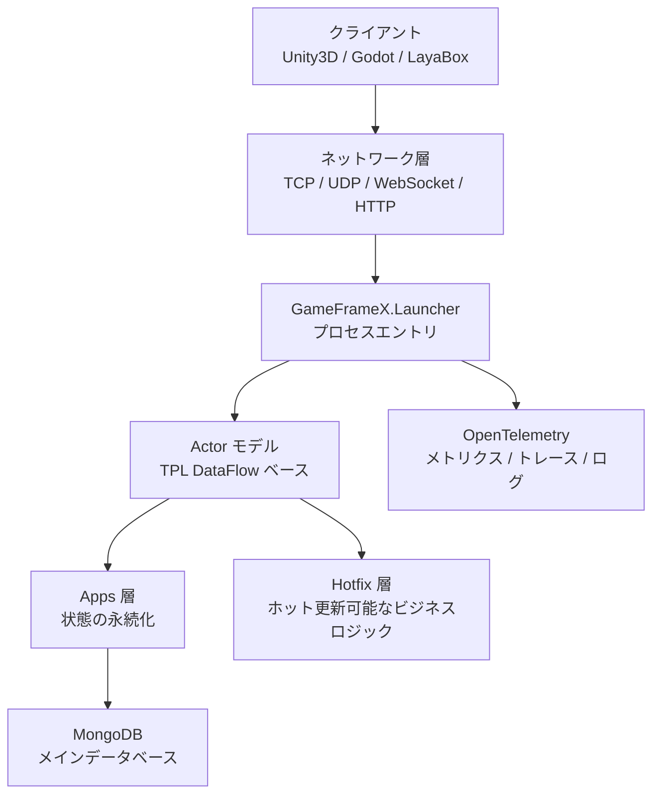

# クイックスタート:最初のゲームサーバーを構築する

このページの手順に従うことで、GameFrameX Server をローカルで起動し、TCP / HTTP / WebSocket をリッスンできるゲームサーバープロセスを動作させ、ヘルスチェックインターフェースで起動成功を確認できます。フレームワークは .NET 10.0 ベースで、Actor モデルを採用しており、デフォルトで MongoDB に接続して状態の永続化を行います。

## 前提条件

| 依存関係 | バージョン | 説明 |
|------|------|------|
| .NET SDK | 10.0 | フレームワークは .NET 10.0 をターゲットとしています。[dotnet 公式サイト](https://dotnet.microsoft.com/download/dotnet/10.0)からダウンロード |
| MongoDB | 4.x 以上 | メインデータベース、状態の永続化に使用;ローカルデフォルトは `mongodb://127.0.0.1:27017` |
| Docker(オプション) | 最新版 | MongoDB をインストールしたくない場合は、リポジトリルートの `docker-compose.yml` で一键起動可能 |
| IDE | 任意 | Rider / VS 2022(17.10+)/ VS Code のいずれも可 |

## クイックスタート

### 1. ソースコードの取得

```bash
git clone https://github.com/GameFrameX/GameFrameX.Server.Source.git
cd GameFrameX.Server.Source
```

### 2. データベースの準備(いずれかを選択)

**方法 A:リポジトリ付属の Docker Compose を使用**

```bash
docker-compose up -d mongodb
```

**方法 B:MongoDB を自行で起動** し、`127.0.0.1:27017` をリッスンするようにしてください。

### 3. ソリューションのビルド

```bash
dotnet build GameFrameX.Launcher -c Debug
```

### 4. サーバーの起動

最小起動コマンド(`Launcher` がプロセスエントリ):

```bash
dotnet run --project GameFrameX.Launcher -- \
    --ServerType=Game \
    --ServerId=1000 \
    --OuterPort=29100 \
    --HttpPort=28080 \
    --DataBaseUrl=mongodb://127.0.0.1:27017 \
    --DataBaseName=gameframex
```

すべての設定項目は `--Key=Value` 形式のコマンドライン引数で渡され、`StartupOptions` で定義されています。よく使われる項目は以下の表のとおりです:

| 設定項目 | 必須 | デフォルト値 | 説明 |
|--------|----------|--------|------|
| `ServerType` | はい | なし | サーバータイプ、例: `Game`、`Social` |
| `ServerId` | はい | なし | サーバー一意識別子 ID |
| `DataBaseUrl` | はい | なし | MongoDB 接続文字列 |
| `DataBaseName` | はい | なし | データベース名 |
| `OuterPort` | いいえ | `29100` | クライアント向け TCP ポート |
| `HttpPort` | いいえ | `8080` | HTTP / ヘルスチェックポート |
| `IsEnableHttp` | いいえ | `true` | HTTP サービスを有効にするか |
| `HttpIsDevelopment` | いいえ | `false` | 開発モード(Swagger を有効化) |
| `IsEnableWebSocket` | いいえ | `false` | WebSocket を有効にするか |

### 5. 起動の確認

起動後、サービス正常動作を確認するために 2 つのことを行います:

1. **ヘルスチェックインターフェース**(デフォルト API ルートパスは `/game/api/`):
   ```bash
   curl http://localhost:28080/game/api/health
   ```
2. **コンソールログの確認**、`Server started, listening on 0.0.0.0:29100` のようなログが表示されれば起動成功です。

## 仕組みの概要



- **Launcher**:プロセスエントリ、コマンドライン引数を受け取り、ネットワーク層と Actor コンテナを起動します。
- **Apps 層**:`StateComponent` と `BaseCacheState` を定義し、状態の永続化を担当します。ホット更新不可。
- **Hotfix 層**:`StateComponentAgent` を実装し、ビジネスロジックを配置します。ランタイムホット更新をサポートします。
- **Actor モデル**:ロックフリー高並行処理、内部状態はメッセージキューによりシリアル化アクセスされます。
- **ネットワーク層**:TCP(SuperSocket ベース)、WebSocket、HTTP/Kestrel の複数プロトコルが並行動作。

## 最小のログインコンポーネントを書く

フレームワークの中核パターンは**状態とロジックの分離**です。以下、ログイン例で完全なフローを示します。

**1. 状態(Apps 層、ホット更新不可)**

`GameFrameX.Apps/Account/Login/Entity/LoginState.cs` はすでに存在し、フィールドにはアカウント、Token、ログイン時間などが含まれます。

**2. コンポーネント(Apps 層、ホット更新不可)**

```csharp
public class LoginComponent : StateComponent<LoginState>
{
    protected override async Task OnInit()
    {
        await base.OnInit();
        // コンポーネント状態を初期化
    }
}
```

**3. ビジネスロジック(Hotfix 層、ホット更新可能)**

`GameFrameX.Hotfix/Logic/Account/Login/ReqLoginHandler.cs` はすでに存在し、HTTP / メッセージハンドラーとして `LoginComponent` を呼び出して Token を書き込みます。

**4. 層をまたいだ呼び出し**

```csharp
// ActorManager を通じてコンポーネントエージェントを取得
var loginAgent = await ActorManager.GetComponentAgent<LoginComponentAgent>(actorId);
var result = await loginAgent.Login(account, password);
```

完全なビジネス開発フローとコンポーネントエージェントパターンについては、《ビジネスロジック開発》セクションを参照;Hotfix アセンブリ置換メカニズムについては、《ホット更新メカニズム》セクションを参照してください。

## 次に進む

- **設定項目全集**:《設定リファレンス》を参照——すべての `--Key=Value` 引数、デフォルト値と例。
- **ビジネス開発**:《Actor コンポーネントの書き方》を参照——状態、コンポーネント、エージェントの三点セット。
- **ホット更新**:《ビジネスロジックのホット更新方法》を参照——Hotfix アセンブリのゼロダウンタイム置換。
- **Docker デプロイ**:《Docker デプロイ》を参照——ルートの `docker-compose.yml` / `docker-compose.multi.yml` によるマルチプロセス連携。
- **監視**:《監視と可観測性》を参照——Prometheus、Grafana Loki、OpenTelemetry の統合。