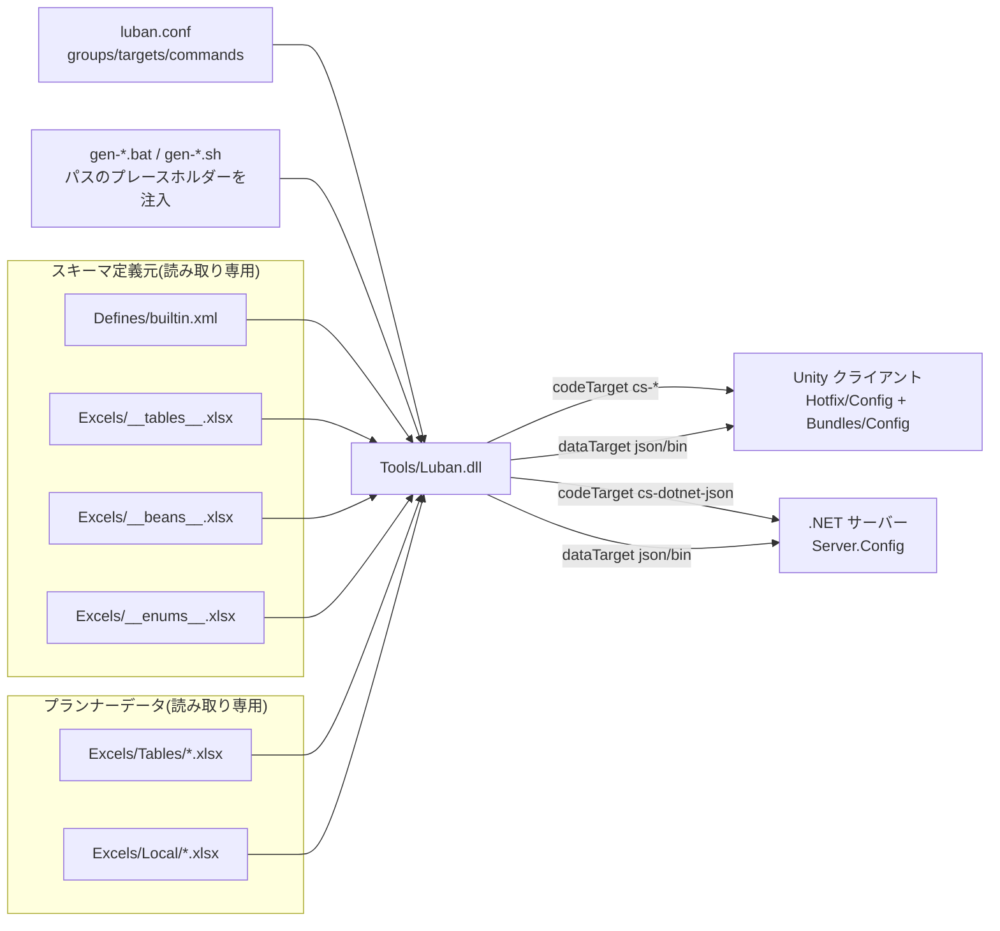

# Config ツールの仕組み

GameFrameX.Config は [Luban](https://github.com/GameFrameX/luban) をベースとした設定テーブルツールです。`Excels/` 配下の Excel ワークブック（データテーブル + ローカライズテーブル + 高度定義テーブル）を読み込み、`Defines/builtin.xml` と `luban.conf` の設定を組み合わせて、クライアント・サーバー両側でそのままロードできる C# コードとデータファイルを一括生成します。

## ワークフローを一言で

`gen-*.bat` または `gen-*.sh` スクリプトを実行 → ツールが `luban.conf` を読み込む → `targets` リストのコマンドに従って `Tools/Luban.dll` を順に呼び出す → Unity プロジェクトの `Hotfix/Config/Generate/`（コード）と `Bundles/Config/`（データ）配下にファイルを出力すると同時に、`Server.Config/` 配下にサーバー版を出力します。

## 設定駆動：`luban.conf` が何を生成するかを決める

`luban.conf` はツールの「中央設定」であり、すべての動作はここから定まります。出典:[luban.conf](https://github.com/GameFrameX/GameFrameX.Config/blob/main/luban.conf)

| フィールド | 意味 | 例 |
|------|------|------|
| `groups` | グループの識別。`c` = クライアント、`s` = サーバー | `"names": ["c"]`、``"names": ["s"]` |
| `schemaFiles` | データスキーマ定義のソース（フィールド型、列挙型、bean、テーブル骨格を含む） | `Defines`、`Excels/__tables__.xlsx`、`Excels/__beans__.xlsx`、`Excels/__enums__.xlsx` |
| `dataDir` | 業務データが置かれているディレクトリ | `Excels` |
| `targets` | 1 回の生成で出力するターゲットの集合（各ターゲットは独自の名前空間、manager、groups を持つ） | `server`、`client`、`all` |
| `commands` | 実際に Luban に渡すコマンドライン。各ターゲットに複数対応（json / bin など異なる形式） | `--target server --dataTarget json --codeTarget cs-dotnet-json …` |
| `toolPath` | Luban ツール dll のパス | `/../Config/Tools/Luban.dll` |
| `UNITY_ASSETS_PATH` / `SERVER_PATH` | クライアントとサーバーのプロジェクト位置を表すプレースホルダー。コマンド内で展開される | 実行スクリプトから注入される |

各 `commands` はプレースホルダー `%UNITY_ASSETS_PATH%` と `%SERVER_PATH%` を通じて、コードとデータをどのプロジェクトディレクトリに書き込むかを決めます。

## 3 層のデータ：動作 / スキーマ / データ

ツールは作業内容を 3 つの層のソースに分けます:

1. **動作層**(`luban.conf`)：生成形式、ターゲット、名前空間を決定します。
2. **スキーマ層**(`Defines/builtin.xml` + `Excels/__*__.xlsx`)：フィールド型、列挙型、構造体、テーブル骨格を定義します。
3. **データ層**(`Excels/Tables/*.xlsx`、`Excels/Local/*.xlsx`)：プランナーが実際に入力するデータです。

出典例 — `Defines/builtin.xml` は同じ「座標」を、クライアントでは Unity 型へ、サーバーでは .NET 型へマッピングします:

```xml
<bean name="vec3" valueType="1" sep="," group="*">
    <var name="x" type="float"/>
    <var name="y" type="float"/>
    <var name="z" type="float"/>
    <mapper target="client" codeTarget="cs-bin,cs-simple-json">
        <option name="type" value="UnityEngine.Vector3"/>
        <option name="constructor" value="ExternalTypeUtil.NewVector3"/>
    </mapper>
    <mapper target="server" codeTarget="cs-bin,cs-dotnet-json">
        <option name="type" value="System.Numerics.Vector3"/>
        <option name="constructor" value="ExternalTypeUtil.NewVector3"/>
    </mapper>
</bean>
```

出典:[Defines/builtin.xml](https://github.com/GameFrameX/GameFrameX.Config/blob/main/Defines/builtin.xml#L14-L26)

つまり、プランナーは 1 つの Excel を用意するだけで、ツールがターゲットごとに対応する言語/エンジン向けのコードを自動出力します。クライアント用とサーバー用をそれぞれ書く必要はありません。

## 3 種類の生成ターゲット

出典:[luban.conf](https://github.com/GameFrameX/GameFrameX.Config/blob/main/luban.conf#L35-L60)

| ターゲット名 | `topModule`（名前空間） | `manager` | 有効になるタイミング |
|--------|-----------------------|-----------|----------|
| `server` | `GameFrameX.Config` | `TablesComponent` | サーバーのコード/データ、groups = `s` |
| `client` | `Hotfix.Config` | `TablesComponent` | Unity クライアントのコード/データ、groups = `c` |
| `all` | `cfg` | `Tables` | 汎用エクスポート、groups = `c,s` |

`commands` リストの各コマンドは、`dataTarget`（`json` または `bin`）、`codeTarget`（`cs-dotnet-json` / `cs-simple-json` / `cs-bin`）、および `validationFailAsError` を個別に切り替えられます。

## 1 回の完全生成のステップ

1. プランナーが `Excels/Tables/*.xlsx` と `Excels/Local/*.xlsx` に入力します（命名は `字母-英文名-中文名` に従う）。
2. リポジトリのルートディレクトリで `gen-client-json.bat / .sh`（または `gen-server-bin.bat / .sh` など）を実行すると、スクリプト内部で `UNITY_ASSETS_PATH`、`SERVER_PATH` がプレースホルダーに注入されます。
3. ツールは `luban.conf` を読み込み、`commands` の順序どおりに `Tools/Luban.dll` を起動します。各 target に 1 つのコマンドが対応します。
4. Luban がスキーマファイル（`Defines/`、`__tables__.xlsx`、`__beans__.xlsx`、`__enums__.xlsx`）を解析し、`Excels/` のデータと 1 つずつ検証します。
5. `codeTarget` に従い、C# ソースコードを `%UNITY_ASSETS_PATH%/Hotfix/Config/Generate/` または `%SERVER_PATH%/Server.Config/Config/` へ生成します。
6. `dataTarget` に従い、データファイルを `Bundles/Config/`（実行時に初回パッケージへバンドル）または `Server.Config/Json/`（サーバーが読み込み）へ生成します。
7. ターミナルに成功出力され、ファイルが出力されていれば、プロジェクト内で直接 `tables.TbXxx.Get(id)` を呼び出せます。

## アーキテクチャ関係図



## 設計意図（背景）

- **設定こそ中心**: `luban.conf` は「誰が生成するか、どこへ生成するか、どの形式を使うか」をすべて JSON として外部化します。ターゲットの追加や json/bin の切り替えでも、ツール本体を変更する必要はありません。
- **1 つのデータを両側で利用**: `Defines/builtin.xml` 内で同じ bean を `<mapper target="client" ...>` と `<mapper target="server" ...>` でそれぞれ Unity 型と .NET 型にマッピングし、Unity とサーバーで同じ業務テーブルを共有できるようにします。
- **グループ分割と結合**: 同じ英語テーブル名（例: `D-ItemConfig-道具表-1001.xlsx` と `D-ItemConfig-道具表-2001.xlsx`）は 1 つのテーブルに結合され、大きなテーブルを必要に応じて分割しやすくなります。

## 関連リンク

- [Defines/builtin.xml](https://github.com/GameFrameX/GameFrameX.Config/blob/main/Defines/builtin.xml)
- [luban.conf](https://github.com/GameFrameX/GameFrameX.Config/blob/main/luban.conf)
- [README.zh-CN.md](https://github.com/GameFrameX/GameFrameX.Config/blob/main/README.zh-CN.md)
- 上流ツール [GameFrameX/luban](https://github.com/GameFrameX/luban)