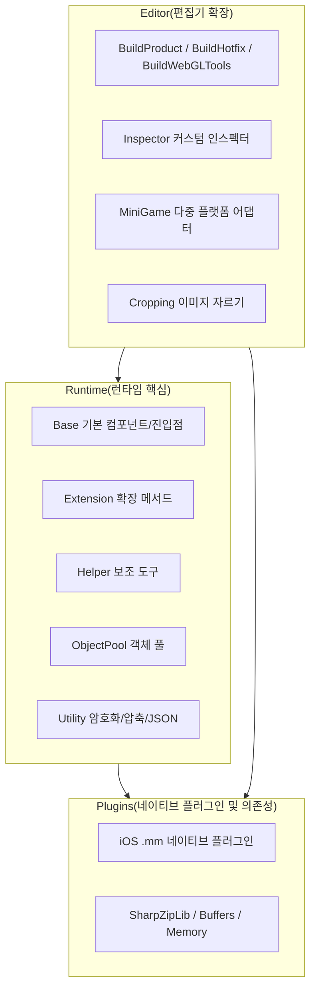

# 프레임워크 3계층 구조 개요

GameFrameX는 독립 게임 개발자를 위한 Unity 프레임워크로, **Runtime / Plugins / Editor** 3계층 모듈화 아키텍처를 채택합니다. 3계층 간의 책임은 명확하며 서로 협력합니다. Runtime은 런타임 핵심 기능을 제공하고, Plugins는 네이티브 플랫폼 기능과 외부 의존성을 제공하며, Editor는 편집기 확장과 빌드 파이프라인을 제공합니다. 이 페이지에서는 한 개의 다이어그램과 한 개의 표를 통해 전체적인 인식을 빠르게 잡을 수 있도록 안내합니다.

## 작업 원리 개요



## 3계층 책임 요약

| 계층 | 디렉터리 | 주요 파일 | 주요 책임 |
|----|------|----------|----------|
| **Runtime** | `Runtime/` | [GameEntry.cs](/Runtime/Base/GameEntry.cs#L46-L60)、[GameFrameworkComponent.cs](/Runtime/Base/GameFrameworkComponent.cs#L43-L45) | 프레임워크 진입점, 컴포넌트 관리, 이벤트 풀, 참조 풀, 객체 풀, 변수 시스템, 암호화/압축, JSON, 확장 메서드, 보조 도구 |
| **Plugins** | `Plugins/` | [GameFrameX.mm](/Plugins/iOS/GameFrameX/GameFrameX.mm)、`ICSharpCode.SharpZipLib.dll`、`System.Memory.dll` | iOS 네이티브 기능, ZIP 압축 라이브러리, .NET 메모리 및 런타임 지원 |

## 다음 단계

- Runtime 내부의 Base / Extension / Helper / Utility 등 하위 모듈 분업을 알고 싶다면 《Runtime 모듈 상세 설명》을 참조하세요.
- Plugins의 iOS 네이티브 플러그인 및 DLL 의존성 목록을 알고 싶다면 《Plugins 모듈 상세 설명》을 참조하세요.
- Editor 빌드 파이프라인, 미니게임 다중 플랫폼 어댑터, Inspector 확장을 알고 싶다면 《Editor 모듈 상세 설명》을 참조하세요.
- 처음부터 최소 엔지니어링을 실행해 보고 싶다면 《빠른 시작》을 참조하세요.## Runtime 계층(런타임 핵심)

Runtime은 프레임워크의 모든 C# 코드로, 디렉터리는 책임에 따라 7개의 하위 모듈로 나뉩니다.

| 하위 모듈 | 주요 내용 | 설명 |
|--------|----------|------|
| **Base** | [GameEntry.cs](/Runtime/Base/GameEntry.cs#L46-L56)、[GameFrameworkComponent.cs](/Runtime/Base/GameFrameworkComponent.cs#L43-L45)、`EventPool/`、`ReferencePool/`、`TaskPool/`、`Variable/` | 프레임워크 진입점과 컴포넌트 기본 클래스, 이벤트 풀, 참조 풀, 작업 풀, 바인딩 가능한 변수, 싱글톤 |
| **Extension** | `BinaryExtension`、`StringExtensions`、`CollectionExtensions`、`UnityEngine.Transform` 확장 등 | 범용 및 Unity 타입 확장 메서드 |
| **Helper** | `ApplicationHelper`、`FileHelper`、`PathHelper`、`MathHelper`、`TimerHelper`、`ZipHelper` 등 | 애플리케이션, 파일, 경로, 수학, 타이머, 압축 등 런타임 보조 도구 |
| **ObjectPool** | [ObjectPoolComponent.cs](/Runtime/ObjectPool/ObjectPoolComponent.cs) | `GameFrameworkComponent` 서브클래스로, 객체 재사용 및 메모리 최적화를 담당 |
| **Property** | `BindableProperty` | MVVM 스타일의 바인딩 가능한 속성 |
| **ReferencePool** | `ReferencePoolComponent` | 참조 타입 객체 풀, GC 부담 감소 |
| **Utility** | `Utility.Encryption`(AES/RSA/DSA)、`Utility.Compression`、`Utility.Json`、`Utility.Hash`(MD5/SHA1/HMAC)、`Utility.Verifier`(CRC32/CRC64) | 암호화, 압축, JSON, 해시, 검증 등 순수 정적 도구 |

진입점 타입 예시:

```csharp
using GameFrameX.Runtime;

// 프레임워크 진입점으로, 게임 프레임워크 컴포넌트의 통합 접근 지점을 제공
public static class GameEntry { /* ... */ }

// GameEntry에 마운트되는 모든 컴포넌트는 이 기본 클래스를 상속받음
public abstract class GameFrameworkComponent : MonoBehaviour { /* ... */ }
```

출처: [GameEntry.cs](/Runtime/Base/GameEntry.cs#L46-L60), [GameFrameworkComponent.cs](/Runtime/Base/GameFrameworkComponent.cs#L43-L45)

## Plugins 계층(네이티브 플러그인 및 의존성)

Plugins 계층은 Unity C# 계층에서 완료할 수 없는 작업만 배치합니다. 네이티브 플랫폼 플러그인과 외부 .NET DLL입니다.

| 하위 모듈 | 파일 | 설명 |
|--------|------|------|
| **iOS 플러그인** | [GameFrameX.mm](/Plugins/iOS/GameFrameX/GameFrameX.mm)、`GameFrameXTrackingAuthorization.mm` | iOS 네이티브 기능(예: ATT 추적 권한) |
| **압축 라이브러리** | `ICSharpCode.SharpZipLib.dll` | ZIP 압축/해제, `Utility.Compression`에서 호출됨 |
| **메모리 및 버퍼** | `System.Buffers.dll`、`System.Memory.dll`、`System.IO.Pipelines.dll` | 고성능 메모리 및 IO 파이프라인 |
| **런타임 지원** | `Microsoft.NET.StringTools.dll`、`System.Runtime.CompilerServices.Unsafe.dll` | 문자열 최적화 및 비안전 코드 지원 |

## Editor 계층(편집기 확장)

Editor 계층은 Unity 편집기 내에서만生效하며, 빌드 파이프라인과 개발 보조 기능을 제공합니다.

| 하위 모듈 | 주요 파일 | 설명 |
|--------|----------|------|
| **BuildProduct** | `BuildProductHelper`、`BuildPostProcessHelper`、`IBuilderPreHookHandler`、`IBuilderPostHookHandler` | 범용 빌드 보조 도구와 빌드 전/후 훅 |
| **BuildHotfix** | `BuildHotfixHelper`、`HotFixAssemblyDefinitionHelper` | HybridCLR 핫업데이트 어셈블리 빌드 |
| **BuildWebGLTools** | `BuildWebGLToolsWithHybridCLR` | WebGL 플랫폼 + HybridCLR 통합 빌드 |
| **MiniGame** | [MiniGameDefineSymbolHelper.WeChat.cs](/Editor/MiniGame/DomesticMiniGames/MiniGameDefineSymbolHelper.WeChat.cs) 등 21개 플랫폼 매크로 정의 | WeChat, Alipay, Douyin, Kuaishou, Baidu, JD, Meituan, Taobao 등 플랫폼 원클릭 전환 |
| **Inspector** | `BaseComponentInspector`、`ObjectPoolComponentInspector`、`ReferencePoolComponentInspector` | 커스텀 인스펙터 패널, 런타임에 풀 상태 관찰 |
| **Cropping** | `CroppingWindow` | 이미지 자르기 도구 |
| **InspectorLockShortcut** | `InspectorLockShortcut` | Inspector 잠금 단축키 |

빌드 훅 사용 예시(의사 코드, 실제 시그니처는 소스 파일 참조):

```csharp
using GameFrameX.Editor;

public sealed class MyPreBuildHook : IBuilderPreHookHandler
{
    public void OnBeforeBuild(BuildContext ctx) { /* ... */ }
}
```