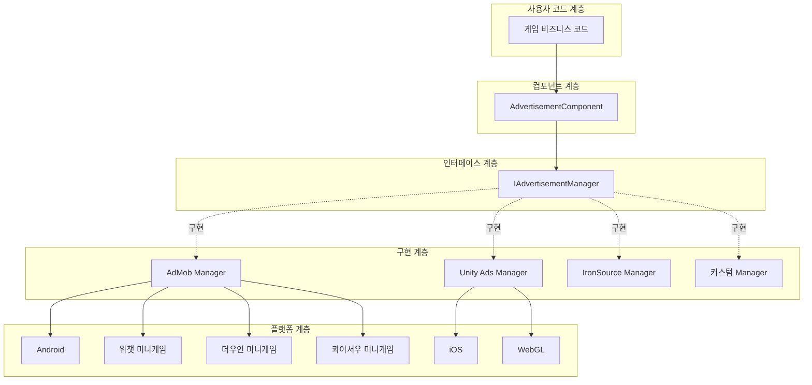
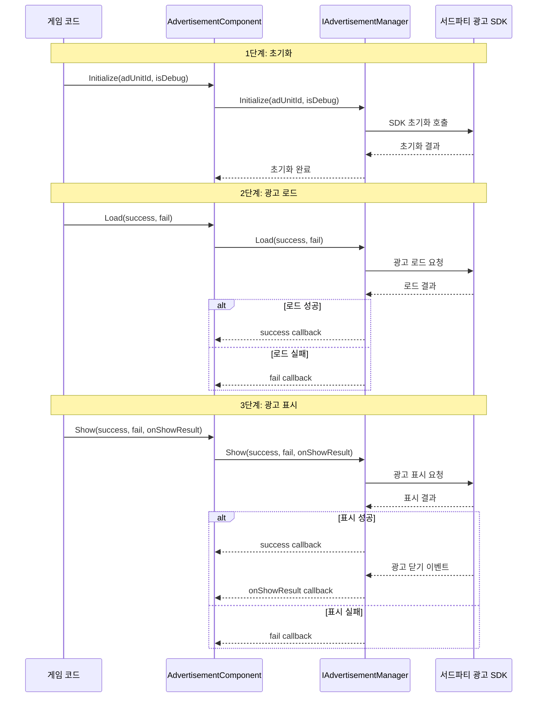

# 개요

Game Frame X Advertisement는 Game Frame X 프레임워크의 광고 컴포넌트로, Unity 프로젝트에 통합된 광고 기능 추상화 계층을 제공합니다. 이 컴포넌트는 전략 패턴(Strategy Pattern)으로 설계되어, 개발자가 핵심 비즈니스 코드를 수정하지 않고도 다양한 광고 SDK(AdMob, Unity Ads, IronSource 등)를 쉽게 통합할 수 있도록 합니다.

## 프로젝트 소개

`com.gameframex.unity.advertisement`는 Game Frame X 프레임워크의 핵심 모듈 중 하나로, Unity 프로젝트에서 광고 통합의 복잡성을 해결하기 위해 특별히 설계되었습니다. 이 컴포넌트는 표준화된 광고 작업 인터페이스를 제공하여, 개발자가 광고 호출 코드를 한 번만 작성하면 다양한 광고 플랫폼 간에 전환할 수 있습니다.

이 컴포넌트는 Unity 2017.1 이상을 지원하며, 현재 최신 버전은 1.4.0입니다. Apache License 2.0 오픈소스 라이선스를 채택하여 상업 및 비상업 프로젝트에서 무료로 사용할 수 있습니다.

## 아키텍처 설계

이 컴포넌트는 계층형 아키텍처로 설계되어, 광고 비즈니스 로직과 구체적인 플랫폼 구현을 분리합니다. 이 설계는 의존성 역전 원칙(DIP)을 따르며, 상위 모듈(AdvertisementComponent)은 구체적인 구현 세부 사항에 관계없이 추상 인터페이스(IAdvertisementManager)에 의존합니다.

## 핵심 컴포넌트

이 컴포넌트는 각각 다른 역할을 담당하며, 광고 기능의 완전한 캡슐화를 완성하는 네 가지 핵심 클래스를 포함합니다.

### AdvertisementComponent

AdvertisementComponent는 사용자가 직접 상호작용하는 주요 진입점으로, GameFrameworkComponent를 상속받는 Unity MonoBehaviour 컴포넌트입니다. 개발자는 이 컴포넌트를 씬의 임의의 GameObject에 추가한 후, 코드에서 해당 메서드를 호출하여 광고를 로드하고 표시할 수 있습니다.

> Source: [AdvertisementComponent.cs](https://cnb.cool/GameFrameX/com.gameframex.unity.advertisement/blob/main/Runtime/Advertisement/AdvertisementComponent.cs#L1-L169)

이 컴포넌트의 핵심 역할은 다음과 같습니다: 현재 실행 플랫폼에 따라 해당 광고 유닛 ID를 자동으로 선택, Unity 수명 주기에서 광고 관리자 초기화, 그리고 비즈니스 코드 호출을 위한 Load, Show, Play 세 가지 주요 메서드 제공.

### IAdvertisementManager

IAdvertisementManager는 광고 관리자의 핵심 인터페이스로, 모든 광고 작업의 표준 메서드를 정의합니다. 구체적인 광고 SDK 구현은 이 인터페이스를 구현해야 하며, 이를 통해 서로 다른 광고 플랫폼 간의 동작 일관성을 보장합니다.

> Source: [IAdvertisementManager.cs](https://cnb.cool/GameFrameX/com.gameframex.unity.advertisement/blob/main/Runtime/Advertisement/IAdvertisementManager.cs#L1-L55)

이 인터페이스는 네 가지 핵심 메서드를 정의합니다: Initialize는 광고 관리자 초기화, SetExtraData는 추가 매개변수 설정, Load는 광고 사전 로드, Show는 광고 표시에 사용됩니다. 인터페이스 설계는 콜백 패턴을 채택하여, Action 델리게이트를 통해 비동기 작업의 성공, 실패 및 결과 콜백을 처리합니다.

### BaseAdvertisementManager

BaseAdvertisementManager는 GameFrameworkModule을 상속받고 IAdvertisementManager 인터페이스를 구현하는 추상 기본 클래스입니다. 개발자에게 커스텀 광고 관리자를 생성하기 위한 시작점을 제공하며, 공통 콜백 처리 로직을 캡슐화합니다.

> Source: [BaseAdvertisementManager.cs](https://cnb.cool/GameFrameX/com.gameframex.unity.advertisement/blob/main/Runtime/Advertisement/BaseAdvertisementManager.cs#L1-L109)

이 기본 클래스는 네 가지 보호된 콜백 속성을 정의합니다: OnShowResult, OnLoadSuccess, OnLoadFail은 각각 광고 표시 결과, 광고 로드 성공, 광고 로드 실패에 해당합니다. 하위 클래스는 이러한 콜백 속성을 사용하여 해당 비즈니스 로직을 트리거할 수 있습니다.

### AdvertisementComponentInspector

AdvertisementComponentInspector는 Unity 에디터의 커스텀 검사 패널로, ComponentTypeComponentInspector를 상속받습니다. AdvertisementComponent에 친화적인 그래픽 구성 인터페이스를 제공하여, 개발자가 Inspector 창에서 각 플랫폼의 광고 유닛 ID를 직접 설정할 수 있습니다.

> Source: [AdvertisementComponentInspector.cs](https://cnb.cool/GameFrameX/com.gameframex.unity.advertisement/blob/main/Editor/Inspector/AdvertisementComponentInspector.cs#L1-L72)

이 에디터 통합은 구성 프로세스를 크게 단순화하여, 개발자가 코드를 작성하지 않고도 광고 유닛 ID 설정을 완료할 수 있습니다.

## 작업 흐름

광고의 표준 작업 흐름은 초기화, 로드 및 표시의 세 가지 주요 단계로 나뉩니다. 이 흐름 설계는 모범 사례를 따르며, 광고가 원활하게 로드되고 적시에 표시되도록 보장합니다.

초기화 단계는 AdvertisementComponent의 Start 메서드에서 자동으로 실행되며, Inspector에 구성된 광고 유닛 ID를 사용합니다. 로드 단계는 선택 사항이지만, 광고를 표시하기 전에 Load 메서드를 미리 호출하여 사용자 대기 시간을 줄이는 것이 좋습니다. 표시 단계는 Show 메서드를 통해 트리거되며, 표시가 완료되면 onShowResult 콜백을 통해 개발자에게 광고가 완전히 시청되었는지 알려줍니다. 이는 보상형 동영상 광고에 특히 중요합니다.

## 플랫폼 지원

이 컴포넌트는 다양한 플랫폼과 배포 대상을 지원하여, 서로 다른 게임 프로젝트의 배포 요구를 충족합니다.

| 플랫폼 | 구성 필드 | 설명 |
|------|----------|------|
| Android | m_adUnitIdAndroid | Google Play 및 기타 Android 앱 스토어 |
| iOS | m_adUnitIdiOS | Apple App Store |
| WebGL | m_adUnitIdWebGL | 표준 WebGL 배포 |
| 위챗 미니게임 | m_adUnitIdWebGLWeChat | 위챗 미니게임 플랫폼 |
| 더우인 미니게임 | m_adUnitIdWebGLDouYin | 더우인 미니게임 플랫폼 |
| 콰이서우 미니게임 | m_adUnitIdWebGLKuaiShou | 콰이서우 미니게임 플랫폼 |

컴포넌트는 컴파일 시점의 플랫폼 매크로에 따라 해당 광고 유닛 ID를 자동으로 선택합니다. 개발자는 해당 플랫폼의 배포 설정에서 올바른 컴파일 매크로를 구성해야 합니다(예: ENABLE_WECHAT_MINI_GAME, ENABLE_DOUYIN_MINI_GAME, ENABLE_KUAISHOU_MINI_GAME 등).

## 보상형 동영상 지원

이 컴포넌트는 모바일 게임에서 가장 일반적인 수익화 방법 중 하나인 보상형 동영상 광고 지원을 특별히 최적화했습니다. 보상형 동영상은 플레이어가 게임 내 보상을 받기 위해 자발적으로 광고 시청을 선택할 수 있게 하며, 이 광고 형식은 높은 사용자 수용도와 전환율을 가집니다.

보상형 동영상의 핵심 흐름은: 플레이어가 광고 시청 액션을 트리거 -> 광고 표시 -> 플레이어가 전체 시청 또는 중간에 닫기 -> 콜백을 통해 개발자에게 보상 지급 여부 통지. onShowResult 콜백의 불리언 매개변수는 광고가 완전히 시청되었는지 나타냅니다: true는 사용자가 전체 광고를 시청했음을 나타내며 보상을 지급해야 합니다; false는 사용자가 광고를 건너뛰었거나 다른 이유로 전체 시청하지 않았음을 나타내며 보상을 지급하지 않아야 합니다.

이 설계는 보상 지급의 공정성을 보장하며, 플레이어가 광고를 닫거나 다른 방법으로 광고를 건너뛰어 부당한 보상을 받지 못하도록 방지합니다.

## 설계 철학

이 컴포넌트의 설계는 사용성, 확장성, 안정성을 보장하기 위해 몇 가지 핵심 원칙을 따릅니다.

첫째, 개방-폐쇄 원칙(OCP)으로, 시스템은 확장에 열려 있고 수정에는 닫혀 있습니다. 새로운 광고 플랫폼을 지원해야 할 때, 기존 코드를 수정하지 않고 새로운 IAdvertisementManager 구현 클래스만 생성하면 됩니다. 이 설계는 광고 플랫폼 추가를 간단하고 제어 가능하게 만들며, 기존 기능의 안정성에 영향을 주지 않습니다.

둘째, 의존성 역전 원칙(DIP)으로, 상위 모듈은 하위 모듈에 의존하지 않아야 하며, 둘 다 추상화에 의존해야 합니다. AdvertisementComponent는 IAdvertisementManager 인터페이스에 의존하며, 구체적으로 어떤 광고 플랫폼의 구현인지는 관심을 두지 않습니다. 이를 통해 비즈니스 코드를 수정하지 않고도 광고 플랫폼을 전환할 수 있습니다.

셋째, 단일 책임 원칙(SRP)으로, 각 클래스는 명확한 책임 경계를 가집니다. AdvertisementComponent는 Unity 수명 주기 통합 및 호출 분배를 담당하고, IAdvertisementManager는 인터페이스 계약을 정의하며, 구체적인 구현 클래스는 각각의 SDK와의 상호작용을 담당합니다. 이러한 분리를 통해 코드를 더 쉽게 이해하고 유지 관리할 수 있습니다.

## 적용 시나리오

이 컴포넌트는 광고 수익화가 필요한 다양한 Unity 게임 프로젝트, 특히 여러 플랫폼에 배포해야 하는 프로젝트에 적합합니다. 통합된 인터페이스 추상화를 통해 개발자는 광고 로직 코드를 한 번만 작성한 후 필요에 따라 다양한 광고 플랫폼 구현을 선택할 수 있습니다.

여러 미니게임 플랫폼에 배포해야 하는 프로젝트의 경우, 이 컴포넌트의 크로스 플랫폼 광고 유닛 ID 구성 기능이 특히 중요합니다. 개발자는 위챗, 더우인, 콰이서우 등의 플랫폼에 각각 다른 광고 유닛을 구성할 수 있으며, 코드 수정 없이 멀티 플랫폼 배포를 실현할 수 있습니다.

## 관련 링크

- [설치 가이드](./2-installation) - 프로젝트에 컴포넌트를 설치하고 구성하는 방법 알아보기
- [빠른 시작](./3-getting-started) - 광고 기능 빠르게 시작하기
- [핵심 개념](./4-core-concepts) - 컴포넌트의 설계 원리 깊이 이해하기
- [플랫폼 구성](./5-platforms) - 각 플랫폼의 상세 구성 설명
- [API 참조](./6-api-reference) - 완전한 인터페이스 문서
- [자주 묻는 질문](./7-troubleshooting) - 자주 묻는 질문 답변

## 업데이트 로그

현재 버전은 1.4.0이며, 이 버전에서는 콰이서우 미니게임 플랫폼에 WebGL 광고 유닛 ID 지원이 추가되었습니다. 컴포넌트는 지속적으로 반복 업데이트되며, 매 업데이트마다 새로운 플랫폼 지원, 기능 향상 및 버그 수정이 제공됩니다.

> Source: [CHANGELOG.md](https://cnb.cool/GameFrameX/com.gameframex.unity.advertisement/blob/main/CHANGELOG.md#L1-L70)
