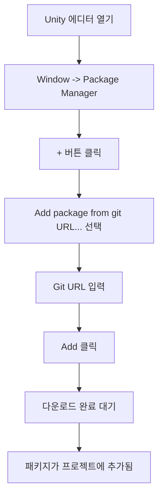

# 설치 가이드

이 가이드는 Game Frame X Advertisement 컴포넌트를 Unity 프로젝트에 설치하고 기본 구성을 완료하는 방법을 안내합니다.

## 개요

Game Frame X Advertisement는 Game Frame X 프레임워크의 광고 컴포넌트로, 통합된 광고 기능 추상화 계층을 제공합니다. 이 컴포넌트는 AdMob, Unity Ads, IronSource 등 여러 광고 플랫폼을 지원하며, 개발자가 핵심 코드를 수정하지 않고도 서로 다른 광고 SDK를 전환할 수 있도록 합니다.

> **중요 안내**: 본 컴포넌트(`com.gameframex.unity.advertisement`)는 광고 표시를 위한 추상화 계층과 핵심 로직을 제공합니다. 프로젝트에 특정 광고 SDK와 상호작용하는 구체적인 `IAdvertisementManager` 인터페이스 구현이 포함되어 있어야 합니다.

## 사전 요구 사항

이 컴포넌트를 설치하기 전에 다음 조건을 충족했는지 확인하십시오:

| 요구 사항 | 설명 |
|------|------|
| Unity 버전 | 2017.1 이상 |
| Game Frame X 코어 | GameFrameX.Runtime 및 GameFrameX.Event.Runtime이 설치되어 있어야 함 |
| 광고 SDK | 구체적인 광고 플랫폼 SDK(AdMob, Unity Ads 등)를 통합해야 함 |

## 설치 단계

### 방법 1: Unity Package Manager를 통한 설치 (권장)

1. Unity 에디터 열기
2. 메뉴에서 `Window` -> `Package Manager` 선택
3. Package Manager 창에서 왼쪽 상단의 `+` 버튼 클릭
4. `Add package from git URL...` 선택
5. 다음 Git URL 입력:
   ```
   https://github.com/GameFrameX/com.gameframex.unity.advertisement.git
   ```
6. `Add` 버튼을 클릭하여 설치 시작
7. Package Manager가 패키지를 다운로드하고 가져올 때까지 대기



### 방법 2: npm/cnpm을 통한 설치

네트워크 환경에서 GitHub 접속이 느린 경우 CNPM 미러를 사용할 수 있습니다:

1. `Packages/manifest.json` 파일에 종속성 추가:
   ```json
   {
     "dependencies": {
       "com.gameframex.unity.advertisement": "https://npm.cnb.cool/GameFrameX/com.gameframex.unity.advertisement.git"
     }
   }
   ```
2. 파일을 저장하면 Unity가 자동으로 패키지를 다운로드하고 가져옵니다

### 방법 3: 수동 설치

1. GitHub 저장소에서 소스 코드를 클론하거나 다운로드:
   ```
   https://github.com/GameFrameX/com.gameframex.unity.advertisement.git
   ```
2. 다운로드한 폴더를 Unity 프로젝트의 `Packages` 디렉토리에 복사
3. 폴더 이름을 `com.gameframex.unity.advertisement`로 변경
4. Unity 에디터를 다시 엽니다

## 종속성 구성

이 컴포넌트는 다음 Game Frame X 모듈에 종속되며, 이러한 모듈이 올바르게 설치되었는지 확인해야 합니다:

```json
// GameFrameX.Advertisement.Runtime.asmdef
{
    "references": [
        "GameFrameX.Runtime",
        "GameFrameX.Event.Runtime"
    ]
}
```

### Game Frame X 코어 모듈 설치

Game Frame X 코어 모듈이 아직 설치되지 않은 경우 다음 단계를 따르십시오:

1. Package Manager에서 GameFrameX 코어 패키지 추가:
   ```
   https://github.com/GameFrameX/com.gameframex.unity.runtime.git
   ```

## 씬 구성

### AdvertisementComponent 추가

1. Unity 에디터에서 광고를 통합할 씬 열기
2. Hierarchy 패널에서 마우스 오른쪽 버튼을 클릭하고 `Create Empty`를 선택하여 빈 GameObject 생성
3. 해당 GameObject를 선택하고 Inspector 패널에서 `Add Component` 클릭
4. `Advertisement Component`(또는 `GameFrameX/Advertisement`) 검색 후 추가
5. 컴포넌트가 씬에 추가됨

```csharp
// 코드를 통해서도 컴포넌트를 추가할 수 있습니다
using GameFrameX.Advertisement.Runtime;
using UnityEngine;

public class AdSetup : MonoBehaviour
{
    void Start()
    {
        // 씬에 AdvertisementComponent가 있는지 확인
        var adComponent = GetComponent<AdvertisementComponent>();
        if (adComponent == null)
        {
            adComponent = gameObject.AddComponent<AdvertisementComponent>();
        }
    }
}
```

### 광고 유닛 ID 구성

Inspector 패널에서 각 플랫폼의 광고 유닛 ID를 구성합니다:

| 플랫폼 | 필드 이름 | 설명 |
|------|----------|------|
| Android | Ad Unit Id (Android) | Google Play 플랫폼 광고 유닛 ID |
| iOS | Ad Unit Id (iOS) | Apple App Store 플랫폼 광고 유닛 ID |
| WebGL | Ad Unit Id (WebGL) | 웹 광고 유닛 ID |
| 위챗 미니게임 | Ad Unit Id (WebGL WeChat) | 위챗 미니게임 광고 유닛 ID |
| 더우인 미니게임 | Ad Unit Id (WebGL DouYin) | 더우인 미니게임 광고 유닛 ID |
| 콰이서우 미니게임 | Ad Unit Id (WebGL KuaiShou) | 콰이서우 미니게임 광고 유닛 ID |

> **참고**: 컴포넌트는 현재 빌드 플랫폼에 따라 해당 광고 유닛 ID를 자동으로 선택합니다.

```mermaid
flowchart TD
    subgraph Configuration["광고 구성 흐름"]
        A[AdvertisementComponent 추가] --> B[대상 플랫폼 선택]
        B --> C{멀티 플랫폼 지원 필요?}
        C -->|예| D[각 플랫폼에 Ad Unit Id 구성]
        C -->|아니오| E[현재 플랫폼 Ad Unit Id만 구성]
        D --> F[테스트 모드 설정 (선택사항)]
        E --> F
        F --> G[프로젝트 실행 후 검증]
    end
```

### 테스트 모드 구성

Inspector 패널에서 `테스트 모드 여부`(Debug Mode) 옵션을 체크하면 테스트 광고를 활성화하여 개발 디버깅에 편리합니다.

```csharp
// 코드를 통해서도 테스트 모드를 구성할 수 있습니다
public class AdSetup : MonoBehaviour
{
    void Start()
    {
        var adComponent = GetComponent<AdvertisementComponent>();
        // 수동 초기화, 두 번째 매개변수는 디버그 모드 활성화 여부
        adComponent.Initialize("your-ad-unit-id", true);
    }
}
```

## 광고 관리자 구현

### IAdvertisementManager 인터페이스 구현

이 컴포넌트는 구체적인 `IAdvertisementManager` 인터페이스 구현을 제공해야 합니다. 다음은 구현 단계입니다:

1. `BaseAdvertisementManager`를 상속받는 새 클래스 생성
2. 모든 추상 메서드 구현
3. 게임 시작 시 구현 등록

```csharp
using System;
using GameFrameX.Advertisement.Runtime;

public class MyAdManager : BaseAdvertisementManager
{
    public override void Initialize(string adUnitId, bool debug = false)
    {
        // 광고 SDK 초기화
    }

    public override void Play(Action<bool> playResult, string customData = null)
    {
        // 보상형 동영상 광고 재생
    }

    public override void Show(Action<string> success, Action<string> fail, Action<bool> onShowResult, string customData = null)
    {
        // 광고 표시
    }

    public override void Load(Action<string> success, Action<string> fail, string customData = null)
    {
        // 광고 로드
    }
}
```

> 자세한 구현 설명은 [핵심 개념](../4-core-concepts) 및 [빠른 시작](../3-getting-started) 문서를 참조하십시오.

## 설치 검증

설치가 완료되면 다음 방법으로 검증할 수 있습니다:

1. **패키지가 올바르게 가져와졌는지 확인**:
   - Unity 프로젝트에서 `Packages/com.gameframex.unity.advertisement` 디렉토리 확인
   - Runtime 및 Editor 폴더가 있는지 확인

2. **컴파일이 성공했는지 확인**:
   - Unity에서 `Window` -> `Assembly Compiler` 열기 (관련 도구가 설치된 경우)
   - 또는 프로젝트 빌드 시도

3. **테스트 실행**:
   - 씬에 AdvertisementComponent 추가
   - 게임을 실행하고 콘솔에 오류 메시지가 있는지 확인

## 자주 묻는 질문

### Q: 설치 후 컴파일 오류 발생

**가능한 원인**: 종속된 Game Frame X 코어 모듈이 누락되었습니다.

**해결 방법**:
1. GameFrameX.Runtime이 설치되었는지 확인
2. GameFrameX.Event.Runtime이 설치되었는지 확인
3. 광고 컴포넌트 패키지를 다시 가져오기

### Q: 광고 유닛 ID가 자동으로 매칭되지 않음

**가능한 원인**: 플랫폼 정의 기호가 올바르게 설정되지 않았습니다.

**해결 방법**:
- Android: Build Settings에서 Android 플랫폼이 선택되었는지 확인
- iOS: Build Settings에서 iOS 플랫폼이 선택되었는지 확인
- WebGL: Build Settings에서 WebGL 플랫폼이 선택되었는지 확인

### Q: Inspector에서 구성 옵션이 보이지 않음

**가능한 원인**: Editor 스크립트가 올바르게 컴파일되지 않았습니다.

**해결 방법**:
1. Editor 폴더가 있는지 확인
2. Unity 에디터를 다시 엽니다
3. `GameFrameX.Advertisement.Editor.asmdef`가 있는지 확인

## 관련 링크

- [개요](../1-overview) - Game Frame X Advertisement 전체 아키텍처 이해
- [빠른 시작](../3-getting-started) - 광고 기능 빠르게 시작하기
- [핵심 개념](../4-core-concepts) - 핵심 인터페이스와 구현 깊이 이해
- [API 참조](../6-api-reference) - 완전한 API 문서
- [GitHub 저장소](https://github.com/GameFrameX/com.gameframex.unity.advertisement.git) - 공식 소스 코드 저장소
