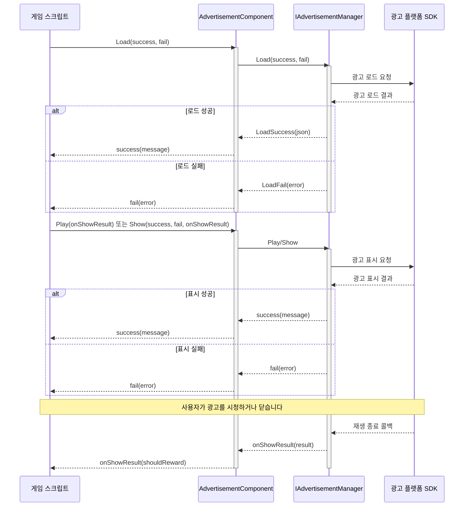

# 빠른 시작

이 가이드는 Unity 프로젝트에 광고 기능을 빠르게 통합하는 방법을 안내합니다. 몇 가지 간단한 단계를 통해 게임에서 배너 광고, 전면 광고 및 보상형 동영상 광고를 표시할 수 있습니다.

## 개요

Game Frame X Advertisement는 Unity 프로젝트에 통합된 광고 인터페이스를 제공하는 경량 광고 추상화 계층 컴포넌트입니다. `IAdvertisementManager` 인터페이스를 구현하여 핵심 비즈니스 코드를 수정하지 않고도 어떤 광고 네트워크(AdMob, Unity Ads, IronSource 등)든 쉽게 통합할 수 있습니다.

이 컴포넌트의 주요 특징:
- **플랫폼 독립**: 통합된 API 인터페이스로 멀티 플랫폼 광고 표시 지원
- **간편한 통합**: Unity 컴포넌트 방식으로 통합되어 복잡한 코드 작성 불필요
- **유연한 확장**: 인터페이스 구현을 통해 서로 다른 광고 SDK를 쉽게 전환

## 아키텍처 개요

광고 컴포넌트는 계층형 아키텍처로 설계되어, 코어 계층과 플랫폼 구현 계층이 분리되어 있습니다:

```mermaid
flowchart TD
    subgraph Client["클라이언트 계층"]
        GameScript[게임 스크립트]
    end

    subgraph Component["AdvertisementComponent"]
        AdComp[광고 컴포넌트]
    end

    subgraph Core["핵심 인터페이스 계층"]
        IAdMgr[IAdvertisementManager]
        BaseMgr[BaseAdvertisementManager]
    end

    subgraph Implementation["플랫폼 구현 계층"]
        Admob[AdMob 구현]
        UnityAds[Unity Ads 구현]
        IronSource[IronSource 구현]
    end

    GameScript --> AdComp
    AdComp --> IAdMgr
    IAdMgr <|.. BaseMgr
    BaseMgr <|-- Admob
    BaseMgr <|-- UnityAds
    BaseMgr <|-- IronSource
```

## 빠른 통합 단계

### 1단계: 광고 컴포넌트 설치

먼저 Unity 프로젝트에 Game Frame X Advertisement 컴포넌트를 설치합니다. 자세한 설치 방법은 [설치 가이드](./2-installation)를 참조하십시오.

### 2단계: 씬에 광고 컴포넌트 추가

1. Unity 에디터에서 광고를 추가할 씬을 선택합니다
2. Hierarchy 패널에서 광고를 추가할 GameObject를 마우스 오른쪽 버튼으로 클릭합니다
3. **GameFrameX -> Advertisement** 메뉴 항목을 선택합니다
4. 또는 `AdvertisementComponent` 스크립트를 GameObject에 직접 드래그 앤 드롭합니다

```csharp
// 수동으로 컴포넌트를 추가하는 방법
using UnityEngine;
using GameFrameX.Advertisement.Runtime;

public class GameManager : MonoBehaviour
{
    private AdvertisementComponent _adComponent;

    void Start()
    {
        // 현재 GameObject에 광고 컴포넌트 추가
        _adComponent = gameObject.AddComponent<AdvertisementComponent>();
    }
}
```

> Source: [AdvertisementComponent.cs](https://cnb.cool/GameFrameX/com.gameframex.unity.advertisement/blob/main/Runtime/Advertisement/AdvertisementComponent.cs#L1-L169)

### 3단계: 광고 유닛 ID 구성

Unity Inspector 패널에서 각 플랫폼의 광고 유닛 ID를 구성합니다:

| 플랫폼 | 필드명 | 설명 |
|------|--------|------|
| Android | Ad Unit Id Android | Google Play 스토어 버전 |
| iOS | Ad Unit Id iOS | Apple App Store 버전 |
| WebGL | Ad Unit Id WebGL | 웹 버전 |
| 위챗 미니게임 | Ad Unit Id WebGL WeChat | 위챗 환경 |
| 더우인 미니게임 | Ad Unit Id WebGL DouYin | 더우인 환경 |
| 콰이서우 미니게임 | Ad Unit Id WebGL KuaiShou | 콰이서우 환경 |

> Source: [AdvertisementComponent.cs](https://cnb.cool/GameFrameX/com.gameframex.unity.advertisement/blob/main/Runtime/Advertisement/AdvertisementComponent.cs#L15-L43)

### 4단계: 광고 관리자 구현

컴포넌트 자체는 추상화 계층만 제공하므로, 구체적인 광고 관리자를 구현해야 합니다. `BaseAdvertisementManager`를 상속받는 클래스를 생성합니다:

```csharp
using System;
using GameFrameX.Advertisement.Runtime;
using UnityEngine;

public class MyAdManager : BaseAdvertisementManager
{
    private string _adUnitId;
    private bool _isDebug;

    /// <summary>
    /// 광고 관리자 초기화
    /// </summary>
    public override void Initialize(string adUnitId, bool debug = false)
    {
        _adUnitId = adUnitId;
        _isDebug = debug;
        Debug.Log($"Ad Manager Initialized with ID: {_adUnitId}, Debug: {_isDebug}");
    }

    /// <summary>
    /// 광고 로드
    /// </summary>
    public override void Load(Action<string> success, Action<string> fail, string customData = null)
    {
        // 여기에 실제 광고 로드 로직을 구현합니다
        // base.LoadSuccess(json) 또는 base.LoadFail(json)을 호출하여 결과를 알립니다
        Debug.Log("Loading advertisement...");
        
        // 로드 성공 시뮬레이션
        base.LoadSuccess("{\"status\":\"loaded\"}");
    }

    /// <summary>
    /// 광고 표시
    /// </summary>
    public override void Show(Action<string> success, Action<string> fail, Action<bool> onShowResult, string customData = null)
    {
        // 여기에 실제 광고 표시 로직을 구현합니다
        Debug.Log("Showing advertisement...");
        
        // 표시 성공 시뮬레이션
        success?.Invoke("{\"status\":\"shown\"}");
    }

    /// <summary>
    /// 보상형 동영상 광고 재생
    /// </summary>
    public override void Play(Action<bool> playResult, string customData = null)
    {
        // 여기에 보상형 동영상 광고 재생 로직을 구현합니다
        // playResult 콜백 매개변수: true = 전체 시청, false = 건너뛰기
        Debug.Log("Playing rewarded advertisement...");
        
        // 전체 시청 시뮬레이션
        playResult?.Invoke(true);
    }
}
```

> Source: [BaseAdvertisementManager.cs](https://cnb.cool/GameFrameX/com.gameframex.unity.advertisement/blob/main/Runtime/Advertisement/BaseAdvertisementManager.cs#L1-L108)

## 사용 예제

### 기본 사용법: 광고 로드 및 표시

```csharp
using UnityEngine;
using GameFrameX.Advertisement.Runtime;
using System;

public class RewardedAdButton : MonoBehaviour
{
    // AdvertisementComponent 참조
    [SerializeField] private AdvertisementComponent adComponent;

    // 광고 로드
    public void LoadRewardedAd()
    {
        if (adComponent == null)
        {
            adComponent = GetComponent<AdvertisementComponent>();
        }

        adComponent.Load(
            // 로드 성공 콜백
            (message) => {
                Debug.Log($"광고 로드 성공: {message}");
                // 여기서 "광고 표시" 버튼을 활성화할 수 있습니다
            },
            // 로드 실패 콜백
            (error) => {
                Debug.LogError($"광고 로드 실패: {error}");
            }
        );
    }

    // 보상형 동영상 광고 표시
    public void ShowRewardedAd()
    {
        if (adComponent == null)
        {
            adComponent = GetComponent<AdvertisementComponent>();
        }

        adComponent.Play(
            // 광고 재생 결과 콜백
            // true = 사용자가 전체 광고를 시청함, 보상 지급 필요
            // false = 사용자가 광고를 건너뜀, 보상 미지급
            (shouldReward) => {
                if (shouldReward)
                {
                    Debug.Log("사용자가 전체 광고를 시청했습니다. 보상을 지급합니다!");
                    GivePlayerReward();
                }
                else
                {
                    Debug.Log("사용자가 광고를 건너뛰었습니다. 보상을 지급하지 않습니다");
                }
            }
        );
    }

    private void GivePlayerReward()
    {
        // 여기에 보상 지급 로직을 구현합니다
        Debug.Log("보상이 지급되었습니다!");
    }
}
```

> Source: [README.md](https://cnb.cool/GameFrameX/com.gameframex.unity.advertisement/blob/main/README.md#L25-L82)

### Show 메서드를 사용한 광고 표시

`Play` 메서드 외에도 `Show` 메서드를 사용하여 더 세밀하게 제어할 수 있습니다:

```csharp
public void ShowInterstitialAd()
{
    adComponent.Show(
        // 표시 성공 콜백
        (message) => {
            Debug.Log($"광고 표시 성공: {message}");
        },
        // 표시 실패 콜백
        (error) => {
            Debug.LogError($"광고 표시 실패: {error}");
        },
        // 표시 결과 콜백 (광고가 닫힐 때 호출)
        (showResult) => {
            Debug.Log($"광고 표시 결과: {(showResult ? "전체 재생" : "미완료 재생")}");
            // 게임 상태 복원
            ResumeGame();
        }
    );
}
```

> Source: [IAdvertisementManager.cs](https://cnb.cool/GameFrameX/com.gameframex.unity.advertisement/blob/main/Runtime/Advertisement/IAdvertisementManager.cs#L36-L53)

### 추가 데이터 설정

일부 광고 플랫폼은 표시 전 추가 매개변수 데이터 설정을 지원합니다:

```csharp
// 추가 데이터 설정
adComponent.SetExtraData("user_level", "10");
adComponent.SetExtraData("is_vip", "true");

// 그런 다음 광고 표시
ShowRewardedAd();
```

> Source: [AdvertisementComponent.cs](https://cnb.cool/GameFrameX/com.gameframex.unity.advertisement/blob/main/Runtime/Advertisement/AdvertisementComponent.cs#L107-L119)

## 광고 로드 및 표시 흐름

다음 흐름도는 광고 로드부터 표시까지의 전체 흐름을 보여줍니다:



## 콜백 설명

| 메서드 | 콜백 | 매개변수 | 설명 |
|------|------|------|------|
| `Load` | success | `string message` | 광고 로드 성공 시 호출, 매개변수는 성공 메시지 |
| `Load` | fail | `string error` | 광고 로드 실패 시 호출, 매개변수는 오류 메시지 |
| `Show` | success | `string message` | 광고 표시 시작 시 호출 |
| `Show` | fail | `string error` | 광고 표시 실패 시 호출 (표시할 광고가 없는 경우 등) |
| `Show` | onShowResult | `bool shouldReward` | 광고가 닫힌 후 호출, `true`는 전체 시청을 의미 |
| `Play` | onShowResult | `bool shouldReward` | 보상형 동영상 재생 결과, `true`는 보상 지급 가능을 의미 |

## 플랫폼 구성

서로 다른 배포 플랫폼은 서로 다른 구성이 필요합니다. 자세한 설명은 [플랫폼 구성](./5-platforms) 문서를 참조하십시오:

- Android 광고 유닛 ID 구성
- iOS 광고 유닛 ID 구성
- WebGL 광고 유닛 ID 구성
- 위챗/더우인/콰이서우 미니게임 구성

## 핵심 개념

광고 시스템의 핵심 개념과 설계 원리를 깊이 이해하려면 [핵심 개념](./4-core-concepts) 문서를 참조하십시오.

## 자주 묻는 질문

통합 과정에서 문제가 발생하면 [자주 묻는 질문](./7-troubleshooting) 문서에서 해결 방법을 찾아보십시오.

## 관련 링크

- [설치 가이드](./2-installation) - 자세한 설치 단계
- [핵심 개념](./4-core-concepts) - 광고 시스템 아키텍처 및 디자인 패턴
- [플랫폼 구성](./5-platforms) - 각 플랫폼의 상세 구성 설명
- [API 참조](./6-api-reference) - 완전한 API 문서
- [자주 묻는 질문](./7-troubleshooting) - 자주 묻는 질문 답변
