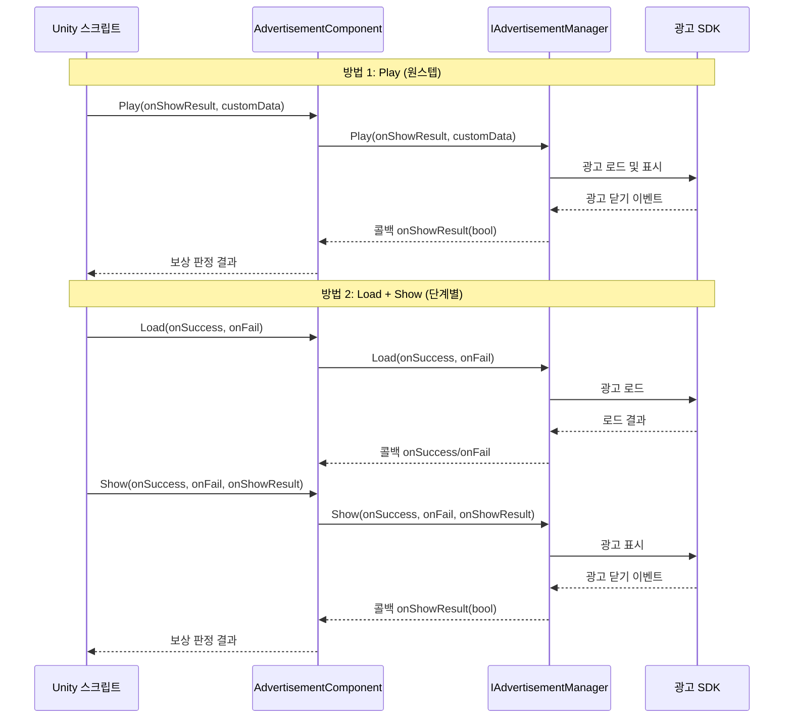

# 핵심 개념

이 문서는 GameFrameX 광고 모듈의 핵심 아키텍처 개념, 디자인 패턴 및 작동 원리를 소개합니다. 이러한 개념을 이해하면 광고 기능을 더 잘 사용하고 확장할 수 있습니다.

## 개요

GameFrameX 광고 모듈은 Unity 기반의 광고 통합 프레임워크로, 모듈형 아키텍처 설계를 채택하여 통합된 광고 인터페이스 추상화를 제공합니다. 이 모듈은 개발자가 플랫폼에 독립적인 방식으로 광고 기능을 구현할 수 있게 하면서, 서로 다른 플랫폼(Android, iOS, WebGL 및 다양한 미니게임 환경)에 대한 맞춤형 구현을 지원합니다.

핵심 설계 철학은 광고 비즈니스 로직과 Unity 컴포넌트 수명 주기를 분리하고, 인터페이스 추상화와 모듈형 설계를 통해 코드를 더 테스트 가능하고, 유지 관리 가능하며, 확장 가능하게 만드는 것입니다.

## 아키텍처 설계

```mermaid
graph TD
    subgraph UnityLayer["Unity 컴포넌트 계층"]
        AC[AdvertisementComponent<br/>광고 컴포넌트]
    end

    subgraph FrameworkLayer["GameFrameX 프레임워크 계층"]
        GFC[GameFrameworkComponent<br/>프레임워크 컴포넌트 기본 클래스]
        GFE[GameFrameworkEntry<br/>프레임워크 진입점]
        GFM[GameFrameworkModule<br/>프레임워크 모듈 기본 클래스]
    end

    subgraph AbstractionLayer["추상 인터페이스 계층"]
        IAM[IAdvertisementManager<br/>광고 관리자 인터페이스]
        BAM[BaseAdvertisementManager<br/>광고 관리자 기본 클래스]
    end

    subgraph ImplementationLayer["플랫폼 구현 계층"]
        ADM[Platform Specific<br/>광고 관리자 구현]
    end

    AC -->|의존| IAM
    AC -->|모듈 가져오기| GFE
    GFE -->|인스턴스화| GFM
    IAM <|..| BAM
    BAM -->|상속| GFM
    BAM -->|의존| ADM
    AC -->|참조| GFC
```

### 각 계층의 역할

**Unity 컴포넌트 계층**
- `AdvertisementComponent`: Unity 게임 오브젝트 컴포넌트로, 광고 기능의 외부 인터페이스를 캡슐화합니다
- 컴포넌트 수명 주기 관리(Awake, Start)를 담당합니다
- 플랫폼별 광고 유닛 ID 선택을 처리합니다

**프레임워크 계층**
- `GameFrameworkComponent`: Unity 컴포넌트의 기본 기능을 제공합니다
- `GameFrameworkEntry`: 모듈 등록 및 가져오기의 진입점을 제공합니다
- `GameFrameworkModule`: 모든 GameFrameX 모듈의 기본 클래스입니다

**추상 인터페이스 계층**
- `IAdvertisementManager`: 광고 관리자의 추상 인터페이스를 정의하여 비즈니스 로직과 구체적인 구현을 분리합니다
- `BaseAdvertisementManager`: 기본 구현을 제공하고, 콜백 필드와 템플릿 메서드를 정의합니다

**플랫폼 구현 계층**
- 구체적인 플랫폼 구현(Unity Ads, AdMob 등)이 `BaseAdvertisementManager`를 상속하여 구현합니다

## 핵심 컴포넌트 상세

### IAdvertisementManager 인터페이스

`IAdvertisementManager`는 광고 모듈의 핵심 인터페이스로, 모든 광고 작업의 표준 계약을 정의합니다:

```csharp
public interface IAdvertisementManager
{
    void Initialize(string adUnitId, bool isDebug = false);
    void SetExtraData(string key, string value);
    void Play(Action<bool> playResult, string customData = null);
    void Show(Action<string> success, Action<string> fail, Action<bool> onShowResult, string customData = null);
    void Load(Action<string> success, Action<string> fail, string customData = null);
}
```

> Source: [IAdvertisementManager.cs]({{file_base_url}}/Runtime/Advertisement/IAdvertisementManager.cs#L10-L54)

**인터페이스 설계 의도:**
- **Initialize**: 광고 관리자를 초기화하고 광고 유닛 ID와 디버그 모드를 설정합니다
- **SetExtraData**: 광고 표시 전 추가 매개변수를 설정하여 광고 SDK에서 사용할 수 있도록 합니다
- **Play**: 간소화된 원스텝 광고 재생 메서드(로드+표시)
- **Show**: 단계별 광고 표시로, 먼저 Load를 호출해야 합니다
- **Load**: 광고 리소스를 미리 로드하여 표시 성공률을 높입니다

### BaseAdvertisementManager 기본 클래스

`BaseAdvertisementManager`는 모든 플랫폼별 광고 관리자의 기본 클래스로, `GameFrameworkModule`을 상속받습니다:

```csharp
public abstract class BaseAdvertisementManager : GameFrameworkModule, IAdvertisementManager
{
    protected Action<bool> OnShowResult;
    protected Action<string> OnLoadSuccess;
    protected Action<string> OnLoadFail;

    public abstract void Initialize(string adUnitId, bool debug = false);
    public abstract void Play(Action<bool> playResult, string customData = null);
    public abstract void Show(Action<string> success, Action<string> fail, Action<bool> onShowResult, string customData = null);
    public abstract void Load(Action<string> success, Action<string> fail, string customData = null);

    protected void LoadSuccess(string json);
    protected void LoadFail(string json);
}
```

> Source: [BaseAdvertisementManager.cs]({{file_base_url}}/Runtime/Advertisement/BaseAdvertisementManager.cs#L11-L108)

**기본 클래스 설계 의도:**
- `GameFrameworkModule`을 상속받아 프레임워크의 일부가 되며, 프레임워크가 제공하는 수명 주기 관리를 받습니다
- `protected` 수정자로 콜백 필드를 노출하여, 하위 클래스가 적절한 시점에 트리거할 수 있도록 합니다
- 추상 메서드는 하위 클래스가 플랫폼별 로직을 구현하도록 강제합니다
- `LoadSuccess` 및 `LoadFail`은 로드 결과의 표준 처리 템플릿을 제공합니다

### AdvertisementComponent 컴포넌트

`AdvertisementComponent`는 Unity 계층의 진입 컴포넌트로, `GameFrameworkComponent`를 상속받습니다:

```csharp
[DisallowMultipleComponent]
[AddComponentMenu("GameFrameX/Advertisement")]
public class AdvertisementComponent : GameFrameworkComponent
{
    [SerializeField] private string m_adUnitIdAndroid = string.Empty;
    [SerializeField] private string m_adUnitIdiOS = string.Empty;
    [SerializeField] private string m_adUnitIdWebGL = string.Empty;
    [SerializeField] private string m_adUnitIdWebGLWeChat = string.Empty;
    [SerializeField] private string m_adUnitIdWebGLDouYin = string.Empty;
    [SerializeField] private string m_adUnitIdWebGLKuaiShou = string.Empty;
    [SerializeField] private bool m_debug = false;

    public string AdUnitId { get; private set; }

    private IAdvertisementManager _advertisementManager;

    protected override void Awake() { /* ... */ }
    private void Start() { /* ... */ }
    public void Initialize(string adUnitId, bool isDebug = false) { /* ... */ }
    public void SetExtraData(string key, string value) { /* ... */ }
    public void Show(Action<string> success, Action<string> fail, Action<bool> onShowResult) { /* ... */ }
    public void Play(Action<bool> onShowResult, string customData = null) { /* ... */ }
    public void Load(Action<string> success, Action<string> fail) { /* ... */ }
}
```

> Source: [AdvertisementComponent.cs]({{file_base_url}}/Runtime/Advertisement/AdvertisementComponent.cs#L13-L168)

**컴포넌트 설계 의도:**
- `[DisallowMultipleComponent]`를 사용하여 씬에 광고 컴포넌트 인스턴스가 하나만 있도록 보장합니다
- `[AddComponentMenu]`를 사용하여 Unity 에디터에서 컴포넌트를 쉽게 추가할 수 있습니다
- 직렬화 필드는 에디터에서 서로 다른 플랫폼의 광고 유닛 ID를 구성할 수 있게 합니다
- `Awake`에서 `GameFrameworkEntry.GetModule<IAdvertisementManager>()`를 통해 모듈 인스턴스를 가져옵니다
- `Start`에서 광고 관리자를 자동으로 초기화합니다
- 실행 시점의 플랫폼과 컴파일 조건에 따라 올바른 광고 유닛 ID를 자동으로 선택합니다

## 플랫폼 선택 메커니즘

광고 컴포넌트는 실행 시점의 환경에 따라 해당 광고 유닛 ID를 자동으로 선택하며, 이 과정은 `Awake` 메서드에서 완료됩니다:

```csharp
AdUnitId =
#if UNITY_WEBGL
#if ENABLE_WECHAT_MINI_GAME
    m_adUnitIdWebGLWeChat
#elif ENABLE_DOUYIN_MINI_GAME
    m_adUnitIdWebGLDouYin
#elif ENABLE_KUAISHOU_MINI_GAME
    m_adUnitIdWebGLKuaiShou
#else
    m_adUnitIdWebGL
#endif
#elif UNITY_ANDROID
    m_adUnitIdAndroid
#elif UNITY_IOS
    m_adUnitIdiOS
#else
    string.Empty
#endif
;
```

> Source: [AdvertisementComponent.cs]({{file_base_url}}/Runtime/Advertisement/AdvertisementComponent.cs#L69-L87)

이 설계는 다음 플랫폼을 지원합니다:
| 플랫폼 | 조건부 컴파일 기호 | 구성 필드 |
|------|-------------|---------|
| Android | `UNITY_ANDROID` | m_adUnitIdAndroid |
| iOS | `UNITY_IOS` | m_adUnitIdiOS |
| WebGL (일반) | `UNITY_WEBGL` | m_adUnitIdWebGL |
| 위챗 미니게임 | `ENABLE_WECHAT_MINI_GAME` | m_adUnitIdWebGLWeChat |
| 더우인 미니게임 | `ENABLE_DOUYIN_MINI_GAME` | m_adUnitIdWebGLDouYin |
| 콰이서우 미니게임 | `ENABLE_KUAISHOU_MINI_GAME` | m_adUnitIdWebGLKuaiShou |

## 광고 재생 흐름



### Play 메서드 (권장 방식)

`Play` 메서드는 가장 간단한 광고 재생 방식으로, 로드와 표시의 전체 흐름을 캡슐화합니다:

```csharp
public void Play(Action<bool> onShowResult, string customData = null)
{
    _advertisementManager.Play(onShowResult, customData);
}
```

> Source: [AdvertisementComponent.cs]({{file_base_url}}/Runtime/Advertisement/AdvertisementComponent.cs#L148-L151)

간단한 시나리오에 적합하며, 호출 시 광고 로드를 자동으로 처리합니다.

### Load + Show 메서드 (세밀한 제어)

세밀한 제어가 필요한 시나리오의 경우 단계별 방식을 사용할 수 있습니다:

```csharp
// 첫 번째 단계: 광고 미리 로드
public void Load(Action<string> success, Action<string> fail)
{
    _advertisementManager.Load(success, fail);
}

// 두 번째 단계: 광고 표시
public void Show(Action<string> success, Action<string> fail, Action<bool> onShowResult)
{
    _advertisementManager.Show(success, fail, onShowResult);
}
```

> Source: [AdvertisementComponent.cs]({{file_base_url}}/Runtime/Advertisement/AdvertisementComponent.cs#L133-L167)

다음과 같은 경우에 적합합니다:
- 특정 시점에 광고를 미리 로드해야 하는 경우
- 로드 결과에 따라 다른 처리를 해야 하는 경우
- 로드 실패와 표시 실패를 구분해야 하는 경우

## 콜백 메커니즘

광고 모듈은 C#의 `Action` 델리게이트를 사용하여 비동기 콜백을 구현합니다:

| 콜백 유형 | 매개변수 | 용도 |
|---------|------|------|
| `Action<string> success` | 성공 메시지 | 작업 성공 시 호출 |
| `Action<string> fail` | 실패 원인 | 작업 실패 시 호출 |
| `Action<bool> onShowResult` | 전체 시청 여부 | 광고가 닫힐 때 호출, true는 보상 지급 필요를 의미 |

### onShowResult 콜백 설명

`onShowResult` 콜백의 불리언 값 의미:
- **true**: 사용자가 전체 광고를 시청함 (일반적으로 보상 지급 필요)
- **false**: 사용자가 광고를 건너뛰었거나 광고 재생 중 오류 발생 (보상 미지급)

```csharp
// 사용 예제
advertisementComponent.Play((shouldReward) =>
{
    if (shouldReward)
    {
        // 보상 지급
        Debug.Log("사용자가 전체 광고를 시청했습니다. 보상을 지급합니다");
    }
    else
    {
        Debug.Log("사용자가 광고를 건너뛰었습니다. 보상을 지급하지 않습니다");
    }
});
```

## 디자인 패턴 요약

### 1. 템플릿 메서드 패턴

`BaseAdvertisementManager`는 `LoadSuccess` 및 `LoadFail` 템플릿 메서드를 정의하며, 하위 클래스는 이러한 메서드를 호출하기만 하면 되고 콜백 로직을 직접 구현할 필요가 없습니다:

```csharp
protected void LoadSuccess(string json)
{
    OnLoadSuccess?.Invoke(json);
}
```

> Source: [BaseAdvertisementManager.cs]({{file_base_url}}/Runtime/Advertisement/BaseAdvertisementManager.cs#L94-L97)

### 2. 의존성 주입

`AdvertisementComponent`는 직접 생성하지 않고 `GameFrameworkEntry.GetModule<IAdvertisementManager>()`를 통해 모듈 인스턴스를 가져옵니다:

```csharp
_advertisementManager = GameFrameworkEntry.GetModule<IAdvertisementManager>();
```

> Source: [AdvertisementComponent.cs]({{file_base_url}}/Runtime/Advertisement/AdvertisementComponent.cs#L62-L67)

이 설계를 통해 실행 시점에 서로 다른 광고 구현을 교체할 수 있으며, 테스트 및 플랫폼 적응에 유리합니다.

### 3. 전략 패턴

서로 다른 광고 플랫폼 구현이 `IAdvertisementManager` 인터페이스를 교체할 수 있으며, 동일한 인터페이스만 구현하면 원활하게 전환할 수 있습니다.

### 4. 파사드 패턴

`AdvertisementComponent`는 통합 진입점으로서 광고 모듈과의 상호작용을 단순화하며, 개발자는 기본 구현 세부 사항에 신경 쓸 필요가 없습니다.

## 광고 모듈 확장

새로운 광고 플랫폼 지원을 추가하려면:

1. `BaseAdvertisementManager`를 상속받는 **새로운 광고 관리자 클래스 생성**
2. 플랫폼별 광고 로직을 처리하는 **모든 추상 메서드 구현**
3. `GameFrameworkEntry`를 통해 모듈을 등록하는 **프레임워크에 등록**
4. 해당 플랫폼의 광고 유닛 ID를 설정하는 **Unity 컴포넌트에서 구성**

구체적인 구현은 [API 참조](./6-api-reference) 및 [플랫폼 구성](./5-platforms) 문서를 참조하십시오.

## 관련 링크

- [빠른 시작](./3-getting-started)
- [플랫폼 구성](./5-platforms)
- [API 참조](./6-api-reference)
- [설치 가이드](./2-installation)
