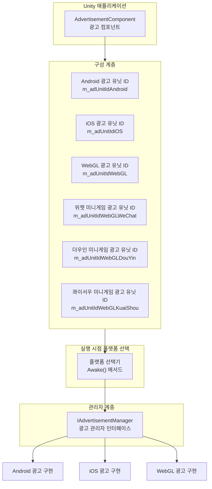

# 플랫폼 구성

이 문서는 Game Frame X 광고 컴포넌트의 플랫폼 구성 메커니즘을 소개하고, 서로 다른 배포 플랫폼에서 광고 유닛 ID를 구성하는 방법을 설명합니다.

## 개요

Game Frame X 광고 컴포넌트는 플랫폼 독립적인 설계 아키텍처를 채택하여, `AdvertisementComponent` 컴포넌트를 통해 통합된 광고 인터페이스를 제공합니다. 하위 계층은 Unity의 조건부 컴파일 지시어를 통해 서로 다른 플랫폼에 자동으로 적응하며, 개발자는 Inspector 패널에서 각 플랫폼의 광고 유닛 ID만 구성하면 한 번의 구성으로 멀티 플랫폼 배포가 가능합니다.

> 참고: 이 컴포넌트는 광고 기능의 추상화 계층과 핵심 로직 프레임워크만 제공합니다. 실제 광고 표시를 구현하려면 프로젝트에 구체적인 광고 SDK(AdMob, Unity Ads, 추산아 등)를 통합하고 `IAdvertisementManager` 인터페이스를 구현해야 합니다.

## 지원 플랫폼

Game Frame X 광고 컴포넌트는 다음 플랫폼 구성을 지원합니다:

| 플랫폼 | 구성 필드 | 조건부 컴파일 지시어 | 설명 |
|------|----------|--------------|------|
| Android | `m_adUnitIdAndroid` | `UNITY_ANDROID` | Android 네이티브 플랫폼 |
| iOS | `m_adUnitIdiOS` | `UNITY_IOS` | iOS 플랫폼 |
| WebGL | `m_adUnitIdWebGL` | `UNITY_WEBGL` | 표준 WebGL 플랫폼 |
| WebGL (위챗 미니게임) | `m_adUnitIdWebGLWeChat` | `UNITY_WEBGL` + `ENABLE_WECHAT_MINI_GAME` | 위챗 미니게임 환경 |
| WebGL (더우인 미니게임) | `m_adUnitIdWebGLDouYin` | `UNITY_WEBGL` + `ENABLE_DOUYIN_MINI_GAME` | 더우인 미니게임 환경 |
| WebGL (콰이서우 미니게임) | `m_adUnitIdWebGLKuaiShou` | `UNITY_WEBGL` + `ENABLE_KUAISHOU_MINI_GAME` | 콰이서우 미니게임 환경 |

## 아키텍처 설계



플랫폼 선택 로직은 `AdvertisementComponent`의 `Awake()` 메서드에서 구현되며, 현재 컴파일 플랫폼에 따라 해당 광고 유닛 ID를 자동으로 선택합니다:

```csharp
AdUnitId =
#if UNITY_WEBGL
#if ENABLE_WECHAT_MINI_GAME
    m_adUnitIdWebGLWeChat
#elif ENABLE_DOUYIN_MINI_GAME
    m_adUnitIdWebGLDouYin
#elif ENABLE_KUAISHOU_MINI_GAME
    m_adUnitIdWebGLKuaiShou
#else
    m_adUnitIdWebGL
#endif
#elif UNITY_ANDROID
    m_adUnitIdAndroid
#elif UNITY_IOS
    m_adUnitIdiOS
#else
    string.Empty
#endif
;
```

> Source: [AdvertisementComponent.cs](https://cnb.cool/GameFrameX/com.gameframex.unity.advertisement/blob/main/Runtime/Advertisement/AdvertisementComponent.cs#L69-L87)

## 구성 흐름

### 1단계: 컴포넌트 추가

Unity 씬에서 빈 GameObject를 만들거나 기존 객체를 선택한 다음 `AdvertisementComponent` 컴포넌트를 추가합니다:

1. Unity 메뉴에서 **GameObject** -> **GameFrameX** -> **Advertisement** 선택
2. 또는 Inspector 패널에서 **Add Component**를 클릭하고 `Advertisement`를 검색하여 추가

### 2단계: 광고 유닛 ID 구성

Inspector 패널에서 각 플랫폼의 광고 유닛 ID를 구성합니다:

```csharp
[SerializeField] private string m_adUnitIdAndroid = string.Empty;      // Android 광고 유닛 ID
[SerializeField] private string m_adUnitIdiOS = string.Empty;           // iOS 광고 유닛 ID
[SerializeField] private string m_adUnitIdWebGL = string.Empty;         // WebGL 광고 유닛 ID
[SerializeField] private string m_adUnitIdWebGLWeChat = string.Empty;   // 위챗 미니게임 광고 유닛 ID
[SerializeField] private string m_adUnitIdWebGLDouYin = string.Empty;   // 더우인 미니게임 광고 유닛 ID
[SerializeField] private string m_adUnitIdWebGLKuaiShou = string.Empty;  // 콰이서우 미니게임 광고 유닛 ID
```

> Source: [AdvertisementComponent.cs](https://cnb.cool/GameFrameX/com.gameframex.unity.advertisement/blob/main/Runtime/Advertisement/AdvertisementComponent.cs#L15-L43)

### 3단계: 테스트 모드 구성 (선택 사항)

디버그 시 광고 로그를 확인하려면 테스트 모드를 활성화할 수 있습니다:

```csharp
[SerializeField] private bool m_debug = false;  // 테스트 모드 여부
```

> Source: [AdvertisementComponent.cs](https://cnb.cool/GameFrameX/com.gameframex.unity.advertisement/blob/main/Runtime/Advertisement/AdvertisementComponent.cs#L48)

### 4단계: 광고 관리자 구현

이 컴포넌트는 구성 계층을 제공하며, 구체적인 광고 관리자도 구현해야 합니다. 일반적인 구현 흐름은 다음과 같습니다:

```csharp
using GameFrameX.Advertisement.Runtime;
using GameFrameX.Runtime;
using UnityEngine;

public class MyAdvertisementManager : BaseAdvertisementManager
{
    public override void Initialize(string adUnitId, bool debug = false)
    {
        // 구체적인 초기화 로직 구현
    }

    public override void Play(Action<bool> playResult, string customData = null)
    {
        // 광고 재생 로직 구현
    }

    public override void Show(Action<string> success, Action<string> fail, Action<bool> onShowResult, string customData = null)
    {
        // 광고 표시 로직 구현
    }

    public override void Load(Action<string> success, Action<string> fail, string customData = null)
    {
        // 광고 로드 로직 구현
    }
}
```

## Unity Editor 구성 인터페이스

Game Frame X는 커스텀 Inspector 인터페이스를 제공하여 개발자가 에디터에서 광고 유닛 ID를 쉽게 구성할 수 있습니다:

```csharp
[CustomEditor(typeof(AdvertisementComponent))]
internal sealed class AdvertisementComponentInspector : ComponentTypeComponentInspector
{
    // Inspector에서 각 플랫폼의 광고 유닛 ID 구성 필드를 커스텀하여 표시
}
```

> Source: [AdvertisementComponentInspector.cs](https://cnb.cool/GameFrameX/com.gameframex.unity.advertisement/blob/main/Editor/Inspector/AdvertisementComponentInspector.cs#L16-L71)

Inspector 인터페이스 표시 효과:

```
┌─────────────────────────────────────────────┐
│ Advertisement Component                      │
├─────────────────────────────────────────────┤
│ Debug Mode:  [ ]                              │
│                                          │
│ Android 광고 유닛 ID:  [________________]        │
│ IOS 광고 유닛 ID:      [________________]        │
│ WebGL 광고 유닛 ID:    [________________]         │
│ WebGL 위챗 광고 유닛 ID: [________________]       │
│ WebGL 더우인 광고 유닛 ID: [________________]       │
│ WebGL 콰이서우 광고 유닛 ID: [________________]       │
└─────────────────────────────────────────────┘
```

## 플랫폼별 설명

### Android 플랫폼

- `UnityEngine.RuntimePlatform.Android`를 컴파일 대상으로 사용
- Google AdMob 또는 기타 Android 광고 플랫폼에서 광고 유닛 ID를 신청해야 합니다

### iOS 플랫폼

- `UnityEngine.RuntimePlatform.IPhonePlayer`를 컴파일 대상으로 사용
- Apple App Store 정책에서 허용하는 광고 플랫폼에서 광고 유닛 ID를 신청해야 합니다

### WebGL 플랫폼

WebGL 플랫폼은 컴파일 매크로 정의에 따라 추가로 세분화됩니다:

| 컴파일 매크로 | 플랫폼 | 설명 |
|--------|------|------|
| `ENABLE_WECHAT_MINI_GAME` | 위챗 미니게임 | 위챗 미니게임 환경 |
| `ENABLE_DOUYIN_MINI_GAME` | 더우인 미니게임 | 더우인 미니게임 환경 |
| `ENABLE_KUAISHOU_MINI_GAME` | 콰이서우 미니게임 | 콰이서우 미니게임 환경 |
| 위 매크로 없음 | 표준 WebGL | 브라우저 환경 |

> **중요 안내**: Unity 빌드 설정에서 대상 플랫폼에 맞게 전처리기 매크로를 올바르게 설정해야 합니다. 위챗, 더우인, 콰이서우 미니게임의 경우 Player Settings -> Other Settings -> Scripting Define Symbols에 해당 매크로 정의를 추가해야 합니다.

## 구성 검증

구성이 완료되면 다음 방법으로 구성이 올바른지 검증할 수 있습니다:

1. **실행 시점 로그**: 컴포넌트 초기화 시 선택된 플랫폼과 광고 유닛 ID가 출력됩니다
2. **코드 디버그**: `Awake()` 메서드에서 `AdUnitId` 속성의 값을 확인합니다

```csharp
// AdvertisementComponent에서
public string AdUnitId { get; private set; }

// 로그 출력으로 검증
Debug.Log($"현재 플랫폼 광고 유닛 ID: {AdUnitId}");
```

## 자주 묻는 질문

### Q1: 각 플랫폼의 광고 유닛 ID는 어떤 형식이어야 합니까?

광고 플랫폼마다 광고 유닛 ID 형식이 다릅니다:
- **Google AdMob**: `ca-app-pub-xxxxxx/xxxxxx` 형식
- **Unity Ads**: 숫자 ID 형식
- **추산아**: 광고 플랫폼에서 제공하는 형식

올바른 광고 유닛 ID 형식은 구체적인 광고 플랫폼의 문서를 참조하십시오.

### Q2: 광고 유닛 ID가 올바르게 구성되었는데 광고가 표시되지 않습니다.

다음 사항을 확인하십시오:
1. `IAdvertisementManager` 인터페이스의 구체적인 클래스가 구현되었는지 확인
2. 구체적인 구현 클래스가 Game Frame X 프레임워크에 올바르게 등록되었는지 확인
3. 광고 플랫폼 백엔드에서 앱과 광고 유닛이 올바르게 구성되었는지 확인
4. `m_debug` 모드를 활성화하여 상세 로그 확인

### Q3: WebGL 플랫폼에서 빌드 후 광고가 표시되지 않습니다.

WebGL 플랫폼의 경우 다음을 확인하십시오:
1. `m_adUnitIdWebGL` 필드가 올바르게 설정되었는지 확인
2. 위챗/더우인/콰이서우 미니게임인 경우 Player Settings에 해당 컴파일 매크로가 추가되었는지 확인
3. 브라우저 콘솔에 JavaScript 오류가 없는지 확인

## 관련 링크

- [개요](./1-overview) - 광고 컴포넌트의 전체 아키텍처 이해
- [설치 가이드](./2-installation) - 컴포넌트 설치 방법 확인
- [빠른 시작](./3-getting-started) - 광고 기능 빠르게 통합
- [핵심 개념](./4-core-concepts) - 핵심 개념 깊이 이해
- [API 참조](./6-api-reference) - 완전한 API 인터페이스 문서
- [자주 묻는 질문](./7-troubleshooting) - 자주 묻는 질문 답변
