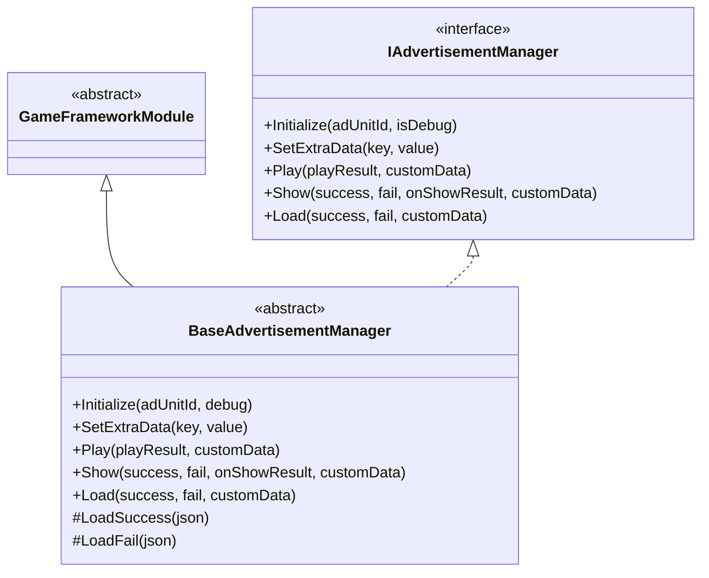
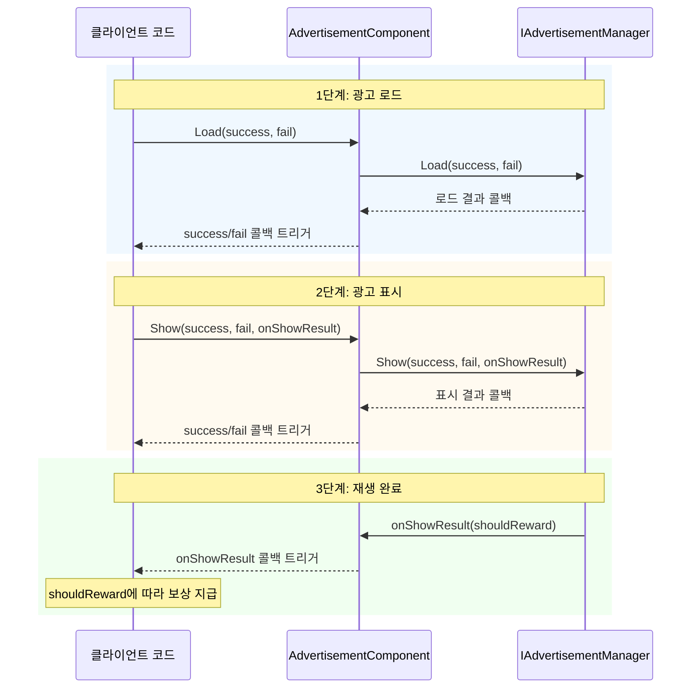

# API 참조

이 섹션에서는 GameFrameX Advertisement 모듈의 완전한 API 인터페이스를 소개하며, 인터페이스 정의, 추상 기본 클래스 및 Unity 컴포넌트의 공개 메서드와 속성을 포함합니다.

## 개요

Advertisement 모듈은 통합된 광고 관리 인터페이스를 제공하며, 여러 광고 플랫폼(Android, iOS, WebGL, 위챗 미니게임, 더우인 미니게임, 콰이서우 미니게임)을 지원합니다. API 설계는 전략 패턴을 채택하여 `IAdvertisementManager` 인터페이스를 통해 통합된 광고 작업 계약을 정의하고, 각 플랫폼 구현 클래스가 구체적인 광고 SDK 통합을 담당합니다.

---

## IAdvertisementManager 인터페이스

`IAdvertisementManager`는 광고 관리의 핵심 인터페이스로, 모든 광고 작업의 표준 메서드를 정의합니다. 이 인터페이스는 의존성 역전 원칙을 채택하여 상위 코드와 구체적인 광고 플랫폼 구현을 분리합니다.

> Source: [IAdvertisementManager.cs]({{file_base_url}}/Runtime/Advertisement/IAdvertisementManager.cs#L1-L55)

### 메서드 목록

| 메서드 | 설명 |
|------|------|
| `Initialize` | 광고 관리자 초기화 |
| `SetExtraData` | 추가 광고 데이터 설정 |
| `Play` | 광고 재생 (간소화 버전) |
| `Show` | 광고 표시 (전체 버전) |
| `Load` | 광고 로드 |

---

## BaseAdvertisementManager 추상 클래스

`BaseAdvertisementManager`는 모든 플랫폼 광고 관리자의 추상 기본 클래스로, `GameFrameworkModule`을 상속받고 `IAdvertisementManager` 인터페이스를 구현합니다. 이 클래스는 일부 메서드의 기본 구현을 제공하며, 하위 클래스가 구현해야 하는 추상 메서드를 정의합니다.

> Source: [BaseAdvertisementManager.cs]({{file_base_url}}/Runtime/Advertisement/BaseAdvertisementManager.cs#L1-L109)

### 클래스 구조



### 보호된 멤버

| 멤버 | 유형 | 설명 |
|------|------|------|
| `OnShowResult` | `Action<bool>` | 광고 표시 결과 콜백 |
| `OnLoadSuccess` | `Action<string>` | 광고 로드 성공 콜백 |
| `OnLoadFail` | `Action<string>` | 광고 로드 실패 콜백 |

### 수명 주기 메서드

#### `Update(elapseSeconds, realElapseSeconds)`

업데이트 메서드로, 매 프레임마다 호출됩니다.

**선언:**
```csharp
protected override void Update(float elapseSeconds, float realElapseSeconds)
```

> Source: [BaseAdvertisementManager.cs]({{file_base_url}}/Runtime/Advertisement/BaseAdvertisementManager.cs#L18-L21)

#### `Shutdown()`

종료 시 정리 메서드로, 모듈이 종료될 때 호출됩니다.

**선언:**
```csharp
protected override void Shutdown()
```

> Source: [BaseAdvertisementManager.cs]({{file_base_url}}/Runtime/Advertisement/BaseAdvertisementManager.cs#L25-L28)

---

## AdvertisementComponent 컴포넌트

`AdvertisementComponent`는 Unity 씬에서 사용되는 광고 컴포넌트로, `GameFrameworkComponent`를 상속받습니다. 이 컴포넌트는 Unity 에디터를 위한 구성 인터페이스와 실행 시점 API를 제공하며, 게임에서 개발자가 가장 많이 직접 상호작용하는 클래스입니다.

> Source: [AdvertisementComponent.cs]({{file_base_url}}/Runtime/Advertisement/AdvertisementComponent.cs#L1-L169)

### Unity 속성

Unity 에디터에서 다음 속성을 구성할 수 있습니다:

| 속성 | 유형 | 기본값 | 설명 |
|------|------|--------|------|
| `AdUnitId` | string | 빈 문자열 | Android 플랫폼 광고 유닛 ID |
| `m_adUnitIdiOS` | string | 빈 문자열 | iOS 플랫폼 광고 유닛 ID |
| `m_adUnitIdWebGL` | string | 빈 문자열 | WebGL 플랫폼 광고 유닛 ID |
| `m_adUnitIdWebGLWeChat` | string | 빈 문자열 | 위챗 미니게임 광고 유닛 ID |
| `m_adUnitIdWebGLDouYin` | string | 빈 문자열 | 더우인 미니게임 광고 유닛 ID |
| `m_adUnitIdWebGLKuaiShou` | string | 빈 문자열 | 콰이서우 미니게임 광고 유닛 ID |
| `m_debug` | bool | false | 테스트 모드 활성화 여부 |

### 공개 속성

#### `AdUnitId`

현재 플랫폼에 해당하는 광고 유닛 ID를 가져옵니다. 이 속성은 `Awake()` 메서드에서 현재 실행 플랫폼에 따라 적절한 광고 유닛 ID를 자동으로 선택합니다.

```csharp
public string AdUnitId { get; private set; }
```

> Source: [AdvertisementComponent.cs]({{file_base_url}}/Runtime/Advertisement/AdvertisementComponent.cs#L51-L53)

### 공개 메서드

#### `Initialize(adUnitId, isDebug)`

광고 관리자를 초기화합니다. 실행 시점에 광고 관리자를 다시 초기화할 수 있습니다.

**선언:**
```csharp
public void Initialize(string adUnitId, bool isDebug = false)
```

**매개변수:**
- `adUnitId` (string): 광고 유닛 ID
- `isDebug` (bool): 테스트 모드 활성화 여부, 기본값은 false

**예제:**
```csharp
// 광고 컴포넌트 초기화
var adComponent = gameObject.GetComponent<AdvertisementComponent>();
adComponent.Initialize("your_ad_unit_id", true);
```

> Source: [AdvertisementComponent.cs]({{file_base_url}}/Runtime/Advertisement/AdvertisementComponent.cs#L101-L105)

---

#### `SetExtraData(key, value)`

광고 추가 데이터를 설정합니다. 광고 표시 전에 추가 매개변수 데이터를 설정하며, 이 데이터는 광고 SDK에서 사용될 수 있습니다.

**선언:**
```csharp
public void SetExtraData(string key, string value)
```

**매개변수:**
- `key` (string): 데이터 키
- `value` (string): 데이터 값

**설계 의도:** 이 메서드는 광고 관련 컨텍스트 정보(예: 사용자 레벨, 스테이지 진행도 등)를 전달하는 데 사용되며, 광고 SDK는 이 정보를 바탕으로 광고 타겟팅 전략을 최적화할 수 있습니다.

**예제:**
```csharp
// 사용자 레벨 정보 설정
adComponent.SetExtraData("user_level", "10");
adComponent.SetExtraData("current_level", "5");
```

> Source: [AdvertisementComponent.cs]({{file_base_url}}/Runtime/Advertisement/AdvertisementComponent.cs#L116-L119)

---

#### `Show(success, fail, onShowResult)`

광고를 표시합니다 (전체 버전). 이 메서드를 호출하기 전에 `Load` 메서드를 통해 광고를 미리 로드했는지 확인하십시오.

**선언:**
```csharp
public void Show(Action<string> success, Action<string> fail, Action<bool> onShowResult)
```

**매개변수:**
- `success` (Action\<string\>): 표시 성공 콜백, 매개변수는 성공 메시지
- `fail` (Action\<string\>): 표시 실패 콜백, 매개변수는 실패 원인
- `onShowResult` (Action\<bool\>): 표시 성공 후 광고 닫기 콜백. 매개변수 값이 true면 광고 보상을 지급해야 함을, false면 광고가 완전히 재생되지 않았음을 의미합니다

**설계 의도:** 이 메서드는 완전한 콜백 처리 능력을 제공하여, 광고 표시 결과에 따라 서로 다른 비즈니스 로직을 실행해야 하는 시나리오에 적합합니다.

**예제:**
```csharp
// 전면 광고 표시
adComponent.Show(
    success => Debug.Log($"광고 표시 성공: {success}"),
    fail => Debug.LogError($"광고 표시 실패: {fail}"),
    shouldReward =>
    {
        if (shouldReward)
        {
            // 보상 지급
            Debug.Log("사용자가 전체 광고를 시청했습니다. 보상을 지급합니다");
        }
    }
);
```

> Source: [AdvertisementComponent.cs]({{file_base_url}}/Runtime/Advertisement/AdvertisementComponent.cs#L133-L136)

---

#### `Play(onShowResult, customData)`

광고를 재생합니다 (간소화 버전). `Show` 메서드의 간소화 버전으로 간단한 광고 재생 시나리오에 적합합니다.

**선언:**
```csharp
public void Play(Action<bool> onShowResult, string customData = null)
```

**매개변수:**
- `onShowResult` (Action\<bool\>): 표시 성공 후 광고 닫기 콜백. 매개변수 값이 true면 광고 보상을 지급해야 함을, false면 광고가 완전히 재생되지 않았음을 의미합니다
- `customData` (string): 커스텀 데이터, null 가능

**설계 의도:** `Show` 메서드에 비해 `Play` 메서드는 콜백 매개변수를 간소화하여 빠른 통합과 간단한 보상 지급 시나리오에 적합합니다.

**예제:**
```csharp
// 보상형 동영상 광고 재생
adComponent.Play(shouldReward =>
{
    if (shouldReward)
    {
        // 보상 지급
        Debug.Log("보상 지급: 골드 x 100");
    }
}, "level_5_reward");
```

> Source: [AdvertisementComponent.cs]({{file_base_url}}/Runtime/Advertisement/AdvertisementComponent.cs#L148-L151)

---

#### `Load(success, fail)`

광고를 로드합니다. 광고를 표시하기 전에 이 메서드를 호출하여 광고 리소스를 미리 로드하는 것이 좋습니다.

**선언:**
```csharp
public void Load(Action<string> success, Action<string> fail)
```

**매개변수:**
- `success` (Action\<string\>): 로드 성공 콜백, 매개변수는 성공 메시지
- `fail` (Action\<string\>): 로드 실패 콜백, 매개변수는 실패 원인

**설계 의도:** 광고 미리 로드는 사용자 대기 시간을 줄이고 사용자 경험을 향상시킬 수 있습니다. 게임 로딩 화면이나 유휴 시간에 미리 호출하는 것이 좋습니다.

**예제:**
```csharp
// 광고 미리 로드
adComponent.Load(
    success => Debug.Log($"광고 로드 성공: {success}"),
    fail => Debug.LogWarning($"광고 로드 실패: {fail}")
);
```

> Source: [AdvertisementComponent.cs]({{file_base_url}}/Runtime/Advertisement/AdvertisementComponent.cs#L164-L167)

---

## 광고 재생 흐름

다음 흐름도는 광고 재생의 전체 수명 주기를 보여줍니다:



---

## 완전한 사용 예제

다음 예제는 게임 스테이지 완료 후 보상형 동영상 광고를 재생하는 전체 흐름을 보여줍니다:

```csharp
using UnityEngine;
using GameFrameX.Advertisement.Runtime;

public class GameLevel : MonoBehaviour
{
    [SerializeField] private AdvertisementComponent advertisementComponent;
    
    private void OnLevelComplete()
    {
        // 사용 가능한 광고가 있는지 확인
        if (advertisementComponent != null)
        {
            // 보상형 동영상 광고 재생
            advertisementComponent.Play(shouldReward =>
            {
                if (shouldReward)
                {
                    // 스테이지 클리어 보상 지급
                    AwardLevelRewards();
                }
                else
                {
                    Debug.Log("사용자가 전체 광고를 시청하지 않아 보상을 받을 수 없습니다");
                }
            }, $"level_{CurrentLevel}_completion");
        }
    }
    
    private void AwardLevelRewards()
    {
        Debug.Log("스테이지 보상이 지급되었습니다!");
    }
}
```

> Sources:
> - [AdvertisementComponent.cs]({{file_base_url}}/Runtime/Advertisement/AdvertisementComponent.cs#L148-L151)
> - [IAdvertisementManager.cs]({{file_base_url}}/Runtime/Advertisement/IAdvertisementManager.cs#L28-L34)

---

## 관련 링크

- [개요](../1-overview) - 광고 모듈 전체 소개
- [설치 가이드](../2-installation) - 환경 구성 및 설치
- [빠른 시작](../3-getting-started) - 빠른 통합 가이드
- [핵심 개념](../4-core-concepts) - 핵심 아키텍처 설계
- [플랫폼 구성](../5-platforms) - 각 플랫폼 상세 구성
- [자주 묻는 질문](../7-troubleshooting) - 자주 묻는 질문과 해결 방법
