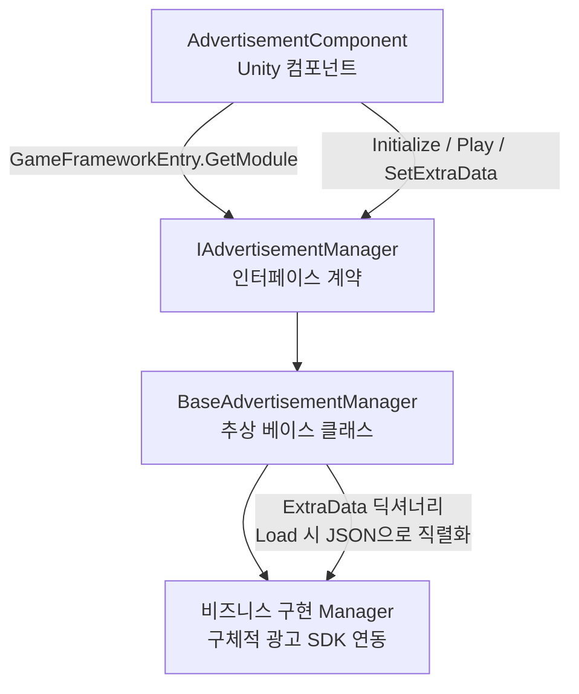

# 광고 컴포넌트 동작 메커니즘 빠른 둘러보기

GameFrameX 광고 컴포넌트는 Unity 컴포넌트 + 프레임워크 모듈의 이중 구조를 기반으로, 광고 SDK의 초기화, 재생, 로드 및 콜백을 모두 통일된 `IAdvertisementManager` 계약으로 수렴합니다. 비즈니스 측은 `AdvertisementComponent`를 향해 호출하기만 하면 됩니다.

## 빠른 시작

1. 씬에 `AdvertisementComponent`를 부착합니다(메뉴 경로 `GameFrameX/Advertisement`). Inspector에서 각 플랫폼의 광고 단위 ID(`m_adUnitIdAndroid` / `m_adUnitIdiOS` / `m_adUnitIdWebGL*`)를 입력합니다.
2. Inspector의 `Config` 필드에 `AdvertisementConfig`를 상속받은 설정 하위 클래스(예: `DefaultAdvertisementConfig`)를 드래그하여 `isDebug` 등의 확장 매개변수를 전달합니다.
3. 씬이 시작되면 프레임워크는 현재 플랫폼에 따라 자동으로 광고 단위 ID를 선택하고, `Start()`에서 `m_config`를 관리자에게 전달합니다. 이후 비즈니스 측은 `Play(AdvertisementPlayOption)`만 호출하면 됩니다.

```csharp
// 재생 트리거(권장 사용법)
var option = new AdvertisementPlayOption
{
    onPlayResult = success => Debug.Log($"재생 종료:{success}"),
    customData = "revive_001",
};
FindObjectOfType<AdvertisementComponent>().Play(option);
```

Source: [AdvertisementComponent.cs](https://github.com/GameFrameX/com.gameframex.unity.advertisement/blob/main/Runtime/Advertisement/AdvertisementComponent.cs#L120-L219)

## 동작 원리 빠른 둘러보기

광고 컴포넌트는 네 가지 객체가 협력합니다: 컴포넌트 계층(`AdvertisementComponent`)→ 인터페이스 계층(`IAdvertisementManager`)→ 추상 관리자(`BaseAdvertisementManager`)→ 플랫폼별 구체적 구현(비즈니스 프로젝트가 `BaseAdvertisementManager`를 상속받아 각 SDK에 연동). `Awake()`는 리플렉션으로 구현 타입을 분석하고 `GameFrameworkEntry`에서 관리자를 가져온 다음, 플랫폼 매크로에 따라 광고 단위 ID를 선택합니다.



핵심 사항:

- **플랫폼 광고 단위 ID 선택**: `Awake()`는 `#if UNITY_WEBGL` / `UNITY_ANDROID` / `UNITY_IOS` 등의 매크로를 통해, WebGL에서는 위챗/도우인/콰이쇼우 미니게임 하위 플랫폼을 세분화합니다.([AdvertisementComponent.cs#L99-L117](https://github.com/GameFrameX/com.gameframex.unity.advertisement/blob/main/Runtime/Advertisement/AdvertisementComponent.cs#L99-L117))
- **설정 객체**: `AdvertisementConfig`는 추상 베이스 클래스로, `isDebug` 필드만 포함합니다. 비즈니스 측은 필요에 따라 파생하고 필드를 추가합니다(예: `adUnitId`). `BaseAdvertisementManager.Initialize(AdvertisementConfig)`가 `DefaultAdvertisementConfig`를 받으면 `adUnitId`를 추출하여 구버전 `Initialize(string, bool)` 경로로 진행합니다.([AdvertisementConfig.cs#L41-L53](https://github.com/GameFrameX/com.gameframex.unity.advertisement/blob/main/Runtime/Advertisement/AdvertisementConfig.cs#L41-L53),[BaseAdvertisementManager.cs#L112-L163](https://github.com/GameFrameX/com.gameframex.unity.advertisement/blob/main/Runtime/Advertisement/BaseAdvertisementManager.cs#L112-L163))
- **신구 API 호환성**: 구버전 `Initialize(string, bool)` / `Show(...)` / `Play(Action<bool>, string)` / `Load(...)`는 여전히 유지되지만 `[Obsolete]`로 표시되어 있으며, 구현에서는 `_delegating` 플래그를 통해 신구 간 상호 재귀 호출을 방지합니다. 새로 권장되는 통일된 사용법은 `Play(AdvertisementPlayOption)`입니다.([BaseAdvertisementManager.cs#L119-L134](https://github.com/GameFrameX/com.gameframex.unity.advertisement/blob/main/Runtime/Advertisement/BaseAdvertisementManager.cs#L119-L134))
- **확장 데이터 투과**: `SetExtraData(string, string)`은 키-값을 베이스 클래스의 `ExtraData` 딕셔너리에 기록하며(`null` 값은 키 제거), 비즈니스 구현은 `Load` 단계에서 딕셔너리를 JSON으로 직렬화하여 광고 서버로 투과시킬 수 있으며, 서버 측 보상 지급 검증에 사용됩니다.([BaseAdvertisementManager.cs#L174-L189](https://github.com/GameFrameX/com.gameframex.unity.advertisement/blob/main/Runtime/Advertisement/BaseAdvertisementManager.cs#L174-L189))
- **콜백 슬롯**: 베이스 클래스에는 `OnShowResult` / `OnLoadSuccess` / `OnLoadFail` 세 개의 콜백 필드가 선언되어 있으며, 비즈니스 구현은 필요에 따라 트리거합니다.([BaseAdvertisementManager.cs#L77-L93](https://github.com/GameFrameX/com.gameframex.unity.advertisement/blob/main/Runtime/Advertisement/BaseAdvertisementManager.cs#L77-L93))

## 다음 단계

- 씬에 컴포넌트를 부착하고 광고 단위 ID 입력하기: 《광고 컴포넌트接入 방법》참조
- 구체적 SDK接入(Unity Ads /穿山甲 / GroMore 등): 《커스텀 광고 관리자 구현 방법》참조
- `Play(AdvertisementPlayOption)`의 매개변수 설명: 《광고 재생 옵션 레퍼런스》참조