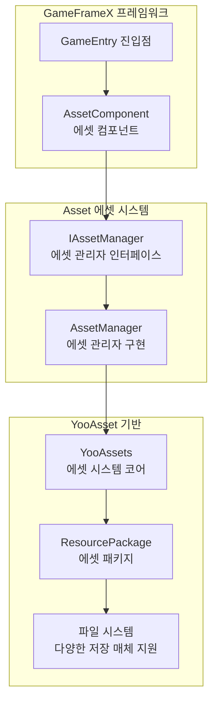
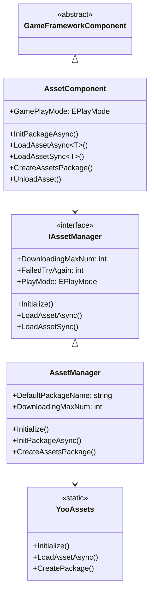
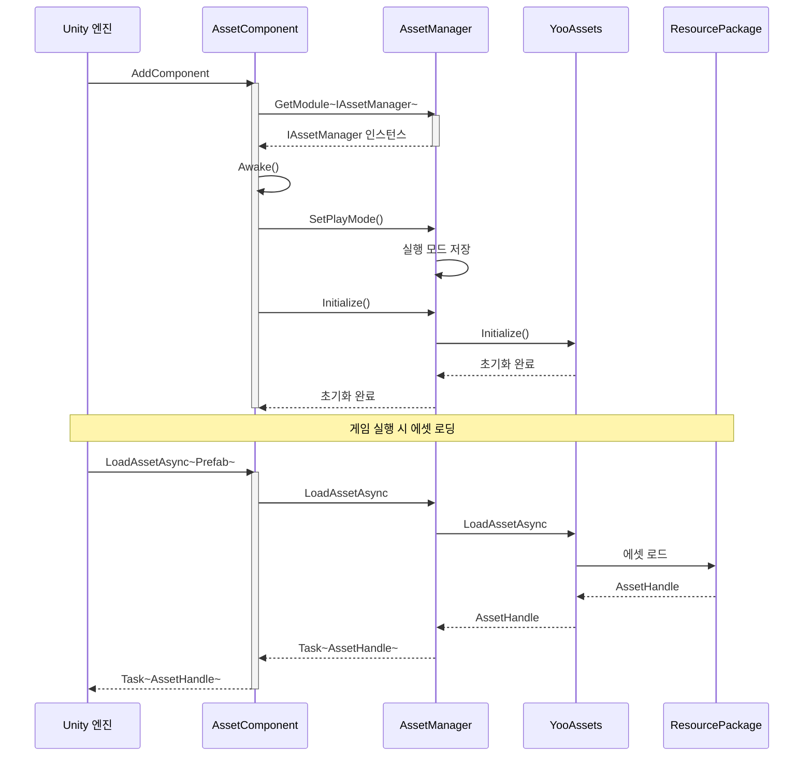
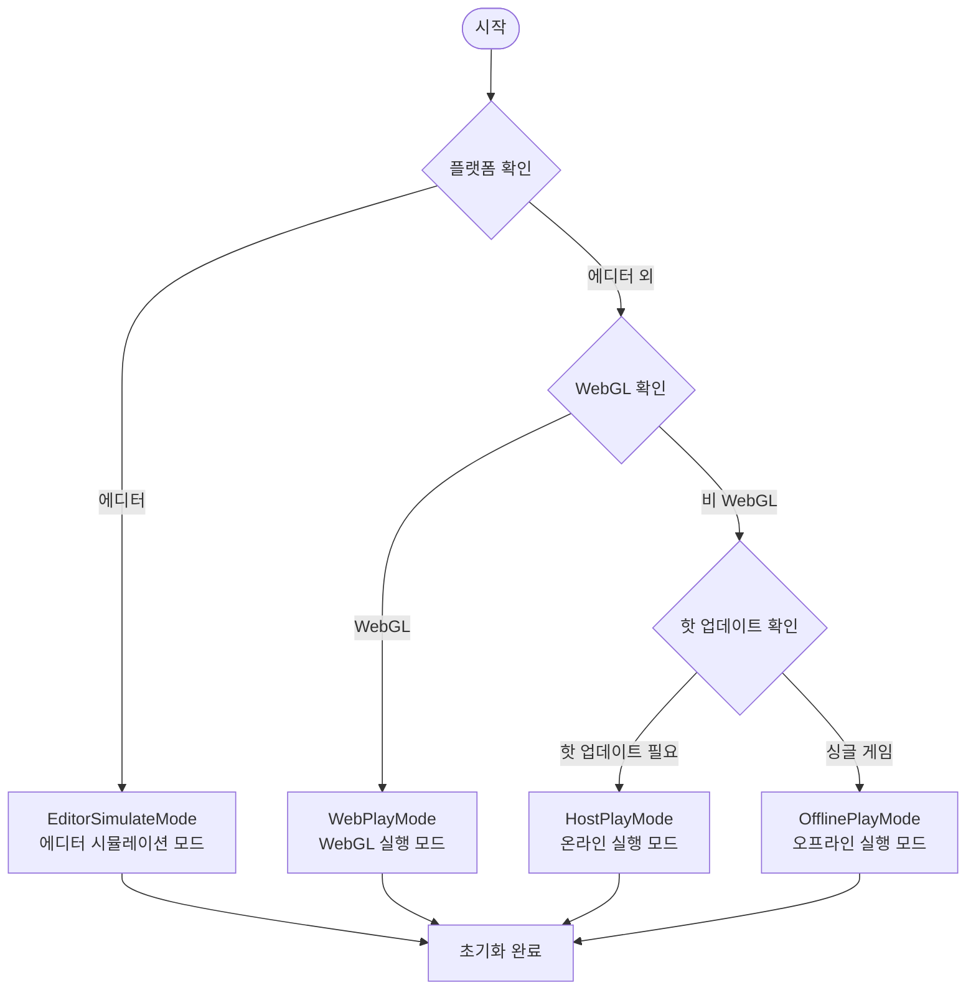

# Asset 에셋 컴포넌트 소개

GameFrameX의 Asset 에셋 컴포넌트는 Unity 게임 에셋의 통합 관리 솔루션으로, YooAsset 기반으로 구현되어 개발자에게 간결하고 효율적인 에셋 로딩 및 관리 인터페이스를 제공합니다. 이 컴포넌트는 여러 실행 모드를 지원하여 개발 디버깅부터 핫 업데이트 프로덕션 환경까지의 전체 프로세스 요구를 충족합니다.

## 개요

Asset 에셋 컴포넌트는 GameFrameX 프레임워크의 핵심 모듈 중 하나로, Unity 프로젝트의 에셋 관리 문제를 해결하기 위해 특별히 설계되었습니다. 게임 개발 과정에서 에셋의 로딩, 캐싱, 언로딩 및 핫 업데이트는 매우 중요한环节으로, 게임의 성능과 사용자 경험에 직접적인 영향을 미칩니다. Asset 컴포넌트는 YooAsset의 강력한 기능을 캡슐화하여 통합되고 간결하며 사용하기 쉬운 API를 제공하므로, 개발자는 기반 구현 세부 사항을 깊이 이해하지 않고도 에셋의 로딩과 관리를 빠르게 구현할 수 있습니다.

이 컴포넌트의 핵심 설계 철학은 복잡한 에셋 관리 로직을 간단한 인터페이스 호출로 캡슐화하는 동시에, 서로 다른 프로젝트 요구를 충족하기 위해 충분한 유연성을 유지하는 것입니다. 간단한 싱글 플레이어 게임이든 핫 업데이트가 필요한 대형 상업 프로젝트든, Asset 컴포넌트는 적절한 솔루션을 제공할 수 있습니다. 여러 실행 모드를 지원하여 개발자는 개발 단계에서 에디터 시뮬레이션 모드를 사용하여 빠르게 반복하고, 테스트 단계에서 오프라인 모드를 사용하여 기능을 검증하며, 프로덕션 환경에서 핫 업데이트 모드를 사용하여 에셋의 동적 업데이트를 구현할 수 있습니다.



## 핵심 기능

Asset 에셋 컴포넌트는 포괄적인 에셋 관리 기능을 제공하여, 게임 개발에서 일반적으로 발생하는 모든 에셋 작업 시나리오를 다룹니다.

### 에셋 로딩

컴포넌트는 동기 및 비동기 두 가지 에셋 로딩 방식을 지원하며, 개발자는 실제 요구에 따라 적절한 로딩 방법을 선택할 수 있습니다. 비동기 로딩은 대부분의 시나리오에 적합하며 게임의 원활한 실행을 유지할 수 있습니다; 동기 로딩은 특정 시나리오(예: 에셋 사전 로딩 완료 후 전환)에서 더 효율적입니다.

- **비동기 로딩**: Task 비동기 패턴으로 에셋을 로드하며, 코루틴과 콜백 두 가지 사용 방식을 지원합니다
- **동기 로딩**: 에셋 핸들을 직접 반환하며, 이미 로딩이 완료된 에셋에 적합합니다
- **제네릭 지원**: 강력한 형식의 제네릭 메서드를 제공하여 형식 변환 오류를 방지합니다
- **다양한 에셋 유형**: 일반 에셋, 서브 에셋, 원시 파일 및 씬 로딩을 지원합니다

### 에셋 패키지 관리

에셋 패키지는 에셋 관리의 기본 단위이며, 컴포넌트는 생성, 가져오기, 기본 패키지 설정 등의 작업을 지원합니다. 에셋 패키지 메커니즘을 통해 에셋의 모듈식 관리를 실현할 수 있으며, 서로 다른 기능 모듈이 서로 다른 에셋 패키지를 사용하여 에셋의 구성과 업데이트를 용이하게 합니다.

```csharp
// 에셋 패키지 생성
var package = assetComponent.CreateAssetsPackage("GameplayPackage");

// 에셋 패키지 가져오기 시도
var existingPackage = assetComponent.TryGetAssetsPackage("GameplayPackage");

// 기본 에셋 패키지 설정
assetComponent.SetDefaultAssetsPackage(existingPackage);

// 에셋 패키지 존재 여부 확인
if (assetComponent.HasAssetsPackage("GameplayPackage"))
{
    // 에셋 패키지가 존재함
}
```

> Source: [AssetComponent.cs](https://github.com/GameFrameX/com.gameframex.unity.asset/blob/main/Runtime/Asset/AssetComponent.cs#L463-L510)

### 에셋 정보 쿼리

컴포넌트는 에셋 정보 가져오기, 에셋 존재 여부 확인, 에셋 다운로드 필요 여부 판단 등 풍부한 에셋 정보 쿼리 기능을 제공합니다. 이러한 기능은 에셋의 주문형 다운로드와 진행률 표시를 구현하는 데 매우 중요합니다.

### 에셋 언로딩 및 정리

합리적인 에셋 관리는 로딩뿐만 아니라 적시 언로딩과 정리도 포함합니다. 컴포넌트는 지정된 에셋 언로딩, 미사용 에셋 언로딩 및 강제 정리 등 다양한 에셋 해제 전략을 제공하여 개발자가 메모리 사용을 효과적으로 제어할 수 있도록 돕습니다.

## 아키텍처 설계

Asset 에셋 컴포넌트는 계층형 아키텍처 설계를 채택하였으며, 각 계층은 명확한 책임 경계를 가집니다. 이 설계는 시스템이 좋은 확장성과 유지 관리성을 갖도록 합니다.

### 계층형 아키텍처



### 컴포넌트 상호작용 흐름



## 실행 모드

Asset 컴포넌트는 네 가지 실행 모드를 지원하며, 각 모드는 서로 다른 개발 및 배포 시나리오에 적합합니다. 실행 모드는 에셋의 로딩 방식과 출처를 결정하며, 개발자는 프로젝트의 구체적인 요구에 따라 적절한 모드를 선택해야 합니다.

### 1. 에디터 시뮬레이션 모드 (EditorSimulateMode)

에디터 시뮬레이션 모드는 주로 개발 단계의 빠른 반복에 사용됩니다. 이 모드에서는 에셋이 Unity 에디터의 에셋 폴더에서 직접 로드되며, 에셋 패키징이 필요하지 않습니다. 이 모드의 장점은 개발 과정에서 에셋을 수정한 후 즉시 효과를 볼 수 있어, 재패키징이 필요 없어 개발 효율을 크게 높인다는 것입니다. 단, 이 모드는 에디터 환경에서만 사용할 수 있으며, 패키징 배포 시 다른 모드로 전환해야 합니다.

### 2. 오프라인 실행 모드 (OfflinePlayMode)

오프라인 실행 모드는 핫 업데이트가 필요 없는 싱글 플레이어 게임이나 게임의 내장 에셋에 적합합니다. 이 모드에서는 모든 에셋이 내장 파일 시스템에서 로드되며, 에셋 패키징 시 설치 패키지에 포함됩니다. 이 모드의 장점은 간단하고 안정적이며, 게임 배포 후 에셋 서버 유지 관리 문제를 고려할 필요가 없어, 콘텐츠를 자주 업데이트하지 않는 게임에 적합합니다.

### 3. 온라인 실행 모드 (HostPlayMode)

온라인 실행 모드는 대형 게임에서 가장 일반적으로 사용되는 모드로, 특히 핫 업데이트가 필요한 프로젝트에 적합합니다. 이 모드에서는 에셋이 내장 에셋과 원격 에셋 두 부분으로 나뉩니다. 내장 에셋은 애플리케이션과 함께 패키징되며, 원격 에셋은 에셋 서버에서 주문형으로 다운로드됩니다. 이 모드는 에셋의 동적 업데이트를 지원하여, 게임 배포 후에도 게임 콘텐츠를 업데이트하거나 버그를 수정하거나 새로운 기능을 추가할 수 있습니다. 컴포넌트는 주 서버와 백업 서버 구성을 지원하여 에셋 다운로드의 안정성을 보장합니다.

### 4. WebGL 실행 모드 (WebPlayMode)

WebGL 실행 모드는 WebGL 플랫폼에 특별히 최적화되어 웹 게임과 미니게임에 적합합니다. 이 모드는 WebGL 플랫폼의 특수한 제한을 고려하여 에셋 로딩에 특별한 적응을 수행합니다. 또한 다양한 미니게임 플랫폼을 지원하며, 개발자는 대상 플랫폼에 따라 적절히 구성할 수 있습니다.



## 플랫폼 지원

Asset 에셋 컴포넌트는 YooAsset 기반으로 구축되어 Unity가 지원하는 모든 플랫폼을 기본적으로 지원합니다. 여기에는 Windows, macOS, iOS, Android, WebGL 및 다양한 미니게임 플랫폼이 포함되지만 이에 국한되지 않습니다. 컴포넌트는 WebGL 플랫폼에서 자동으로 WebPlayMode로 전환하여 에셋 로딩의 정확성을 보장합니다.

## 빠른 시작

프로젝트에서 Asset 에셋 컴포넌트를 사용하려면 먼저 씬에 AssetComponent를 추가해야 합니다:

```csharp
// Unity 씬에서 빈 오브젝트를 만들고 AssetComponent 추가
var assetComponent = gameObject.AddComponent<AssetComponent>();
assetComponent.GamePlayMode = EPlayMode.HostPlayMode;
```

그런 다음 GameFrameX의 진입점을 통해 컴포넌트 인스턴스를 가져와 에셋을 로드합니다:

```csharp
// 에셋 컴포넌트 가져오기
var assetComponent = GameEntry.GetComponent<AssetComponent>();

// 비동기 에셋 로딩
var handle = await assetComponent.LoadAssetAsync<GameObject>("Assets/Prefabs/Player.prefab");
var prefab = handle.AssetObject as GameObject;

// 사용 완료 후 에셋 해제
handle.Release();
```

> Source: [AssetComponent.cs](https://github.com/GameFrameX/com.gameframex.unity.asset/blob/main/Runtime/Asset/AssetComponent.cs#L225-L316)

## 관련 링크

- [기능 특성](./1-overview.features) - 더 많은 기능 특성 알아보기
- [설치 방법](./2-installation.index) - 설치 구성 가이드
- [빠른 시작 가이드](./3-getting-started.index) - 빠르게 시작하기
- [아키텍처 설계](./4-core-concepts.architecture) - 아키텍처 설계 자세히 알아보기
- [에셋 관리자](./4-core-concepts.asset-manager) - 에셋 관리자 상세 설명
- [에셋 로딩 인터페이스](./5-api-reference.loading-api) - API 참조
- [실행 모드](./6-configuration.play-modes) - 실행 모드 구성
