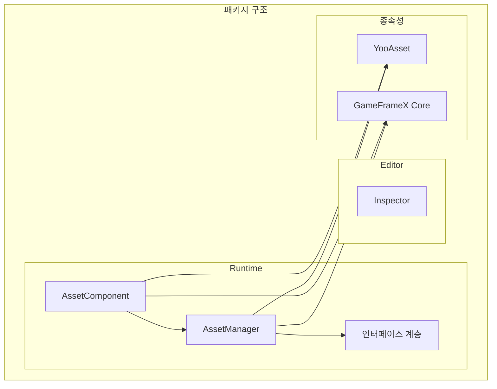

# 설치 방법

GameFrameX Asset 에셋 컴포넌트는 다양한 설치 방법을 지원하여 서로 다른 프로젝트 워크플로우와 개발 요구에 적응합니다. 이 문서에서는 각 설치 방법과 적용 시나리오를 자세히 설명합니다.

## 개요

GameFrameX Asset 에셋 컴포넌트는 YooAsset 기반으로 구축된 Unity 에셋 관리 기능 패키지로, 통합된 에셋 로딩, 언로딩 및 핫 업데이트 인터페이스를 제공합니다. 이 컴포넌트는 Unity Package Manager (UPM) 방식으로 배포되며, 여러 설치 경로를 지원하여 개발자가 프로젝트 상황에 맞게 가장 적합한 설치 방법을 선택할 수 있습니다.

## 환경 요구 사항

| 요구 항목 | 최소 버전 | 설명 |
|--------|----------|------|
| Unity 버전 | 2019.4 | LTS 버전 권장 |
| 패키지 관리자 | UPM | Unity 내장 |
| 네트워크 환경 | GitHub 접속 필요 | Git URL 설치에 사용 |

## 설치 방법

### 방법 1: manifest.json을 통한 설치

프로젝트의 `Packages/manifest.json` 파일을 직접 편집하여 `dependencies` 노드 아래에 패키지 참조를 추가합니다. 이것은 가장 일반적으로 사용되는 설치 방법으로, 버전 관리가 필요한 팀 프로젝트에 적합합니다.

**작업 단계:**

1. Unity 프로젝트 디렉토리의 `Packages/manifest.json` 파일 열기
2. `dependencies` 노드에 패키지 참조 추가
3. 파일을 저장한 후 Unity가 자동으로 다운로드하고 가져올 때까지 대기

```json
{
  "dependencies": {
    "com.gameframex.unity.asset": "https://github.com/GameFrameX/com.gameframex.unity.asset.git"
  }
}
```

> Source: [README.md](https://github.com/GameFrameX/com.gameframex.unity.asset/blob/main/README.md#L13-L16)

**적용 시나리오:**
- 팀 협업 프로젝트, 버전 잠금이 필요한 경우
- CI/CD 자동화 빌드 환경
- 사용자 정의 패키지 버전이 필요한 개발 워크플로우

**주의 사항:**
- 이 방법은 항상 최신 버전을 가져옵니다
- 버전을 잠그려면 `#브랜치명` 또는 `#tag` 구문을 사용하십시오
- Git 저장소 주소에 접근 가능해야 합니다

### 방법 2: Unity Package Manager를 통한 설치

Unity 에디터에 내장된 패키지 관리자 인터페이스를 사용하여 Git URL로 패키지를 추가합니다. 이 방법은 구성 파일을 수동으로 편집할 필요가 없어 빠른 시도와 임시 테스트에 적합합니다.

**작업 단계:**

1. Unity 에디터에서 `Window` -> `Package Manager` 열기
2. 왼쪽 상단의 `+` 버튼 클릭
3. `Add package from git URL...` 선택
4. Git 저장소 주소 입력: `https://github.com/GameFrameX/com.gameframex.unity.asset.git`
5. `Add`를 클릭하고 패키지 다운로드가 완료될 때까지 대기

```
https://github.com/GameFrameX/com.gameframex.unity.asset.git
```

> Source: [README.md](https://github.com/GameFrameX/com.gameframex.unity.asset/blob/main/README.md#L17)

**적용 시나리오:**
- 빠른 프로토타이핑 및 기능 테스트
- 인디 개발자의 빠른 시작
- 임시로 도입해야 하는 기능 검증

**주의 사항:**
- 네트워크 연결을 유지해야 합니다
- 첫 설치 시 종속성 다운로드에 시간이 걸릴 수 있습니다
- 테스트 완료 후 방법 1로 전환하여 버전 관리를 하는 것이 좋습니다

### 방법 3: Packages 디렉토리에 수동 배치

저장소를 클론하거나 다운로드한 후 Unity 프로젝트의 `Packages` 디렉토리에 직접 배치합니다. 이 방법은 완전히 오프라인으로 작동하여 네트워크가 제한된 환경에 적합합니다.

**작업 단계:**

1. 저장소 클론 또는 다운로드: `https://github.com/GameFrameX/com.gameframex.unity.asset.git`
2. 저장소 폴더명을 `com.gameframex.unity.asset`로 변경
3. 폴더를 Unity 프로젝트의 `Packages` 디렉토리에 복사
4. Unity가 자동으로 인식하고 패키지를 로드합니다

```
YourUnityProject/
└── Packages/
    └── com.gameframex.unity.asset/
        ├── package.json
        ├── Runtime/
        └── Editor/
```

> Source: [README.md](https://github.com/GameFrameX/com.gameframex.unity.asset/blob/main/README.md#L18)

**적용 시나리오:**
- 네트워크가 제한되거나 외부 저장소에 접근할 수 없는 경우
- 패키지를 로컬에서 수정하고 디버깅해야 하는 경우
- 오프라인 개발 및 빌드 환경

**주의 사항:**
- 패키지가 자동으로 업데이트되지 않으므로 수동 동기화가 필요합니다
- 수정된 패키지는 향후 업그레이드에 영향을 줄 수 있습니다
- 업그레이드를 위해 원본 패키지 사본을 보관하는 것이 좋습니다

## 종속 요구 사항

GameFrameX Asset 컴포넌트는 다음 패키지에 종속되며, 설치 과정에서 자동으로 함께 설치됩니다:

| 종속 패키지 | 버전 | 설명 |
|--------|------|------|
| com.gameframex.unity | 1.1.1 | GameFrameX 핵심 프레임워크 |
| YooAsset | - | 에셋 관리 기반 구현 |
| BetterStreamingAssets | - | 스트리밍 에셋 접근 지원 |

### YooAsset 통합

이 컴포넌트는 [YooAsset](https://github.com/yoomotion/YooAsset) 기반으로 구축되어 다음 핵심 기능을 제공합니다:

- 에셋 패키징 및 할당
- 에셋 로딩 및 캐시 관리
- 씬 비동기 로딩
- 에셋 핫 업데이트 지원
- 멀티 플랫폼 적응

> 자세한 API 사용 방법은 [에셋 로딩 인터페이스](./5-api-reference.loading-api) 문서를 참조하십시오.

## 패키지 구조 설명

설치가 완료되면 패키지 디렉토리 구조는 다음과 같습니다:

```
com.gameframex.unity.asset/
├── package.json              # 패키지 구성 파일
├── Runtime/                  # 런타임 코드
│   ├── GameFrameX.Asset.Runtime.asmdef
│   ├── Asset/
│   │   ├── AssetComponent.cs
│   │   ├── AssetManager.cs
│   │   ├── IAssetManager.cs
│   │   └── Constant.cs
│   └── Update/
│       ├── EPatchStates.cs
│       └── EventArgs/
├── Editor/                   # 에디터 코드
│   ├── GameFrameX.Asset.Editor.asmdef
│   └── Inspector/
│       └── AssetComponentInspector.cs
└── Tests/                   # 단위 테스트
    └── GameFrameX.Asset.Tests.asmdef
```



## 설치 검증

설치가 완료되면 다음 방법으로 검증할 수 있습니다:

1. **Package Manager 확인**: Package Manager 창에서 `GameFrameX Asset` 패키지가 표시되는지 확인
2. **어셈블리 확인**: Project 창에서 `GameFrameX.Asset.Runtime` 및 `GameFrameX.Asset.Editor` 어셈블리가 생성되었는지 확인
3. **예제 코드 실행**: 에셋을 로드하여 기능이 정상인지 확인

```csharp
// 설치 성공 확인을 위한 간단한 테스트
using GameFrameX.Asset.Runtime;

public class InstallationTest : MonoBehaviour
{
    private void Start()
    {
        // 에셋 관리자 인스턴스 가져오기
        var manager = AssetManager.Instance;
        Debug.Log($"Asset Manager initialized: {manager != null}");
    }
}
```

## 버전 선택

| 버전 형식 | 예시 | 설명 |
|----------|------|------|
| latest | - | 메인 브랜치의 최신 코드 가져오기 |
| 브랜치 | #main | 지정된 브랜치 가져오기 |
| 태그 | #2.4.0 | 지정된 버전 릴리스 가져오기 |

공식 프로젝트에서는 구체적인 버전 번호를 잠그어 자동 업데이트로 인한 호환성 문제를 방지하는 것이 좋습니다.

## 자주 묻는 질문

### 설치 후 컴파일 오류 발생

**원인**: 종속 패키지 누락 또는 Unity 버전이 너무 낮음

**해결 방법**:
1. Unity 버전이 2019.4 이상인지 확인
2. `manifest.json`에 종속성이 올바르게 추가되었는지 확인
3. `Library` 폴더를 삭제한 후 프로젝트를 다시 열어보기

### Git 저장소에 연결할 수 없음

**원인**: 네트워크 문제 또는 저장소 주소 변경

**해결 방법**:
1. 네트워크 연결 확인
2. Git 저장소 주소가 올바른지 확인
3. 방법 3을 사용하여 수동 설치 시도

### 버전 업그레이드 문제

**해결 방법**:
1. 현재 프로젝트 백업
2. 이전 버전 패키지 삭제
3. 이 문서에 따라 새 버전 재설치
4. [CHANGELOG](./CHANGELOG.md)에서 버전 변경 사항 확인

## 관련 링크

- [GitHub 저장소](https://github.com/GameFrameX/com.gameframex.unity.asset.git)
- [종속 요구 사항](./2-installation.dependencies)
- [빠른 시작 가이드](./3-getting-started.index)
- [공식 문서](https://gameframex.doc.alianblank.com)
