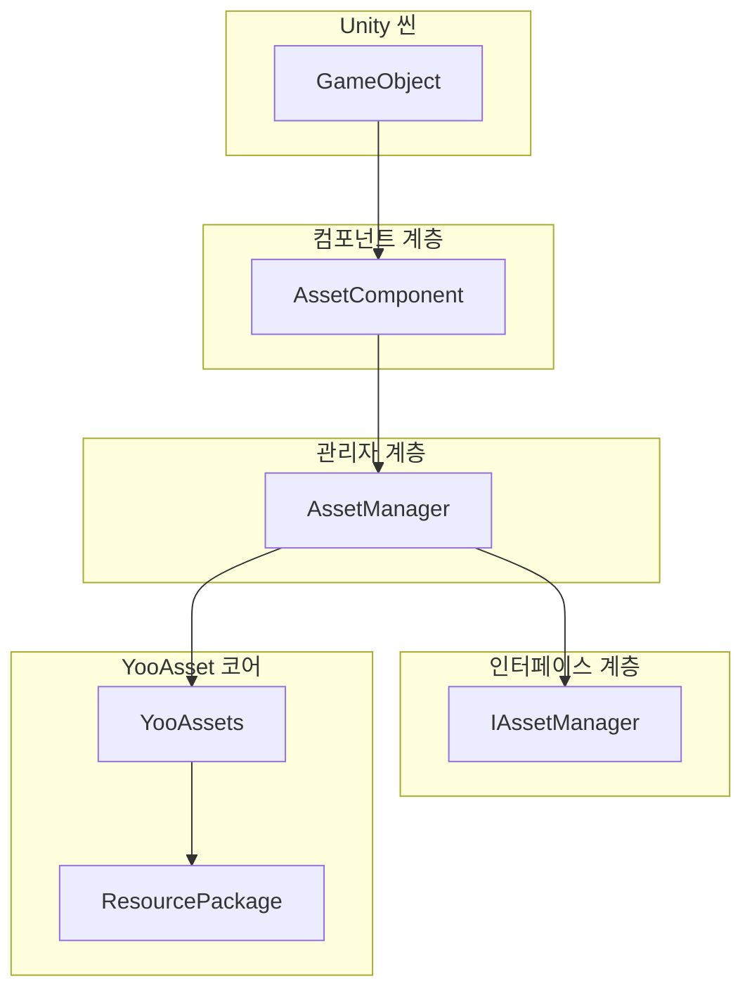
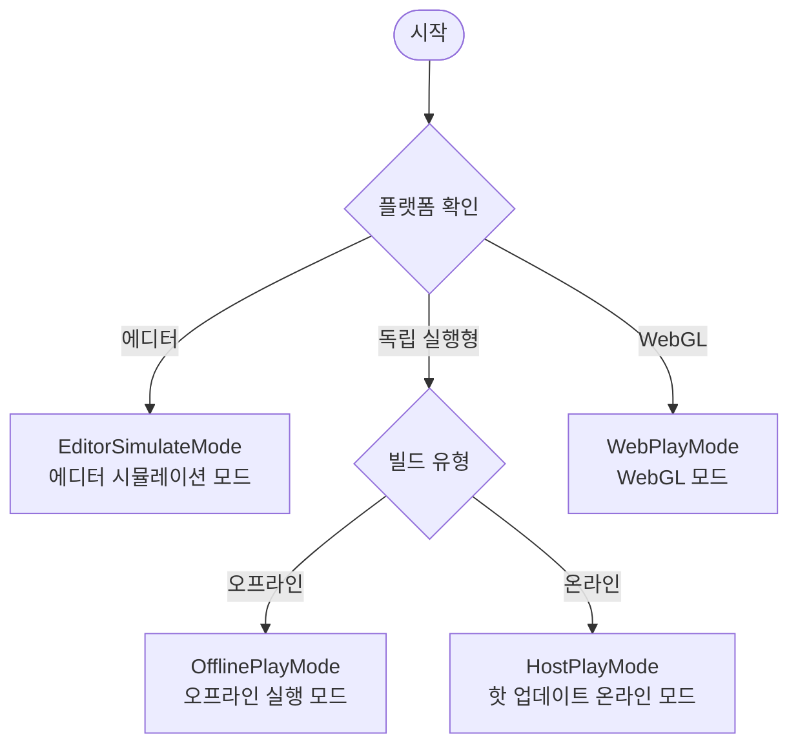

# 빠른 시작 가이드

이 문서는 GameFrameX Asset 에셋 컴포넌트를 빠르게 시작하는 방법을 안내하며, Unity 프로젝트에서 이 컴포넌트를 통합하고 사용하여 에셋을 관리하는 방법을 소개합니다.

## 개요

GameFrameX Asset은 [YooAsset](https://yooasset.com/) 기반으로 구축된 Unity 에셋 관리 시스템입니다. 통합된 에셋 로딩 인터페이스를 제공하며, 에디터 시뮬레이션 모드, 오프라인 실행 모드, 핫 업데이트 온라인 모드 및 WebGL 모드를 포함한 여러 실행 모드를 지원합니다. 이 컴포넌트는 GameFrameX 게임 프레임워크의 핵심 모듈 중 하나로, 게임 에셋의 로딩, 언로딩 및 핫 업데이트 흐름을 전담합니다.

Asset 컴포넌트의 주요 설계 목표는 에셋 관리의 복잡성을 단순화하여, 개발자가 더 간결한 방식으로 에셋의 비동기 로딩, 동기 로딩, 씬 전환 및 핫 업데이트 기능을 구현할 수 있도록 하는 것입니다. YooAsset의 하위 API를 캡슐화하여 Asset 컴포넌트는 더 직관적이고 사용하기 쉬운 인터페이스를 제공하면서도 YooAsset의 강력한 에셋 관리 능력을 유지합니다.

## 시스템 아키텍처

Asset 컴포넌트는 계층형 아키텍처 설계를 채택하였으며, 코어는 Unity 컴포넌트 계층, 관리자 계층 및 인터페이스 계층의 세 가지 주요 부분으로 구성됩니다. 이러한 계층화 설계는 코드의 유지 관리성과 확장성을 보장하면서 유연한 에셋 관리 능력을 제공합니다.



**각 계층의 역할 설명:**

**컴포넌트 계층(AssetComponent)**은 Unity의 MonoBehaviour 컴포넌트로, 씬의 GameObject에 마운트해야 합니다. 게임 시작 시 에셋 관리 시스템을 초기화하고 대상 플랫폼에 따라 적절한 실행 모드를 자동으로 선택합니다. WebGL 플랫폼에서는 컴포넌트가 자동으로 WebPlayMode로 전환하여 에셋이 원격 서버에서 올바르게 로드되도록 합니다.

**관리자 계층(AssetManager)**은 에셋 관리의 핵심 구현 클래스로, GameFrameworkModule을 상속받습니다. 에셋의 로딩, 언로딩, 패키지 관리 및 정리 등 모든 에셋 작업을 캡슐화합니다. AssetManager는 동기 및 비동기 두 가지 로딩 인터페이스를 제공하여 서로 다른 시나리오의 요구를 충족합니다.

**인터페이스 계층(IAssetManager)**은 에셋 관리의 표준 인터페이스를 정의하여 관리자 구현의 규범성을 보장합니다. 인터페이스 추상화를 통해 단위 테스트와 모듈 교체가 편리합니다.

## 핵심 개념

### 실행 모드(PlayMode)

Asset 컴포넌트는 네 가지 실행 모드를 지원하며, 각 모드는 서로 다른 개발 및 배포 시나리오에 적합합니다:



**EditorSimulateMode(에디터 시뮬레이션 모드)**는 주로 개발 단계에 사용됩니다. 이 모드에서는 에셋이 Unity 에디터의 에셋 폴더에서 직접 로드되며, 에셋 패키징이 필요하지 않습니다. 이 모드는 개발 반복 주기를 크게 단축하여 개발자가 에셋 로딩 기능을 빠르게 테스트할 수 있게 합니다. 단, 에디터가 아닌 환경에서 실행할 때 이 모드로 설정되어 있으면 시스템이 자동으로 HostPlayMode로 전환됩니다.

**OfflinePlayMode(오프라인 실행 모드)**는 핫 업데이트가 필요 없는 싱글 플레이어 게임이나 내부 테스트 단계에 적합합니다. 이 모드에서는 모든 에셋이 내장 에셋 패키지(Buildin)에서 로드되며, 원격 에셋 다운로드가 포함되지 않습니다. 에셋이 패키징된 후 설치 패키지에 내장되므로 플레이어는 네트워크 연결 없이 게임을 실행할 수 있습니다.

**HostPlayMode(핫 업데이트 온라인 모드)**는 가장 일반적으로 사용되는 프로덕션 모드로, 지속적인 업데이트가 필요한 온라인 게임에 적합합니다. 에셋은 내장 에셋과 원격 에셋 두 부분으로 나뉩니다. 내장 에셋은 애플리케이션 패키지와 함께 배포되며, 원격 에셋은 핫 업데이트 서버에서 주문형으로 다운로드됩니다. 이 모드는 에셋의 동적 업데이트를 지원하여, 애플리케이션을 다시 배포하지 않고도 게임 콘텐츠를 업데이트할 수 있습니다.

**WebPlayMode(WebGL 모드)**는 WebGL 플랫폼에 특별히 최적화되었습니다. 브라우저 보안 제한과 로딩 성능을 고려하여 WebGL 플랫폼은 특수한 에셋 로딩 방식을 사용해야 합니다. Asset 컴포넌트는 WebGL 플랫폼을 자동으로 감지하고 이 모드로 전환하며, 바이트 미니게임, 위챗 미니게임, 콰이서우 미니게임 등 다양한 플랫폼을 지원합니다.

### 에셋 패키지(ResourcePackage)

에셋 패키지는 에셋을 구성하고 관리하는 기본 단위입니다. 각 에셋 패키지는 독립적인 이름을 가지며, 서로 다른 에셋 서버 주소를 구성할 수 있습니다. 시스템은 여러 에셋 패키지 생성을 지원하여 서로 다른 유형의 에셋을 분리하는 데 사용할 수 있습니다(예: 메인 에셋 패키지, DLC 에셋 패키지, 언어 에셋 패키지 등). 기본 에셋 패키지 이름은 "DefaultPackage"이며, 시스템이 자동으로 생성하고 기본 패키지로 설정합니다.

### 에셋 핸들(AssetHandle)

에셋 핸들은 로딩된 에셋의 반환값 캡슐화 클래스입니다. 핸들 객체를 통해 로딩된 에셋에 접근할 수 있으며, 더 이상 필요하지 않을 때 Release 메서드를 호출하여 에셋을 해제할 수 있습니다. 시스템은 다양한 유형의 핸들을 제공합니다: AssetHandle은 일반 에셋, SubAssetsHandle은 서브 에셋, AllAssetsHandle은 모든 에셋 로딩, SceneHandle은 씬 로딩, RawFileHandle은 원시 파일에 사용됩니다.

## 빠른 시작 흐름

프로젝트에서 Asset 컴포넌트를 사용하려면 다음 몇 가지 핵심 단계를 완료해야 합니다:

### 1단계: 컴포넌트 설치

먼저 Asset 컴포넌트를 Unity 프로젝트에 설치해야 합니다. 설치 방법은 [설치 방법](./2-installation.index) 문서를 참조하십시오. 설치가 완료되면 프로젝트에 GameFrameX 핵심 프레임워크와 기타 필수 종속성이 포함되어 있는지 확인하십시오.

### 2단계: 씬에 컴포넌트 추가

Unity 에디터에서 새로운 GameObject를 만들거나 기존 게임 오브젝트를 선택한 다음, 메뉴 "Component" -> "GameFrameX" -> "Asset"을 통해 AssetComponent 컴포넌트를 추가합니다. 컴포넌트를 추가한 후 Inspector 패널에서 실행 모드와 기타 매개변수를 구성할 수 있습니다.

```csharp
// 컴포넌트 추가 후 Unity 씬 계층 구조 예시
// GameObject (Root)
// └── Asset (AssetComponent 컴포넌트가 추가됨)
```

> Source: [AssetComponent.cs](https://github.com/GameFrameX/com.gameframex.unity.asset/blob/main/Runtime/Asset/AssetComponent.cs#L18-L35)

### 3단계: 실행 모드 구성

Inspector 패널에서 개발 단계와 배포 대상에 따라 적절한 실행 모드를 선택합니다:

- **개발 단계**: EditorSimulateMode를 선택하면 에디터에서 직접 에셋을 로드할 수 있습니다
- **오프라인 테스트**: OfflinePlayMode를 선택하면 오프라인 환경을 시뮬레이션합니다
- **핫 업데이트 테스트**: HostPlayMode를 선택하면 완전한 핫 업데이트 흐름을 테스트합니다
- **WebGL 배포**: WebGL 플랫폼에서는 자동으로 WebPlayMode로 전환됩니다

```csharp
// 코드에서도 실행 모드를 동적으로 설정할 수 있습니다
var assetComponent = gameObject.GetComponent<AssetComponent>();
assetComponent.GamePlayMode = EPlayMode.HostPlayMode;
```

> Source: [AssetComponent.cs](https://github.com/GameFrameX/com.gameframex.unity.asset/blob/main/Runtime/Asset/AssetComponent.cs#L20-L31)

### 4단계: 에셋 패키지 초기화

핫 업데이트가 필요한 시나리오의 경우, 에셋 패키지를 초기화하고 원격 서버 주소를 구성해야 합니다. 이 단계는 일반적으로 게임 시작 시 또는 에셋 업데이트 흐름에서 실행됩니다.

```csharp
// 기본 에셋 패키지 초기화
var assetComponent = gameObject.GetComponent<AssetComponent>();
bool success = await assetComponent.InitPackageAsync(
    "DefaultPackage",           // 에셋 패키지 이름
    "https://your-server.com/", // 메인 서버 주소
    "https://backup-server.com/", // 백업 서버 주소
    true                        // 기본 패키지로 설정 여부
);

if (success)
{
    Debug.Log("에셋 패키지 초기화 성공");
}
```

> Source: [AssetComponent.cs](https://github.com/GameFrameX/com.gameframex.unity.asset/blob/main/Runtime/Asset/AssetComponent.cs#L80-L95)

### 5단계: 에셋 로딩

초기화가 완료되면 컴포넌트가 제공하는 인터페이스를 사용하여 에셋을 로드할 수 있습니다. 시스템은 동기 및 비동기 두 가지 로딩 방식을 모두 지원합니다:

```csharp
// 비동기 에셋 로딩 예시
var assetComponent = gameObject.GetComponent<AssetComponent>();
var handle = await assetComponent.LoadAssetAsync<Sprite>("UI/Icons/PlayerIcon");
var sprite = handle.AssetObject as Sprite;

// 사용이 끝난 후 에셋 해제
handle.Release();
```

> Source: [AssetComponent.cs](https://github.com/GameFrameX/com.gameframex.unity.asset/blob/main/Runtime/Asset/AssetComponent.cs#L258-L261)

## 에셋 로딩 방법 상세 설명

Asset 컴포넌트는 다양한 로딩 요구를 충족할 수 있는 풍부한 에셋 로딩 인터페이스를 제공합니다.

### 비동기 로딩

비동기 로딩은 권장되는 주요 로딩 방식으로, 대량의 에셋을 로드해야 하는 시나리오에 특히 적합합니다. 비동기 로딩은 메인 스레드를 차단하지 않아 게임이 원활하게 실행되도록 유지합니다. 모든 비동기 메서드는 Task 객체를 반환하며, await 구문을 지원합니다:

```csharp
// 비동기 일반 에셋 로딩
var handle = await assetComponent.LoadAssetAsync<GameObject>("Prefabs/Player");

// 타입이 있는 에셋 비동기 로딩
var handle = await assetComponent.LoadAssetAsync<Sprite>("UI/Background");

// 여러 에셋 비동기 로딩
var allAssetsHandle = await assetComponent.LoadAllAssetsAsync<GameObject>("Prefabs/Enemies");

// 씬 비동기 로딩
var sceneHandle = await assetComponent.LoadSceneAsync("Scenes/GameLevel", LoadSceneMode.Single);
```

> Source: [AssetManager.cs](https://github.com/GameFrameX/com.gameframex.unity.asset/blob/main/Runtime/Asset/AssetManager.cs#L469-L481)

### 동기 로딩

동기 로딩은 로딩 시간 요구 사항이 엄격하지 않지만 에셋을 즉시 가져와야 하는 시나리오에 적합합니다. 동기 로딩은 메인 스레드를 차단하므로, 대형 에셋을 로드할 때 버벅거림이 발생할 수 있어 필요한 경우에만 사용하는 것이 좋습니다:

```csharp
// 동기 에셋 로딩
var handle = assetComponent.LoadAssetSync<GameObject>("Prefabs/Player");
var player = handle.AssetObject as GameObject;
```

> Source: [AssetManager.cs](https://github.com/GameFrameX/com.gameframex.unity.asset/blob/main/Runtime/Asset/AssetManager.cs#L603-L606)

### 서브 에셋 로딩

서브 에셋 로딩은 하나의 에셋 파일에 여러 서브 에셋이 포함된 경우(예: Sprite Atlas 또는 모델 파일의 여러 서브 객체)에 사용됩니다:

```csharp
// Sprite Atlas의 모든 서브 이미지 로드
var handle = await assetComponent.LoadSubAssetsAsync<Sprite>("Atlas/UIAtlas");
foreach (var sprite in handle.AssetObject)
{
    Debug.Log($"스프라이트 이름: {sprite.name}");
}
handle.Release();
```

> Source: [AssetManager.cs](https://github.com/GameFrameX/com.gameframex.unity.asset/blob/main/Runtime/Asset/AssetManager.cs#L244-L250)

### 원시 파일 로딩

Unity 에셋 유형이 아닌 파일(예: 구성 파일, 텍스트 파일 등)을 로드해야 하는 경우 원시 파일 로딩 인터페이스를 사용할 수 있습니다:

```csharp
// 원시 파일 비동기 로딩
var rawHandle = await assetComponent.LoadRawFileAsync("Config/GameConfig.json");
byte[] data = rawHandle.ReadRawFile();
rawHandle.Release();
```

> Source: [AssetManager.cs](https://github.com/GameFrameX/com.gameframex.unity.asset/blob/main/Runtime/Asset/AssetManager.cs#L314-L320)

## 에셋 관리 모범 사례

### 에셋을 적시에 해제

더 이상 사용하지 않는 에셋은 메모리 공간을 확보하기 위해 적시에 해제해야 합니다. 에셋 핸들의 Release 메서드를 사용하여 해제할 수 있습니다:

```csharp
// 에셋 로드 및 사용
var handle = await assetComponent.LoadAssetAsync<GameObject>("Prefabs/Player");
var player = Instantiate(handle.AssetObject as GameObject);

// 사용 완료 후 핸들 해제 (참고: 에셋 인스턴스는 삭제되지 않음)
handle.Release();

// 에셋 인스턴스를 포함하여 완전히 정리해야 하는 경우
Destroy(player);
```

> Source: [AssetComponent.cs](https://github.com/GameFrameX/com.gameframex.unity.asset/blob/main/Runtime/Asset/AssetComponent.cs#L622-L628)

### 미사용 에셋 일괄 언로딩

게임이 일정 시간 실행된 후 더 이상 사용하지 않는 에셋이 많이 누적될 수 있습니다. 정리 기능을 사용하여 이러한 에셋을 해제할 수 있습니다:

```csharp
// 참조되지 않은 에셋 언로딩
assetComponent.UnloadUnusedAssetsAsync();

// 미사용 에셋 패키지 파일 정리 (저장 공간 확보 가능)
assetComponent.ClearUnusedBundleFilesAsync();
```

> Source: [AssetComponent.cs](https://github.com/GameFrameX/com.gameframex.unity.asset/blob/main/Runtime/Asset/AssetComponent.cs#L635-L658)

### 에셋 패키지를 사용한 에셋 격리

대형 프로젝트의 경우 여러 에셋 패키지를 사용하여 서로 다른 유형의 에셋을 구성하는 것이 좋습니다. 이를 통해 에셋의 주문형 로딩과 업데이트를 실현할 수 있습니다:

```csharp
// 추가 에셋 패키지 생성
var dlcPackage = assetComponent.CreateAssetsPackage("DLC_Package");

// 기존 에셋 패키지 가져오기
var package = assetComponent.TryGetAssetsPackage("DefaultPackage");

// 기본 에셋 패키지 설정
assetComponent.SetDefaultAssetsPackage(package);
```

> Source: [AssetComponent.cs](https://github.com/GameFrameX/com.gameframex.unity.asset/blob/main/Runtime/Asset/AssetComponent.cs#L471-L507)

## 다음 단계

이제 Asset 컴포넌트의 기본 사용 방법을 이해했으므로, 다음 내용을 계속 학습할 수 있습니다:

- **[첫 번째 예제](./3-getting-started.first-steps)**: 완전한 코드 예제를 통해 에셋 로딩의 구체적인 구현을 깊이 학습
- **[아키텍처 설계](./4-core-concepts.architecture)**: 컴포넌트의 상세한 아키텍처 설계와 모듈 분할 이해
- **[에셋 로딩 인터페이스](./5-api-reference.loading-api)**: 완전한 API 인터페이스 문서 참조
- **[실행 모드](./6-configuration.play-modes)**: 다양한 실행 모드의 구성과 사용 시나리오 상세 이해

## 관련 링크

- [Asset 에셋 컴포넌트 소개](./1-overview.introduction)
- [기능 특성](./1-overview.features)
- [지원하는 Unity 버전](./1-overview.supported-versions)
- [설치 방법](./2-installation.index)
- [종속 요구 사항](./2-installation.dependencies)
- [첫 번째 예제](./3-getting-started.first-steps)
- [아키텍처 설계](./4-core-concepts.architecture)
- [에셋 컴포넌트](./4-core-concepts.asset-component)
- [에셋 관리자](./4-core-concepts.asset-manager)
