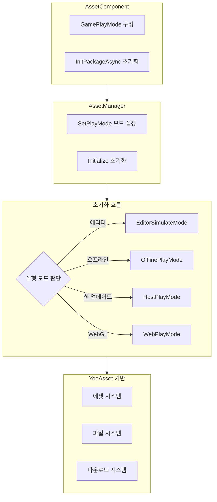

# 기능 특성

Asset 에셋 컴포넌트는 GameFrameX 프레임워크의 핵심 모듈 중 하나로, YooAsset을 기반으로 캡슐화 및 구축되어 통합된 에셋 로딩, 관리 및 업데이트 기능을 제공합니다. 이 컴포넌트는 복잡한 에셋 관리 작업을 직관적인 API 인터페이스로 단순화하여, 개발자가 효율적으로 에셋 로딩, 씬 전환 및 에셋 패키지 관리를 수행할 수 있도록 합니다.

## 개요

Asset 에셋 컴포넌트는 Unity 프로젝트의 에셋 관리 문제를 해결하기 위해 설계되었습니다. 여기에는 에셋 로딩 방식의 불일치, 에셋 업데이트의 어려움, 멀티 플랫폼 적응의 복잡성 등이 포함됩니다. 통합된 인터페이스 추상화와 여러 실행 모드 지원을 제공하여, 개발자는 서로 다른 개발 및 배포 시나리오에서 동일한 코드를 유연하게 사용할 수 있습니다. 이 컴포넌트는 간단한 싱글 플레이어 게임부터 복잡한 핫 업데이트 게임까지 다양한 요구를 지원하며, 에디터에서의 빠른 반복이든 프로덕션 환경의 핫 업데이트 배포든 완전한 솔루션을 제공합니다.

이 컴포넌트의 핵심 가치는 기반 에셋 관리 프레임워크(YooAsset)의 복잡한 기능을 캡슐화하면서도 그 강력한 능력을 유지하는 데 있습니다. 개발자는 기반 구현 세부 사항을 이해할 필요 없이, 간단한 API 호출만으로 에셋 로딩, 씬 전환 등의 작업을 완료할 수 있습니다. 또한 컴포넌트는 완전한 이벤트 시스템을 제공하여 개발자가 에셋 다운로드 진행률, 상태 변화 등 핵심 정보를 실시간으로 모니터링할 수 있게 하여, 더 나은 사용자 경험을 구현할 수 있습니다.

## 핵심 기능 특성

### 멀티 모드 실행 지원

Asset 컴포넌트는 네 가지 실행 모드를 지원하며, 각 모드는 특정 사용 시나리오에 최적화되어 있습니다. 이 설계를 통해 동일한 코드가 서로 다른 개발 및 배포 환경에서 원활하게 전환될 수 있으며, 비즈니스 로직 코드를 수정할 필요가 없습니다.

**에디터 시뮬레이션 모드(EditorSimulateMode)**는 개발 단계의 빠른 반복에 적합합니다. 이 모드에서는 에셋이 Unity 에디터의 프로젝트 디렉토리에서 직접 로드되며, 어떠한 패키징 작업도 필요하지 않습니다. 이는 개발 속도를 크게 높입니다. 개발자가 에셋을 수정한 후 즉시 효과를 볼 수 있어, 에셋 패키징이 완료될 때까지 기다릴 필요가 없습니다. 이 모드는 Unity 에디터 환경에서만 유효하며, 패키징 배포 시 다른 모드로 자동 전환됩니다.

**오프라인 실행 모드(OfflinePlayMode)**는 싱글 플레이어 게임이나 핫 업데이트가 필요 없는 시나리오에 적합합니다. 이 모드에서는 모든 에셋이 내장 에셋 패키지(Buildin)에서 로드되며, 네트워크 요청이 포함되지 않습니다. 에셋은 애플리케이션과 함께 배포되어 추가 다운로드 단계가 필요하지 않습니다. 이 모드는 인디 게임 개발이나 에셋 배포 방식을 엄격하게 제어해야 하는 시나리오에 가장 적합합니다.

**온라인 실행 모드(HostPlayMode)**는 핫 업데이트 기능이 필요한 게임에 적합합니다. 이 모드에서는 에셋이 두 부분으로 나뉩니다. 내장 에셋 패키지는 초기 에셋을 저장하고, 원격 서버는 핫 업데이트 에셋을 저장합니다. 컴포넌트는 업데이트가 필요한 에셋을 자동으로 감지하고 다운로드하며, 이어서 다운로드와 버전 관리를 지원합니다. 이 모드는 현대 모바일 게임의 표준이며, 게임 배포 후에도 콘텐츠를 계속 업데이트할 수 있게 합니다.

**WebGL 실행 모드(WebPlayMode)**는 WebGL 플랫폼에 특별히 최적화되었습니다. 이 모드는 브라우저 환경의 특수성에 적응하며, 다양한 웹 미니게임 플랫폼(위챗 미니게임, 더우인 미니게임, 콰이서우 미니게임 등)을 지원합니다. 컴포넌트는 대상 플랫폼을 자동으로 감지하고 적절한 파일 시스템 매개변수를 선택하여 에셋이 올바르게 로드되도록 합니다.



### 통합된 에셋 로딩 인터페이스

Asset 컴포넌트는 다양한 사용 시나리오를 아우르는 풍부한 에셋 로딩 인터페이스를 제공합니다. 모든 로딩 인터페이스는 제네릭 버전을 지원하여 에셋 유형을 자동으로 추론하고, 형식 변환의 번거로움을 줄입니다.

**비동기 로딩**은 권장되는 주요 로딩 방식으로, 특히 여러 에셋을 로드하거나 에셋이 큰 시나리오에 적합합니다. 비동기 로딩은 메인 스레드를 차단하지 않아 인터페이스의 원활한 응답을 유지합니다. 컴포넌트는 YooAsset의 콜백식 API를 Task식 비동기 인터페이스로 변환하여 코드를 더 간결하고 읽기 쉽게 만들며, async/await 구문을 지원합니다.

```csharp
// 비동기 에셋 로딩
var handle = await assetComponent.LoadAssetAsync<Texture2D>("Textures/Background");
var texture = handle.AssetObject as Texture2D;

// 모든 에셋 비동기 로딩
var allHandle = await assetComponent.LoadAllAssetsAsync<GameObject>("Prefabs/Enemies");
foreach (var obj in allHandle.AllAssetObjects)
{
    // 각 에셋 처리
}

// 씬 비동기 로딩
await assetComponent.LoadSceneAsync("Scenes/GameLevel", LoadSceneMode.Single);
```

> Source: [AssetComponent.cs](https://github.com/GameFrameX/com.gameframex.unity.asset/blob/main/Runtime/Asset/AssetComponent.cs#L258-L261)

**동기 로딩**은 로딩 시간에 엄격한 요구 사항이 있는 시나리오(예: 즉시 표시해야 하는 에셋)에 적합합니다. 동기 로딩은 호출 스레드를 차단하므로 인터페이스 버벅거림이 발생할 수 있어, 필요한 경우에만 사용하고 메인 스레드에서 대형 에셋을 로드하는 것은 피하는 것이 좋습니다.

```csharp
// 동기 에셋 로딩
var handle = assetComponent.LoadAssetSync<AudioClip>("Audio/BGM");
var audio = handle.AssetObject as AudioClip;
```

> Source: [AssetComponent.cs](https://github.com/GameFrameX/com.gameframex.unity.asset/blob/main/Runtime/Asset/AssetComponent.cs#L426-L429)

**서브 에셋 로딩**은 서브 에셋이 포함된 에셋(SpriteAtlas 등, 여러 Sprite 포함)을 처리하는 데 사용됩니다. 이를 통해 개발자는 전체 아틀라스를 한 번에 로드한 다음 필요에 따라 개별 스프라이트를 가져올 수 있습니다.

```csharp
// 서브 에셋 로딩
var handle = await assetComponent.LoadSubAssetsAsync<Sprite>("UI/Atlas/MainUI");
foreach (var sprite in handle.SubAssetObjects)
{
    // 각 서브 에셋 처리
}
```

> Source: [AssetComponent.cs](https://github.com/GameFrameX/com.gameframex.unity.asset/blob/main/Runtime/Asset/AssetComponent.cs#L128-L131)

**원시 파일 로딩**은 Unity 에셋 형식이 아닌 파일(예: 구성 파일, 텍스트 파일, 바이너리 데이터 등)을 로드하는 데 사용됩니다. 로드된 데이터는 바이트 배열 형태로 반환되며, 개발자가 직접 파싱할 수 있습니다.

```csharp
// 원시 파일 로딩
var handle = await assetComponent.LoadRawFileAsync("Config/GameConfig.json");
var data = handle.RawFileData;
var json = System.Text.Encoding.UTF8.GetString(data);
```

> Source: [AssetComponent.cs](https://github.com/GameFrameX/com.gameframex.unity.asset/blob/main/Runtime/Asset/AssetComponent.cs#L192-L195)

### 에셋 패키지 관리

에셋 패키지(ResourcePackage)는 에셋을 구성하고 관리하는 기본 단위입니다. Asset 컴포넌트는 여러 독립적인 에셋 패키지 생성을 지원하여, 개발자가 기능 모듈 또는 로딩 전략에 따라 에셋을 분할할 수 있게 합니다.

**에셋 패키지 생성**을 통해 개발자는 특정 카테고리의 에셋을 관리하기 위해 새로운 에셋 패키지를 만들 수 있습니다. 각 에셋 패키지는 독립적인 초기화 매개변수와 에셋 세트를 가지며, 서로 다른 에셋 세트를 주문형으로 로드해야 하는 시나리오에 적합합니다.

```csharp
// 에셋 패키지 생성
var package = assetComponent.CreateAssetsPackage("DLC_Package");
```

> Source: [AssetComponent.cs](https://github.com/GameFrameX/com.gameframex.unity.asset/blob/main/Runtime/Asset/AssetComponent.cs#L471-L474)

**에셋 패키지 가져오기 및 확인**을 통해 기존 에셋 패키지를 쿼리하는 여러 방법을 제공합니다. 이름으로 에셋 패키지 인스턴스를 가져오거나, 특정 이름의 에셋 패키지가 존재하는지 확인할 수 있습니다.

```csharp
// 에셋 패키지 존재 여부 확인
if (assetComponent.HasAssetsPackage("DLC_Package"))
{
    var package = assetComponent.GetAssetsPackage("DLC_Package");
}
```

> Source: [AssetComponent.cs](https://github.com/GameFrameX/com.gameframex.unity.asset/blob/main/Runtime/Asset/AssetComponent.cs#L493-L506)

**기본 에셋 패키지 설정**을 통해 기본 에셋 패키지를 지정할 수 있으며, 이후 에셋 로딩 작업은 기본적으로 해당 에셋 패키지를 사용합니다. 이는 에셋 로딩 코드를 단순화하여 매번 에셋 패키지 이름을 지정할 필요가 없게 합니다.

```csharp
// 기본 에셋 패키지 설정
assetComponent.SetDefaultAssetsPackage(package);
```

> Source: [AssetComponent.cs](https://github.com/GameFrameX/com.gameframex.unity.asset/blob/main/Runtime/Asset/AssetComponent.cs#L581-L584)

### 에셋 쿼리 및 검증

컴포넌트는 개발자가 에셋을 로드하기 전에 관련 정보를 파악할 수 있도록 완전한 에셋 쿼리 기능을 제공합니다.

**에셋 정보 가져오기**를 통해 에셋의 태그나 경로에 따라 에셋의 메타데이터를 가져올 수 있습니다. 이 정보에는 에셋의 종속 관계, 소속 에셋 패키지, 로딩 방식 등이 포함되며, 더 복잡한 에셋 관리 전략을 구현하는 데 매우 유용합니다.

```csharp
// 태그로 에셋 정보 가져오기
var infos = assetComponent.GetAssetInfos("UI");
// 경로로 단일 에셋 정보 가져오기
var info = assetComponent.GetAssetInfo("Prefabs/Player");
```

> Source: [AssetComponent.cs](https://github.com/GameFrameX/com.gameframex.unity.asset/blob/main/Runtime/Asset/AssetComponent.cs#L550-L562)

**에셋 경로 확인**을 통해 지정된 에셋 경로가 유효한지 검증하여, 존재하지 않는 에셋을 로드하여 발생하는 오류를 방지합니다.

```csharp
// 에셋 경로 존재 여부 확인
if (assetComponent.HasAssetPath("Prefabs/Enemy"))
{
    // 에셋이 존재함, 안전하게 로드 가능
}
```

> Source: [AssetComponent.cs](https://github.com/GameFrameX/com.gameframex.unity.asset/blob/main/Runtime/Asset/AssetComponent.cs#L570-L573)

**다운로드 필요 여부 확인**을 통해 온라인 실행 모드에서 특정 에셋이 원격 서버에서 다운로드해야 하는지 확인할 수 있습니다. 이는 사전 다운로드 기능을 구현하거나 다운로드 진행률을 표시하는 데 매우 유용합니다.

```csharp
// 다운로드 필요 여부 확인
if (assetComponent.IsNeedDownload("Textures/HighRes/Detail"))
{
    // 해당 에셋은 원격에서 다운로드 필요
}
```

> Source: [AssetComponent.cs](https://github.com/GameFrameX/com.gameframex.unity.asset/blob/main/Runtime/Asset/AssetComponent.cs#L528-L531)

### 에셋 언로딩 및 정리

합리적인 에셋 관리는 로딩뿐만 아니라 적시 언로딩과 정리도 포함하여, 메모리를 해제하고 성능을 최적화합니다.

**지정된 에셋 언로딩**은 특정 에셋의 메모리 점유를 해제합니다. 특정 에셋이 더 이상 필요하지 않을 때 적시에 언로딩하여 메모리를 해제해야 합니다.

```csharp
// 지정된 에셋 언로딩
assetComponent.UnloadAsset("Prefabs/Enemy");
// 에셋 패키지 지정 언로딩
assetComponent.UnloadAsset("DLC_Package", "Prefabs/Boss");
```

> Source: [AssetComponent.cs](https://github.com/GameFrameX/com.gameframex.unity.asset/blob/main/Runtime/Asset/AssetComponent.cs#L612-L615)

**미사용 에셋 언로딩**은 참조되지 않은 모든 에셋을 스캔하고 언로딩합니다. 이는 일반적으로 씬 전환 또는 새로운 게임 단계 진입 시 호출되어 더 이상 필요하지 않은 에셋을 정리합니다.

```csharp
// 미사용 에셋 언로딩
assetComponent.UnloadUnusedAssetsAsync();
```

> Source: [AssetComponent.cs](https://github.com/GameFrameX/com.gameframex.unity.asset/blob/main/Runtime/Asset/AssetComponent.cs#L635-L638)

**에셋 파일 정리**는 메모리 해제뿐만 아니라 캐시된 다운로드 파일도 삭제합니다. 디스크 공간을 확보하거나 에셋 캐시를 재설정해야 할 때 사용합니다.

```csharp
// 미사용 에셋 파일 정리
assetComponent.ClearUnusedBundleFilesAsync();
// 모든 에셋 파일 정리
assetComponent.ClearAllBundleFilesAsync();
```

> Source: [AssetComponent.cs](https://github.com/GameFrameX/com.gameframex.unity.asset/blob/main/Runtime/Asset/AssetComponent.cs#L645-L658)

### 업데이트 이벤트 시스템

Asset 컴포넌트는 완전한 이벤트 시스템을 구현하여, 개발자가 에셋 관리의 각 단계를 실시간으로 모니터링할 수 있게 합니다. 이는 로딩 인터페이스, 업데이트 프롬프트 등의 기능을 구현하는 데 중요합니다.

**다운로드 진행률 업데이트 이벤트**는 에셋 다운로드 과정에서 지속적으로 트리거되며, 현재 다운로드 진행률 정보를 제공합니다. 이벤트 매개변수에는 총 파일 수, 다운로드된 파일 수, 총 크기, 다운로드된 크기가 포함되며, 개발자는 이를 바탕으로 백분율을 계산하고 진행률 바를 표시할 수 있습니다.

```csharp
// 다운로드 진행률 업데이트 이벤트 구독
EventComponent.Subscribe<AssetDownloadProgressUpdateEventArgs>(OnDownloadProgress);

private void OnDownloadProgress(object sender, AssetDownloadProgressUpdateEventArgs e)
{
    var progress = (float)e.CurrentDownloadSizeBytes / e.TotalDownloadSizeBytes;
    Debug.Log($"다운로드 진행률: {progress * 100}%");
}
```

> Source: [AssetDownloadProgressUpdateEventArgs.cs](https://github.com/GameFrameX/com.gameframex.unity.asset/blob/main/Runtime/Update/EventArgs/AssetDownloadProgressUpdateEventArgs.cs#L66-L68)

**업데이트 파일 발견 이벤트**는 업데이트가 필요한 에셋 파일이 감지되면 트리거됩니다. 이때 사용자에게 업데이트 콘텐츠 요약을 표시하고 다운로드를 시작할지 묻습니다.

**에셋 패키지 상태 변경 이벤트**는 에셋 초기화 흐름의 각 단계에서 트리거되며, 준비 단계, 버전 감지 단계, 매니페스트 업데이트 단계, 에셋 탐지 단계 및 완료 단계를 포함합니다.

```csharp
// 상태 변경 이벤트 구독
EventComponent.Subscribe<AssetPatchStatesChangeEventArgs>(OnPatchStatesChange);

private void OnPatchStatesChange(object sender, AssetPatchStatesChangeEventArgs e)
{
    Debug.Log($"현재 상태: {e.CurrentStates}");
}
```

> Source: [AssetPatchStatesChangeEventArgs.cs](https://github.com/GameFrameX/com.gameframex.unity.asset/blob/main/Runtime/Update/EventArgs/AssetPatchStatesChangeEventArgs.cs#L41-L42)

**오류 처리 이벤트**에는 패치 매니페스트 업데이트 실패, 정적 버전 업데이트 실패, 네트워크 파일 다운로드 실패 등의 이벤트가 포함되어, 개발자가 서로 다른 유형의 오류에 대해 적절한 처리를 수행할 수 있게 합니다.

```csharp
// 다운로드 실패 이벤트 구독
EventComponent.Subscribe<AssetWebFileDownloadFailedEventArgs>(OnDownloadFailed);

private void OnDownloadFailed(object sender, AssetWebFileDownloadFailedEventArgs e)
{
    Debug.LogError($"파일 다운로드 실패: {e.FileName}, 오류: {e.Error}");
}
```

> Source: [AssetWebFileDownloadFailedEventArgs.cs](https://github.com/GameFrameX/com.gameframex.unity.asset/blob/main/Runtime/Update/EventArgs/AssetWebFileDownloadFailedEventArgs.cs#L51-L53)

## 플랫폼 지원

Asset 컴포넌트는 서로 다른 대상 플랫폼에 특별히 최적화된 지원을 제공하여 다양한 환경에서 정상적으로 작동하도록 보장합니다.

**Unity 에디터**는 시뮬레이션 실행 모드, 에셋 미리보기 및 디버그 기능을 포함한 완전한 개발 지원을 제공합니다. 개발자는 에디터에서 에셋 관리 로직을 빠르게 테스트하고 반복할 수 있습니다.

**PC 플랫폼**(Windows, Mac, Linux)은 온라인 모드의 핫 업데이트 기능을 포함한 모든 실행 모드를 지원합니다. 디스크와 네트워크 조건이 일반적으로 양호하여 에셋 로딩 경험이 원활합니다.

**모바일 플랫폼**(iOS, Android)은 컴포넌트의 주요 대상 플랫폼으로, 완전한 핫 업데이트 기능을 지원합니다. 컴포넌트는 모바일 네트워크의 불안정성에 대해 최적화되어, 이어서 다운로드와 실패 재시도를 지원합니다.

**WebGL 플랫폼**은 전용 실행 모드를 가지며, 브라우저 환경에 최적화되어 있습니다. 컴포넌트는 주요 웹 미니게임 플랫폼을 지원합니다(위챗 미니게임, 더우인 미니게임, 콰이서우 미니게임 포함).

```mermaid
flowchart LR
    subgraph Platforms["지원 플랫폼"]
        P1[Unity 에디터]
        P2[PC (Win/Mac/Linux)]
        P3[모바일 (iOS/Android)]
        P4[WebGL]
        P5[미니게임 플랫폼]
    end
    
    subgraph Modes["지원 실행 모드"]
        M1[EditorSimulateMode]
        M2[OfflinePlayMode]
        M3[HostPlayMode]
        M4[WebPlayMode]
    end
    
    P1 -->|EditorSimulateMode| M1
    P2 -->|OfflinePlayMode| M2
    P2 -->|HostPlayMode| M3
    P3 -->|OfflinePlayMode| M2
    P3 -->|HostPlayMode| M3
    P4 -->|WebPlayMode| M4
    P5 -->|WebPlayMode| M4
```

## 구성 옵션

Asset 컴포넌트는 여러 구성 옵션을 제공하여, 개발자가 프로젝트 요구에 따라 동작을 조정할 수 있게 합니다.

| 구성 항목 | 유형 | 기본값 | 설명 |
|--------|------|--------|------|
| GamePlayMode | EPlayMode | EditorSimulateMode | 에셋 실행 모드 |
| DownloadingMaxNum | int | 10 | 동시 다운로드 최대 파일 수 |
| FailedTryAgain | int | 3 | 다운로드 실패 후 재시도 횟수 |
| VerifyLevel | EFileVerifyLevel | Normal | 다운로드 파일 검증 등급 |
| Milliseconds | long | 30 | 비동기 시스템 프레임당 최대 실행 시간 슬라이스(밀리초) |
| ReadOnlyPath | string | - | 에셋 읽기 전용 경로 |
| ReadWritePath | string | - | 에셋 읽기/쓰기 경로 |

> Source: [IAssetManager.cs](https://github.com/GameFrameX/com.gameframex.unity.asset/blob/main/Runtime/Asset/IAssetManager.cs#L18-L75)

## 관련 링크

- [Asset 에셋 컴포넌트 소개](./1-overview.introduction)
- [아키텍처 설계](./4-core-concepts.architecture)
- [에셋 컴포넌트](./4-core-concepts.asset-component)
- [에셋 관리자](./4-core-concepts.asset-manager)
- [실행 모드](./6-configuration.play-modes)
- [에셋 로딩 인터페이스](./5-api-reference.loading-api)
- [에셋 패키지 관리](./5-api-reference.package-management)
- [업데이트 이벤트](./5-api-reference.update-events)
