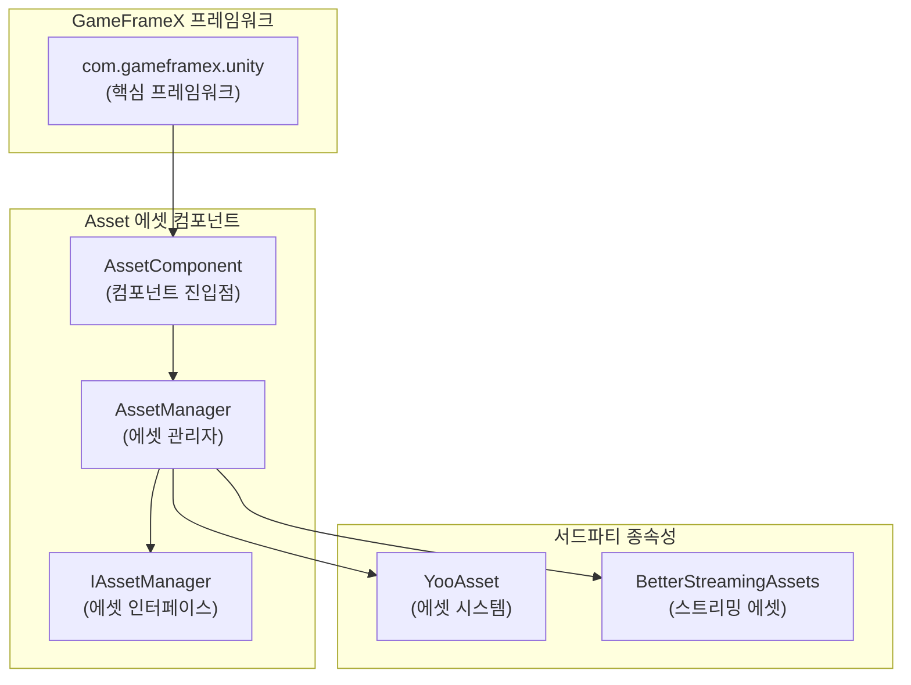

# 종속 요구 사항

이 문서는 GameFrameX Asset 에셋 컴포넌트의 종속 요구 사항을 자세히 설명하며, Unity 버전 요구 사항, 프레임워크 종속성 및 서드파티 종속성을 포함합니다.

## 개요

GameFrameX Asset 에셋 컴포넌트는 GameFrameX 프레임워크의 핵심 모듈 중 하나로, 통합된 에셋 관리 기능을 제공합니다. 이 컴포넌트를 사용하기 전에 개발 환경과 프로젝트가 다음 종속 요구 사항을 충족하는지 확인하십시오.

## Unity 버전 요구 사항

| 항목 | 요구 사항 |
|------|------|
| 최소 Unity 버전 | **2019.4** |
| 권장 Unity 버전 | 2020.3 LTS 이상 |

> Source: [package.json](https://github.com/GameFrameX/com.gameframex.unity.asset/blob/main/package.json#L7)

## 프레임워크 종속성

### 핵심 종속성

Asset 에셋 컴포넌트는 GameFrameX 핵심 프레임워크 패키지에 종속되며, 이는 이 컴포넌트를 사용하기 위한 **필수 전제 조건**입니다.

| 종속 패키지 | 버전 | 설명 |
|--------|------|------|
| `com.gameframex.unity` | **1.1.1** | GameFrameX 핵심 프레임워크, 기본 아키텍처 및 모듈 시스템 제공 |

```json
{
  "dependencies": {
    "com.gameframex.unity.asset": "2.4.0",
    "com.gameframex.unity": "1.1.1"
  }
}
```

> Source: [package.json](https://github.com/GameFrameX/com.gameframex.unity.asset/blob/main/package.json#L21-L23)

### 프레임워크 아키텍처

Asset 컴포넌트의 GameFrameX 프레임워크 내 위치는 다음과 같습니다:



**설계 설명:**
- `AssetComponent`는 `GameFrameworkComponent`를 상속받아 컴포넌트의 진입점입니다
- `AssetManager`는 `IAssetManager` 인터페이스를 구현하여 에셋 관리의 구체적인 구현을 제공합니다
- 기반으로 YooAsset을 에셋 관리 시스템으로 사용하고, BetterStreamingAssets을 스트리밍 에셋 지원으로 사용합니다

## 서드파티 종속성

### YooAsset

YooAsset은 Asset 컴포넌트의 핵심 에셋 관리 시스템으로, 다음을 담당합니다:
- 에셋의 비동기/동기 로딩
- 에셋 패키지 관리
- 에셋 버전 관리
- 에셋 핫 업데이트 지원

```csharp
// AssetManager.cs에서 YooAsset 사용
using YooAsset;

public partial class AssetManager : GameFrameworkModule, IAssetManager
{
    public void Initialize()
    {
        BetterStreamingAssets.Initialize();
        YooAssets.Initialize();
        YooAssets.SetOperationSystemMaxTimeSlice(30);
    }
}
```

> Source: [Runtime/Asset/AssetManager.cs](https://github.com/GameFrameX/com.gameframex.unity.asset/blob/main/Runtime/Asset/AssetManager.cs#L46-L56)

### BetterStreamingAssets

스트리밍 에셋에 대한 효율적인 접근을 지원하며, YooAsset의 종속 컴포넌트입니다.

## 네임스페이스 종속성

Asset 컴포넌트는 다음 네임스페이스를 사용합니다:

| 네임스페이스 | 설명 |
|----------|------|
| `GameFrameX.Runtime` | 핵심 프레임워크 런타임 네임스페이스 |
| `GameFrameX.Asset.Runtime` | Asset 컴포넌트 자체 네임스페이스 |
| `YooAsset` | 에셋 관리 시스템 |
| `UnityEngine` | Unity 엔진 코어 |
| `UnityEngine.SceneManagement` | 씬 관리 |

```csharp
using GameFrameX.Runtime;
using GameFrameX.Asset.Runtime;
using YooAsset;
using UnityEngine;
using UnityEngine.SceneManagement;
using Object = UnityEngine.Object;
```

> Source: [Runtime/Asset/AssetComponent.cs](https://github.com/GameFrameX/com.gameframex.unity.asset/blob/main/Runtime/Asset/AssetComponent.cs#L1-L8)

## 종속성 설치

### 자동 설치 (권장)

Unity 프로젝트의 `Packages/manifest.json` 파일에 종속성을 추가합니다:

```json
{
  "dependencies": {
    "com.gameframex.unity.asset": "https://github.com/GameFrameX/com.gameframex.unity.asset.git",
    "com.gameframex.unity": "1.1.1"
  }
}
```

> 자세한 내용은 [설치 방법](./2-installation.index)을 참조하십시오.

### Git URL 설치

Unity Package Manager에서 Git URL을 사용하여 추가합니다:
- Asset 컴포넌트: `https://github.com/GameFrameX/com.gameframex.unity.asset.git`
- 핵심 프레임워크: `https://github.com/GameFrameX/com.gameframex.unity.git`

### 로컬 설치

저장소를 Unity 프로젝트의 `Packages` 디렉토리에 직접 클론합니다:

```bash
git clone https://github.com/GameFrameX/com.gameframex.unity.asset.git Packages/com.gameframex.unity.asset
git clone https://github.com/GameFrameX/com.gameframex.unity.git Packages/com.gameframex.unity
```

## 버전 호환성

| Asset 컴포넌트 버전 | Unity 버전 | 프레임워크 버전 | 설명 |
|----------------|------------|----------|------|
| 2.4.0 | 2019.4+ | 1.1.1 | 현재 최신 버전 |
| 2.3.0 | 2019.4+ | 1.1.1 | 더우인 미니게임 지원 |
| 2.2.x | 2019.4+ | 1.1.0 | 기본 기능 안정 버전 |

## 자주 묻는 질문

### Q: 핵심 프레임워크를 설치하지 않으면 어떻게 되나요?

A: Asset 컴포넌트는 `GameFrameworkComponent` 기본 클래스에 종속되어 있어, 핵심 프레임워크가 설치되지 않은 경우 컴파일 오류가 발생합니다. `com.gameframex.unity` 패키지를 먼저 설치했는지 확인하십시오.

### Q: YooAsset을 별도로 설치해야 하나요?

A: 필요하지 않습니다. YooAsset은 YooAsset 패키지의 종속성으로, Asset 컴포넌트 설치 시 하위 종속성으로 자동 설치됩니다.

### Q: 어떤 Unity 플랫폼을 지원하나요?

A: Asset 컴포넌트는 다음 플랫폼을 지원합니다:
- Windows/Mac/Linux 데스크톱 플랫폼
- iOS/Android 모바일 플랫폼
- WebGL 플랫폼
- 위챗 미니게임
- 더우인 미니게임
- 콰이서우 미니게임

> 자세한 내용은 [플랫폼 지원 개요](./7-platforms.index)를 참조하십시오.

## 관련 링크

- [설치 방법](./2-installation.index)
- [Asset 에셋 컴포넌트 소개](./1-overview.introduction)
- [기능 특성](./1-overview.features)
- [핵심 개념](./4-core-concepts.architecture)
- [API 참조](./5-api-reference.loading-api)
