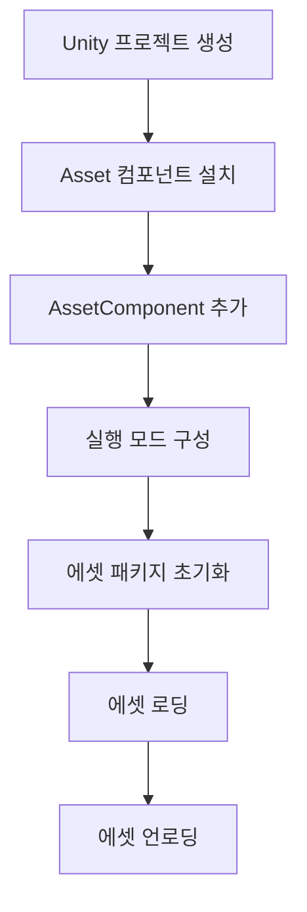

# 첫 번째 예제

이 문서는 GameFrameX Asset 에셋 컴포넌트의 첫 사용을 안내하며, 완전한 예제를 통해 에셋 시스템의 핵심 기능을 빠르게 시작할 수 있도록 돕습니다.

## 개요

Asset 에셋 컴포넌트는 YooAssets 기반으로 구축된 Unity 에셋 관리 시스템으로, 통합된 에셋 로딩, 언로딩 및 핫 업데이트 기능을 제공합니다. 이 예제에서는 Unity 프로젝트에서 이 컴포넌트를 구성하고 사용하여 기본 에셋 로딩 작업을 완료하는 방법을 보여줍니다.

## 빠른 시작 흐름

Asset 에셋 컴포넌트 사용의 표준 흐름은 다음과 같습니다:



## 사용 단계

### 단계 1: AssetComponent 추가

Unity 씬에서 빈 GameObject를 만들고 `AssetComponent` 컴포넌트를 추가합니다. 이 컴포넌트는 에셋 관리의 다양한 기능을 자동으로 노출합니다.

```csharp
// Unity 에디터에서
// 1. 씬에서 빈 GameObject 생성
// 2. Add Component 클릭
// 3. "GameFrameX/Asset" 검색 후 추가
// 4. AssetComponent가 자동으로 마운트됨
```

> Source: [AssetComponent.cs](https://github.com/GameFrameX/com.gameframex.unity.asset/blob/main/Runtime/Asset/AssetComponent.cs#L16-L18)

AssetComponent는 `GameFrameworkComponent`를 상속받으며, `[AddComponentMenu("GameFrameX/Asset")]` 속성을 통해 에디터에서 쉽게 추가할 수 있습니다.

### 단계 2: 실행 모드 구성

AssetComponent는 `GamePlayMode` 속성을 제공하여 에셋의 실행 모드를 설정합니다:

```csharp
// AssetComponent.cs의 속성 정의
public EPlayMode GamePlayMode { get; set; }
```

지원하는 실행 모드:
- **EditorSimulateMode**: 에디터 시뮬레이션 모드, 개발 시에만 사용
- **HostPlayMode**: 원격 핫 업데이트 모드
- **WebPlayMode**: WebGL 플랫폼 전용 모드

> 자세한 실행 모드 설명은 [실행 모드](./6-configuration.play-modes) 문서를 참조하십시오.

```csharp
// 런타임 모드 설정 예시 (AssetComponent.Awake에서)
_assetManager.SetPlayMode(GamePlayMode);
```

> Source: [AssetComponent.cs](https://github.com/GameFrameX/com.gameframex.unity.asset/blob/main/Runtime/Asset/AssetComponent.cs#L63)

### 단계 3: 에셋 패키지 초기화

에셋 시스템을 사용하기 전에 먼저 에셋 패키지를 초기화해야 합니다:

```csharp
// AssetComponent.Start에서 자동으로 초기화 호출됨
private void Start()
{
    _assetManager.Initialize();
}
```

> Source: [AssetComponent.cs](https://github.com/GameFrameX/com.gameframex.unity.asset/blob/main/Runtime/Asset/AssetComponent.cs#L66-L70)

특정 에셋 패키지를 수동으로 초기화할 수도 있습니다:

```csharp
// 에셋 패키지 초기화 예시
public async Task<bool> InitPackageAsync(string packageName, string host, string fallbackHostServer, bool isDefaultPackage = false)
{
    return await _assetManager.InitPackageAsync(packageName, host, fallbackHostServer, isDefaultPackage);
}
```

> Source: [AssetComponent.cs](https://github.com/GameFrameX/com.gameframex.unity.asset/blob/main/Runtime/Asset/AssetComponent.cs#L80-L95)

## 에셋 로딩 예제

Asset 컴포넌트는 여러 에셋 로딩 방법을 제공합니다. 아래에서는 비동기 로딩과 동기 로딩의 사용법을 각각 보여줍니다.

### 비동기 에셋 로딩

비동기 로딩은 권장되는 주요 방법으로, 메인 스레드를 차단하지 않습니다:

```csharp
using UnityEngine;
using GameFrameX.Asset.Runtime;
using YooAsset;
using System.Threading.Tasks;

// Prefab 비동기 로딩 예제
public async void LoadAssetExample(AssetComponent assetComponent)
{
    // 방법 1: 제네릭 비동기 로딩 사용
    var handle = await assetComponent.LoadAssetAsync<GameObject>("Assets/Prefabs/Player.prefab");
    var prefab = handle.AssetObject as GameObject;
    
    // 객체 인스턴스화
    if (prefab != null)
    {
        Instantiate(prefab);
    }
    
    // 로딩 완료 후 핸들 해제
    handle.Release();
}
```

> Source: [AssetComponent.cs](https://github.com/GameFrameX/com.gameframex.unity.asset/blob/main/Runtime/Asset/AssetComponent.cs#L257-L261)

```csharp
// 방법 2: 경로와 타입으로 로딩
public async Task LoadAssetWithType(AssetComponent assetComponent)
{
    var handle = await assetComponent.LoadAssetAsync("Assets/Textures/Background.png", typeof(Texture2D));
    var texture = handle.AssetObject as Texture2D;
    
    // 텍스처 사용...
    handle.Release();
}
```

> Source: [AssetComponent.cs](https://github.com/GameFrameX/com.gameframex.unity.asset/blob/main/Runtime/Asset/AssetComponent.cs#L245-L249)

### 동기 에셋 로딩

동기 로딩은 현재 프레임에서 에셋을 가져와야 하는 시나리오에 적합합니다:

```csharp
// Prefab 동기 로딩 예제
public void LoadAssetSyncExample(AssetComponent assetComponent)
{
    var handle = assetComponent.LoadAssetSync<GameObject>("Assets/Prefabs/Enemy.prefab");
    var enemy = handle.AssetObject as GameObject;
    
    if (enemy != null)
    {
        Instantiate(enemy);
    }
    
    // 동기 로딩도 수동 해제 필요
    handle.Release();
}
```

> Source: [AssetComponent.cs](https://github.com/GameFrameX/com.gameframex.unity.asset/blob/main/Runtime/Asset/AssetComponent.cs#L425-L429)

### 씬 로딩

```csharp
// 씬 비동기 로딩 예제
public async Task LoadSceneExample(AssetComponent assetComponent)
{
    var sceneHandle = await assetComponent.LoadSceneAsync(
        "Assets/Scenes/GameScene.unity", 
        UnityEngine.SceneManagement.LoadSceneMode.Single, 
        true
    );
    
    Debug.Log($"씬 로딩 완료: {sceneHandle.Scene.name}");
}
```

> Source: [AssetComponent.cs](https://github.com/GameFrameX/com.gameframex.unity.asset/blob/main/Runtime/Asset/AssetComponent.cs#L442-L446)

### 여러 에셋 로딩

```csharp
// 지정된 경로의 모든 에셋 로딩
public async Task LoadAllAssetsExample(AssetComponent assetComponent)
{
    var allAssetsHandle = await assetComponent.LoadAllAssetsAsync<GameObject>("Assets/Prefabs/");
    
    foreach (var asset in allAssetsHandle.AllAssetObjects)
    {
        Debug.Log($"에셋 로드: {asset.name}");
    }
    
    // 모두 사용 완료 후 해제
    allAssetsHandle.Release();
}
```

> Source: [AssetComponent.cs](https://github.com/GameFrameX/com.gameframex.unity.asset/blob/main/Runtime/Asset/AssetComponent.cs#L269-L273)

## 에셋 언로딩 예제

에셋 수명 주기를 올바르게 관리하는 것은 메모리 누수를 방지하는 데 중요합니다:

```csharp
public class ResourceManager
{
    private AssetComponent _assetComponent;
    
    // 지정된 에셋 언로딩
    public void UnloadSingleAsset(string assetPath)
    {
        _assetComponent.UnloadAsset(assetPath);
    }
    
    // 미사용 에셋 언로딩 (정기적 호출 권장)
    public void UnloadUnusedAssets()
    {
        _assetComponent.UnloadUnusedAssetsAsync();
    }
    
    // 미사용 에셋 패키지 파일 정리
    public void ClearUnusedBundles()
    {
        _assetComponent.ClearUnusedBundleFilesAsync();
    }
    
    // 모든 에셋 강제 언로딩 (신중하게 사용)
    public void UnloadAllAssets()
    {
        _assetComponent.UnloadAllAssetsAsync(null);
    }
}
```

> Source: [AssetComponent.cs](https://github.com/GameFrameX/com.gameframex.unity.asset/blob/main/Runtime/Asset/AssetComponent.cs#L590-L658)

## 완전한 사용 예제

다음은 초기화부터 로딩, 언로딩까지의 전체 흐름을 보여주는 완전한 MonoBehaviour 스크립트 예제입니다:

```csharp
using UnityEngine;
using GameFrameX.Asset.Runtime;
using YooAsset;
using System.Threading.Tasks;
using UnityEngine.SceneManagement;

public class GameEntry : MonoBehaviour
{
    private AssetComponent _assetComponent;
    
    private void Start()
    {
        // AssetComponent 컴포넌트 가져오기
        _assetComponent = GetComponent<AssetComponent>();
        
        // 에셋 패키지 초기화
        InitializePackage();
    }
    
    private async void InitializePackage()
    {
        // 기본 에셋 패키지 초기화
        bool success = await _assetComponent.InitPackageAsync(
            "DefaultPackage",           // 패키지 이름
            "http://localhost:8080/",   // 메인 서버 주소
            "http://backup:8080/",     // 백업 서버 주소
            true                        // 기본 패키지로 설정 여부
        );
        
        if (success)
        {
            Debug.Log("에셋 패키지 초기화 성공!");
            // 게임 콘텐츠 로딩 시작
            LoadGameContent();
        }
        else
        {
            Debug.LogError("에셋 패키지 초기화 실패!");
        }
    }
    
    private async void LoadGameContent()
    {
        // 플레이어 프리팹 로딩
        var playerHandle = await _assetComponent.LoadAssetAsync<GameObject>("Assets/Prefabs/Player.prefab");
        var playerPrefab = playerHandle.AssetObject as GameObject;
        
        if (playerPrefab != null)
        {
            Instantiate(playerPrefab);
        }
        
        // 배경 음악 로딩
        var audioHandle = await _assetComponent.LoadAssetAsync<AudioClip>("Assets/Audio/BGM.mp3");
        var bgm = audioHandle.AssetObject as AudioClip;
        
        // 메인 씬 로딩
        await _assetComponent.LoadSceneAsync(
            "Assets/Scenes/Main.unity",
            LoadSceneMode.Single,
            true
        );
        
        // 참고: 실제 프로젝트에서는 요구 사항에 따라 에셋 핸들 해제 시점을 결정해야 합니다
    }
}
```

> Source: [AssetManager.cs](https://github.com/GameFrameX/com.gameframex.unity.asset/blob/main/Runtime/Asset/AssetManager.cs#L46-L56)

## 에셋 패키지 관리

Asset 컴포넌트는 멀티 에셋 패키지 관리를 지원하여 서로 다른 에셋 패키지를 생성하고 전환할 수 있습니다:

```csharp
public class PackageManagerExample
{
    private AssetComponent _assetComponent;
    
    // 새 에셋 패키지 생성
    public void CreatePackage(string packageName)
    {
        var package = _assetComponent.CreateAssetsPackage(packageName);
        
        if (package != null)
        {
            Debug.Log($"에셋 패키지 생성 성공: {packageName}");
        }
    }
    
    // 에셋 패키지 가져오기
    public void GetPackage(string packageName)
    {
        var package = _assetComponent.GetAssetsPackage(packageName);
        
        if (package != null)
        {
            Debug.Log($"에셋 패키지 가져옴: {package.Name}");
        }
    }
    
    // 에셋 패키지 존재 여부 확인
    public bool CheckPackageExists(string packageName)
    {
        return _assetComponent.HasAssetsPackage(packageName);
    }
    
    // 기본 에셋 패키지 설정
    public void SetDefaultPackage(string packageName)
    {
        var package = _assetComponent.GetAssetsPackage(packageName);
        if (package != null)
        {
            _assetComponent.SetDefaultAssetsPackage(package);
        }
    }
}
```

> Source: [AssetComponent.cs](https://github.com/GameFrameX/com.gameframex.unity.asset/blob/main/Runtime/Asset/AssetComponent.cs#L470-L507)

## 모범 사례

### 1. 비동기 로딩 사용

```csharp
// 권장: 비동기 로딩
public async Task<GameObject> LoadPlayerAsync()
{
    var handle = await _assetComponent.LoadAssetAsync<GameObject>("Assets/Prefabs/Player.prefab");
    return handle.AssetObject as GameObject;
}
```

### 2. 에셋 핸들을 적시에 해제

```csharp
// 권장: 사용 완료 후 해제
var handle = await _assetComponent.LoadAssetAsync<GameObject>("Assets/Prefabs/Player.prefab");
var player = handle.AssetObject as GameObject;
Instantiate(player);
handle.Release();  // 핸들 즉시 해제

// 비권장: 핸들을 오랫동안 해제하지 않고 유지
var handle = await _assetComponent.LoadAssetAsync<GameObject>("Assets/Prefabs/Player.prefab");
// ... 장시간 해제하지 않고 유지
```

### 3. 에셋 태그를 사용한 일괄 쿼리

```csharp
// 태그로 일괄 에셋 정보 가져오기
public void LoadByTag()
{
    var assets = _assetComponent.GetAssetInfos("UI");
    foreach (var asset in assets)
    {
        Debug.Log($"UI 에셋 발견: {asset.AssetPath}");
    }
}
```

> Source: [AssetComponent.cs](https://github.com/GameFrameX/com.gameframex.unity.asset/blob/main/Runtime/Asset/AssetComponent.cs#L549-L553)

## 관련 링크

- [빠른 시작 가이드](./3-getting-started.index) - 빠른 시작 개요로 돌아가기
- [아키텍처 설계](./4-core-concepts.architecture) - 시스템 아키텍처 이해
- [에셋 컴포넌트](./4-core-concepts.asset-component) - AssetComponent에 대한 자세한 정보
- [에셋 관리자](./4-core-concepts.asset-manager) - AssetManager에 대한 자세한 정보
- [에셋 로딩 인터페이스](./5-api-reference.loading-api) - 완전한 API 참조
- [실행 모드](./6-configuration.play-modes) - 서로 다른 실행 모드 구성
- [컴포넌트 설정](./6-configuration.component-settings) - 컴포넌트 설정 상세
