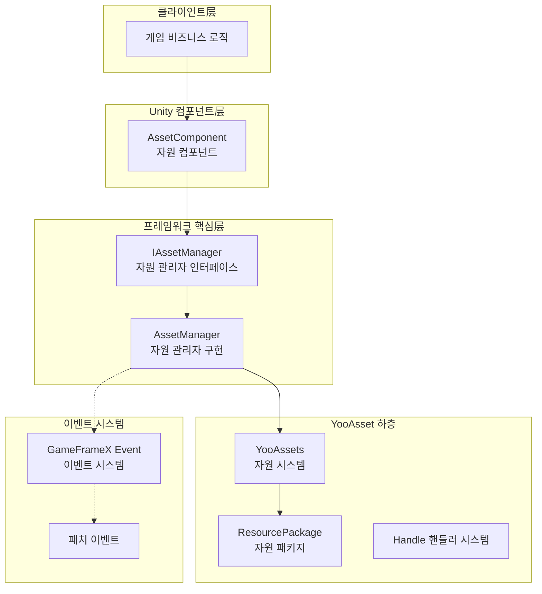
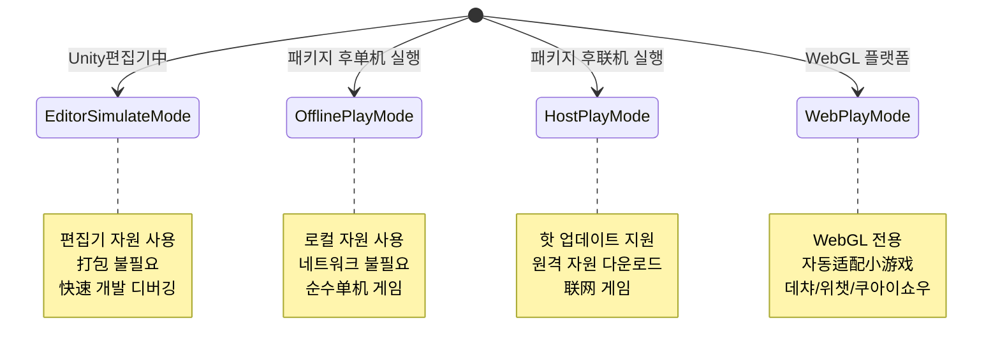
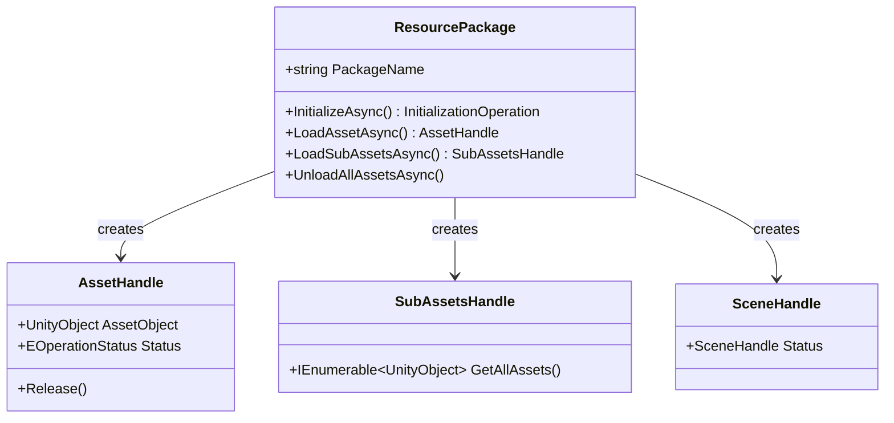
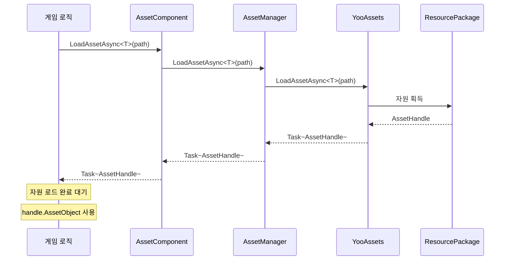

# 아키텍처 설계

이 문서는 GameFrameX Asset 자원 컴포넌트의 전체 아키텍처 설계를 상세히 소개하며, 핵심 컴포넌트, 모듈 책임, 상호 작용 관계 및 설계 결정을 포함합니다.

## 개요

GameFrameX Asset 자원 컴포넌트는 GameFrameX 프레임워크의 핵심 모듈 중 하나로, 업계에서 성숙한 **YooAsset** 자원 관리 시스템을 기반으로 구축되었습니다. 이 컴포넌트는 YooAsset의 하층 API를 캡슐화하여 Unity 게임 응용 프로그램에 **통일, 간결, 사용 편의** 자원 관리 솔루션을 제공합니다.

**설계 목표:**
- 자원 로드 및 언로드 복잡성 간소화
- 크로스 플랫폼 일관된 API 인터페이스 제공
- 다양한 실행 모드 지원 (편집기 모의, 오프라인, 핫 업데이트, WebGL)
- GameFrameX 이벤트 시스템 통합, 상태 통지 实现
- 다중 자원 패키지 관리 지원

## 아키텍처 총览



### 각 层 책임 설명

| 层 | 컴포넌트 | 책임 |
|------|------|------|
| 클라이언트层 | 게임 비즈니스 로직 | 자원 컴포넌트가 제공하는 API를 호출하여 자원 로드 |
| Unity 컴포넌트层 | AssetComponent | Unity 장면의 컴포넌트로, 사용자 지향 API 진입점 제공 |
| 프레임워크 핵심层 | AssetManager | 자원 관리의 핵심 비즈니스 로직 구현 |
| YooAsset 하층 | YooAssets | 하층 자원 시스템, 실제 파일 시스템, 다운로드, 캐시 등 처리 |
| 이벤트 시스템 | EventSystem | 패치 흐름 상태 통지, 다운로드 진행률 등 이벤트 제공 |

## 핵심 컴포넌트

### 1. AssetComponent（자원 컴포넌트）

`AssetComponent`는 Unity 게임 장면의 핵심 컴포넌트로, `GameFrameworkComponent`를 상속합니다. 이는 자원 시스템의統一 진입점으로서 게임 로직 层에 자원 접근 인터페이스를 제공합니다.

**주요 책임:**
- Unity 컴포넌트로 장면에 매달림
- 실행 모드(PlayMode) 구성
- 자원 패키지 초기화 관리
- AssetManager에 자원 로드 요청 프록시 포워드
- 플랫폼 차이 처리 (WebGL 자동 모드 전환)

> Source: [AssetComponent.cs](https://github.com/GameFrameX/com.gameframex.unity.asset/blob/main/Runtime/Asset/AssetComponent.cs#L18-L70)

```csharp
[DisallowMultipleComponent]
[AddComponentMenu("GameFrameX/Asset")]
public sealed class AssetComponent : GameFrameworkComponent
{
    [Tooltip("대상 플랫폼이 Web 플랫폼일 때强制적으로 WebPlayMode로 설정됩니다")]
    [SerializeField]
    private EPlayMode m_GamePlayMode;
    
    private IAssetManager _assetManager;
    
    protected override void Awake()
    {
        // 비편집기 환경에서 자동으로 실행 모드 조정
#if !UNITY_EDITOR
        if (GamePlayMode == EPlayMode.EditorSimulateMode)
        {
            GamePlayMode = EPlayMode.HostPlayMode;
        }
#if UNITY_WEBGL
        GamePlayMode = EPlayMode.WebPlayMode;
#endif
#endif
        base.Awake();
        _assetManager = GameFrameworkEntry.GetModule<IAssetManager>();
        _assetManager.SetPlayMode(GamePlayMode);
    }
}
```

**설계 의도:**
- `[DisallowMultipleComponent]`를 사용하여 장면에 AssetComponent가 하나만 존재하도록 제한, 자원 관리의 유일성 보장
- `Awake`에서 플랫폼 차이 처리, 비편집기 환경에서 올바른 실행 모드 사용 보장
- 의존성 주입을 통해 IAssetManager 인스턴스 획득, 解耦实现

### 2. IAssetManager（자원 관리자 인터페이스）

`IAssetManager` 인터페이스는 자원 관리의 모든 操作 계약을 정의하며, 구현 유연성과 테스트 가능성을 보장합니다.

> Source: [IAssetManager.cs](https://github.com/GameFrameX/com.gameframex.unity.asset/blob/main/Runtime/Asset/IAssetManager.cs#L1-L519)

**인터페이스 분류:**

| 기능 분류 | 메서드 예시 |
|----------|----------|
| 초기화 | `Initialize()`, `InitPackageAsync()` |
| 비동기 로드 | `LoadAssetAsync<T>()`, `LoadSceneAsync()` |
| 동기 로드 | `LoadAssetSync<T>()`, `LoadSubAssetSync()` |
| 자원 패키지 관리 | `CreateAssetsPackage()`, `GetAssetsPackage()` |
| 자원 언로드 | `UnloadAsset()`, `UnloadUnusedAssetsAsync()` |
| 자원 조회 | `GetAssetInfo()`, `HasAssetPath()`, `IsNeedDownload()` |

### 3. AssetManager（자원 관리자 구현）

`AssetManager`는 자원 관리의 핵심 구현 클래스로, `GameFrameworkModule`를 상속하고 `IAssetManager` 인터페이스를 구현합니다. YooAssets 호출을 캡슐화하고 GameFrameX의 모듈 시스템에适配합니다.

**주요 책임:**
- YooAssets 초기화 관리
- 서로 다른 실행 모드의 구성 처리
- 자원 로드/언로드 操作 캡슐화
- 자원 패키지(Package) 관리

> Source: [AssetManager.cs](https://github.com/GameFrameX/com.gameframex.unity.asset/blob/main/Runtime/Asset/AssetManager.cs#L14-L60)

```csharp
[UnityEngine.Scripting.Preserve]
public partial class AssetManager : GameFrameworkModule, IAssetManager
{
    public string DefaultPackageName { get; set; } = ConstDefaultPackageName;
    public int DownloadingMaxNum { get; set; }
    public int FailedTryAgain { get; set; }
    public EFileVerifyLevel VerifyLevel { get; set; }
    public EPlayMode PlayMode { get; private set; }
    
    public void Initialize()
    {
        BetterStreamingAssets.Initialize();
        Log.Info($"자원 시스템 실행 모드: {PlayMode}");
        YooAssets.Initialize();
        YooAssets.SetOperationSystemMaxTimeSlice(30);
    }
}
```

## 실행 모드

Asset 컴포넌트는 `EPlayMode` 열거형으로 정의되는 네 가지 실행 모드를 지원합니다:



### 모드 선택 로직

> Source: [AssetManager.Initialization.cs](https://github.com/GameFrameX/com.gameframex.unity.asset/blob/main/Runtime/Asset/AssetManager.Initialization.cs#L18-L47)

```csharp
private InitializationOperation CreateInitializationOperationHandler(ResourcePackage resourcePackage, string hostServerURL, string fallbackHostServerURL)
{
    switch (PlayMode)
    {
        case EPlayMode.EditorSimulateMode:
            return InitializeYooAssetEditorSimulateMode(resourcePackage);
        case EPlayMode.OfflinePlayMode:
            return InitializeYooAssetOfflinePlayMode(resourcePackage);
        case EPlayMode.HostPlayMode:
            return InitializeYooAssetHostPlayMode(resourcePackage, hostServerURL, fallbackHostServerURL);
        case EPlayMode.WebPlayMode:
            return InitializeYooAssetWebPlayMode(resourcePackage, hostServerURL, fallbackHostServerURL);
        default:
            return null;
    }
}
```

### 모드 초기화 상세

| 모드 | 초기화 메서드 | 적용 시나리오 |
|------|------------|----------|
| EditorSimulateMode | `InitializeYooAssetEditorSimulateMode()` | 편집기 개발 디버깅,打包 불필요 |
| OfflinePlayMode | `InitializeYooAssetOfflinePlayMode()` |单机 게임, 핫 업데이트 불필요 |
| HostPlayMode | `InitializeYooAssetHostPlayMode()` | 핫 업데이트가 필요한联网 게임 |
| WebPlayMode | `InitializeYooAssetWebPlayMode()` | WebGL/小游戏 플랫폼 |

## 자원 패키지 시스템

Asset 컴포넌트는 서로 다른 유형의 자원을 관리하기 위해 **자원 패키지(ResourcePackage)** 메커니즘을 采用합니다.



### 자원 패키지 操作

```csharp
// 자원 패키지 생성
ResourcePackage package = assetComponent.CreateAssetsPackage("MyPackage");

// 자원 패키지 획득
ResourcePackage pkg = assetComponent.TryGetAssetsPackage("MyPackage");

// 기본 자원 패키지 설정
assetComponent.SetDefaultAssetsPackage(pkg);

// 자원 패키지 존재 여부 확인
if (assetComponent.HasAssetsPackage("MyPackage"))
{
    // 자원 패키지 사용
}
```

> Source: [AssetManager.cs](https://github.com/GameFrameX/com.gameframex.unity.asset/blob/main/Runtime/Asset/AssetManager.cs#L646-L692)

## 이벤트 시스템

Asset 컴포넌트는 자원 로드 진행률과 상태 변경을 통지하기 위해 GameFrameX의 이벤트 시스템을 통합합니다.

### 패치 상태 변경

> Source: [EPatchStates.cs](https://github.com/GameFrameX/com.gameframex.unity.asset/blob/main/Runtime/Update/EPatchStates.cs#L1-L33)

```csharp
public enum EPatchStates
{
    /// <summary>정적 자원 버전 업데이트</summary>
    UpdateStaticVersion,
    /// <summary>패치清单 업데이트</summary>
    UpdateManifest,
    /// <summary>다운로드 생성기 생성</summary>
    CreateDownloader,
    /// <summary>원격 파일 다운로드</summary>
    DownloadWebFiles,
    /// <summary>패치 흐름 완료</summary>
    PatchDone,
}
```

### 이벤트 유형

| 이벤트 클래스 | 용도 |
|--------|------|
| AssetPatchStatesChangeEventArgs | 패치 흐름 상태 변경 |
| AssetDownloadProgressUpdateEventArgs | 다운로드 진행률 업데이트 |
| AssetFoundUpdateFilesEventArgs | 업데이트가 필요한 파일 발견 |
| AssetPatchManifestUpdateFailedEventArgs | 패치清单 업데이트 실패 |
| AssetWebFileDownloadFailedEventArgs | 자원 파일 다운로드 실패 |

> Source: [AssetPatchStatesChangeEventArgs.cs](https://github.com/GameFrameX/com.gameframex.unity.asset/blob/main/Runtime/Update/EventArgs/AssetPatchStatesChangeEventArgs.cs#L1-L49)

## 자원 로드 흐름

### 비동기 자원 로드



### 자원 언로드 흐름

```mermaid
flowchart LR
    A[UnloadAsset 호출] --> B{지정 자원 패키지?}
    B -->|예| C[UnloadAsset(packageName, assetPath)]
    B -->|아니오| D[UnloadAsset(assetPath)]
    C --> E[대상 자원 패키지 획득]
    D --> E
    E --> F[Package.TryUnloadUnusedAsset 호출]
    F --> G[YooAsset 자원 해제]
    
    G --> H{UnloadUnusedAssetsAsync 호출?}
    H -->|예| I[미사용 자원 해제]
    H -->|아니오| J[종료]
```

## 구성 옵션

Asset 컴포넌트는 다음과 같은 구성 가능한 항목을 제공합니다:

| 구성 항목 | 타입 | 기본값 | 설명 |
|--------|------|--------|------|
| GamePlayMode | EPlayMode | EditorSimulateMode | 자원 실행 모드 |
| DefaultPackageName | string | "DefaultPackage" | 기본 자원 패키지 이름 |
| DownloadingMaxNum | int | - | 최대 동시 다운로드 수 |
| FailedTryAgain | int | - | 다운로드 실패 재시도 횟수 |
| VerifyLevel | EFileVerifyLevel | - | 파일 검증 등급 |
| Milliseconds | long | - | 비동기 시스템 每帧 최대 실행 시간(밀리초) |

> Source: [AssetComponent.cs](https://github.com/GameFrameX/com.gameframex.unity.asset/blob/main/Runtime/Asset/AssetComponent.cs#L20-L36)

## 설계 결정 설명

### 1. 왜 YooAsset을 사용하는가?

YooAsset을 하층 자원 시스템으로 선택한 이유:
- **기능 완비**: 자원打包, 의존성 분석, 핫 업데이트, 캐시管理等 완전한 기능 지원
- **성능 최적화**: 핸들러 메커니즘, 참조 카운팅, 자원 해제 최적화 제공
- **크로스 플랫폼**: Unity 모든 주류 플랫폼 지원
- **커뮤니티 활발**: 지속적인 유지보수 및 업데이트

### 2. 왜 인터페이스 분리를 채택하는가?

`IAssetManager` 인터페이스를 통해 명확한 操作 계약 정의:
- 단위 테스트 용이 (mock 구현 가능)
- 확장점 제공, 하층 구현 교체 허용
- API 문서 더 명확

### 3. 왜 동기/비동기 로드를 구분하는가?

- **비동기 로드**: 대규모 자원 로드에 적합, 메인 스레드 차단 회피
- **동기 로드**: 소규모 자원 또는 특정 성능 민감 시나리오에 적합
- 사용자는 시나리오 요구 사항에 따라 적절한 로드 방식 선택 가능

### 4. 왜 자원 패키지가 필요한가?

다중 자원 패키지 설계 지원:
- 기능 모듈별로 자원 구분 (UI, DLC, 구성)
- 특정 모듈의 동적 로드/언로드
- 자원 필요 시 다운로드, 대역폭 절약

## 관련 링크

- [자원 컴포넌트](./4-core-concepts.asset-component) - AssetComponent 상세 API
- [자원 관리자](./4-core-concepts.asset-manager) - AssetManager 구현 상세
- [자원 로드 인터페이스](./5-api-reference.loading-api) - 완전한 로드 API 참고
- [자원 패키지 관리](./5-api-reference.package-management) - 자원 패키지 操作 API
- [실행 모드](./6-configuration.play-modes) - 다양한 실행 모드 구성
- [컴포넌트 구성](./6-configuration.component-settings) - 컴포넌트 구성 옵션