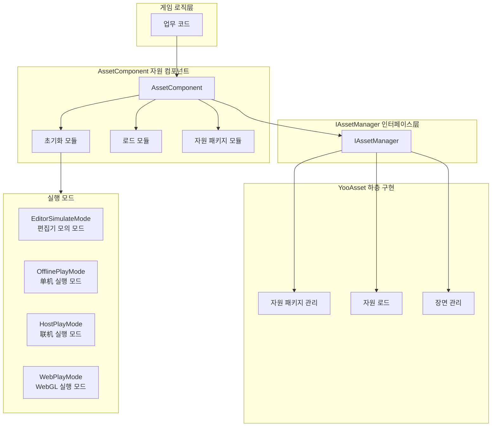
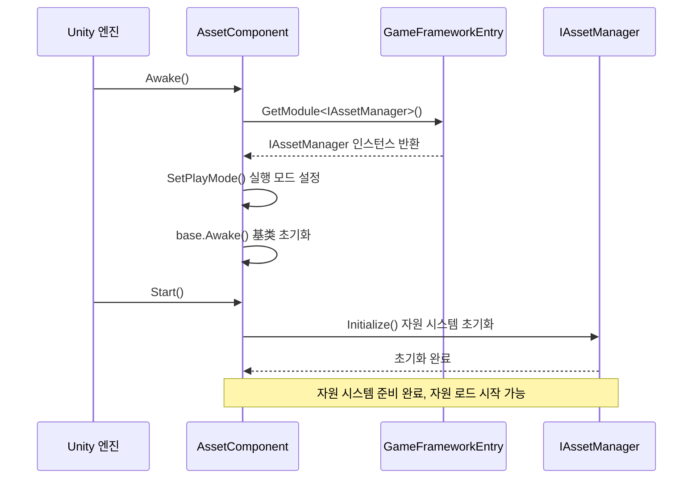
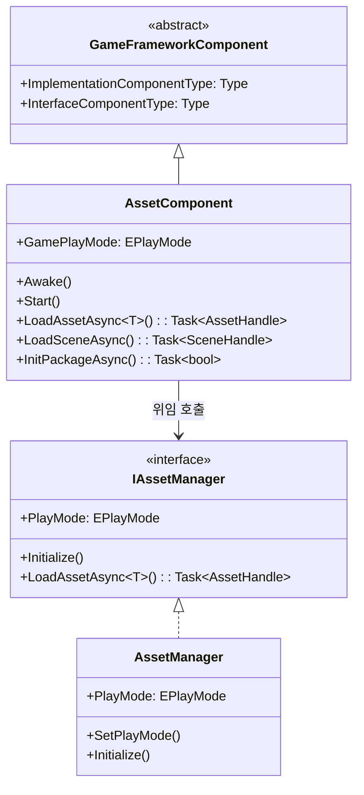

# 자원 컴포넌트

자원 컴포넌트(AssetComponent)는 GameFrameX 자원 시스템의 핵심 진입점으로,统一的 자원 로드, 언로드 및 관리 기능을 제공합니다. 이 컴포넌트는 YooAsset 하층 구현을 캡슐화하여 게임 프로젝트에 간결하고 효율적인 자원 관리 API를 제공합니다.

## 개요

AssetComponent는 Unity 컴포넌트(MonoBehaviour)로, GameFrameworkComponent를 상속합니다. 자원 시스템의 파사드(Facade)로, 자원 조작의 복잡성을 간소화하여 동기/비동기 로드, 장면 관리, 자원 패키지 관리 등의 기능을 제공합니다.

**설계 목적**:
- 통일된 자원 접근 인터페이스 제공, 하층 구현 상세 숨김
-多种 실행 모드 지원, 서로 다른 개발 및 배포 시나리오適応
- 자원 지연 로드 및 자동 해제 구현, 메모리 사용 최적화
- 핫 업데이트 자원 관리 지원,联机 게임에 적용 가능

## 아키텍처 설계



**아키텍처 설명**:
- **게임 로직层**: 업무 코드는 AssetComponent를 통해 자원 시스템 접근
- **AssetComponent 层**: 컴포넌트화된 자원 인터페이스 제공, 초기화, 로드, 패키지 관리 모듈 포함
- **IAssetManager 인터페이스层**: 자원 관리의 추상 인터페이스 정의, 관심사 분리 실현
- **YooAsset 层**: YooAsset 라이브러리에 기반한 실제 자원 관리 구현
- **실행 모드**: 네 가지 서로 다른 자원 실행 모드 지원, 다양한 개발 배포 시나리오適応

## 핵심 기능

### 1. 실행 모드 지원

AssetComponent는 `GamePlayMode` 속성을 통해 네 가지 실행 모드를 지원합니다:

| 모드 | 설명 | 적용 시나리오 |
|------|------|----------|
| EditorSimulateMode | 편집기 모의 모드 | 개발 단계,打包 없이 자원 테스트 가능 |
| OfflinePlayMode |单机 실행 모드 | 순수 로컬 자원, 네트워크 업데이트 관련 없음 |
| HostPlayMode |联机 실행 모드 | 핫 업데이트가 필요한 공식 배포 버전 |
| WebPlayMode | WebGL 실행 모드 | Web 플랫폼 배포, 미니게임 플랫폼 지원 |

**플랫폼 자동 어댑션**:

```csharp
// AssetComponent.cs - 실행 시 자동으로 실행 모드 조정
#if !UNITY_EDITOR
    if (GamePlayMode == EPlayMode.EditorSimulateMode)
    {
        GamePlayMode = EPlayMode.HostPlayMode;
    }
#if UNITY_WEBGL
    GamePlayMode = EPlayMode.WebPlayMode;
#endif
#endif
```
> Source: [AssetComponent.cs](https://github.com/GameFrameX/com.gameframex.unity.asset/blob/main/Runtime/Asset/AssetComponent.cs#L44-L52)

### 2. 자원 로드

AssetComponent는 다양한 자원 로드 인터페이스를 제공하여 동기/비동기 두 가지 방식을 지원합니다:

```csharp
// 비동기 로드 자원
public async Task<AssetHandle> LoadAssetAsync<T>(string path) where T : Object

// 동기 로드 자원
public AssetHandle LoadAssetSync<T>(string path) where T : Object

// 비동기 서브 자원 로드 (예: SpriteAtlas의 Sprite)
public Task<SubAssetsHandle> LoadSubAssetsAsync<T>(string path) where T : Object

// 비동기 모든 자원 로드
public Task<AllAssetsHandle> LoadAllAssetsAsync<T>(string path) where T : Object
```
> Source: [AssetComponent.cs](https://github.com/GameFrameX/com.gameframex.unity.asset/blob/main/Runtime/Asset/AssetComponent.cs#L257-L305)

### 3. 장면 로드

비동기 Unity 장면 로드를 지원합니다:

```csharp
// 비동기 장면 로드
public Task<SceneHandle> LoadSceneAsync(string path, LoadSceneMode sceneMode, bool activateOnLoad = true)
```
> Source: [AssetComponent.cs](https://github.com/GameFrameX/com.gameframex.unity.asset/blob/main/Runtime/Asset/AssetComponent.cs#L443-L459)

### 4. 자원 패키지 관리

다중 자원 패키지 관리 지원, 생성, 획득, 기본 패키지 설정 가능:

```csharp
// 자원 패키지 생성
public ResourcePackage CreateAssetsPackage(string packageName)

// 자원 패키지 획득 시도 (존재하지 않으면 null 반환)
public ResourcePackage TryGetAssetsPackage(string packageName)

// 자원 패키지 존재 확인
public bool HasAssetsPackage(string packageName)

// 기본 자원 패키지 설정
public void SetDefaultAssetsPackage(ResourcePackage assetsPackage)
```
> Source: [AssetComponent.cs](https://github.com/GameFrameX/com.gameframex.unity.asset/blob/main/Runtime/Asset/AssetComponent.cs#L471-L584)

### 5. 자원 언로드 및 정리

다양한 자원 해제 전략을 제공합니다:

```csharp
// 지정 자원 언로드
public void UnloadAsset(string assetPath)

// 자원 핸들 언로드
public void UnloadAssetHandle(object assetHandle)

// 미사용 자원 언로드
public void UnloadUnusedAssetsAsync(string packageName = null)

// 미사용 자원 패키지 파일 정리
public void ClearUnusedBundleFilesAsync(string packageName = null)

// 모든 자원 강제 회수
public void UnloadAllAssetsAsync(string packageName)

// 모든 자원 패키지 파일 정리
public void ClearAllBundleFilesAsync(string packageName = null)
```
> Source: [AssetComponent.cs](https://github.com/GameFrameX/com.gameframex.unity.asset/blob/main/Runtime/Asset/AssetComponent.cs#L602-L658)

## 핵심 흐름

### 컴포넌트 초기화 흐름



### 자원 로드 흐름

```mermaid
sequenceDiagram
    participant Client as 업무 코드
    participant AC as AssetComponent
    participant IAM as IAssetManager
    package as YooAsset ResourcePackage

    Client->>AC: LoadAssetAsync<T>(path)
    AC->>IAM: LoadAssetAsync<T>(path)
    IAM->>package: LoadAssetAsync(path)
    
    rect rgb(240, 248, 255)
        Note right of package: 자원 로드 단계
    end
    
    package-->>IAM: AssetHandle
    IAM-->>AC: AssetHandle
    AC-->>Client: Task<AssetHandle>
    
    Client->>Client: await Task
    Note over Client: 자원 객체 획득
    
    Client->>AC: UnloadAssetHandle(handle)
    AC->>IAM: handle.Release()
    Note over package: 자원 해제됨
```

## 사용 예시

### 기초 사용: 비동기 자원 로드

```csharp
using UnityEngine;
using GameFrameX.Asset.Runtime;
using YooAssets;

public class Example : MonoBehaviour
{
    private async void Start()
    {
        var assetComponent = GameEntry.GetComponent<AssetComponent>();
        
        // 비동기 Prefab 로드
        var handle = await assetComponent.LoadAssetAsync<GameObject>("Prefabs/Player");
        var prefab = handle.LoadAsset();
        
        // 객체 인스턴스화
        Instantiate(prefab);
        
        // 로드 완료 후 자원 핸들 해제
        handle.Release();
    }
}
```
> Source: [AssetComponent.cs](https://github.com/GameFrameX/com.gameframex.unity.asset/blob/main/Runtime/Asset/AssetComponent.cs#L257-L261)

###进阶 사용: 자원 패키지 초기화 및 다중 패키지 관리

```csharp
using UnityEngine;
using GameFrameX.Asset.Runtime;

public class MultiPackageExample : MonoBehaviour
{
    private async void Start()
    {
        var assetComponent = GameEntry.GetComponent<AssetComponent>();
        
        // 기본 자원 패키지 초기화
        await assetComponent.InitPackageAsync(
            "DefaultPackage",           // 패키지 이름
            "https://cdn.example.com/", // 메인 다운로드 주소
            "https://backup.example.com/", // 백업 주소
            true                        // 기본 패키지 여부
        );
        
        // 추가 자원 패키지 생성
        var uiPackage = assetComponent.CreateAssetsPackage("UIPackage");
        var configPackage = assetComponent.CreateAssetsPackage("ConfigPackage");
        
        // 기본 자원 패키지 설정
        assetComponent.SetDefaultAssetsPackage(uiPackage);
    }
}
```
> Source: [AssetComponent.cs](https://github.com/GameFrameX/com.gameframex.unity.asset/blob/main/Runtime/Asset/AssetComponent.cs#L80-L95)

### 고급 사용: 자원 상태 확인 및 조건 로드

```csharp
using UnityEngine;
using GameFrameX.Asset.Runtime;

public class ResourceCheckExample : MonoBehaviour
{
    private async void LoadResourceWithCheck()
    {
        var assetComponent = GameEntry.GetComponent<AssetComponent>();
        
        string resourcePath = "Prefabs/HeavyModel";
        
        // 자원 다운로드 필요 여부 확인
        if (assetComponent.IsNeedDownload(resourcePath))
        {
            Debug.Log("자원 다운로드 필요, 다운로드界面 표시...");
            // 여기에 다운로드 진행률 UI 추가 가능
        }
        
        // 자원 정보 획득
        var assetInfo = assetComponent.GetAssetInfo(resourcePath);
        if (assetInfo != null)
        {
            Debug.Log($"자원 경로: {assetInfo.AssetPath}");
        }
        
        // 자원 경로 존재 여부 확인
        if (assetComponent.HasAssetPath(resourcePath))
        {
            var handle = await assetComponent.LoadAssetAsync<GameObject>(resourcePath);
            // 자원 처리
            handle.Release();
        }
    }
}
```
> Source: [AssetComponent.cs](https://github.com/GameFrameX/com.gameframex.unity.asset/blob/main/Runtime/Asset/AssetComponent.cs#L517-L573)

## 설정 설명

### Unity 편집기에서 설정

Unity 장면에서 GameObject를 생성하고 **AssetComponent** 컴포넌트를 추가합니다:

1. Inspector 패널에서 **자원 실행 모드**(GamePlayMode) 구성
2. 선택한 모드에 따라相应的 매개변수 구성

```csharp
// AssetComponentInspector.cs - 편집기 설정 인터페이스
[CustomEditor(typeof(AssetComponent))]
internal sealed class AssetComponentInspector : ComponentTypeComponentInspector
{
    public override void OnInspectorGUI()
    {
        // 실행 모드 시 편집 비활성화
        EditorGUI.BeginDisabledGroup(EditorApplication.isPlayingOrWillChangePlaymode);
        {
            EditorGUILayout.PropertyField(m_GamePlayMode, m_GamePlayModeGUIContent);
        }
    }
}
```
> Source: [AssetComponentInspector.cs](https://github.com/GameFrameX/com.gameframex.unity.asset/blob/main/Editor/Inspector/AssetComponentInspector.cs#L48-L66)

### 컴포넌트 속성

| 속성 | 타입 | 설명 |
|------|------|------|
| GamePlayMode | EPlayMode | 자원 실행 모드, 자원 로드 방식 결정 |
| ImplementationComponentType | Type | IAssetManager의 구현 타입 |
| InterfaceComponentType | Type | 컴포넌트에 대응하는 인터페이스 타입 |

## 자원 관리자와의 관계

AssetComponent는 Unity 컴포넌트 시스템에Oriented된 파사드 클래스이고, IAssetManager/AssetManager는 순수 업무 로직层面的 자원 관리 능력을 제공합니다:



**책임 구분**:
- **AssetComponent**: Unity 컴포넌트로, 생명주기(Awake/Start) 처리, Unity 친화적 API 제공
- **IAssetManager**: 자원 관리 인터페이스 계약 정의, Unity 생명주기와 분리
- **AssetManager**: 인터페이스의 구체적 구현, YooAsset 하층 호출 처리

## 관련 링크

- [자원 관리자](./4-core-concepts.asset-manager) - 자원 관리의 하층 구현 자세히 알아보기
- [실행 모드](./6-configuration.play-modes) - 네 가지 실행 모드의 상세 구성 알아보기
- [자원 로드 API](./5-api-reference.loading-api) - 완전한 자원 로드 인터페이스 문서
- [자원 패키지 관리](./5-api-reference.package-management) - 자원 패키지 관리 상세 설명
- [설치 가이드](./2-installation.index) - 자원 컴포넌트 설치 및 설정 방법
- [빠른 시작](./3-getting-started.index) - 자원 컴포넌트 사용 빠르게 시작