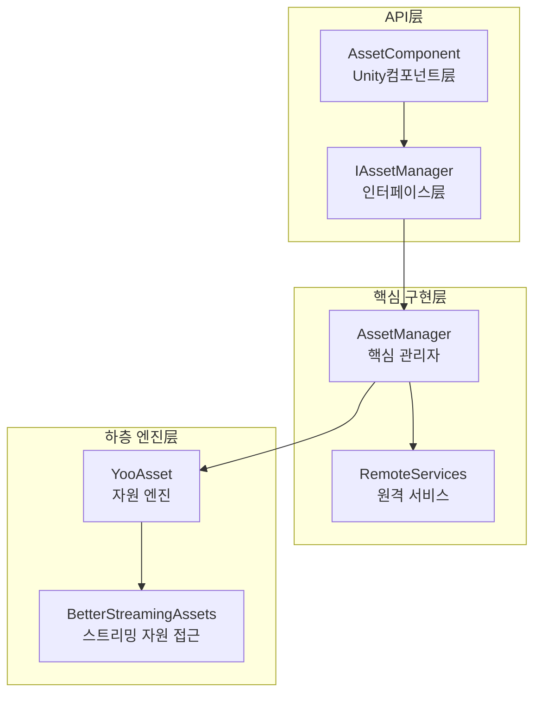
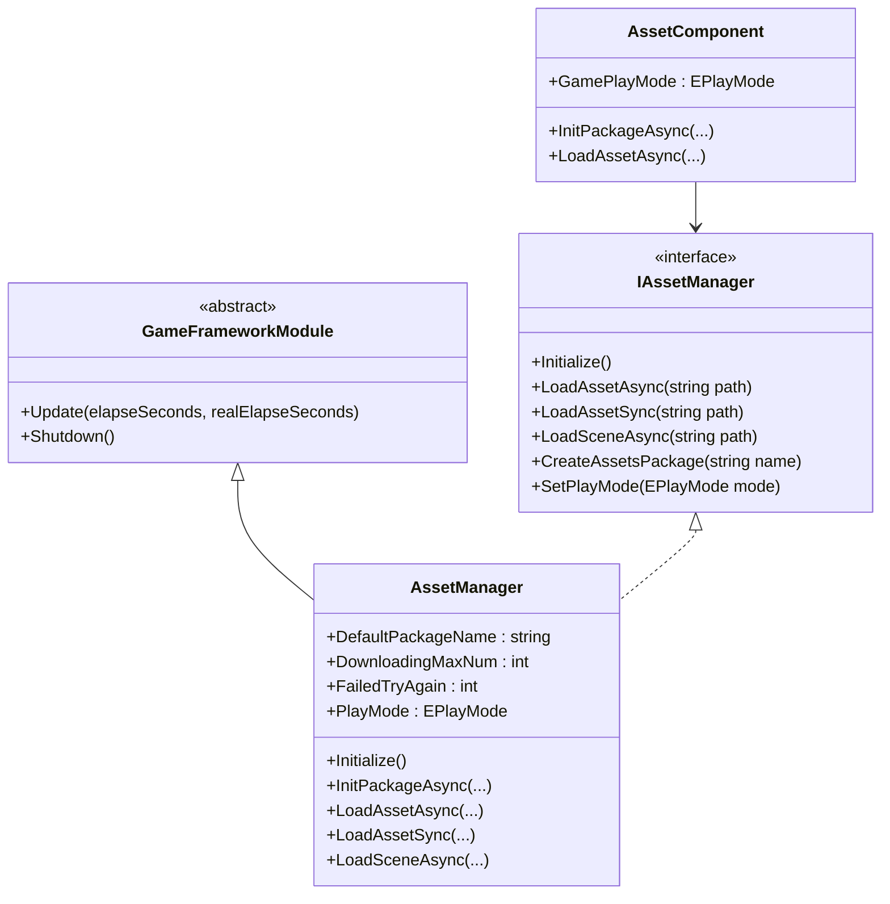
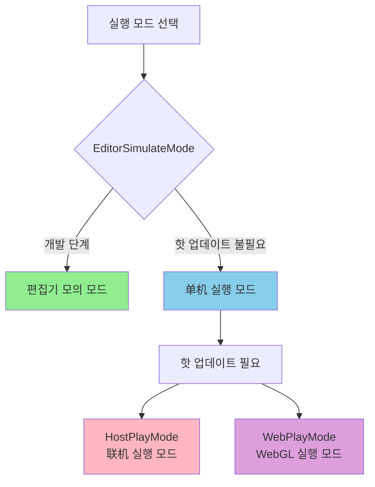
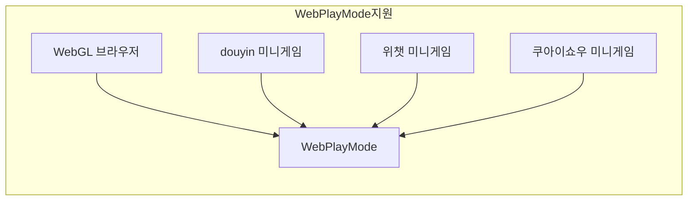

# 자원 관리자

자원 관리자(Asset Manager)는 GameFrameX 자산 시스템의 핵심 컴포넌트로, 게임 자원 로드, 언로드, 핫 업데이트 및 자원 패키지 관리를統一管理합니다. 이 컴포넌트는 YooAsset 라이브러리에 기반하여 구축되었으며, 간결하고 사용하기 쉬운 API 인터페이스를 제공하여 다양한 실행 모드와 플랫폼을 지원합니다.

## 개요

자원 관리자는 게임 프레임워크의 핵심 모듈로서, 게임 실행 시 자원 관리의 핵심 책임을집니다. 현대 게임 개발에서 자원의 효과적인 관리는 게임 성능, 로드 속도 및 사용자 경험에 직접적인 영향을 미칩니다. 자원 관리자는 YooAsset의 기능을统一 캡슐화하여 개발자에게 완전한 자원 관리 솔루션을 제공합니다.

이 컴포넌트는 다음 핵심 기능을 지원합니다:

- **동기/비동기 자원 로드**: 동기 및 비동기 두 가지 로드 방식을 제공하여 서로 다른 시나리오 요구 충족
- **다중 자원 패키지 관리**: 여러 개의 독립적인 자원 패키지 생성 및 관리 지원
- **장면 로드**: 비동기 장면 로드 및 전환 지원
- **핫 업데이트 지원**: HostPlayMode 및 WebPlayMode에서 자원 핫 업데이트 지원
- **자원 정리**: 다양한 자원 해제 전략 제공, 메모리 사용 최적화

자원 관리자의 설계理念은 복잡한 하층 자원 관리 로직을 캡슐화하여, 개발자는 업무层面的 자원 사용에만 주력하면 되며, 자원이 어떻게 디스크 또는 네트워크에서 로드되고, 어떻게 버전 관리되는 등의 문제를 신경 쓸 필요가 없습니다.

## 아키텍처 설계

자원 관리자의 아키텍처는分层 설계 모드를 채택하여 위에서 아래로 세 가지 주요 계층으로 나뉩니다:



### 컴포넌트 설명

**API 层**는 Unity 엔진 및 업무 코드와의 상호작용을 담당합니다. `AssetComponent`는 GameObject에 Attach된 Unity 컴포넌트로, Inspector 패널 구성 및 컴포넌트 생명주기 관리를 제공합니다. `IAssetManager` 인터페이스는 자원 관리의 모든 조작 계약를 정의하여 코드의 테스트 가능성 및 대체 가능성을 보장합니다.

**핵심 구현层**는 자원 관리의 핵심 로직을 구현합니다. `AssetManager`는 `GameFrameworkModule`를 상속하여 전체 자원 시스템의 핵심입니다. YooAsset의 모든 기능을 캡슐화하고 게임 개발에 더 적합한 기능을 추가합니다. `RemoteServices`는 내부 클래스로 핫 업데이트 자원의 원격 URL 분석을 담당합니다.

**하층 엔진层**는 실제 자원 조작 구현입니다. YooAsset은 업계 우수Unity 자원 관리 솔루션으로, 강력한 자원打包, 로드 및 핫 업데이트 기능을 제공합니다. BetterStreamingAssets는 StreamingAssets 디렉토리에 대한 효율적인 접근을 제공합니다.

### 핵심 클래스 다이어그램



## 핵심 기능

### 자원 로드

자원 관리자는 풍부한 자원 로드 인터페이스를 제공하여 동기 및 비동기 두 가지 로드 모드를 지원합니다. 동기 로드는 로드 시간에 대한 요구가 높지 않고 메인 스레드에서 실행되는 시나리오에 적합합니다. 비동기 로드는 프레임률 안정성을 유지해야 하는大型 자원 로드 시나리오에 적합합니다.

#### 비동기 로드 자원

비동기 로드는 게임 개발에서 가장 많이 사용되는 자원 로드 방식으로, 메인 스레드를 차단하지 않아 게임의流畅运行을 유지할 수 있습니다. 자원 관리자는 다양한 비동기 로드 인터페이스를 제공합니다:

```csharp
// 경로를 통해 비동기 자원 로드
var handle = await assetComponent.LoadAssetAsync<GameObject>("Prefabs/Player");

// 로드 완료된 자원 객체 획득
var playerPrefab = handle.AssetObject as GameObject;
if (playerPrefab != null)
{
    Instantiate(playerPrefab);
}

// 로드 완료 후 핸들 해제
handle.Release();
```

> Source: [AssetManager.cs](https://github.com/GameFrameX/com.gameframex.unity.asset/blob/main/Runtime/Asset/AssetManager.cs#L454-L480)

비동기 로드는 Handle 객체를 반환하며, 이 객체를 통해 로드된 자원 획득, 로드 진행률 모니터링 및 적절한 타이밍에 자원 해제 가능합니다. 개발자는 자원이 더 이상 필요하지 않을 때 적시에 Handle을 해제하여 메모리 누수를 방지해야 합니다.

#### 동기 로드 자원

특정 현재 프레임에 자원을 획득해야 하는 시나리오에서는 동기 로드 인터페이스를 사용할 수 있습니다:

```csharp
// 동기 로드 자원
var handle = assetComponent.LoadAssetSync<GameObject>("Prefabs/Enemy");
var enemyPrefab = handle.AssetObject as GameObject;
handle.Release();
```

> Source: [AssetManager.cs](https://github.com/GameFrameX/com.gameframex.unity.asset/blob/main/Runtime/Asset/AssetManager.cs#L603-L606)

동기 로드는 호출 스레드를 차단하며, 자원 로드 완료 전에는 반환되지 않습니다. 따라서 동기 로드는大型 자원 로드에 적합하지 않으며, 일반적으로 구성 데이터 등 소규모 자원의 로드에만 사용됩니다.

#### 서브 자원 로드

일부 자원은 여러 개의 서브 자원을 포함합니다 (예: prefab에서 참조하는 머티리얼 또는 텍스처). 자원 관리자는 전문 서브 자원 로드 인터페이스를 제공합니다:

```csharp
// 비동기 서브 자원 로드
var handle = await assetComponent.LoadSubAssetsAsync<Sprite>("Atlas/GameUI");
foreach (var subAsset in handle.SubAssets)
{
    var sprite = subAsset.AssetObject as Sprite;
    // sprite 처리...
}
handle.Release();
```

> Source: [AssetManager.cs](https://github.com/GameFrameX/com.gameframex.unity.asset/blob/main/Runtime/Asset/AssetManager.cs#L244-L250)

### 자원 패키지 관리

자원 패키지(Resource Package)는 자원 관리의 기본 단위로, 각 자원 패키지는 독립적인打包, 버전 관리 및 핫 업데이트가 가능합니다. 자원 관리자는 여러 자원 패키지를 동시에 관리하는 것을 지원합니다.

#### 자원 패키지 생성

```csharp
// 새로운 자원 패키지 생성
var package = assetComponent.CreateAssetsPackage("DLC_Package");
assetComponent.SetDefaultAssetsPackage(package);
```

> Source: [AssetManager.cs](https://github.com/GameFrameX/com.gameframex.unity.asset/blob/main/Runtime/Asset/AssetManager.cs#L654-L657)

#### 자원 패키지 획득

```csharp
// 기존 자원 패키지 획득
var package = assetComponent.TryGetAssetsPackage("DLC_Package");
if (package != null)
{
    // 자원 패키지 사용...
}
```

> Source: [AssetManager.cs](https://github.com/GameFrameX/com.gameframex.unity.asset/blob/main/Runtime/Asset/AssetManager.cs#L665-L668)

### 장면 관리

자원 관리자는 Unity 장면의 비동기 로드를 지원하며, 이는大型 게임의 레벨 전환에서 특히 중요합니다:

```csharp
// 비동기 장면 로드
var handle = await assetComponent.LoadSceneAsync(
    "Scenes/Level1", 
    LoadSceneMode.Single, 
    true
);
```

> Source: [AssetManager.cs](https://github.com/GameFrameX/com.gameframex.unity.asset/blob/main/Runtime/Asset/AssetManager.cs#L620-L626)

세 번째 매개변수는 로드 완료 후 자동으로 장면을 활성화할지 제어합니다. 로드 과정에서 Loading界面를 표시해야 하는 경우 매개변수를 false로 설정하고, Loading 완료 후 수동으로 활성화할 수 있습니다.

### 자원 정리

자원 메모리를 합리적으로 관리하는 것은 게임 성능 최적화의 중요한 부분입니다. 자원 관리자는 다양한 자원 해제 인터페이스를 제공합니다:

```csharp
// 지정 자원 언로드
assetComponent.UnloadAsset("Prefabs/Player");

// 미사용 자원 언로드
assetComponent.UnloadUnusedAssetsAsync();

// 미사용 Bundle 파일 정리
assetComponent.ClearUnusedBundleFilesAsync();

// 모든 자원 강제 회수
assetComponent.UnloadAllAssetsAsync();
```

> Source: [AssetManager.cs](https://github.com/GameFrameX/com.gameframex.unity.asset/blob/main/Runtime/Asset/AssetManager.cs#L591-L658)

이러한 인터페이스의 사용 시나리오는 각각 다릅니다: UnloadAsset은 특정 자원 언로드에 사용됩니다. UnloadUnusedAssetsAsync는 현재 참조되지 않는 자원 언로드에 사용됩니다. ClearUnusedBundleFilesAsync는 미사용 Bundle 파일을 정리하여 디스크 공간을 확보합니다. UnloadAllAssetsAsync는 자원 패키지의 모든 자원을 강제로 언로드합니다.

## 실행 모드

자원 관리자는 네 가지 실행 모드를 지원하며, 각 모드는 서로 다른 개발 및 배포 시나리오에适用합니다:



### 편집기 모의 모드

편집기 모의 모드(EditorSimulateMode)는 개발 단계에서 가장 많이 사용되는 모드입니다. 이 모드에서 자원은 Unity 편집기의 소스 자원 폴더에서 직접 로드되며, 자원打包가 필요하지 않습니다. 이는 개발 반복 속도를 크게加速하여 자원 수정 후 즉시 결과를 확인할 수 있습니다.

```csharp
// 실행 모드 설정
assetComponent.GamePlayMode = EPlayMode.EditorSimulateMode;
```

> Source: [AssetManager.Initialization.cs](https://github.com/GameFrameX/com.gameframex.unity.asset/blob/main/Runtime/Asset/AssetManager.Initialization.cs#L55-L61)

**특징:**
-打包 불필요, 자원 수정 즉시 효과
- 핫 업데이트 기능 지원하지 않음
- 편집기 환경에서만 사용 가능

###单机 실행 모드

单机 실행 모드(OfflinePlayMode)는 핫 업데이트가 필요하지 않은单机 게임 또는 독립 애플리케이션에 적합합니다. 이 모드에서 모든 자원은 로컬 저장소에서 로드됩니다.

```csharp
// 실행 모드 설정
assetComponent.GamePlayMode = EPlayMode.OfflinePlayMode;
```

> Source: [AssetManager.Initialization.cs](https://github.com/GameFrameX/com.gameframex.unity.asset/blob/main/Runtime/Asset/AssetManager.Initialization.cs#L69-L75)

**특징:**
- 모든 자원이 로컬에서 로드됨
- 네트워크 요청 없음, 성능 안정적
-单机 게임 또는 배포 버전에 적합

###联机 실행 모드

联机 실행 모드(HostPlayMode)는 가장 많이 사용되는 프로덕션 모드로, 완전한 핫 업데이트 기능을 지원합니다. 이 모드에서 자원은 내장 자원 및 원격 자원两部分으로 나뉘며, 내장 자원은 앱과 함께 배포되고, 원격 자원은 서버에서 동적으로 다운로드됩니다.

```csharp
// 실행 모드 설정
assetComponent.GamePlayMode = EPlayMode.HostPlayMode;

// 자원 패키지 초기화 (비동기)
await assetComponent.InitPackageAsync(
    "DefaultPackage",           // 패키지 이름
    "http://192.168.1.100:8000", // 메인 서버 주소
    "http://backup.example.com"   // 백업 서버 주소
);
```

> Source: [AssetManager.Initialization.cs](https://github.com/GameFrameX/com.gameframex.unity.asset/blob/main/Runtime/Asset/AssetManager.Initialization.cs#L155-L164)

**특징:**
- 자원 핫 업데이트 지원
- 내장 자원 + 원격 자원의 혼합 모드
- 내용을 자주 업데이트해야 하는 게임에 적합

### WebGL 실행 모드

WebGL 실행 모드(WebPlayMode)는 WebGL 플랫폼을 위해 설계된 모드이며, 다양한 미니게임 환경과 호환됩니다:

```csharp
// Web 플랫폼은 자동으로 WebPlayMode 사용
#if UNITY_WEBGL && !UNITY_EDITOR
assetComponent.GamePlayMode = EPlayMode.WebPlayMode;
#endif
```

> Source: [AssetComponent.cs](https://github.com/GameFrameX/com.gameframex.unity.asset/blob/main/Runtime/Asset/AssetComponent.cs#L49-L51)

**지원 플랫폼:**
- WebGL 브라우저
-douyin 미니게임
- 위챗 미니게임
- 쿠아이쇼우 미니게임



## 사용 예시

### 기초 초기화

게임 시작 시 자원 시스템을 올바르게 초기화해야 합니다:

```csharp
public class GameBootstrap : MonoBehaviour
{
    public AssetComponent assetComponent;
    
    private async void Start()
    {
        // 실행 모드 구성
        assetComponent.GamePlayMode = EPlayMode.HostPlayMode;
        
        // 기본 자원 패키지 초기화
        bool success = await assetComponent.InitPackageAsync(
            "DefaultPackage",
            "http://localhost:8080",
            "http://localhost:8081",
            true
        );
        
        if (success)
        {
            Debug.Log("자원 시스템 초기화 성공");
            // 게임 로직 시작...
        }
    }
}
```

> Source: [AssetComponent.cs](https://github.com/GameFrameX/com.gameframex.unity.asset/blob/main/Runtime/Asset/AssetComponent.cs#L80-L95)

### 자원 로드 모범 사례

```csharp
public class ResourceManager
{
    private AssetComponent _assetComponent;
    
    // 제네릭으로 자원 로드, 권장 방식
    public async Task<T> LoadAssetAsync<T>(string path) where T : UnityEngine.Object
    {
        var handle = await _assetComponent.LoadAssetAsync<T>(path);
        return handle.AssetObject as T;
    }
    
    // 여러 동일 타입 자원 로드
    public async Task<T[]> LoadAssetsAsync<T>(string path) where T : UnityEngine.Object
    {
        var handle = await _assetComponent.LoadAllAssetsAsync<T>(path);
        var assets = new List<T>();
        foreach (var asset in handle.AllAssets())
        {
            assets.Add(asset.AssetObject as T);
        }
        handle.Release();
        return assets.ToArray();
    }
    
    // SpriteAtlas 로드
    public async Task<Sprite[]> LoadSprites(string atlasPath)
    {
        var handle = await _assetComponent.LoadSubAssetsAsync<Sprite>(atlasPath);
        var sprites = new List<Sprite>();
        foreach (var subAsset in handle.SubAssets)
        {
            sprites.Add(subAsset.AssetObject as Sprite);
        }
        handle.Release();
        return sprites.ToArray();
    }
}
```

### 핫 업데이트 확인

자원 핫 업데이트 확인이 필요할 때:

```csharp
public async Task<bool> CheckAndUpdateResources()
{
    var assetComponent = GameEntry.GetComponent<AssetComponent>();
    
    // 자원 다운로드 필요 여부 확인
    if (assetComponent.IsNeedDownload("Prefabs/Player"))
    {
        Debug.Log("새 자원 발견, 다운로드 필요...");
        // 다운로드 로직 구현...
    }
    
    return true;
}
```

> Source: [AssetManager.cs](https://github.com/GameFrameX/com.gameframex.unity.asset/blob/main/Runtime/Asset/AssetManager.cs#L700-L714)

## 설정 설명

### AssetComponent 설정

Unity 편집기에서 AssetComponent는 다음 설정 옵션을 제공합니다:

| 설정 항목 | 타입 | 설명 |
|--------|------|------|
| GamePlayMode | EPlayMode | 자원 실행 모드 |

> Source: [AssetComponent.cs](https://github.com/GameFrameX/com.gameframex.unity.asset/blob/main/Runtime/Asset/AssetComponent.cs#L18-L31)

### 자원 관리자 설정

자원 관리자는 여러 구성 가능한 속성을 제공합니다:

| 속성 | 타입 | 기본값 | 설명 |
|------|------|--------|------|
| DefaultPackageName | string | "DefaultPackage" | 기본 자원 패키지 이름 |
| DownloadingMaxNum | int | - | 동시 다운로드 최대 수 |
| FailedTryAgain | int | - | 실패 재시도 횟수 |
| VerifyLevel | EFileVerifyLevel | - | 다운로드 파일 검증 등급 |
| Milliseconds | long | - | 비동기 시스템 시간 슬라이스 (밀리초) |

> Source: [AssetManager.cs](https://github.com/GameFrameX/com.gameframex.unity.asset/blob/main/Runtime/Asset/AssetManager.cs#L14-L39)

## API 참고

### 초기화 인터페이스

#### `Initialize()`

자원 시스템을 초기화합니다. Unity 컴포넌트의 Start 단계에서 자동으로 호출됩니다.

```csharp
public void Initialize()
```

> Source: [AssetManager.cs](https://github.com/GameFrameX/com.gameframex.unity.asset/blob/main/Runtime/Asset/AssetManager.cs#L46-L56)

#### `InitPackageAsync`

비동기 자원 패키지 초기화.

```csharp
public Task<bool> InitPackageAsync(
    string packageName,           // 자원 패키지 이름
    string hostServerURL,         // 메인 서버URL
    string fallbackHostServerURL, // 백업 서버URL
    bool isDefaultPackage = true  // 기본 패키지로 설정 여부
)
```

> Source: [AssetManager.cs](https://github.com/GameFrameX/com.gameframex.unity.asset/blob/main/Runtime/Asset/AssetManager.cs#L68-L100)

### 자원 로드 인터페이스

#### `LoadAssetAsync<T>`

비동기 단일 자원 로드.

```csharp
public Task<AssetHandle> LoadAssetAsync<T>(string path) where T : UnityEngine.Object
```

**파라미터:**
- `path` (string): 자원 경로

**반환:** Task<AssetHandle> - 자원 핸들

> Source: [AssetManager.cs](https://github.com/GameFrameX/com.gameframex.unity.asset/blob/main/Runtime/Asset/AssetManager.cs#L469-L481)

#### `LoadAssetSync<T>`

동기 단일 자원 로드.

```csharp
public AssetHandle LoadAssetSync<T>(string path) where T : UnityEngine.Object
```

**파라미터:**
- `path` (string): 자원 경로

**반환:** AssetHandle - 자원 핸들

> Source: [AssetManager.cs](https://github.com/GameFrameX/com.gameframex.unity.asset/blob/main/Runtime/Asset/AssetManager.cs#L603-L606)

#### `LoadSceneAsync`

비동기 장면 로드.

```csharp
public Task<SceneHandle> LoadSceneAsync(
    string path,                      // 장면 경로
    LoadSceneMode sceneMode,          // 장면 로드 모드
    bool activateOnLoad = true        // 로드 완료 시 자동 활성화 여부
)
```

> Source: [AssetManager.cs](https://github.com/GameFrameX/com.gameframex.unity.asset/blob/main/Runtime/Asset/AssetManager.cs#L620-L626)

### 자원 패키지 관리 인터페이스

#### `CreateAssetsPackage`

새로운 자원 패키지 생성.

```csharp
public ResourcePackage CreateAssetsPackage(string packageName)
```

> Source: [AssetManager.cs](https://github.com/GameFrameX/com.gameframex.unity.asset/blob/main/Runtime/Asset/AssetManager.cs#L654-L657)

#### `GetAssetsPackage`

기존 자원 패키지 획득.

```csharp
public ResourcePackage GetAssetsPackage(string packageName)
```

> Source: [AssetManager.cs](https://github.com/GameFrameX/com.gameframex.unity.asset/blob/main/Runtime/Asset/AssetManager.cs#L687-L690)

### 자원 정리 인터페이스

#### `UnloadAsset`

지정 자원 언로드.

```csharp
public void UnloadAsset(string assetPath)
```

> Source: [AssetManager.cs](https://github.com/GameFrameX/com.gameframex.unity.asset/blob/main/Runtime/Asset/AssetManager.cs#L107-L112)

#### `UnloadUnusedAssetsAsync`

비동기 미사용 자원 언로드.

```csharp
public void UnloadUnusedAssetsAsync(string packageName = null)
```

> Source: [AssetManager.cs](https://github.com/GameFrameX/com.gameframex.unity.asset/blob/main/Runtime/Asset/AssetManager.cs#L153-L165)

#### `ClearUnusedBundleFilesAsync`

미사용 Bundle 파일 정리.

```csharp
public void ClearUnusedBundleFilesAsync(string packageName = null)
```

> Source: [AssetManager.cs](https://github.com/GameFrameX/com.gameframex.unity.asset/blob/main/Runtime/Asset/AssetManager.cs#L191-L204)

## 관련 링크

- [자원 컴포넌트](./4-core-concepts.asset-component) - Unity 컴포넌트层面的 자원 접근
- [자원 로드 인터페이스](./5-api-reference.loading-api) - 상세 API 참고
- [자원 패키지 관리](./5-api-reference.package-management) - 자원 패키지 조작 안내
- [실행 모드](./6-configuration.play-modes) - 각 실행 모드 상세 구성
- [컴포넌트 설정](./6-configuration.component-settings) - Unity 컴포넌트 설정 설명
- [WebGL 플랫폼](./7-platforms.webgl) - WebGL 플랫폼 특수 설정