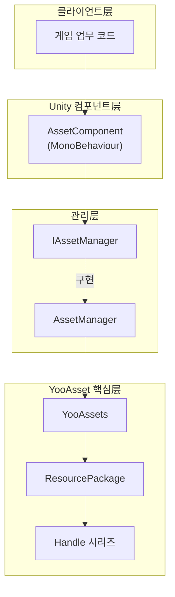
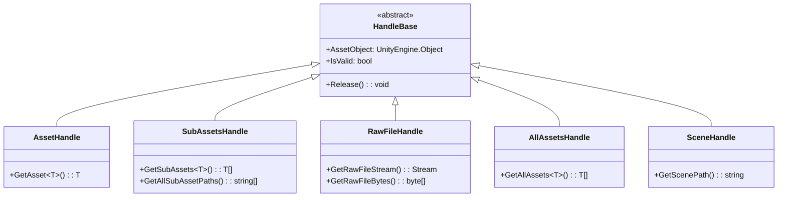
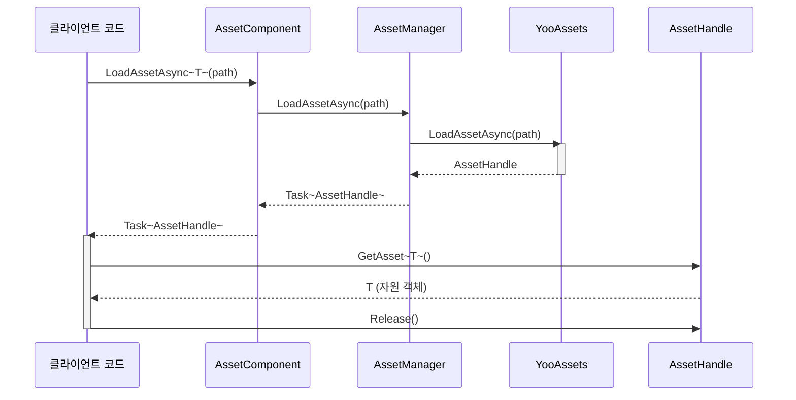

# 자원 로드 인터페이스

자원 로드 인터페이스는 GameFrameX Asset 모듈의 핵심 API로,统一된 자원 로드 및 관리 솔루션을 제공합니다. 이 인터페이스는 YooAsset 라이브러리에 기반하여 구축되었으며, 동기/비동기 로드, 자원 패키지 관리, 장면 로드 등 다양한 자원 조작을 지원합니다.

## 개요

`IAssetManager` 인터페이스는 자원 컴포넌트의 모든 로드 기능을 정의하며, 다음 핵심 능력을 포함합니다:

- **다양한 자원 로드 방식**: 동기 및 비동기 두 가지 로드 모드 지원
- **풍부한 자원 타입**: 일반 자원, 서브 자원, 네이티브 파일, 장면 등 다양한 타입 지원
- **자원 패키지 관리**: 여러 자원 패키지 생성, 획득, 전환 지원
- **자원 생명주기 관리**: 자원 해제, 정리, 회수 등 완전한 관리 능력 제공

자원 로드 인터페이스는 Handle 모드를 채택하여 자원 생명주기를 관리하며, 모든 로드 조작은 대응하는 Handle 객체를 반환하며, Handle 객체를 통해 로드된 자원을 획득하고 해제 조작을 수행할 수 있습니다.

> Source: [IAssetManager.cs](https://github.com/GameFrameX/com.gameframex.unity.asset/blob/main/Runtime/Asset/IAssetManager.cs#L1-L519)

## 아키텍처 설계

자원 로드 시스템은分层 아키텍처 설계를 채택하였으며, 핵심 컴포넌트는 다음과 같습니다:



**아키텍처 설명:**

- **클라이언트层**: 게임 업무 코드는 `AssetComponent` 또는 `IAssetManager` 인터페이스를 통해 자원 기능 호출
- **Unity 컴포넌트层**: `AssetComponent`는 GameObject에 Attach된 MonoBehaviour 컴포넌트로, 컴포넌트 방식의 접근 제공
- **관리层**: `AssetManager`는 `IAssetManager` 인터페이스를 구현한 핵심 자원 관리자
- **YooAsset 핵심层**: 실제 자원 로드는 YooAsset이 완료하며, 다양한 Handle 객체를 반환하여 자원 관리

### Handle 객체 체계

자원 로드가 반환하는 Handle 객체는 자원 관리의 핵심입니다:



> Handle 타입 정의는 YooAsset 라이브러리에서 왔으며, 상세는 [YooAsset 공식 문서](https://www.yooasset.com/)를 참조하세요.

## 핵심 로드 API

### 비동기 로드 자원

비동기 로드는 권장되는 주요 로드 방식으로, 메인 스레드를 차단하지 않습니다.

```csharp
/// <summary>
/// 비동기 자원 로드
/// </summary>
/// <param name="path">자원 경로</param>
/// <typeparam name="T">자원 타입</typeparam>
/// <returns>AssetHandle 객체를 포함하는 Task 반환</returns>
Task<AssetHandle> LoadAssetAsync<T>(string path) where T : UnityEngine.Object;
```

> Source: [IAssetManager.cs](https://github.com/GameFrameX/com.gameframex.unity.asset/blob/main/Runtime/Asset/IAssetManager.cs#L234)

**사용 예시:**

```csharp
// AssetComponent를 통해 Prefab 비동기 로드
var handle = await assetComponent.LoadAssetAsync<GameObject>("Prefabs/Player");
GameObject player = handle.GetAsset<GameObject>();
// 사용 완료 후 자원 해제
handle.Release();
```

> Source: [AssetComponent.cs](https://github.com/GameFrameX/com.gameframex.unity.asset/blob/main/Runtime/Asset/AssetComponent.cs#L258-L261)

### 동기 로드 자원

동기 로드는 즉시 자원을 반환하지만, 로드 과정에서 메인 스레드를 차단하므로 신중하게 사용해야 합니다.

```csharp
/// <summary>
/// 동기 자원 로드
/// </summary>
/// <param name="path">자원 경로</param>
/// <returns>AssetHandle 객체 반환</returns>
AssetHandle LoadAssetSync<T>(string path) where T : UnityEngine.Object;
```

> Source: [IAssetManager.cs](https://github.com/GameFrameX/com.gameframex.unity.asset/blob/main/Runtime/Asset/IAssetManager.cs#L365)

**사용 예시:**

```csharp
// 동기 Sprite 로드
var handle = assetManager.LoadAssetSync<Sprite>("UI/Sprites/Icon");
Sprite sprite = handle.GetAsset<Sprite>();
handle.Release();
```

> Source: [AssetManager.cs](https://github.com/GameFrameX/com.gameframex.unity.asset/blob/main/Runtime/Asset/AssetManager.cs#L603-L606)

### 서브 자원 로드

서브 자원 로드는 하나의 자원 패키지 내의 모든 서브 자원을 획득하는 데 사용됩니다 (예: Atlas의 모든 Sprite).

```csharp
/// <summary>
/// 비동기 서브 자원 객체 로드
/// </summary>
/// <param name="path">자원 경로</param>
/// <typeparam name="T">자원 타입</typeparam>
Task<SubAssetsHandle> LoadSubAssetsAsync<T>(string path) where T : UnityEngine.Object;
```

> Source: [IAssetManager.cs](https://github.com/GameFrameX/com.gameframex.unity.asset/blob/main/Runtime/Asset/IAssetManager.cs#L134)

**사용 예시:**

```csharp
// Atlas의 모든 Sprite 로드
var handle = await assetComponent.LoadSubAssetsAsync<Sprite>("Atlas/UI/MainAtlas");
Sprite[] sprites = handle.GetSubAssets<Sprite>();
foreach (var sprite in sprites)
{
    Debug.Log($"Sprite: {sprite.name}");
}
handle.Release();
```

> Source: [AssetComponent.cs](https://github.com/GameFrameX/com.gameframex.unity.asset/blob/main/Runtime/Asset/AssetComponent.cs#L128-L131)

### 네이티브 파일 로드

네이티브 파일 로드는 Unity 자원 타입이 아닌 원본 파일(예: 구성 파일, 텍스트 파일 등)을 로드하는 데 사용됩니다.

```csharp
/// <summary>
/// 비동기 네이티브 파일 로드
/// </summary>
/// <param name="path">자원 경로</param>
Task<RawFileHandle> LoadRawFileAsync(string path);
```

> Source: [IAssetManager.cs](https://github.com/GameFrameX/com.gameframex.unity.asset/blob/main/Runtime/Asset/IAssetManager.cs#L183)

**사용 예시:**

```csharp
// JSON 구성 파일 로드
var handle = await assetComponent.LoadRawFileAsync("Config/GameConfig.json");
string json = System.Text.Encoding.UTF8.GetString(handle.GetRawFileBytes());
handle.Release();
```

> Source: [AssetComponent.cs](https://github.com/GameFrameX/com.gameframex.unity.asset/blob/main/Runtime/Asset/AssetComponent.cs#L192-L195)

### 모든 자원 로드

지정된 자원 패키지 내의 모든 자원 객체를 로드합니다.

```csharp
/// <summary>
/// 비동기 자원 패키지 내의 모든 자원 객체 로드
/// </summary>
/// <param name="path">자원 위치 주소</param>
Task<AllAssetsHandle> LoadAllAssetsAsync(string path);
```

> Source: [IAssetManager.cs](https://github.com/GameFrameX/com.gameframex.unity.asset/blob/main/Runtime/Asset/IAssetManager.cs#L267)

**사용 예시:**

```csharp
// 특정 디렉터리의 모든 Prefab 로드
var handle = await assetComponent.LoadAllAssetsAsync<GameObject>("Prefabs/Enemies");
GameObject[] enemies = handle.GetAllAssets<GameObject>();
handle.Release();
```

> Source: [AssetComponent.cs](https://github.com/GameFrameX/com.gameframex.unity.asset/blob/main/Runtime/Asset/AssetComponent.cs#L292-L295)

### 장면 로드

Unity 장면을 비동기 로드합니다.

```csharp
/// <summary>
/// 비동기 장면 로드
/// </summary>
/// <param name="path">자원 경로</param>
/// <param name="sceneMode">장면 모드</param>
/// <param name="activateOnLoad">로드 완료 시 자동 활성화 여부</param>
Task<SceneHandle> LoadSceneAsync(string path, LoadSceneMode sceneMode, bool activateOnLoad = true);
```

> Source: [IAssetManager.cs](https://github.com/GameFrameX/com.gameframex.unity.asset/blob/main/Runtime/Asset/IAssetManager.cs#L379)

**사용 예시:**

```csharp
// 비동기 장면 로드 및 활성화
var handle = await assetComponent.LoadSceneAsync("Scenes/Game", LoadSceneMode.Single);
Debug.Log("장면 로드 완료");
// 수동 활성화가 필요한 경우:
// handle.Activate();
```

> Source: [AssetComponent.cs](https://github.com/GameFrameX/com.gameframex.unity.asset/blob/main/Runtime/Asset/AssetComponent.cs#L443-L446)

## 자원 관리 API

### 자원 패키지 관리

자원 패키지(ResourcePackage)는 자원 관리의 기본 단위로, 여러 개의 독립적인 자원 패키지를 생성할 수 있습니다.

```csharp
/// <summary>
/// 자원 패키지 생성
/// </summary>
ResourcePackage CreateAssetsPackage(string packageName);

/// <summary>
/// 자원 패키지 획득 시도
/// </summary>
ResourcePackage TryGetAssetsPackage(string packageName);

/// <summary>
/// 자원 패키지 존재 여부 확인
/// </summary>
bool HasAssetsPackage(string packageName);

/// <summary>
/// 자원 패키지 획득
/// </summary>
ResourcePackage GetAssetsPackage(string packageName);

/// <summary>
/// 기본 자원 패키지 설정
/// </summary>
void SetDefaultAssetsPackage(ResourcePackage resourcePackage);
```

> Source: [IAssetManager.cs](https://github.com/GameFrameX/com.gameframex.unity.asset/blob/main/Runtime/Asset/IAssetManager.cs#L393-L481)

### 자원 해제 및 정리

```csharp
/// <summary>
/// 자원 해제
/// </summary>
void UnloadAsset(string assetPath);
void UnloadAsset(string packageName, string assetPath);

/// <summary>
/// 미사용 자원 해제
/// </summary>
void UnloadUnusedAssetsAsync(string packageName = null);

/// <summary>
/// 미사용 자원 정리
/// </summary>
void ClearUnusedBundleFilesAsync(string packageName = null);

/// <summary>
/// 모든 자원 정리
/// </summary>
void ClearAllBundleFilesAsync(string packageName = null);

/// <summary>
/// 모든 자원 강제 회수
/// </summary>
void UnloadAllAssetsAsync(string packageName = null);
```

> Source: [IAssetManager.cs](https://github.com/GameFrameX/com.gameframex.unity.asset/blob/main/Runtime/Asset/IAssetManager.cs#L107-L509)

### 자원 정보 조회

```csharp
/// <summary>
/// 다운로드 필요 여부 (자원이 원격 서버에 있는지 여부)
/// </summary>
bool IsNeedDownload(AssetInfo assetInfo);
bool IsNeedDownload(string path);

/// <summary>
/// 자원 정보 획득
/// </summary>
AssetInfo[] GetAssetInfos(string[] assetTags);
AssetInfo[] GetAssetInfos(string assetTag);
AssetInfo GetAssetInfo(string path);

/// <summary>
/// 지정된 자원 경로가 유효한지 확인
/// </summary>
bool HasAssetPath(string assetPath);
```

> Source: [IAssetManager.cs](https://github.com/GameFrameX/com.gameframex.unity.asset/blob/main/Runtime/Asset/IAssetManager.cs#L429-L481)

## 초기화 및 설정

### 자원 시스템 초기화

자원 로드 기능 사용 전 반드시 자원 시스템을 초기화해야 합니다.

```csharp
/// <summary>
/// 초기화
/// </summary>
void Initialize();
```

> Source: [IAssetManager.cs](https://github.com/GameFrameX/com.gameframex.unity.asset/blob/main/Runtime/Asset/IAssetManager.cs#L89)

초기화 조작은 `AssetComponent`가 Start 단계에서 자동으로 호출하며, 일반적으로 수동 호출이 필요하지 않습니다.

### 자원 패키지 초기화

```csharp
/// <summary>
/// 비동기 초기화 조작
/// </summary>
Task<bool> InitPackageAsync(
    string packageName, 
    string hostServerURL, 
    string fallbackHostServerURL, 
    bool isDefaultPackage = true
);
```

> Source: [IAssetManager.cs](https://github.com/GameFrameX/com.gameframex.unity.asset/blob/main/Runtime/Asset/IAssetManager.cs#L100)

**사용 예시:**

```csharp
// AssetComponent에서 자원 패키지 초기화
bool success = await assetComponent.InitPackageAsync(
    "DefaultPackage",                    // 패키지 이름
    "https://cdn.example.com/assets",   // 메인 핫 업데이트 서버 주소
    "https://backup.example.com/assets", // 백업 서버 주소
    true                                 // 기본 패키지로 설정
);

if (success)
{
    Debug.Log("자원 패키지 초기화 성공");
}
```

> Source: [AssetComponent.cs](https://github.com/GameFrameX/com.gameframex.unity.asset/blob/main/Runtime/Asset/AssetComponent.cs#L80-L95)

### 설정 속성

```csharp
/// <summary>
/// 동시 다운로드 최대 수
/// </summary>
int DownloadingMaxNum { get; set; }

/// <summary>
/// 실패 재시도 최대 수
/// </summary>
int FailedTryAgain { get; set; }

/// <summary>
/// 자원 읽기 전용 영역 경로 획득
/// </summary>
string ReadOnlyPath { get; }

/// <summary>
/// 자원 읽기 쓰기 영역 경로 획득
/// </summary>
string ReadWritePath { get; }

/// <summary>
/// 실행 모드 획득 또는 설정
/// </summary>
EPlayMode PlayMode { get; }

/// <summary>
/// 다운로드 파일 검증 등급 획득 또는 설정
/// </summary>
EFileVerifyLevel VerifyLevel { get; set; }
```

> Source: [IAssetManager.cs](https://github.com/GameFrameX/com.gameframex.unity.asset/blob/main/Runtime/Asset/IAssetManager.cs#L15-L75)

### 실행 모드

시스템은 `EPlayMode` 열거형으로 정의된 네 가지 실행 모드를 지원합니다:

| 모드 | 설명 | 사용 시나리오 |
|------|------|----------|
| `EditorSimulateMode` | 편집기 모의 모드 | 개발 단계,打包 없이 테스트 가능 |
| `OfflinePlayMode` |单机 실행 모드 | 순수 로컬 자원, 핫 업데이트 지원 안 함 |
| `HostPlayMode` |联机 실행 모드 | 핫 업데이트가 필요한 공식 환경 |
| `WebPlayMode` | WebGL 실행 모드 | WebGL 플랫폼 전용 |

> 실행 모드详细介绍는 [실행 모드](./6-configuration.play-modes)를 참조하세요.

```csharp
/// <summary>
/// 실행 모드 설정
/// </summary>
void SetPlayMode(EPlayMode playMode);
```

> Source: [IAssetManager.cs](https://github.com/GameFrameX/com.gameframex.unity.asset/blob/main/Runtime/Asset/IAssetManager.cs#L82)

## 로드 흐름

### 전형적인 비동기 로드 흐름



### 완전한 사용 예시

```csharp
using UnityEngine;
using System;
using System.Threading.Tasks;
using YooAssets;
using GameFrameX.Asset.Runtime;

public class ResourceLoaderExample : MonoBehaviour
{
    private AssetComponent _assetComponent;
    
    async void Start()
    {
        // AssetComponent 획득
        _assetComponent = GetComponent<AssetComponent>();
        
        // 자원 패키지 초기화 (일반적으로 시작 화면에서 완료)
        await InitializePackages();
        
        // 예시 1: 단일 자원 비동기 로드
        await LoadSingleAssetAsync();
        
        // 예시 2: 서브 자원 로드 (Atlas)
        await LoadSubAssetsAsync();
        
        // 예시 3: 장면 로드
        await LoadSceneAsync();
    }
    
    async Task InitializePackages()
    {
        bool success = await _assetComponent.InitPackageAsync(
            "DefaultPackage",
            "https://cdn.example.com/assets",
            "https://backup.example.com/assets",
            true
        );
        Debug.Log($"자원 패키지 초기화: {(success ? "성공" : "실패")}");
    }
    
    async Task LoadSingleAssetAsync()
    {
        // Prefab 로드
        var handle = await _assetComponent.LoadAssetAsync<GameObject>("Prefabs/Player");
        if (handle.IsValid())
        {
            GameObject player = handle.GetAsset<GameObject>();
            Instantiate(player);
            Debug.Log($"Prefab 로드 성공: {player.name}");
            
            // 사용 완료 후 반드시 해제
            handle.Release();
        }
    }
    
    async Task LoadSubAssetsAsync()
    {
        // Atlas의 모든 Sprite 로드
        var handle = await _assetComponent.LoadSubAssetsAsync<Sprite>("Atlas/UI/MainUI");
        if (handle.IsValid())
        {
            var sprites = handle.GetSubAssets<Sprite>();
            Debug.Log($"Sprite {sprites.Length}개 로드됨");
            
            foreach (var sprite in sprites)
            {
                Debug.Log($"  - {sprite.name}");
            }
            
            handle.Release();
        }
    }
    
    async Task LoadSceneAsync()
    {
        // 게임 장면 로드
        var handle = await _assetComponent.LoadSceneAsync(
            "Scenes/GameMain", 
            UnityEngine.SceneManagement.LoadSceneMode.Single,
            true
        );
        
        if (handle.IsValid())
        {
            Debug.Log("장면 로드 성공");
        }
    }
}
```

> Source: [AssetManager.cs](https://github.com/GameFrameX/com.gameframex.unity.asset/blob/main/Runtime/Asset/AssetManager.cs#L1-L829)

## API 참고

### 초기화 메서드

#### `Initialize(): void`

자원 시스템을 초기화합니다. 일반적으로 `AssetComponent`가 시작 시 자동으로 호출합니다.

#### `InitPackageAsync(packageName, hostServerURL, fallbackHostServerURL, isDefaultPackage): Task<bool>`

비동기 자원 패키지 초기화.

**파라미터:**
- `packageName` (string): 자원 패키지 이름
- `hostServerURL` (string): 메인 핫 업데이트 서버 주소
- `fallbackHostServerURL` (string): 백업 핫 업데이트 서버 주소
- `isDefaultPackage` (bool, 선택): 기본 패키지로 설정 여부, 기본값 true

**반환:** 초기화 성공 여부

### 비동기 로드 메서드

#### `LoadAssetAsync<T>(path): Task<AssetHandle>`

비동기 단일 자원 로드.

**파라미터:**
- `path` (string): 자원 경로
- `T`: 자원 타입 (제네릭 파라미터)

**반환:** AssetHandle을 포함하는 Task

#### `LoadSubAssetsAsync<T>(path): Task<SubAssetsHandle>`

비동기 서브 자원 로드.

#### `LoadRawFileAsync(path): Task<RawFileHandle>`

비동기 네이티브 파일 로드.

#### `LoadAllAssetsAsync(path): Task<AllAssetsHandle>`

비동기 자원 패키지 내의 모든 자원 객체 로드.

#### `LoadSceneAsync(path, sceneMode, activateOnLoad): Task<SceneHandle>`

비동기 장면 로드.

### 동기 로드 메서드

동기 로드 메서드는 비동기 메서드에 대응하지만 즉시 결과를 반환합니다:
- `LoadAssetSync<T>(path): AssetHandle`
- `LoadSubAssetSync<T>(path): SubAssetsHandle`
- `LoadRawFileSync(path): RawFileHandle`
- `LoadAllAssetsSync<T>(path): AllAssetsHandle`

### 자원 관리 메서드

| 메서드 | 설명 |
|------|------|
| `CreateAssetsPackage(name)` | 자원 패키지 생성 |
| `GetAssetsPackage(name)` | 자원 패키지 획득 |
| `HasAssetsPackage(name)` | 자원 패키지 존재 여부 확인 |
| `SetDefaultAssetsPackage(package)` | 기본 자원 패키지 설정 |
| `UnloadAsset(path)` | 지정 자원 언로드 |
| `UnloadUnusedAssetsAsync()` | 비동기 미사용 자원 언로드 |
| `ClearUnusedBundleFilesAsync()` | 미사용 자원 패키지 파일 정리 |
| `UnloadAllAssetsAsync()` | 모든 자원 강제 회수 |

### 조회 메서드

| 메서드 | 설명 |
|------|------|
| `IsNeedDownload(path)` | 자원 다운로드 필요 여부 확인 |
| `GetAssetInfo(path)` | 자원 정보 획득 |
| `GetAssetInfos(tag)` | 태그별로 자원 정보 목록 획득 |
| `HasAssetPath(path)` | 자원 경로가 유효한지 확인 |

## 모범 사례

### 1. 비동기 로드 사용

우선 비동기 로드 메서드를 사용하여 메인 스레드 차단을 피하고 게임 프레임률에 영향 주는 것을 방지합니다:

```csharp
// ✅ 권장: 비동기 로드
var handle = await assetComponent.LoadAssetAsync<GameObject>("Prefabs/Player");

// ⚠️ 주의: 동기 로드
var handle = assetManager.LoadAssetSync<GameObject>("Prefabs/Player");
```

### 2. 제때 자원 해제

자원 사용 후 반드시 Release()를 호출하여 해제하여 메모리 누수를 방지합니다:

```csharp
var handle = await assetComponent.LoadAssetAsync<GameObject>("Prefabs/Player");
GameObject obj = handle.GetAsset<GameObject>();
// ... 자원 객체 사용
handle.Release(); // 자원 해제
```

### 3. try-finally를 사용하여 해제 보장

try-finally를 사용하여 자원이 반드시 해제되도록 보장합니다:

```csharp
var handle = await assetComponent.LoadAssetAsync<GameObject>("Prefabs/Player");
try
{
    GameObject obj = handle.GetAsset<GameObject>();
    // 자원 사용
}
finally
{
    handle.Release();
}
```

### 4. 합리적으로 자원 패키지 사용

게임 구조에 따라 자원 패키지를 합리적으로 구분합니다:

```csharp
// UI 자원 패키지 생성
var uiPackage = assetManager.CreateAssetsPackage("UI");
// 기본 패키지로 설정
assetManager.SetDefaultAssetsPackage(uiPackage);
```

### 5. 자원 유효성 확인

자원 획득 전 Handle 유효성을 확인합니다:

```csharp
var handle = await assetComponent.LoadAssetAsync<GameObject>("Prefabs/Player");
if (handle.IsValid())
{
    GameObject obj = handle.GetAsset<GameObject>();
    // 자원 사용
}
else
{
    Debug.LogError("자원 로드 실패");
}
handle.Release();
```

## 관련 링크

- [자원 컴포넌트](./4-core-concepts.asset-component) - Unity 컴포넌트 방식으로 자원 접근
- [자원 관리자](./4-core-concepts.asset-manager) - 자원 관리자 핵심 구현
- [실행 모드](./6-configuration.play-modes) - 네 가지 실행 모드 상세
- [자원 패키지 관리](./5-api-reference.package-management) - 자원 패키지 관리 API
- [업데이트 이벤트](./5-api-reference.update-events) - 자원 업데이트 이벤트
- [YooAsset 공식 문서](https://www.yooasset.com/)