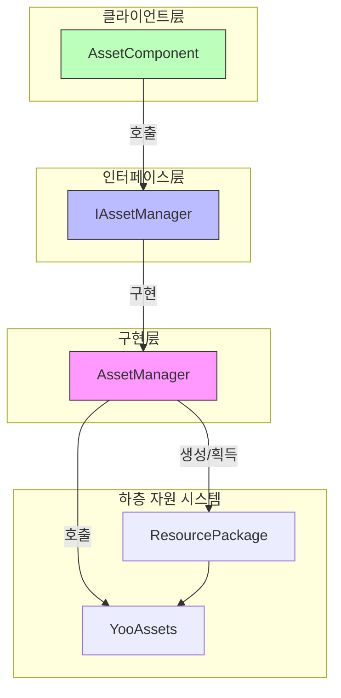
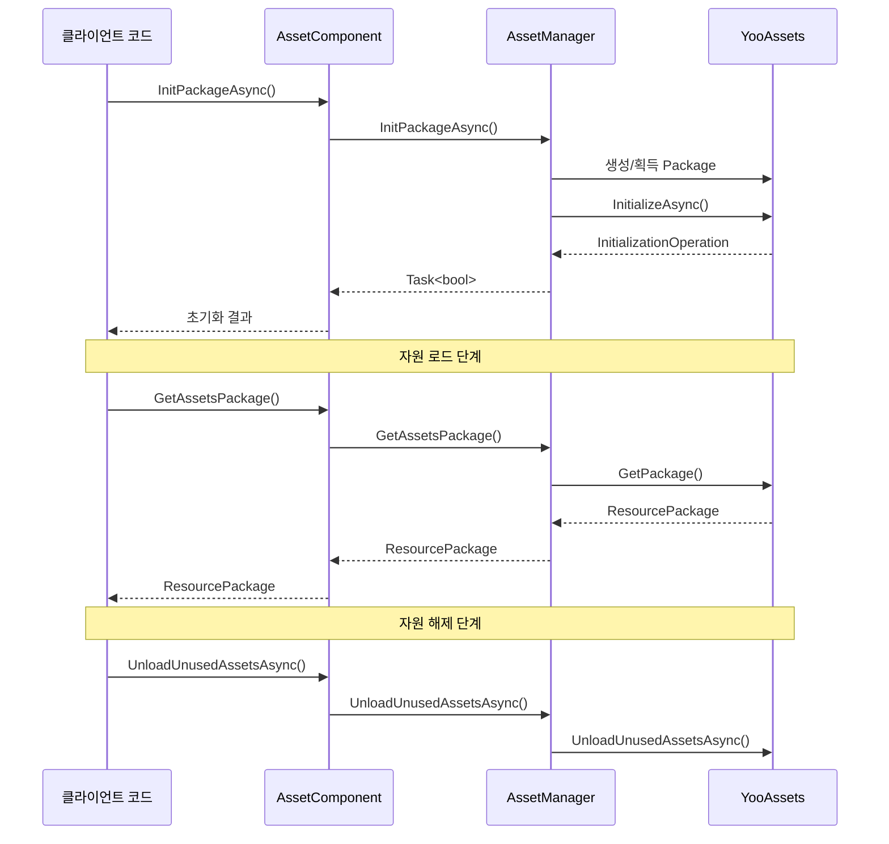

# 자원 패키지 관리

자원 패키지 관리 API는 자원 패키지(ResourcePackage)의 완전한 생명주기 관리 능력을 제공하며,包的 생성, 초기화, 획득, 언로드 등의 조작을 포함합니다. 이 모듈은 YooAssets 라이브러리에 기반하여 구축되었으며, GameFrameX에 통일되고 강력한 자원 패키지 관리 기능을 제공합니다.

## 개요

자원 패키지(ResourcePackage)는 GameFrameX 자원 시스템에서 자원을 구성하고 관리하는 핵심 개념입니다. 각 자원 패키지는 독립적인 자원 집합을 나타내며, 자체 다운로드 주소, 초기화 방식 및 자원 로드 규칙을 가질 수 있습니다. 자원 패키지 관리 API를 통해 개발자는 다음과 같은 작업을 수행할 수 있습니다:

- 여러 개의 독립적인 자원 패키지를 생성하여 자원의 모듈化管理實現
- 각 자원 패키지에 대해 다른 원격 서버 주소 구성
- 기본 자원 패키지를 설정하여 로드 인터페이스 사용 간소화
- 자원의 로드 및 언로드 타이밍을 유연하게 제어

시스템은 여러 자원 패키지를 동시에 관리하는 것을 지원하지만,同一 시간에는 하나의 기본 패키지만 설정할 수 있습니다. 기본 패키지는 간소화된 로드 인터페이스를 사용할 수 있으며, 패키지 이름을 명시적으로指定할 필요가 없습니다.

> 참고: 기본 자원 패키지 이름은 `DefaultPackage`이며, `AssetManager.ConstDefaultPackageName` 상수에 정의되어 있습니다.

## 아키텍처

자원 패키지 관리는 전형적인分层 설계 모드를 채택하였으며, 인터페이스 추상을 통해 하층 YooAssets의 캡슐화를実現합니다:



**컴포넌트 설명:**

| 컴포넌트 | 책임 |
|------|------|
| AssetComponent | Unity 컴포넌트层, 공개 API 인터페이스 제공 |
| IAssetManager | 자원 관리의 추상 인터페이스 정의 |
| AssetManager | 구체적인 구현 클래스, YooAssets와의 상호작용 담당 |
| ResourcePackage | YooAssets의 자원 패키지 객체 |

## 핵심 기능

### 자원 패키지 초기화

자원 패키지는 사용 전에 반드시 초기화해야 합니다. 초기화 과정은 실행 모드(PlayMode)에 따라 서로 다른 파일 시스템을 구성하고, 필요한 경우 원격 서버에 연결합니다.

#### 비동기 자원 패키지 초기화

```csharp
public async Task<bool> InitPackageAsync(string packageName, string host, string fallbackHostServer, bool isDefaultPackage = false)
```

> Source: [AssetComponent.cs](https://github.com/GameFrameX/com.gameframex.unity.asset/blob/main/Runtime/Asset/AssetComponent.cs#L80-L95)

**파라미터 설명:**
- `packageName` (string): 자원 패키지 이름, 이 패키지를 식별하고 획득하는 데 사용
- `host` (string): 메인 다운로드 주소, 원격 자원 다운로드에 사용
- `fallbackHostServer` (string): 백업 다운로드 주소, 메인 주소가 사용 불가능할 때 사용
- `isDefaultPackage` (bool): 기본 패키지로 설정 여부, 기본값 false

**반환값:** 
- `Task<bool>`: 초기화 성공 여부

**사용 예시:**

```csharp
var assetComponent = GameEntry.GetComponent<AssetComponent>();
bool success = await assetComponent.InitPackageAsync(
    "MyPackage", 
    "https://cdn.example.com/assets", 
    "https://backup.example.com/assets", 
    true
);
```

초기화 과정은 현재 설정된 실행 모드(EPlayMode)에 따라 서로 다른 초기화 전략을 선택합니다:

- **EditorSimulateMode**: 편집기 모의 모드, 편집기 내 모의 자원 사용
- **OfflinePlayMode**:单机 실행 모드, 내장 자원만 사용
- **HostPlayMode**:联机 실행 모드, 원격 자원 다운로드 및 핫 업데이트 지원
- **WebPlayMode**: WebGL 실행 모드, Web 플랫폼 최적화

> 실행 모드의 상세한 설명은 [실행 모드](./6-configuration.play-modes) 문서를 참조하세요.

### 자원 패키지 생성 및 획득

#### 자원 패키지 생성

```csharp
public ResourcePackage CreateAssetsPackage(string packageName)
```

> Source: [AssetComponent.cs](https://github.com/GameFrameX/com.gameframex.unity.asset/blob/main/Runtime/Asset/AssetComponent.cs#L471-L474)

새로운 자원 패키지를 생성합니다. 패키가 이미 존재하면 기존 패키지 인스턴스를 반환합니다.

**파라미터:**
- `packageName` (string): 자원 패키지 이름

**반환값:**
- ResourcePackage: 생성된 자원 패키지 객체

#### 자원 패키지 획득 시도

```csharp
public ResourcePackage TryGetAssetsPackage(string packageName)
```

> Source: [AssetComponent.cs](https://github.com/GameFrameX/com.gameframex.unity.asset/blob/main/Runtime/Asset/AssetComponent.cs#L482-L485)

안전하게 자원 패키지를 획득하며, 패키지가 존재하지 않으면 null을 반환하며 예외를 발생시키지 않습니다.

**파라미터:**
- `packageName` (string): 자원 패키지 이름

**반환값:**
- ResourcePackage: 자원 패키지 객체, 존재하지 않으면 null 반환

#### 자원 패키지 존재 여부 확인

```csharp
public bool HasAssetsPackage(string packageName)
```

> Source: [AssetComponent.cs](https://github.com/GameFrameX/com.gameframex.unity.asset/blob/main/Runtime/Asset/AssetComponent.cs#L493-L496)

지정된 이름의 자원 패키지가 이미 생성되었는지 확인합니다.

**파라미터:**
- `packageName` (string): 자원 패키지 이름

**반환값:**
- bool: 존재 여부

#### 자원 패키지 획득

```csharp
public ResourcePackage GetAssetsPackage(string packageName)
```

> Source: [AssetComponent.cs](https://github.com/GameFrameX/com.gameframex.unity.asset/blob/main/Runtime/Asset/AssetComponent.cs#L504-L507)

지정된 이름의 자원 패키지를 획득합니다. 패키가 존재하지 않으면 예외를 발생시킵니다.

**파라미터:**
- `packageName` (string): 자원 패키지 이름

**반환값:**
- ResourcePackage: 자원 패키지 객체

### 기본 자원 패키지

#### 기본 자원 패키지 설정

```csharp
public void SetDefaultAssetsPackage(ResourcePackage assetsPackage)
```

> Source: [AssetComponent.cs](https://github.com/GameFrameX/com.gameframex.unity.asset/blob/main/Runtime/Asset/AssetComponent.cs#L581-L584)

기본 자원 패키지를 설정합니다. 설정 후 자원 로드 시 패키지 이름을 명시적으로 지정할 필요가 없으며, 시스템이 자동으로 기본 패키지에서 로드합니다.

**파라미터:**
- `assetsPackage` (ResourcePackage): 기본으로 설정할 자원 패키지

**사용 예시:**

```csharp
var assetComponent = GameEntry.GetComponent<AssetComponent>();
var package = assetComponent.GetAssetsPackage("MyPackage");
assetComponent.SetDefaultAssetsPackage(package);
// 이후 간소화된 로드 인터페이스 사용 가능
var handle = await assetComponent.LoadAssetAsync("Prefabs/Player");
```

## 자원 해제 및 정리

GameFrameX는 다양한 시나리오 요구를 충족하기 위해 다층의 자원 해제 및 정리 메커니즘을 제공합니다.

### 단일 자원 언로드

```csharp
public void UnloadAsset(string assetPath)
public void UnloadAsset(string packageName, string assetPath)
```

> Source: [AssetComponent.cs](https://github.com/GameFrameX/com.gameframex.unity.asset/blob/main/Runtime/Asset/AssetComponent.cs#L602-L615)

지정된 경로의 자원을 언로드합니다.

**파라미터:**
- `packageName` (string): 자원 패키지 이름 (선택, 지정하지 않으면 기본 패키지 사용)
- `assetPath` (string): 자원 경로

### 모든 자원 강제 회수

```csharp
public void UnloadAllAssetsAsync(string packageName)
```

> Source: [AssetComponent.cs](https://github.com/GameFrameX/com.gameframex.unity.asset/blob/main/Runtime/Asset/AssetComponent.cs#L591-L594)

지정된 자원 패키지의 모든 로드된 자원을 강제로 회수합니다. 이 조작은 즉시 모든 자원 메모리를 해제하며 신중하게 사용해야 합니다.

**파라미터:**
- `packageName` (string): 자원 패키지 이름

### 미사용 자원 언로드

```csharp
public void UnloadUnusedAssetsAsync(string packageName = null)
```

> Source: [AssetComponent.cs](https://github.com/GameFrameX/com.gameframex.unity.asset/blob/main/Runtime/Asset/AssetComponent.cs#L635-L638)

참조되지 않는 자원을 언로드합니다. 이는 권장되는 자원 해제 방식으로, 시스템이 자동으로 더 이상 사용되지 않는 자원을 인식하여 해제합니다.

**파라미터:**
- `packageName` (string): 자원 패키지 이름, null이면 기본 패키지 정리

### 자원 파일 정리

```csharp
public void ClearAllBundleFilesAsync(string packageName = null)
public void ClearUnusedBundleFilesAsync(string packageName = null)
```

> Source: [AssetComponent.cs](https://github.com/GameFrameX/com.gameframex.unity.asset/blob/main/Runtime/Asset/AssetComponent.cs#L645-L658)

로컬 캐시된 자원 패키지 파일을 정리합니다.

- `ClearAllBundleFilesAsync`: 모든 자원 파일 정리
- `ClearUnusedBundleFilesAsync`: 미사용 자원 파일만 정리

**파라미터:**
- `packageName` (string): 자원 패키지 이름, null이면 기본 패키지 정리

## 사용 흐름

다음은 다중 자원 패키지 시나리오의 전형적인 사용 흐름입니다:



## 전형적인 사용 시나리오

### 시나리오 1: DLC 자원 패키지 관리

게임 배포 후 추가 DLC 내용을 동적으로 로드해야 하는 경우 독립적인 자원 패키지를 사용할 수 있습니다:

```csharp
var assetComponent = GameEntry.GetComponent<AssetComponent>();

// DLC 자원 패키지 초기화
await assetComponent.InitPackageAsync(
    "DLC_LevelPack1",
    "https://cdn.example.com/dlc/levelpack1",
    "https://backup.example.com/dlc/levelpack1"
);

// DLC 패키지 획득 및 자원 로드
var dlcPackage = assetComponent.GetAssetsPackage("DLC_LevelPack1");
assetComponent.SetDefaultAssetsPackage(dlcPackage);

var levelHandle = await assetComponent.LoadAssetAsync<Scene>("Levels/Level01");
```

### 시나리오 2: 자원 핫 업데이트

联机 모드 사용 시 자원 패키지는 핫 업데이트 자원 관리에 사용됩니다:

```csharp
var assetComponent = GameEntry.GetComponent<AssetComponent>();

// 핫 업데이트용 기본 패키지 초기화
bool success = await assetComponent.InitPackageAsync(
    "HotUpdate",
    "https://gamecdn.example.com/hotupdate",
    "https://backup.example.com/hotupdate",
    true
);

if (success)
{
    Debug.Log("핫 업데이트 자원 패키지 초기화 성공");
}
```

### 시나리오 3: 자원 정리

게임 장면 전환 또는 특정 프로세스 진입 시 필요 없는 자원을 정리합니다:

```csharp
var assetComponent = GameEntry.GetComponent<AssetComponent>();

// 미사용 자원 언로드 (권장)
assetComponent.UnloadUnusedAssetsAsync();

// 또는 특정 자원 패키지의 모든 캐시 정리
assetComponent.ClearUnusedBundleFilesAsync("OldDLC");
```

## API 참고

### AssetComponent

| 메서드 | 반환 타입 | 설명 |
|------|----------|------|
| InitPackageAsync | Task\<bool\> | 비동기 자원 패키지 초기화 |
| CreateAssetsPackage | ResourcePackage | 자원 패키지 생성 |
| TryGetAssetsPackage | ResourcePackage | 자원 패키지 획득 시도 (안전) |
| HasAssetsPackage | bool | 자원 패키지 존재 여부 확인 |
| GetAssetsPackage | ResourcePackage | 자원 패키지 획득 |
| SetDefaultAssetsPackage | void | 기본 자원 패키지 설정 |
| UnloadAsset | void | 지정 자원 언로드 |
| UnloadAllAssetsAsync | void | 모든 자원 강제 회수 |
| UnloadUnusedAssetsAsync | void | 미사용 자원 언로드 |
| ClearAllBundleFilesAsync | void | 모든 자원 파일 정리 |
| ClearUnusedBundleFilesAsync | void | 미사용 자원 파일 정리 |

### IAssetManager

| 속성 | 타입 | 설명 |
|------|------|------|
| DefaultPackageName | string | 기본 자원 패키지 이름 |
| PlayMode | EPlayMode | 현재 실행 모드 |
| VerifyLevel | EFileVerifyLevel | 파일 검증 등급 |
| Milliseconds | long | 비동기 시스템 시간 슬라이스 |

> 완전한 인터페이스 정의는 [IAssetManager.cs](https://github.com/GameFrameX/com.gameframex.unity.asset/blob/main/Runtime/Asset/IAssetManager.cs)를 참조하세요.

## 관련 링크

- [자원 로드 인터페이스](./5-api-reference.loading-api) - 패키지에서 자원 로드 방법 알아보기
- [실행 모드](./6-configuration.play-modes) - 서로 다른 실행 모드 구성 알아보기
- [자원 컴포넌트](./4-core-concepts.asset-component) - AssetComponent 컴포넌트 알아보기
- [아키텍처 설계](./4-core-concepts.architecture) - 전체 아키텍처 설계 알아보기