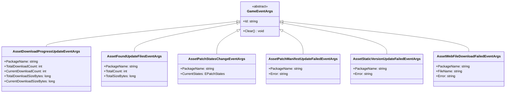
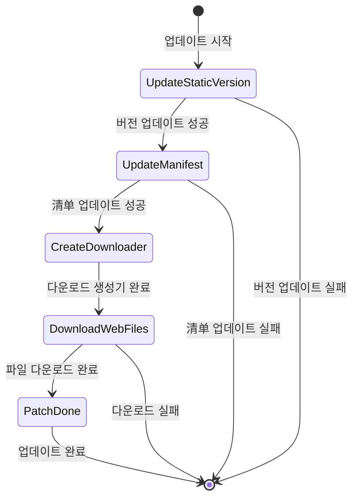

# 업데이트 이벤트

자원 시스템이 제공하는 업데이트 이벤트 메커니즘으로, 개발자가 자원 핫 업데이트 과정에서 주요 노드를 리스닝하고 사용자 정의 로직을 실행할 수 있게 합니다.

## 개요

자원 핫 업데이트 흐름에서 시스템은 현재 업데이트 진행률과 상태를 통지하기 위해 다양한 이벤트를 트리거합니다. 이러한 이벤트는 GameFrameX의 이벤트 시스템에 기반하여 구축되었으며, 发布-구독 모드를 따릅니다. 개발자는 이러한 이벤트를 구독하여 다음을 实现할 수 있습니다:
- 업데이트 진행률 UI 표시
- 다운로드 데이터 통계
- 업데이트 실패 상황 처리
- 사용자 정의 비즈니스 로직 실행

모든 업데이트 이벤트는 `GameEventArgs` 基类를 상속하며, 각 이벤트에는 이벤트订阅 및 배포를 위한 고유한 이벤트 ID(EventId)가 있습니다.

## 이벤트 체계 아키텍처



## 업데이트 흐름 상태

업데이트 흐름은 `EPatchStates` 열거형으로 정의되며, 다섯 가지 상태를 포함합니다:



| 상태 | 설명 |
|------|------|
| UpdateStaticVersion | 정적 자원 버전号 업데이트 |
| UpdateManifest | 패치清单 파일 업데이트 |
| CreateDownloader | 다운로드 생성기 생성 |
| DownloadWebFiles | 원격 파일 다운로드 |
| PatchDone | 패치 흐름 완료 |

## 이벤트 상세 설명

### 다운로드 진행률 업데이트 이벤트 (AssetDownloadProgressUpdateEventArgs)

자원 다운로드 과정에서 실시간으로 트리거되어 현재 다운로드 진행률을 보고합니다.

> Source: [Runtime/Update/EventArgs/AssetDownloadProgressUpdateEventArgs.cs](https://github.com/GameFrameX/com.gameframex.unity.asset/blob/main/Runtime/Update/EventArgs/AssetDownloadProgressUpdateEventArgs.cs#L1-L77)

**이벤트 ID:**
```csharp
public static readonly string EventId = typeof(AssetDownloadProgressUpdateEventArgs).FullName;
```

**속성 설명:**

| 속성 | 타입 | 설명 |
|------|------|------|
| PackageName | string | 자원 패키지 이름 |
| TotalDownloadCount | int | 총 다운로드 수 |
| CurrentDownloadCount | int | 현재 다운로드 완료 수 |
| TotalDownloadSizeBytes | long | 총 다운로드 크기 (바이트) |
| CurrentDownloadSizeBytes | long | 현재 다운로드 완료 크기 (바이트) |

**생성 메서드:**
```csharp
public static AssetDownloadProgressUpdateEventArgs Create(
    string packageName, 
    int totalDownloadCount, 
    int currentDownloadCount, 
    long totalDownloadSizeBytes, 
    long currentDownloadSizeBytes)
```

### 업데이트 파일 발견 이벤트 (AssetFoundUpdateFilesEventArgs)

시스템이 스캔하여 업데이트가 필요한 파일을 발견하면 트리거되며, 업데이트 대기 파일의 통계 정보를 전달합니다.

> Source: [Runtime/Update/EventArgs/AssetFoundUpdateFilesEventArgs.cs](https://github.com/GameFrameX/com.gameframex.unity.asset/blob/main/Runtime/Update/EventArgs/AssetFoundUpdateFilesEventArgs.cs#L1-L60)

**이벤트 ID:**
```csharp
public static readonly string EventId = typeof(AssetFoundUpdateFilesEventArgs).FullName;
```

**속성 설명:**

| 속성 | 타입 | 설명 |
|------|------|------|
| PackageName | string | 자원 패키지 이름 |
| TotalCount | int | 업데이트가 필요한 파일 총 수 |
| TotalSizeBytes | long | 업데이트가 필요한 파일 총 크기 (바이트) |

**생성 메서드:**
```csharp
public static AssetFoundUpdateFilesEventArgs Create(
    string packageName, 
    int totalCount, 
    long totalSizeBytes)
```

### 패치 흐름 상태 변경 이벤트 (AssetPatchStatesChangeEventArgs)

자원 업데이트 흐름이 새로운 상태 단계에 진입하면 트리거되어 현재 업데이트 진행률을 통지합니다.

> Source: [Runtime/Update/EventArgs/AssetPatchStatesChangeEventArgs.cs](https://github.com/GameFrameX/com.gameframex.unity.asset/blob/main/Runtime/Update/EventArgs/AssetPatchStatesChangeEventArgs.cs#L1-L49)

**이벤트 ID:**
```csharp
public static readonly string EventId = typeof(AssetPatchStatesChangeEventArgs).FullName;
```

**속성 설명:**

| 속성 | 타입 | 설명 |
|------|------|------|
| PackageName | string | 자원 패키지 이름 |
| CurrentStates | EPatchStates | 현재 업데이트 상태 |

**생성 메서드:**
```csharp
public static AssetPatchStatesChangeEventArgs Create(
    string packageName, 
    EPatchStates currentStates)
```

### 패치清单 업데이트 실패 이벤트 (AssetPatchManifestUpdateFailedEventArgs)

패치清单 파일 업데이트 실패 시 트리거되며, 오류 정보를 포함합니다.

> Source: [Runtime/Update/EventArgs/AssetPatchManifestUpdateFailedEventArgs.cs](https://github.com/GameFrameX/com.gameframex.unity.asset/blob/main/Runtime/Update/EventArgs/AssetPatchManifestUpdateFailedEventArgs.cs#L1-L52)

**이벤트 ID:**
```csharp
public static readonly string EventId = typeof(AssetPatchManifestUpdateFailedEventArgs).FullName;
```

**속성 설명:**

| 속성 | 타입 | 설명 |
|------|------|------|
| PackageName | string | 자원 패키지 이름 |
| Error | string | 오류 정보 |

**생성 메서드:**
```csharp
public static AssetPatchManifestUpdateFailedEventArgs Create(
    string packageName, 
    string error)
```

### 자원 버전号 업데이트 실패 이벤트 (AssetStaticVersionUpdateFailedEventArgs)

자원 버전号 업데이트 실패 시 트리거되며, 오류 정보를 포함합니다.

> Source: [Runtime/Update/EventArgs/AssetStaticVersionUpdateFailedEventArgs.cs](https://github.com/GameFrameX/com.gameframex.unity.asset/blob/main/Runtime/Update/EventArgs/AssetStaticVersionUpdateFailedEventArgs.cs#L1-L52)

**이벤트 ID:**
```csharp
public static readonly string EventId = typeof(AssetStaticVersionUpdateFailedEventArgs).FullName;
```

**속성 설명:**

| 속성 | 타입 | 설명 |
|------|------|------|
| PackageName | string | 자원 패키지 이름 |
| Error | string | 오류 정보 |

**생성 메서드:**
```csharp
public static AssetStaticVersionUpdateFailedEventArgs Create(
    string packageName, 
    string error)
```

### 네트워크 파일 다운로드 실패 이벤트 (AssetWebFileDownloadFailedEventArgs)

某个 자원 파일 다운로드 실패 시 트리거되며, 파일 이름과 오류 정보를 포함합니다.

> Source: [Runtime/Update/EventArgs/AssetWebFileDownloadFailedEventArgs.cs](https://github.com/GameFrameX/com.gameframex.unity.asset/blob/main/Runtime/Update/EventArgs/AssetWebFileDownloadFailedEventArgs.cs#L1-L60)

**이벤트 ID:**
```csharp
public static readonly string EventId = typeof(AssetWebFileDownloadFailedEventArgs).FullName;
```

**속성 설명:**

| 속성 | 타입 | 설명 |
|------|------|------|
| PackageName | string | 자원 패키지 이름 |
| FileName | string | 다운로드 실패한 파일 이름 |
| Error | string | 오류 정보 |

**생성 메서드:**
```csharp
public static AssetWebFileDownloadFailedEventArgs Create(
    string packageName, 
    string fileName, 
    string error)
```

## 사용 예시

### 업데이트 상태 변화 이벤트 구독

```csharp
// 패치 흐름 상태 변경 이벤트 구독
GameEntry.Event.Subscribe(AssetPatchStatesChangeEventArgs.EventId, OnPatchStatesChange);

private void OnPatchStatesChange(object sender, AssetPatchStatesChangeEventArgs e)
{
    switch (e.CurrentStates)
    {
        case EPatchStates.UpdateStaticVersion:
            Debug.Log("자원 버전号 업데이트 중...");
            break;
        case EPatchStates.UpdateManifest:
            Debug.Log("패치清单 업데이트 중...");
            break;
        case EPatchStates.CreateDownloader:
            Debug.Log("다운로드 생성기 생성 중...");
            break;
        case EPatchStates.DownloadWebFiles:
            Debug.Log("원격 파일 다운로드 중...");
            break;
        case EPatchStates.PatchDone:
            Debug.Log("업데이트 완료!");
            break;
    }
}
```

> Source: [Runtime/Update/EventArgs/AssetPatchStatesChangeEventArgs.cs](https://github.com/GameFrameX/com.gameframex.unity.asset/blob/main/Runtime/Update/EventArgs/AssetPatchStatesChangeEventArgs.cs#L35-L47)

### 다운로드 진행률 업데이트 이벤트 구독

```csharp
// 다운로드 진행률 업데이트 이벤트 구독
GameEntry.Event.Subscribe(AssetDownloadProgressUpdateEventArgs.EventId, OnDownloadProgress);

private void OnDownloadProgress(object sender, AssetDownloadProgressUpdateEventArgs e)
{
    float progress = (float)e.CurrentDownloadCount / e.TotalDownloadCount;
    long downloadedSize = e.CurrentDownloadSizeBytes / 1024 / 1024; // MB
    long totalSize = e.TotalDownloadSizeBytes / 1024 / 1024; // MB
    
    Debug.Log($"다운로드 진행률: {progress * 100:F1}% ({e.CurrentDownloadCount}/{e.TotalDownloadCount}) - {downloadedSize}MB / {totalSize}MB");
}
```

> Source: [Runtime/Update/EventArgs/AssetDownloadProgressUpdateEventArgs.cs](https://github.com/GameFrameX/com.gameframex.unity.asset/blob/main/Runtime/Update/EventArgs/AssetDownloadProgressUpdateEventArgs.cs#L60-L75)

### 업데이트 파일 발견 이벤트 구독

```csharp
// 업데이트 파일 발견 이벤트 구독
GameEntry.Event.Subscribe(AssetFoundUpdateFilesEventArgs.EventId, OnFoundUpdateFiles);

private void OnFoundUpdateFiles(object sender, AssetFoundUpdateFilesEventArgs e)
{
    long totalSizeMB = e.TotalSizeBytes / 1024 / 1024;
    Debug.Log($"업데이트가 필요한 파일 {e.TotalCount}개 발견, 총 크기: {totalSizeMB}MB");
}
```

> Source: [Runtime/Update/EventArgs/AssetFoundUpdateFilesEventArgs.cs](https://github.com/GameFrameX/com.gameframex.unity.asset/blob/main/Runtime/Update/EventArgs/AssetFoundUpdateFilesEventArgs.cs#L44-L58)

### 오류 이벤트 구독

```csharp
// 버전号 업데이트 실패 이벤트 구독
GameEntry.Event.Subscribe(AssetStaticVersionUpdateFailedEventArgs.EventId, OnStaticVersionUpdateFailed);

//清单 업데이트 실패 이벤트 구독
GameEntry.Event.Subscribe(AssetPatchManifestUpdateFailedEventArgs.EventId, OnManifestUpdateFailed);

// 파일 다운로드 실패 이벤트 구독
GameEntry.Event.Subscribe(AssetWebFileDownloadFailedEventArgs.EventId, OnFileDownloadFailed);

private void OnStaticVersionUpdateFailed(object sender, AssetStaticVersionUpdateFailedEventArgs e)
{
    Debug.LogError($"자원 버전号 업데이트 실패: {e.Error}");
    // 여기서 오류 안내 표시 또는 재시도 로직 실행 가능
}

private void OnManifestUpdateFailed(object sender, AssetPatchManifestUpdateFailedEventArgs e)
{
    Debug.LogError($"패치清单 업데이트 실패: {e.Error}");
}

private void OnFileDownloadFailed(object sender, AssetWebFileDownloadFailedEventArgs e)
{
    Debug.LogError($"파일 다운로드 실패: {e.FileName}, 오류: {e.Error}");
}
```

> Sources:
> - [Runtime/Update/EventArgs/AssetStaticVersionUpdateFailedEventArgs.cs](https://github.com/GameFrameX/com.gameframex.unity.asset/blob/main/Runtime/Update/EventArgs/AssetStaticVersionUpdateFailedEventArgs.cs#L38-L50)
> - [Runtime/Update/EventArgs/AssetPatchManifestUpdateFailedEventArgs.cs](https://github.com/GameFrameX/com.gameframex.unity.asset/blob/main/Runtime/Update/EventArgs/AssetPatchManifestUpdateFailedEventArgs.cs#L38-L50)
> - [Runtime/Update/EventArgs/AssetWebFileDownloadFailedEventArgs.cs](https://github.com/GameFrameX/com.gameframex.unity.asset/blob/main/Runtime/Update/EventArgs/AssetWebFileDownloadFailedEventArgs.cs#L44-L58)

## 이벤트 사용 주의 사항

1. **이벤트 구독 타이밍**: 게임 시작 시 또는 자원 시스템 초기화 전에 이벤트를 구독하여 모든 업데이트 이벤트를 놓치지 않도록 하는 것을 권장합니다.

2. **이벤트 구독 취소**: 적절한 타이밍(예: 장면 전환 또는 컴포넌트 파괴 시)에 이벤트 구독을 취소하여 메모리 누수를 방지합니다.

3. **객체 풀 메커니즘**: 모든 이벤트 파라미터 클래스는 객체 풀 모드를 구현하며, `Create` 메서드를 통해 풀에서 인스턴스를 획득하고 사용 후 자동으로 회수됩니다. 개발자는 수동으로 생명주기를 관리할 필요가 없습니다.

4. **오류 처리**: 업데이트 실패 시 적시에 감지하여 대응 처리를 할 수 있도록 오류 타입 이벤트를 구독할 것을強く 권장합니다 (예: 사용자에게 재시도 안내).

5. **진행률 계산**: `AssetDownloadProgressUpdateEventArgs`는 바이트 수준의 다운로드 진행률을 제공하므로 정밀한 다운로드 진행률 표시 구현에 사용할 수 있습니다.

## 관련 링크

- [자원 로드 인터페이스](./5-api-reference.loading-api)
- [자원 패키지 관리](./5-api-reference.package-management)
- [실행 모드](./6-configuration.play-modes)
- [핵심 개념 - 자원 관리자](./4-core-concepts.asset-manager)