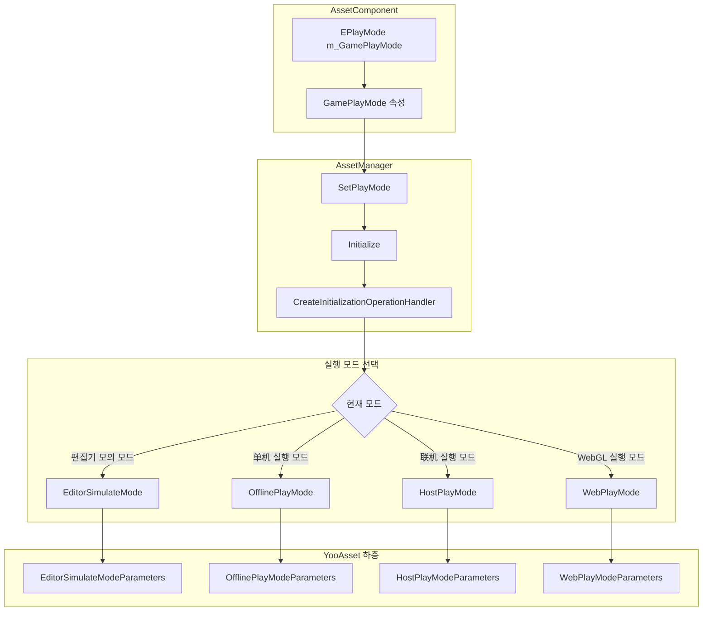
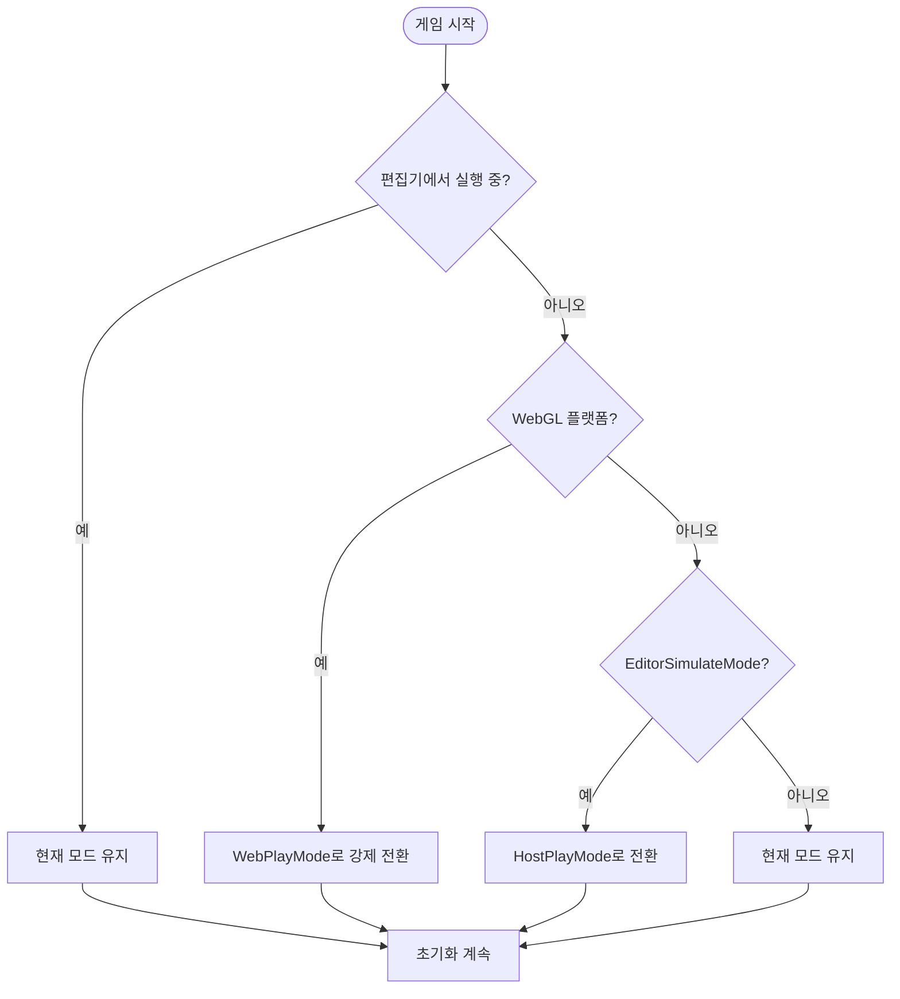

# 실행 모드

실행 모드는 자원系统在游戏启动时如何初始化和加载资源를 정의합니다. 서로 다른 개발 및 배포 시나리오에 따라 GameFrameX는 네 가지 실행 모드를 제공합니다.

## 개요

자원 시스템의 실행 모드는 자원의 로드 방식과 데이터 출처를 결정합니다. 올바른 실행 모드 선택은 게임 개발 및 배포에非常重要합니다:

- **EditorSimulateMode**: Unity 편집기에서만 사용되며,快速 개발 및 디버깅용
- **OfflinePlayMode**:单机 게임 모드, 네트워크 연결 불필요
- **HostPlayMode**: 핫 업데이트 모드, 원격 서버에서 자원 업데이트 지원
- **WebPlayMode**: WebGL 및 미니게임 플랫폼 전용 모드

> **주의**: 목표 플랫폼이 WebGL일 때 시스템은 실행 모드를強制적으로 `EPlayMode.WebPlayMode`로 설정하며, 수동으로更改할 수 없습니다.

## 아키텍처 설계



### 컴포넌트 책임

| 컴포넌트 | 책임 |
|------|------|
| AssetComponent | 실행 모드 구성 저장, 실행 시 플랫폼 자동 감지 및 모드 조정 |
| AssetManager | 실행 모드에 따라 대응하는 초기화 매개변수 생성 및 자원 시스템 초기화 완료 |
| YooAsset | 하층 자원 시스템, 서로 다른 매개변수 타입에 따라 대응하는 초기화 로직 실행 |

## 각 실행 모드 상세

### 1. 편집기 모의 모드 (EditorSimulateMode)

편집기 모의 모드는 Unity 편집기 환경에서만 실행되며, 최종 배포 게임 패키지에打包되지 않습니다. 이 모드는 `EditorSimulateModeParameters`를 사용하여 초기화합니다:

```csharp
// Source: Runtime/Asset/AssetManager.Initialization.cs#L55-L60
private InitializationOperation InitializeYooAssetEditorSimulateMode(ResourcePackage resourcePackage)
{
    var simulateBuildResult = EditorSimulateModeHelper.SimulateBuild(nameof(EDefaultBuildPipeline.BuiltinBuildPipeline), ConstDefaultPackageName);
    var createParameters = new EditorSimulateModeParameters();
    createParameters.EditorFileSystemParameters = FileSystemParameters.CreateDefaultEditorFileSystemParameters(simulateBuildResult);
    return resourcePackage.InitializeAsync(createParameters);
}
```

**특징**:
- 자원打包 조작 불필요
- 편집기의 소스 자원 파일에서 직접 로드
- 로드 속도가 가장 빠름,快速 반복 개발에 적합
-打包 배포 시 자동으로 다른 모드로 전환

**사용 시나리오**:
- 편집기下的 기능 개발 및 디버깅
- 자원 로드 로직快速 검증

### 2.单机 실행 모드 (OfflinePlayMode)

单机 실행 모드는 완전한 오프라인 게임 시나리오에 사용되며, 모든 자원이 게임 설치 패키지에打包되어 있습니다. 이 모드는 `OfflinePlayModeParameters`를 사용하여 초기화합니다:

```csharp
// Source: Runtime/Asset/AssetManager.Initialization.cs#L69-L74
private InitializationOperation InitializeYooAssetOfflinePlayMode(ResourcePackage resourcePackage)
{
    var buildinFileSystem = FileSystemParameters.CreateDefaultBuildinFileSystemParameters();
    var initParameters = new OfflinePlayModeParameters();
    initParameters.BuildinFileSystemParameters = buildinFileSystem;
    return resourcePackage.InitializeAsync(initParameters);
}
```

**특징**:
- 네트워크 연결 불필요
- 자원이 애플리케이션 내장의 읽기 전용 영역 (StreamingAssets)에서 로드
- 실행 시 자원 업데이트 지원 안 함
-单机 게임 또는 네트워크 환경이 불안정한 시나리오에 적합

**사용 시나리오**:
-单机 게임
- 핫 업데이트가 필요 없는 독립 게임
- 네트워크 환경이 제한된 배포 플랫폼

### 3.联机 실행 모드 (HostPlayMode)

联机 실행 모드 (핫 업데이트 모드)는大型 게임에서 가장 많이 사용되는 모드로, 자원의 핫 업데이트 기능을 지원합니다. 이 모드는 `HostPlayModeParameters`를 사용하여 초기화합니다:

```csharp
// Source: Runtime/Asset/AssetManager.Initialization.cs#L155-L163
private InitializationOperation InitializeYooAssetHostPlayMode(ResourcePackage resourcePackage, string hostServerURL, string fallbackHostServerURL)
{
    var remoteServices = new RemoteServices(hostServerURL, fallbackHostServerURL);
    var createParameters = new HostPlayModeParameters
    {
        BuildinFileSystemParameters = FileSystemParameters.CreateDefaultBuildinFileSystemParameters(),
        CacheFileSystemParameters = FileSystemParameters.CreateDefaultCacheFileSystemParameters(remoteServices),
    };
    return resourcePackage.InitializeAsync(createParameters);
}
```

**특징**:
- 자원 핫 업데이트 기능 지원
- 원격 서버에서 최신 자원 우선 다운로드
- 내장 자원은 백업方案으로 사용
-断点续传 및 캐시 관리 지원

**사용 시나리오**:
- 내용을 자주 업데이트해야 하는 네트워크 게임
-大型 게임의 자원을 분할 다운로드해야 하는情况
- 핫 업데이트를 통해 bug를 수정하거나 새 내용을 추가하고 싶은 게임

### 4. WebGL 실행 모드 (WebPlayMode)

WebGL 실행 모드는 WebGL 플랫폼 및 미니게임 플랫폼을 위해 설계되었으며, 다양한 미니게임 플랫폼의 파일 시스템을 지원합니다:

```csharp
// Source: Runtime/Asset/AssetManager.Initialization.cs#L85-L145
private InitializationOperation InitializeYooAssetWebPlayMode(ResourcePackage resourcePackage, string hostServerURL, string fallbackHostServerURL)
{
    var initParameters = new WebPlayModeParameters();
    FileSystemSystemParameters webFileSystem = null;
#if UNITY_WEBGL
#if ENABLE_DOUYIN_MINI_GAME
    // 데챠 미니게임 파일 시스템
    webFileSystem = ByteGameFileSystemCreater.CreateByteGameFileSystemParameters(hostServerURL);
#elif ENABLE_WECHAT_MINI_GAME
    // 위챗 미니게임 파일 시스템
    webFileSystem = WechatFileSystemCreater.CreateWechatPathFileSystemParameters(hostServerURL);
#elif ENABLE_KUAISHOU_MINI_GAME
    // 쿠아이쇼우 미니게임 파일 시스템
    webFileSystem = KuaiShouFileSystemCreater.CreateKuaiShouPathFileSystemParameters(hostServerURL);
#else
    // 기본 WebGL 파일 시스템
    webFileSystem = FileSystemParameters.CreateDefaultWebFileSystemParameters();
#endif
#else
    webFileSystem = FileSystemParameters.CreateDefaultWebFileSystemParameters();
#endif
    initParameters.WebFileSystemParameters = webFileSystem;
    return resourcePackage.InitializeAsync(initParameters);
}
```

**지원 플랫폼**:
- WebGL 브라우저 플랫폼
- 데챠 미니게임 (ByteDance Mini Game)
- 위챗 미니게임 (WeChat Mini Game)
- 쿠아이쇼우 미니게임 (Kuaishou Mini Game)

**특징**:
- 목표 플랫폼 자동 감지 및 적합한 파일 시스템 선택
- 미니게임 플랫폼에 대한 특수 최적화
- 미니게임 플랫폼特有的预加载 메커니즘 지원

## 플랫폼 자동 전환 로직

시스템은 실행 시 플랫폼 호환성 문제를 자동으로 처리합니다:

```csharp
// Source: Runtime/Asset/AssetComponent.cs#L42-L63
protected override void Awake()
{
#if !UNITY_EDITOR
    if (GamePlayMode == EPlayMode.EditorSimulateMode)
    {
        GamePlayMode = EPlayMode.HostPlayMode;
    }
#if UNITY_WEBGL
    GamePlayMode = EPlayMode.WebPlayMode;
#endif
#endif
    // ... 기타 초기화 코드
    _assetManager.SetPlayMode(GamePlayMode);
}
```



## 설정 설명

실행 모드는 Unity 장면의 AssetComponent 컴포넌트를 통해 구성합니다:

```csharp
// Source: Runtime/Asset/AssetComponent.cs#L18-L31
[Tooltip("대상 플랫폼이 Web 플랫폼일 때 강제로 WebPlayMode로 설정됩니다")] [SerializeField]
private EPlayMode m_GamePlayMode;

/// <summary>
/// 자원 실행 모드
/// </summary>
public EPlayMode GamePlayMode
{
    get { return m_GamePlayMode; }
    set { m_GamePlayMode = value; }
}
```

### 설정 속성

| 속성 | 타입 | 설명 |
|------|------|------|
| GamePlayMode | EPlayMode | 자원 실행 모드 |

### EPlayMode 열거형 값

| 열거형 값 | 설명 |
|--------|------|
| EditorSimulateMode | 편집기 모의 모드, 편집기에서만 사용 가능 |
| OfflinePlayMode |单机 실행 모드 |
| HostPlayMode |联机 실행 모드 (핫 업데이트 모드) |
| WebPlayMode | WebGL 실행 모드 |

## 사용 권장

### 개발 단계

- Unity 편집기에서 **EditorSimulateMode** 사용,快速 반복 개발 가능
- 자원打包 도구와 협력하여 완전한打包 테스트 실행

### 테스트 단계

- **OfflinePlayMode**를 사용하여 완전한 오프라인 기능 테스트 실행
- **HostPlayMode**를 사용하여 핫 업데이트 흐름 테스트

### 배포 단계

- 목표 플랫폼에 따라 적합한 실행 모드 선택
- WebGL 플랫폼은 자동으로 WebPlayMode 사용, 수동 설정 불필요
- 모바일 네트워크 게임은 HostPlayMode 권장

## 관련 링크

- [자원 컴포넌트](./4-core-concepts.asset-component)
- [자원 관리자](./4-core-concepts.asset-manager)
- [아키텍처 설계](./4-core-concepts.architecture)
- [컴포넌트 설정](./6-configuration.component-settings)
- [WebGL 플랫폼 설정](./7-platforms.webgl)