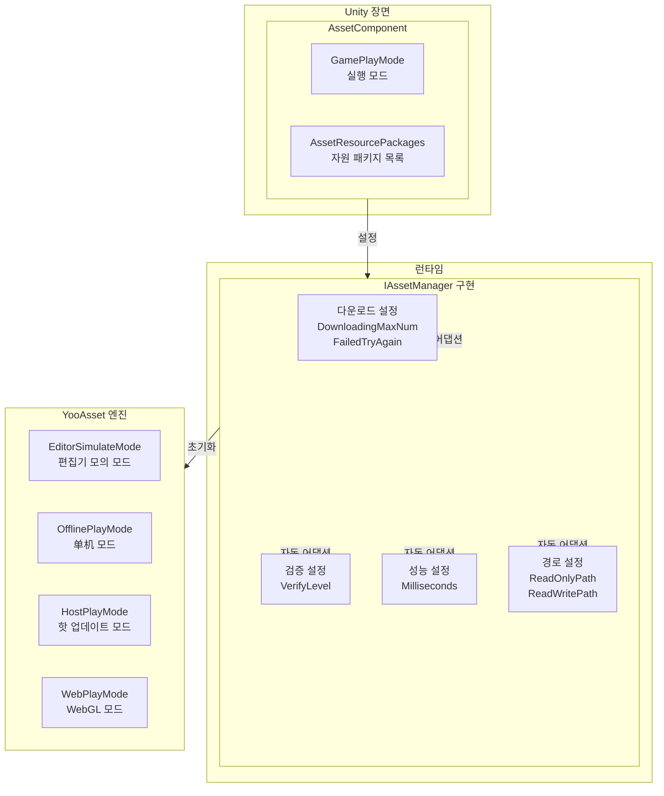
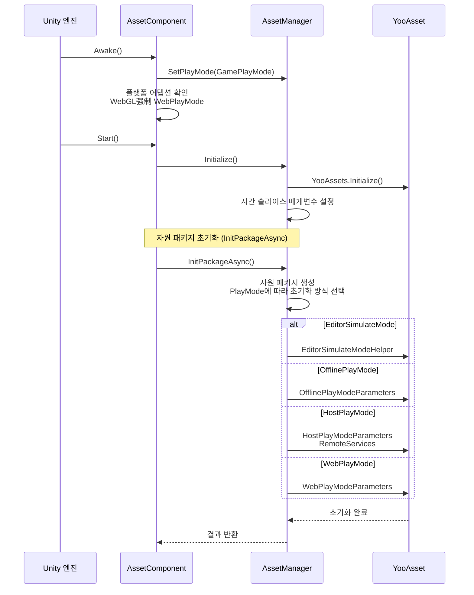

# 컴포넌트 설정

AssetComponent는 GameFrameX 자원 시스템의 핵심 Unity 컴포넌트로, 자원의 런타임 동작을 구성하고 관리합니다. 이 컴포넌트를 통해 개발자는 자원 로드 모드, 다운로드 매개변수, 자원 패키지 정보 등 핵심 설정을 유연하게 구성할 수 있습니다.

## 개요

AssetComponent는 GameFrameworkComponent를 상속하며, Unity 장면의 핵심 컴포넌트로 자원 시스템 초기화 및 관리를 담당합니다. 이 컴포넌트는 Unity Inspector 패널을 통해 구성하며, 다양한 실행 모드를 지원하여 서로 다른 플랫폼에 자동으로 최적의 자원 로드 전략을 적용합니다.



**설정 흐름 설명:**
1. Unity Inspector에서 AssetComponent의 실행 모드 및 자원 패키지 정보 구성
2. AssetComponent는 Awake 단계에서 구성을 가져와 AssetManager에 전달
3. AssetManager는 구성에 따라 YooAsset 엔진 초기화
4. 시스템은 실행 모드에 따라 적합한 자원 로드 전략 선택

## 핵심 설정 속성

### 실행 모드 설정

AssetComponent는 자원 실행 모드를 설정하기 위한 `GamePlayMode` 속성을 제공합니다:

```csharp
[Tooltip("대상 플랫폼이 Web 플랫폼일 때 강제로 WebPlayMode로 설정됩니다")] [SerializeField]
private EPlayMode m_GamePlayMode;
```
> Source: [Runtime/Asset/AssetComponent.cs](https://github.com/GameFrameX/com.gameframex.unity.asset/blob/main/Runtime/Asset/AssetComponent.cs#L20-L21)

**실행 모드 설명:**

| 모드 | 열거형 값 | 설명 | 적용 시나리오 |
|------|--------|------|----------|
| 편집기 모의 모드 | `EPlayMode.EditorSimulateMode` | Unity 편집기에서 모의 방식으로 자원 로드,打包 없이 테스트 가능 | 개발 디버깅 단계 |
|单机 실행 모드 | `EPlayMode.OfflinePlayMode` | 로컬 내장 자원 파일 사용, 네트워크 다운로드 불필요 | 순수单机 게임 |
|联机 실행 모드 | `EPlayMode.HostPlayMode` | 핫 업데이트 지원, 원격 서버에서 자원 다운로드 | 핫 업데이트가 필요한 게임 |
| WebGL 실행 모드 | `EPlayMode.WebPlayMode` | WebGL 플랫폼을 위한 특수 최적화 모드 | WebGL 플랫폼 |

**플랫폼 자동 어댑션 메커니즘:**

```csharp
protected override void Awake()
{
#if !UNITY_EDITOR
    if (GamePlayMode == EPlayMode.EditorSimulateMode)
    {
        GamePlayMode = EPlayMode.HostPlayMode;
    }
#if UNITY_WEBGL
    GamePlayMode = EPlayMode.WebPlayMode;
#endif
#endif
    // ... 후속 초기화 로직
}
```
> Source: [Runtime/Asset/AssetComponent.cs](https://github.com/GameFrameX/com.gameframex.unity.asset/blob/main/Runtime/Asset/AssetComponent.cs#L42-L64)

**자동 어댑션 규칙:**
- 편집기 환경이 아닐 때 `EditorSimulateMode`는 자동으로 `HostPlayMode`로 변환
- WebGL 플랫폼 환경에서는 구성과 관계없이强制적으로 `WebPlayMode`로 설정

### 자원 패키지 설정

편집기 환경에서는 `AssetResourcePackages`를 통해 여러 자원 패키지 정보를 구성할 수 있습니다:

```csharp
#if UNITY_EDITOR
[SerializeField] private List<AssetResourcePackageInfo> m_assetResourcePackages = new List<AssetResourcePackageInfo>();
#endif
```
> Source: [Runtime/Asset/AssetComponent.cs](https://github.com/GameFrameX/com.gameframex.unity.asset/blob/main/Runtime/Asset/AssetComponent.cs#L33-L34)

**자원 패키지 정보 구조:**

```csharp
[Serializable]
public sealed class AssetResourcePackageInfo
{
    [SerializeField] public string PackageName;
    [SerializeField] public string DownloadURL;
    [SerializeField] public string FallbackDownloadURL;
}
```
> Source: [Runtime/Asset/AssetComponent.cs](https://github.com/GameFrameX/com.gameframex.unity.asset/blob/main/Runtime/Asset/AssetComponent.cs#L661-L667)

| 설정 항목 | 타입 | 설명 |
|--------|------|------|
| PackageName | string | 자원 패키지 이름 |
| DownloadURL | string | 메인 다운로드 주소 |
| FallbackDownloadURL | string | 백업 다운로드 주소 |

## 런타임 설정 인터페이스

IAssetManager 인터페이스는 풍부한 런타임 설정 속성을 제공하여 코드에서 동적으로 조정할 수 있습니다:

```csharp
public interface IAssetManager
{
    /// <summary>
    /// 동시 다운로드의 최대 수.
    /// </summary>
    int DownloadingMaxNum { get; set; }

    /// <summary>
    /// 실패 재시도의 최대 수.
    /// </summary>
    int FailedTryAgain { get; set; }

    /// <summary>
    /// 자원 패키지 이름을 획득 또는 설정.
    /// </summary>
    string DefaultPackageName { get; set; }

    /// <summary>
    /// 다운로드 파일 검증 등급을 획득 또는 설정.
    /// </summary>
    EFileVerifyLevel VerifyLevel { get; }

    /// <summary>
    /// 비동기 시스템 매개변수를 획득 또는 설정, 每帧 실행 소비의 최대 시간 슬라이스 (단위: 밀리초).
    /// </summary>
    long Milliseconds { get; set; }

    /// <summary>
    /// 자원 읽기 전용 영역 경로를 획득.
    /// </summary>
    string ReadOnlyPath { get; }

    /// <summary>
    /// 자원 읽기 쓰기 영역 경로를 획득.
    /// </summary>
    string ReadWritePath { get; }
}
```
> Source: [Runtime/Asset/IAssetManager.cs](https://github.com/GameFrameX/com.gameframex.unity.asset/blob/main/Runtime/Asset/IAssetManager.cs#L13-L76)

### 다운로드 설정

| 설정 항목 | 타입 | 기본값 | 설명 |
|--------|------|--------|------|
| DownloadingMaxNum | int | - | 동시 다운로드의 최대 수, 네트워크 상황에 따라 설정 권장 |
| FailedTryAgain | int | - | 다운로드 실패 후 재시도 횟수, 3-5회 설정 권장 |

### 검증 설정

| 설정 항목 | 타입 | 설명 |
|--------|------|------|
| VerifyLevel | EFileVerifyLevel | 파일 검증 등급, 다운로드 파일의 완전성 보장 |

**검증 등급 설명:**
- `None` - 검증 안 함
- `Low` - 경도 검증, 파일 존재 여부만 검증
- `Medium` - 중도 검증, 파일 크기 및 일부 해시 검증
- `High` - 고도 검증, 완전한 파일 해시 검증

### 성능 설정

| 설정 항목 | 타입 | 기본값 | 설명 |
|--------|------|--------|------|
| Milliseconds | long | 30 | 비동기 시스템 每帧 실행의 최대 시간 슬라이스 (밀리초), 每帧 자원 로드 시간 제어, 지연 방지 |

### 경로 설정

| 설정 항목 | 타입 | 설명 |
|--------|------|------|
| ReadOnlyPath | string | 자원 읽기 전용 영역 경로, 일반적으로 StreamingAssets 가리킴 |
| ReadWritePath | string | 자원 읽기 쓰기 영역 경로, 다운로드한 자원 및 캐시 저장용 |

## 설정 초기화 흐름



**초기화 코드 예시:**

```csharp
public void Initialize()
{
    BetterStreamingAssets.Initialize();
    Log.Info($"자원 시스템 실행 모드: {PlayMode}");
    YooAssets.Initialize();
    YooAssets.SetOperationSystemMaxTimeSlice(30);
    Log.Info("Asset Init Over");
}
```
> Source: [Runtime/Asset/AssetManager.cs](https://github.com/GameFrameX/com.gameframex.unity.asset/blob/main/Runtime/Asset/AssetManager.cs#L46-L56)

## 편집기 설정 인터페이스

AssetComponent는 사용자 정의 Unity Inspector 편집기 인터페이스를 제공합니다:

```csharp
[CustomEditor(typeof(AssetComponent))]
internal sealed class AssetComponentInspector : ComponentTypeComponentInspector
{
    public override void OnInspectorGUI()
    {
        // 실행 모드 설정 (재생 시 수정 불가)
        EditorGUI.BeginDisabledGroup(EditorApplication.isPlayingOrWillChangePlaymode);
        {
            EditorGUILayout.PropertyField(m_GamePlayMode, m_GamePlayModeGUIContent);
            GUI.enabled = false;
            EditorGUILayout.PropertyField(m_AssetResourcePackages, m_AssetResourcePackagesGUIContent);
            GUI.enabled = true;
        }
        EditorGUI.EndDisabledGroup();
    }
}
```
> Source: [Editor/Inspector/AssetComponentInspector.cs](https://github.com/GameFrameX/com.gameframex.unity.asset/blob/main/Editor/Inspector/AssetComponentInspector.cs#L39-L79)

**설정 인터페이스 특성:**
- 실행 모드 설정: 드롭다운 선택 상자, 편집기에서 직관적으로 선택 가능
- 패키지 목록 설정: 구성된 자원 패키지 정보 표시 (재생 시 비활성화)
- 재생 보호: 재생 모드 진입 후 설정 항목 수정 불가

## 설정 예시 코드

### 기초 설정

```csharp
// AssetComponent 획득
var assetComponent = GameEntry.GetComponent<AssetComponent>();

// 현재 실행 모드 획득
var playMode = assetComponent.GamePlayMode;
Debug.Log($"현재 실행 모드: {playMode}");
```
> Source: [Runtime/Asset/AssetComponent.cs](https://github.com/GameFrameX/com.gameframex.unity.asset/blob/main/Runtime/Asset/AssetComponent.cs#L27-L31)

### 런타임 설정 조정

```csharp
// 자원 관리자 획득
var assetManager = GameFrameworkEntry.GetModule<IAssetManager>();

// 다운로드 매개변수 구성
assetManager.DownloadingMaxNum = 10;  // 최대 동시 다운로드 10개
assetManager.FailedTryAgain = 3;       // 실패 재시도 3회

// 성능 매개변수 구성
assetManager.Milliseconds = 30;        // 每帧 최대 30밀리초

// 검증 등급 구성
assetManager.VerifyLevel = EFileVerifyLevel.Medium;

// 경로 구성
assetManager.SetReadOnlyPath(Application.streamingAssetsPath);
assetManager.SetReadWritePath(Application.persistentDataPath);
```
> Source: [Runtime/Asset/AssetManager.cs](https://github.com/GameFrameX/com.gameframex.unity.asset/blob/main/Runtime/Asset/AssetManager.cs#L24-L39)

### 자원 패키지 초기화

```csharp
// 기본 자원 패키지 초기화
var success = await assetComponent.InitPackageAsync(
    "DefaultPackage",                      // 패키지 이름
    "https://cdn.example.com/assets/",      // 메인 다운로드 주소
    "https://backup.example.com/assets/",  // 백업 다운로드 주소
    true                                    // 기본 패키지 여부
);

if (success)
{
    Debug.Log("자원 패키지 초기화 성공");
}
else
{
    Debug.LogError("자원 패키지 초기화 실패");
}
```
> Source: [Runtime/Asset/AssetComponent.cs](https://github.com/GameFrameX/com.gameframex.unity.asset/blob/main/Runtime/Asset/AssetComponent.cs#L80-L95)

## 플랫폼 특수 설정

### WebGL 플랫폼

WebGL 플랫폼에서 시스템은 서로 다른 미니게임 플랫폼의 어댑션을 자동으로 처리합니다:

```csharp
// 데챠 미니게임
#if ENABLE_DOUYIN_MINI_GAME
GameEntry.GetComponent<AssetComponent>().gameObject.GetOrAddComponent<DouYinConfigHandler>();
#endif

// 위챗 미니게임
#if ENABLE_WECHAT_MINI_GAME
GameEntry.GetComponent<AssetComponent>().gameObject.GetOrAddComponent<WeChatConfigHandler>();
#endif

// 쿠아이쇼우 미니게임
#if ENABLE_KUAISHOU_MINI_GAME
GameEntry.GetComponent<AssetComponent>().gameObject.GetOrAddComponent<KuaiShouConfigHandler>();
#endif
```
> Source: [Runtime/Asset/AssetManager.Initialization.cs](https://github.com/GameFrameX/com.gameframex.unity.asset/blob/main/Runtime/Asset/AssetManager.Initialization.cs#L90-L126)

**미니게임 플랫폼 특수 처리:**
- **데챠 미니게임**: 데챠 전용 파일 시스템 사용, 동시성 수 자동 제어
- **위챗 미니게임**: 위챗 파일 시스템 사용, 캐시到用户 데이터 디렉토리
- **쿠아이쇼우 미니게임**: 쿠아이쇼우 파일 시스템 사용

## 설정 모범 사례

### 개발 단계

```csharp
// 개발 단계 권장 설정
assetManager.DownloadingMaxNum = 5;
assetManager.FailedTryAgain = 3;
assetManager.VerifyLevel = EFileVerifyLevel.Low;
assetManager.Milliseconds = 20;
```

### 생산 단계

```csharp
// 생산 단계 권장 설정
assetManager.DownloadingMaxNum = 10;
assetManager.FailedTryAgain = 5;
assetManager.VerifyLevel = EFileVerifyLevel.High;
assetManager.Milliseconds = 30;
```

### 네트워크 환경 어댑션

```csharp
// 약한 네트워크 환경
if (Application.internetReachability == NetworkReachability.NotReachable)
{
    assetManager.GamePlayMode = EPlayMode.OfflinePlayMode;
}

// 모바일 네트워크
else if (Application.internetReachability == NetworkReachability.ReachableViaCarrierDataNetwork)
{
    assetManager.DownloadingMaxNum = 3;
}

// WiFi 환경
else if (Application.internetReachability == NetworkReachability.ReachableViaLocalAreaNetwork)
{
    assetManager.DownloadingMaxNum = 10;
}
```

## 일반적인 설정 문제

### 문제 1: 편집기 모드 정상 작동 불가

**원인**: 비편집기 환경에서 `EditorSimulateMode` 사용

**해결책**:打包 배포 시 실행 모드를 `HostPlayMode` 또는 `OfflinePlayMode`로 변경했는지 확인

### 문제 2: WebGL 플랫폼 자원 로드 실패

**원인**: WebGL 플랫폼이强制적으로 `WebPlayMode`로 설정되어 있어 올바른 다운로드 서버 구성 필요

**해결책**: `InitPackageAsync`에서 올바른 `DownloadURL` 및 `FallbackDownloadURL` 제공했는지 확인

### 문제 3: 자원 다운로드 속도 느림

**원인**: `DownloadingMaxNum` 설정이 너무 낮음

**해결책**: WiFi 환경에서 적절히 `DownloadingMaxNum` 값 증가

## 관련 링크

- [실행 모드](./6-configuration.play-modes) - 다양한 실행 모드의 차이 자세히 알아보기
- [자원 로드 인터페이스](./5-api-reference.loading-api) - 자원 로드 API 문서
- [자원 패키지 관리](./5-api-reference.package-management) - 자원 패키지 관리 문서
- [AssetComponent API](./4-core-concepts.asset-component) - 컴포넌트 핵심 개념