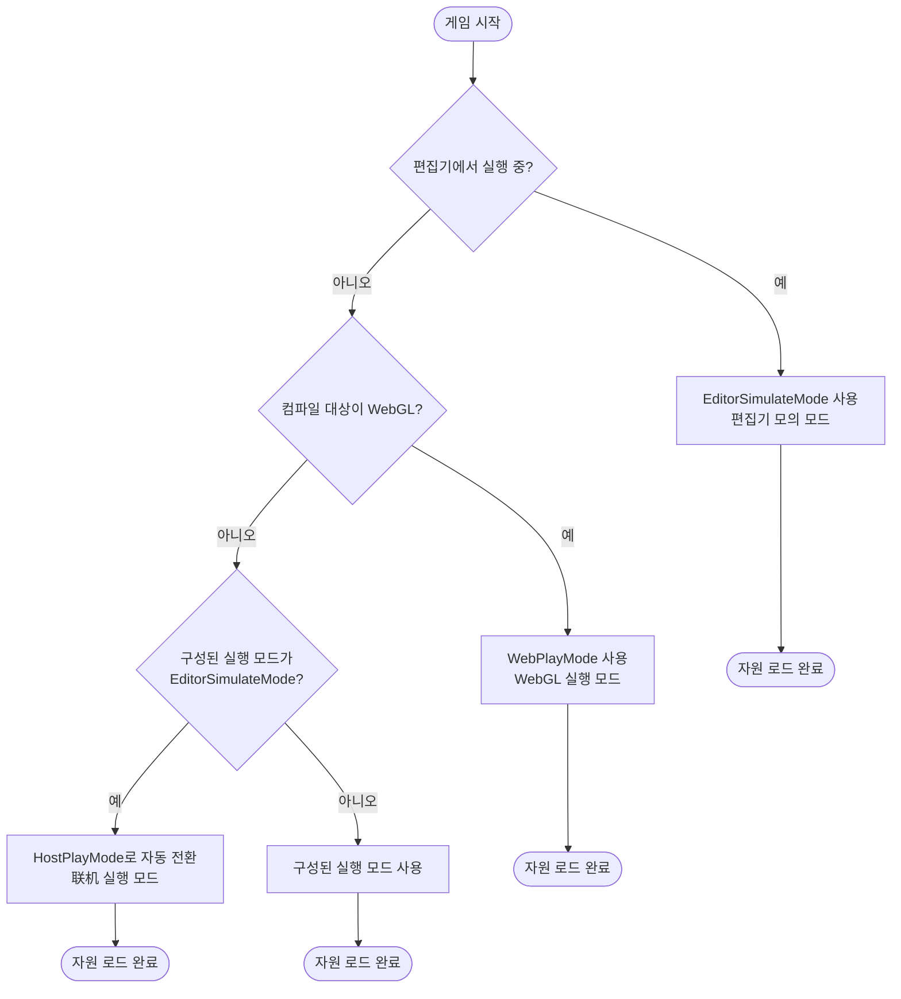
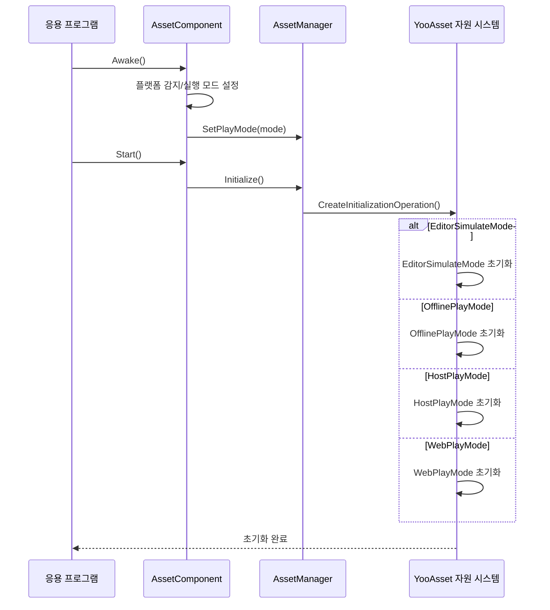

# 플랫폼 지원 개요

GameFrameX Asset 컴포넌트는 다양한 Unity 플랫폼을 지원하며, 다양한 배포 시나리오에 맞게 유연한 실행 모드를 제공합니다. 이 문서는 시스템이 지원하는 플랫폼, 실행 모드 및 플랫폼 자동 감지 메커니즘을 개괄합니다.

## 개요

GameFrameX Asset 컴포넌트는 [YooAsset](https://www.yooasset.com/) 자원 시스템을 기반으로 구축되어, 다양한 Unity 플랫폼과 실행 모드를 지원하는 통일된 자원 로드 인터페이스를 제공합니다. 시스템 설계 시 다양한 플랫폼의 차이를 고려하였으며, 실행 모드(Play Mode)를 통해 다양한 배포 시나리오(편집기 개발,单机 게임, 핫 업데이트 게임, WebGL 플랫폼)를 지원합니다.

실행 모드는 플랫폼 지원을 이해하는 핵심 개념입니다. 서로 다른 실행 모드는 자원의 로드 방식과 업데이트 전략을 결정하며, 개발자는 목표 플랫폼에 따라 적절한 실행 모드를 선택해야 합니다. 시스템은 또한 플랫폼 자동 감지 기능을 제공하여, 일부 상황에서는 컴파일 대상 플랫폼에 따라 가장 적합한 실행 모드를 자동으로 선택합니다.

## 지원 플랫폼

GameFrameX Asset 컴포넌트가 지원하는 플랫폼은 다음 Kategorien으로 분류됩니다:

| 플랫폼 분류 | 구체적 플랫폼 | 권장 실행 모드 | 설명 |
|---------|---------|-------------|------|
| 편집기 | Unity Editor | EditorSimulateMode | 개발 단계의快速 반복용 |
| PC 플랫폼 | Windows, macOS, Linux | HostPlayMode / OfflinePlayMode | 핫 업데이트 또는单机 배포 지원 |
| 모바일 플랫폼 | iOS, Android | HostPlayMode / OfflinePlayMode | 핫 업데이트 또는单机 배포 지원 |
| Web 플랫폼 | WebGL | WebPlayMode | 전문 최적화된 Web 플랫폼 모드 |
|小游戏|抖音, 쿠아이쇼우, 위챗小游戏| WebPlayMode | WebGL 기반小游戏 플랫폼 |

### 실행 모드 상세

시스템은 서로 다른 시나리오에 적용되는 네 가지 실행 모드를 제공합니다:

```csharp
// 실행 모드 정의 (来自 YooAsset)
public enum EPlayMode
{
    EditorSimulateMode,  // 편집기 모의 모드
    OfflinePlayMode,    //单机 실행 모드
    HostPlayMode,       //联机 실행 모드（핫 업데이트）
    WebPlayMode         // WebGL 실행 모드
}
```

> Source: [AssetManager.Initialization.cs](https://github.com/GameFrameX/com.gameframex.unity.asset/blob/main/Runtime/Asset/AssetManager.Initialization.cs#L20-L46)

## 플랫폼 선택 흐름

시스템은 서로 다른 환경에서 자동으로 적절한 실행 모드를 선택합니다. 다음은 실행 모드 선택 로직입니다:



### 자동 플랫폼 감지 구현

`AssetComponent`에서 시스템은 런타임 시 플랫폼을 자동 감지하여 실행 모드를 조정합니다. 다음은 핵심 구현 로직입니다:

```csharp
protected override void Awake()
{
#if !UNITY_EDITOR
    // 비편집기 환경에서 EditorSimulateMode가 구성되어 있으면 자동으로联机 모드로 전환
    if (GamePlayMode == EPlayMode.EditorSimulateMode)
    {
        GamePlayMode = EPlayMode.HostPlayMode;
    }
    
    // WebGL 플랫폼은 WebPlayMode强制 사용
#if UNITY_WEBGL
    GamePlayMode = EPlayMode.WebPlayMode;
#endif
#endif
    // ... 후속 초기화 로직
}
```

> Source: [AssetComponent.cs](https://github.com/GameFrameX/com.gameframex.unity.asset/blob/main/Runtime/Asset/AssetComponent.cs#L42-L64)

이러한 설계는 다음을 보장합니다:
- 개발 단계에서 모의 모드를 사용하여快速 반복 가능
- 패키지 배포 후 자동으로 적절한 실행 모드로 전환
- WebGL 플랫폼은 항상 전문 최적화된 WebPlayMode 사용

## 실행 모드와 초기화

서로 다른 실행 모드는 서로 다른 자원 초기화 방식에 해당합니다. 시스템은 `AssetManager`에서 선택된 실행 모드에 따라 해당 초기화 메서드를 호출합니다:



### 각 모드의 초기화 메서드

시스템은 `AssetManager.Initialization.cs`에서 각 실행 모드에 대해 전문 초기화 메서드를 제공합니다:

```csharp
private InitializationOperation CreateInitializationOperationHandler(
    ResourcePackage resourcePackage, 
    string hostServerURL, 
    string fallbackHostServerURL)
{
    switch (PlayMode)
    {
        case EPlayMode.EditorSimulateMode:
            return InitializeYooAssetEditorSimulateMode(resourcePackage);
        case EPlayMode.OfflinePlayMode:
            return InitializeYooAssetOfflinePlayMode(resourcePackage);
        case EPlayMode.HostPlayMode:
            return InitializeYooAssetHostPlayMode(resourcePackage, hostServerURL, fallbackHostServerURL);
        case EPlayMode.WebPlayMode:
            return InitializeYooAssetWebPlayMode(resourcePackage, hostServerURL, fallbackHostServerURL);
    }
}
```

> Source: [AssetManager.Initialization.cs](https://github.com/GameFrameX/com.gameframex.unity.asset/blob/main/Runtime/Asset/AssetManager.Initialization.cs#L18-L47)

## WebGL과小游戏 플랫폼

WebGL 플랫폼은 이 컴포넌트의 주요 지원 대상이며, 표준 WebPlayMode 외에도 다양한小游戏 플랫폼을 지원합니다:

```csharp
private InitializationOperation InitializeYooAssetWebPlayMode(
    ResourcePackage resourcePackage, 
    string hostServerURL, 
    string fallbackHostServerURL)
{
    var initParameters = new WebPlayModeParameters();
    FileSystemParameters webFileSystem = null;
    
#if UNITY_WEBGL
#if ENABLE_DOUYIN_MINI_GAME
    // 데챠小游戏 특수 처리
    TTSDK.TT.PreloadConcurrent(10);
    // ... ByteGame 파일 시스템 생성
#elif ENABLE_WECHAT_MINI_GAME
    // 위챗小游戏 특수 처리
    WeChatWASM.WXBase.PreloadConcurrent(10);
    // ... Wechat 파일 시스템 생성
#elif ENABLE_KUAISHOU_MINI_GAME
    // 쿠아이쇼우小游戏 특수 처리
    KSWASM.KSBase.PreloadConcurrent(10);
    // ... KuaiShou 파일 시스템 생성
#else
    // 기본 WebGL 파일 시스템
    webFileSystem = FileSystemParameters.CreateDefaultWebFileSystemParameters();
#endif
#else
    webFileSystem = FileSystemParameters.CreateDefaultWebFileSystemParameters();
#endif
    
    initParameters.WebFileSystemParameters = webFileSystem;
    return resourcePackage.InitializeAsync(initParameters);
}
```

> Source: [AssetManager.Initialization.cs](https://github.com/GameFrameX/com.gameframex.unity.asset/blob/main/Runtime/Asset/AssetManager.Initialization.cs#L85-L146)

### 지원小游戏 플랫폼

| 플랫폼 | 사전 정의된符号| 특징 |
|-----|----------|------|
| 데챠小游戏 | `ENABLE_DOUYIN_MINI_GAME` | ByteGameFileSystem 사용 |
| 위챗小游戏 | `ENABLE_WECHAT_MINI_GAME` | WechatFileSystem 사용 |
| 쿠아이쇼우小游戏 | `ENABLE_KUAISHOU_MINI_GAME` | KuaiShouFileSystem 사용 |

## 실행 모드 구성

Unity 편집기에서 `AssetComponent` 컴포넌트를 통해 실행 모드를 구성할 수 있습니다:

```csharp
[Tooltip("대상 플랫폼이 Web 플랫폼일 때强制적으로 WebPlayMode로 설정됩니다")]
[SerializeField]
private EPlayMode m_GamePlayMode;
```

> Source: [AssetComponent.cs](https://github.com/GameFrameX/com.gameframex.unity.asset/blob/main/Runtime/Asset/AssetComponent.cs#L20-L21)

구성 단계:
1. 장면에서 `AssetComponent`가 있는 GameObject를 생성하거나 선택합니다
2. Inspector 패널에서 "Game Play Mode" 속성을 찾습니다
3. 적절한 실행 모드를 선택합니다
4. 프로젝트를 빌드할 때 시스템은 자동으로 대상 플랫폼에 따라 모드를 조정합니다

## 실행 모드 선택 가이드

서로 다른 프로젝트 요구 사항에 따라 적절한 실행 모드를 선택합니다:

| 시나리오 | 권장 모드 | 이유 |
|-----|---------|------|
| 편집기 개발 디버깅 | EditorSimulateMode |快速 로드,打包 불필요 |
|单机 독립 게임 | OfflinePlayMode | 자원 내장, 네트워크 불필요 |
| 핫 업데이트가 필요한 게임 | HostPlayMode | 자원 업데이트 지원 |
| WebGL 웹 게임 | WebPlayMode | Web 플랫폼 최적화 |
| 위챗/데챠小游戏 | WebPlayMode + 플랫폼符号| 플랫폼 네이티브 지원 |

## 관련 링크

- [WebGL 플랫폼 구성](./7-platforms.webgl) - 상세 WebGL 플랫폼 구성 설명
- [실행 모드](./6-configuration.play-modes) - 실행 모드의 상세 구성 옵션
- [자원 로드 인터페이스](./5-api-reference.loading-api) - 자원 로드 API 참고
- [컴포넌트 구성](./6-configuration.component-settings) - AssetComponent 구성 설명
