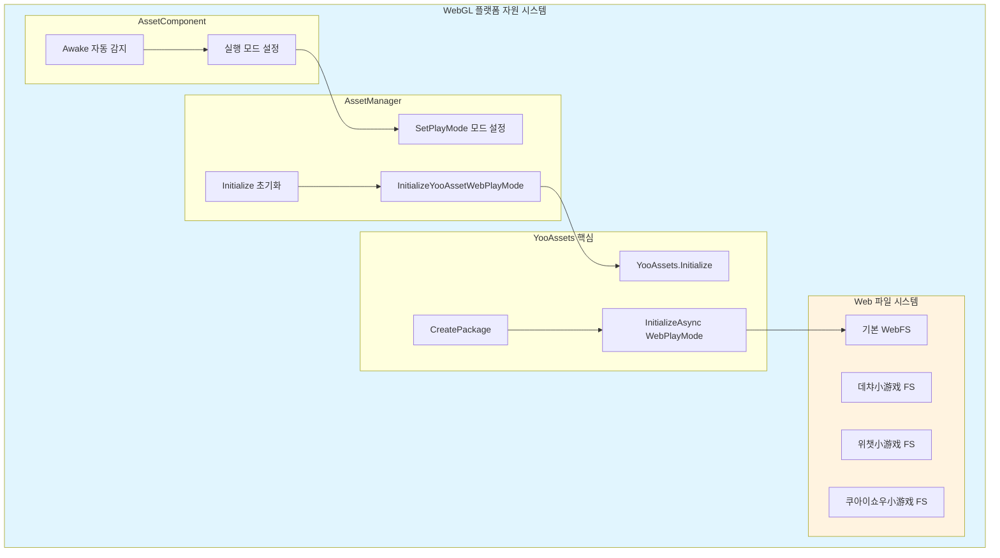
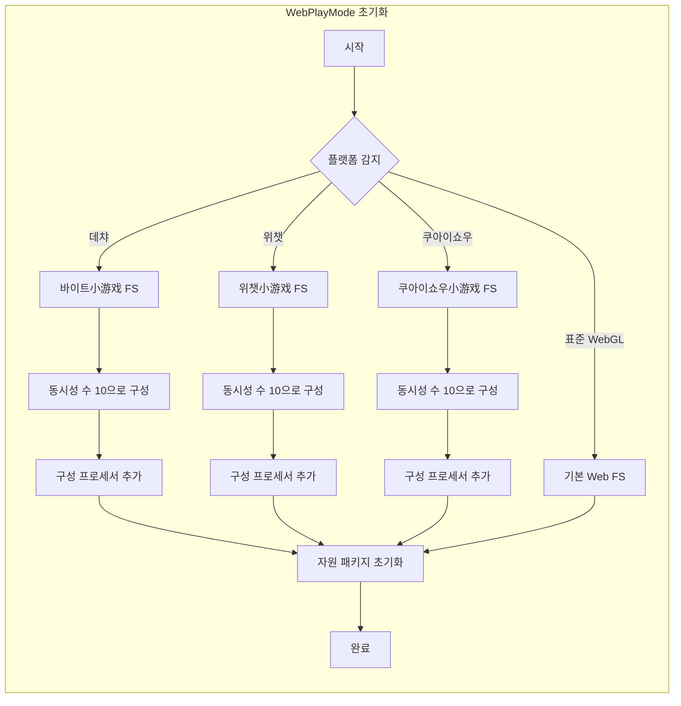

# WebGL 플랫폼

이 문서는 GameFrameX Asset 자원 컴포넌트의 WebGL 플랫폼 지원 및 구성에 대해 소개합니다.

## 개요

WebGL 플랫폼은 Unity가 Web 브라우저에 배포하는 중요한 대상 플랫폼입니다. GameFrameX Asset 컴포넌트는 YooAssets 프레임워크를 기반으로 완전한 WebGL 자원 로드 솔루션을 제공합니다. 이 솔루션은 표준 WebGL 빌드 및 다양한小游戏 플랫폼(데챠小游戏, 위챗小游戏, 쿠아이쇼우小游戏)을 지원합니다.

WebGL 플랫폼의 주요 특징:
- **브라우저 환경 제한**: 기존 파일 시스템을 사용할 수 없어 특수한 자원 로드 메커니즘이 필요합니다
- **단일 스레드 실행**: JavaScript 환경에서 자원 로드는 비동기 처리가 필요합니다
- **캐시 메커니즘**: 다운로드된 자원은 브라우저 캐시에 의존하여 저장됩니다
- **小游戏 플랫폼 지원**: 국내 주요小游戏 플랫폼에 대해 전문적으로适配되었습니다

## 아키텍처 설계



### 핵심 컴포넌트 설명

| 컴포넌트 | 책임 |
|------|------|
| AssetComponent | Awake 시 WebGL 환경을 자동 감지하여 실행 모드 설정 |
| AssetManager | 자원 초기화 및 로드 관리, YooAssets 호출 |
| YooAssets | 하층 자원 시스템, WebPlayMode 초기화 제공 |
| Web 파일 시스템 | Web 환경에서의 자원 로드 및 캐시 처리 |

## 자동 플랫폼 감지

GameFrameX는 지능적인 자동 플랫폼 감지 메커니즘을 구현합니다. 편집기가 아닌 환경에서 빌드할 때 AssetComponent는 대상 플랫폼을 자동 인식하여 적절한 실행 모드를 선택합니다.

```csharp
using GameFrameX.Asset.Runtime;
using UnityEngine;

[DisallowMultipleComponent]
[AddComponentMenu("GameFrameX/Asset")]
public sealed class AssetComponent : GameFrameworkComponent
{
    [Tooltip("대상 플랫폼이 Web 플랫폼일 때强制적으로 WebPlayMode로 설정됩니다")]
    [SerializeField]
    private EPlayMode m_GamePlayMode;

    protected override void Awake()
    {
#if !UNITY_EDITOR
        if (GamePlayMode == EPlayMode.EditorSimulateMode)
        {
            GamePlayMode = EPlayMode.HostPlayMode;
        }
#if UNITY_WEBGL
        GamePlayMode = EPlayMode.WebPlayMode;
#endif
#endif
        base.Awake();
        _assetManager.SetPlayMode(GamePlayMode);
    }
}
```

> Source: [AssetComponent.cs](https://github.com/GameFrameX/com.gameframex.unity.asset/blob/main/Runtime/Asset/AssetComponent.cs#L42-L64)

### 감지 로직 설명

| 조건 | 동작 |
|------|------|
| 편집기 환경 | 구성된 GamePlayMode 사용 |
| 비편집기 + EditorSimulateMode | HostPlayMode로 변환 |
| 비편집기 + UNITY_WEBGL | 자동으로 WebPlayMode로 전환 |
| 기타 상황 | 구성된 실행 모드 유지 |

## WebPlayMode 초기화 흐름

WebPlayMode로 설정되면 AssetManager는 `InitializeYooAssetWebPlayMode` 메서드를 호출하여 초기화합니다. 이 메서드는 다양한 Web 환경 구성을 지원합니다.

```csharp
/// <summary>
/// YooAsset WebGL 실행 모드 초기화
/// </summary>
private InitializationOperation InitializeYooAssetWebPlayMode(
    ResourcePackage resourcePackage,
    string hostServerURL,
    string fallbackHostServerURL)
{
    var initParameters = new WebPlayModeParameters();
    FileSystemParameters webFileSystem = null;

#if UNITY_WEBGL
#if ENABLE_DOUYIN_MINI_GAME
    // 데챠小游戏 구성
    TTSDK.TT.PreloadConcurrent(10);
    GameEntry.GetComponent<AssetComponent>().gameObject
        .GetOrAddComponent<DouYinConfigHandler>();
    
    if (hostServerURL.IsNullOrWhiteSpace())
    {
        webFileSystem = ByteGameFileSystemCreater.CreateByteGameFileSystemParameters();
    }
    else
    {
        webFileSystem = ByteGameFileSystemCreater.CreateByteGameFileSystemParameters(hostServerURL);
    }
#elif ENABLE_WECHAT_MINI_GAME
    // 위챗小游戏 구성
    WeChatWASM.WXBase.PreloadConcurrent(10);
    GameEntry.GetComponent<AssetComponent>().gameObject
        .GetOrAddComponent<WeChatConfigHandler>();
    
    string packageRoot = $"{WeChatWASM.WXBase.env.USER_DATA_PATH}/__GAME_FILE_CACHE/{YooAssetSettingsData.Setting.DefaultYooFolderName}";
    
    if (hostServerURL.IsNullOrWhiteSpace())
    {
        webFileSystem = WechatFileSystemCreater.CreateWechatFileSystemParameters();
    }
    else
    {
        webFileSystem = WechatFileSystemCreater.CreateWechatPathFileSystemParameters(hostServerURL);
    }
#elif ENABLE_KUAISHOU_MINI_GAME
    // 쿠아이쇼우小游戏 구성
#if !UNITY_EDITOR
    KSWASM.KSBase.PreloadConcurrent(10);
#endif
    GameEntry.GetComponent<AssetComponent>().gameObject
        .GetOrAddComponent<KuaiShouConfigHandler>();
    
    if (hostServerURL.IsNullOrWhiteSpace())
    {
        webFileSystem = KuaiShouFileSystemCreater.CreateKuaiShouFileSystemParameters();
    }
    else
    {
        webFileSystem = KuaiShouFileSystemCreater.CreateKuaiShouPathFileSystemParameters(hostServerURL);
    }
#else
    // 표준 WebGL 파일 시스템
    webFileSystem = FileSystemParameters.CreateDefaultWebFileSystemParameters();
#endif
#else
    // 비 WebGL 환경回退
    webFileSystem = FileSystemParameters.CreateDefaultWebFileSystemParameters();
#endif

    initParameters.WebFileSystemParameters = webFileSystem;
    return resourcePackage.InitializeAsync(initParameters);
}
```

> Source: [AssetManager.Initialization.cs](https://github.com/GameFrameX/com.gameframex.unity.asset/blob/main/Runtime/Asset/AssetManager.Initialization.cs#L85-L146)

## 미니게임 플랫폼 지원

GameFrameX Asset 컴포넌트는 국내 주요 미니小程序 플랫폼에 대해 전문적인适配 지원을 제공합니다.

### 지원 플랫폼

| 플랫폼 | 사전 정의된符号| 특성 |
|------|-----------|------|
| 데챠小程序 | ENABLE_DOUYIN_MINI_GAME | 바이트小游戏 파일 시스템 |
| 위챗小程序 | ENABLE_WECHAT_MINI_GAME | 위챗 캐시 디렉토리 구성 |
| 쿠아이쇼우小程序 | ENABLE_KUAISHOU_MINI_GAME | 쿠아이쇼우 파일 시스템适配 |

### 플랫폼 초기화 차이



### 구성 프로세서 설명

각小程序 플랫폼에는 대응하는 구성 프로세서를 추가해야 합니다:
- **DouYinConfigHandler**: 데챠小游戏 구성 처리
- **WeChatConfigHandler**: 위챗小游戏 구성 처리
- **KuaiShouConfigHandler**: 쿠아이쇼우小游戏 구성 처리

이 프로세서들은 플랫폼 고유의 파일 시스템 구성 및 자원 경로 매핑을 담당합니다.

## 자원 패키지 초기화

WebGL 플랫폼에서 자원 패키지를 사용할 때 올바르게 초기화 매개변수를 구성해야 합니다:

```csharp
using UnityEngine;
using GameFrameX.Runtime;

public class WebGLBootstrap : MonoBehaviour
{
    private async void Start()
    {
        var assetComponent = GameEntry.GetComponent<AssetComponent>();
        
        // 기본 자원 패키지 초기화
        bool success = await assetComponent.InitPackageAsync(
            "DefaultPackage",           // 패키지 이름
            "https://cdn.example.com/", // 메인 서버 주소
            "https://backup.example.com/", // 백업 서버 주소
            true                        // 기본 패키지로 설정
        );
        
        if (success)
        {
            Debug.Log("WebGL 자원 패키지 초기화 성공");
        }
    }
}
```

## 실행 모드 구성

GameFrameX Asset 컴포넌트는 다양한 실행 모드를 지원하며, WebGL 플랫폼은 주로 WebPlayMode를 사용합니다:

| 모드 | 적용 시나리오 | WebGL 지원 |
|------|----------|------------|
| EditorSimulateMode | 편집기 개발 디버깅 | ❌ 지원 안 함 |
| OfflinePlayMode |单机 실행 | ⚠️ 제한적 지원 |
| HostPlayMode | 핫 업데이트 모드 | ⚠️ 조건부 지원 |
| WebPlayMode | WebGL 실행 환경 | ✅ 완전 지원 |

> 실행 모드의 상세 구성은 [실행 모드](./6-configuration.play-modes) 문서를 참조하세요.

## 자주 묻는 질문

### Q1: WebGL 빌드 후 자원 로드 실패

**가능한 원인**:
- 서버 주소 구성 오류
- CORS 교차 출처 정책 문제
- 자원 패키지가 올바르게 빌드되지 않음

**해결책**:
1. 자원 서버가 CORS를 지원하는지 확인합니다
2. 자원 패키지가 WebGL 플랫폼으로 빌드되었는지 확인합니다
3. hostServerURL 구성이 올바른지 검증합니다

### Q2:小程序 플랫폼 자원 로드 느림

**가능한 원인**:
- 동시 다운로드 수가 너무 높음
- 자원이分包 처리되지 않음

**해결책**:
1. 코드에서 PreloadConcurrent 매개변수 조정
2. 자원 태그를 사용하여 필요 시 로드
3. 자원 압축 및 병합 활성화

### Q3: 메모리占用 과다

**가능한 원인**:
- 동시에 너무 많은 자원 로드
- 자원 핸들러를 제때 해제하지 않음

**해결책**:
1. `UnloadAsset`을 사용하여 사용 완료된 자원 제때 해제
2. `DownloadingMaxNum`을 적절히 설정하여 동시성 제어
3. 정기적으로 `UnloadUnusedAssetsAsync`를 호출하여 무용 자원 정리

## 관련 링크

- [실행 모드 구성](./6-configuration.play-modes) - 상세 실행 모드 설명
- [컴포넌트 구성](./6-configuration.component-settings) - AssetComponent 구성 상세
- [자원 로드 인터페이스](./5-api-reference.loading-api) - 비동기/동기 로드 API
- [자원 패키지 관리](./5-api-reference.package-management) - 자원 패키지 작업
- [Asset 컴포넌트 소개](./1-overview.introduction) - Asset 컴포넌트 개요
- [기능 특성](./1-overview.features) - 완전한 기능 목록
