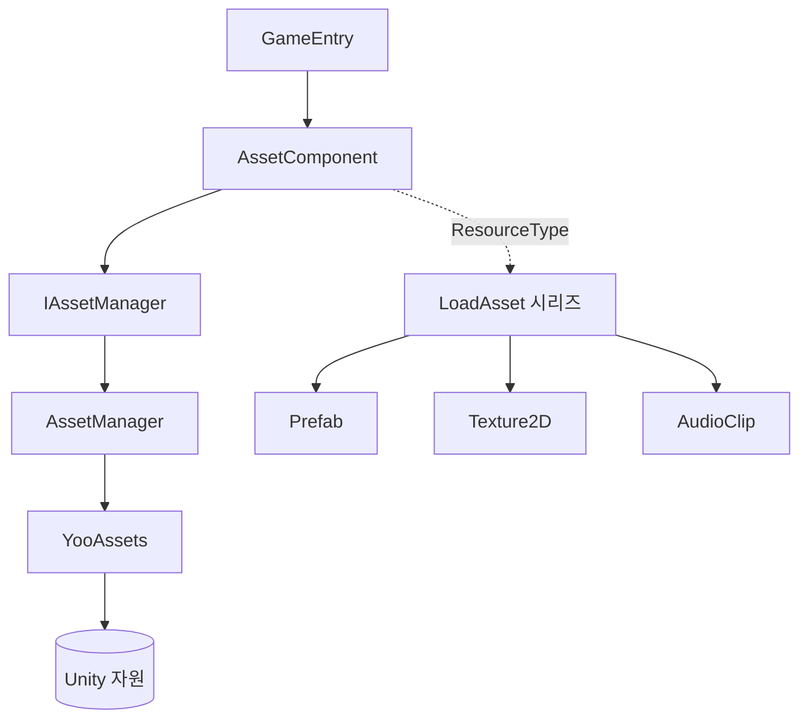

# GameFrameX Asset 알아보기

GameFrameX Asset은 GameFrameX 프레임워크를 기반으로封装된 Unity 자산 관리 컴포넌트로, [YooAsset](https://github.com/tuyoogame/YooAsset)을 하단 엔진으로 사용하여 통일된 자산 로딩, 언로딩 및 분할 관리 인터페이스를 제공합니다. 이를 통해 게임运行时이 경로나 类型에 따라 안전하게 `Prefab`, `Texture2D`, `AudioClip` 등 Unity 자원을 获取할 수 있습니다.

## 빠른 시작

1. Unity 프로젝트의 `Packages/manifest.json`에 scoped registry를 추가하고, `dependencies` 노드 아래에 의존성을 선언합니다:

```json
{
  "scopedRegistries": [
    {
      "name": "GameFrameX",
      "url": "https://gameframex.upm.alianblank.uk",
      "scopes": ["com.gameframex"]
    }
  ],
  "dependencies": {
    "com.gameframex.unity.asset": "3.0.1"
  }
}
```

`scopes`는 `com.gameframex`로 시작하는 패키지만 이 레지스트리를 거치도록 제어하며, 다른 패키지는 여전히 Unity 공식 소스를 사용합니다. Git URL을 직접 `dependencies`에 작성하거나 `Packages` 디렉터리에 넣어 오프라인으로 로드할 수도 있습니다.

2. 장면에서 `AssetComponent`가 부착되었는지 확인합니다(`GameEntry`에 자동 등록됨). 그런 다음 `GameEntry`에서 컴포넌트를 가져와 로딩 인터페이스를 호출합니다:

```csharp
// 표준 방식: GameEntry를 통해 (com.gameframex.unity.entry에 의존하지 않음)
var assetComponent = GameEntry.GetComponent<AssetComponent>();
assetComponent.LoadAsset("AssetPath");
```

## 작업 원리 개요



- `AssetComponent`는 `GameFrameworkComponent`로서 GameFrameX 프레임워크에 자동 등록되며, 편집기에서 `AssetComponentInspector`를 통해 설정됩니다.
- `IAssetManager`는 인터페이스이며, 기본 구현인 `AssetManager`는 YooAssets의 초기화 작업 `InitializationOperation`, 패키지 정보 목록, 그리고 로딩/언로딩 작업 대기열을 보유합니다.
- 각 Unity 자원 类型은 partial 파일에 대응됩니다(예: `AssetComponent.Prefab.cs`, `AssetComponent.Texture2D.cs`), `LoadAssetAsync` 등의 강력한 类型 인터페이스를 제공합니다.

## 다음 단계

- 의존성 설치 및 레지스트리 설정: `README.zh-CN.md`의 설치 섹션을 참조하세요.
- 각 类型 자산의 로딩 인터페이스: `Runtime/Asset/AssetComponent.*.cs` 시리즈 파일을 참조하세요.
- 편집기 측 Inspector 설정: [AssetComponentInspector.cs](https://github.com/GameFrameX/com.gameframex.unity.asset/blob/main/Editor/Inspector/AssetComponentInspector.cs) 참조.

## 관련 링크

- 저장소 주소: https://github.com/GameFrameX/com.gameframex.unity.asset
- 문서 사이트: https://gameframex.doc.alianblank.com
- 문제 피드백: https://github.com/GameFrameX/com.gameframex.unity.asset/issues
- 소스 코드 주 진입점: [AssetComponent.cs](https://github.com/GameFrameX/com.gameframex.unity.asset/blob/main/Runtime/Asset/AssetComponent.cs), [AssetManager.cs](https://github.com/GameFrameX/com.gameframex.unity.asset/blob/main/Runtime/Asset/AssetManager.cs)