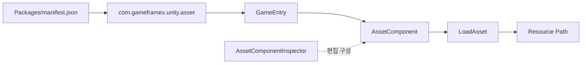

# 빠른 시작: 설치 및 첫 리소스 로드

`com.gameframex.unity.asset` 설치 후, `GameEntry`를 통해 `AssetComponent`를 가져오고, `LoadAsset`으로 지정된 경로의 리소스를 로드할 수 있습니다. 이 페이지에서는 저장소 README에서 바로 복사하여 사용할 수 있는 설치 및 호출 경로를 제공합니다.

## 빠른 시작

### 사전 조건

- Unity `2019.4`.
- 프로젝트에 GameFrameX 핵심 패키지가 설치되어 있어야 합니다. 현재 패키지 매니페스트는 `com.gameframex.unity: 1.1.1` 및 `com.gameframex.unity.event: 1.1.0`에 의존한다고 명시합니다.
- 사용 가능한 리소스 경로를 준비합니다. 예제에서는 플레이스홀더 문자열 `AssetPath`를 사용하며, 실제 주소는 사용자의 리소스 주소로 교체해야 합니다.

### 작업 단계

1. Unity에서 `Packages/manifest.json`을 열고, 패키지를 `dependencies`에 추가합니다:

```json
{
  "dependencies": {
    "com.gameframex.unity.asset": "3.0.1"
  }
}
```

> 출처: [README.zh-CN.md](https://github.com/GameFrameX/com.gameframex.unity.asset/blob/main/README.zh-CN.md#L32-L63)

2. Unity Package Manager가 패키지를 분석하고 로드할 때까지 기다립니다. README에 나열된 scoped registry, Git URL 또는 `Packages` 디렉터리에 직접 넣는 설치 방식도 선택할 수 있습니다.

3. 프로젝트 코드에서 `GameEntry`를 통해 `AssetComponent`를 가져옵니다:

```csharp
var assetComponent = GameEntry.GetComponent<AssetComponent>();
assetComponent.LoadAsset("AssetPath");
```

> 출처: [README.zh-CN.md](https://github.com/GameFrameX/com.gameframex.unity.asset/blob/main/README.zh-CN.md#L64-L70)

4. `AssetPath`를 사용자의 리소스 주소로 교체한 다음, 실제로 리소스 로드流程을 실행합니다. 저장소의 현재 패키지 버전은 `3.1.1`이며, README의 설치 예제는 `3.0.1`을 사용합니다. 사용 시에는 프로젝트에서 잠긴 버전을 기준으로 해야 합니다.

```json
{
  "name": "com.gameframex.unity.asset",
  "version": "3.1.1",
  "unity": "2019.4",
  "dependencies": {
    "com.gameframex.unity": "1.1.1",
    "com.gameframex.unity.event": "1.1.0"
  }
}
```

> 출처: [package.json](https://github.com/GameFrameX/com.gameframex.unity.asset/blob/main/package.json#L1-L25)

## 일반적인 변형

| 설치 방식 | 설정 |
|------|------|
| Scoped registry | 레지스트리 URL은 `https://gameframex.upm.alianblank.uk`, scope는 `com.gameframex` |
| Git URL | `https://github.com/gameframex/com.gameframex.unity.asset.git` |
| 로컬 디렉터리 | 저장소를 Unity 프로젝트의 `Packages` 디렉터리에 직접 넣기 |

## 일반적인 오류

| 증상 | 원인 | 해결 방법 |
|------|------|------|
| Package Manager에서 패키지를 찾을 수 없음 | `scopedRegistries`, scope 또는 버전 불일치 | `manifest.json`의 `scopes`가 `com.gameframex`인지 확인하고, Unity가 대상 버전을 사용하는지 확인 |
| `GetComponent<AssetComponent>()` 컴파일 실패 | GameFrameX 핵심 종속성이 설치되지 않았거나 해당 네임스페이스를 참조하지 않음 | `com.gameframex.unity: 1.1.1` 설치; 저장소 소스 코드에는 그대로 복사할 수 있는 완전한 네임스페이스 사용법이 제공되지 않으며, 구현 세부 정보는 소스에서 찾을 수 없음 |
| 리소스를 로드할 수 없음 | 전달된 경로가 유효한 리소스 주소가 아니거나, 컴포넌트/패키지가 아직 준비되지 않음 | 실제 리소스 주소를 사용하고, 패키지 로드 및 리소스 빌드 구성을 확인; 저장소 README에서는 더 구체적인 로드 사전 단계를 제공하지 않음 |

## 작동 원리 개요

설치 완료 후, Unity는 패키지 매니페스트를 통해 `com.gameframex.unity.asset`를 로드합니다. 런타임에 `GameEntry`에서 `AssetComponent`를 가져오고, 이 컴포넌트가 `LoadAsset`을 호출하여 리소스를 로드합니다. 에디터 측에서는 `AssetComponentInspector`가 제공되어 `리소스 실행 모드` 및 `패키지 목록` 구성을 표시합니다.



> 출처: [README.zh-CN.md](https://github.com/GameFrameX/com.gameframex.unity.asset/blob/main/README.zh-CN.md#L26-L29); [README.zh-CN.md](https://github.com/GameFrameX/com.gameframex.unity.asset/blob/main/README.zh-CN.md#L64-L70); [Editor/Inspector/AssetComponentInspector.cs](https://github.com/GameFrameX/com.gameframex.unity.asset/blob/main/Editor/Inspector/AssetComponentInspector.cs#L32-L40); [Editor/Inspector/AssetComponentInspector.cs](https://github.com/GameFrameX/com.gameframex.unity.asset/blob/main/Editor/Inspector/AssetComponentInspector.cs#L73-L78)

## 다음 단계

- 리소스 패키지의 설치, 로드 및 런타임 구성은 [프로젝트 README](https://github.com/GameFrameX/com.gameframex.unity.asset/blob/main/README.zh-CN.md#L30-L80)를 우선 참조하세요.
- 패키지 버전 및 종속성 제약 조건은 [package.json](https://github.com/GameFrameX/com.gameframex.unity.asset/blob/main/package.json#L1-L25)을 참조하세요.
- `AssetComponent`의 에디터 구성 진입점은 [AssetComponentInspector.cs](https://github.com/GameFrameX/com.gameframex.unity.asset/blob/main/Editor/Inspector/AssetComponentInspector.cs#L39-L78)을 참조하세요.
- 공식 문서 진입점: [GameFrameX 문서](https://gameframex.doc.alianblank.com).