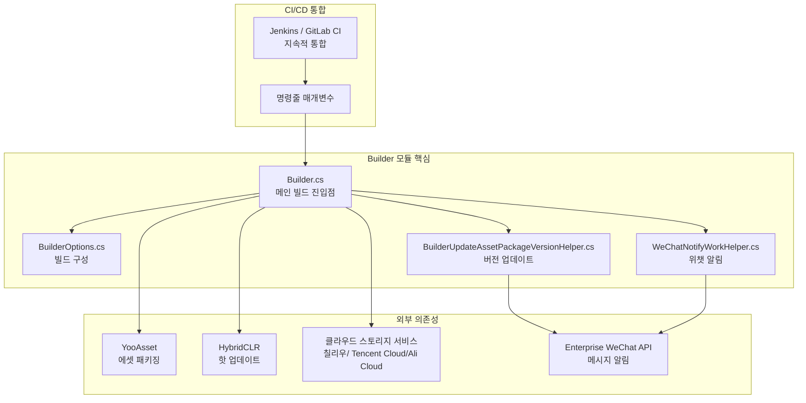
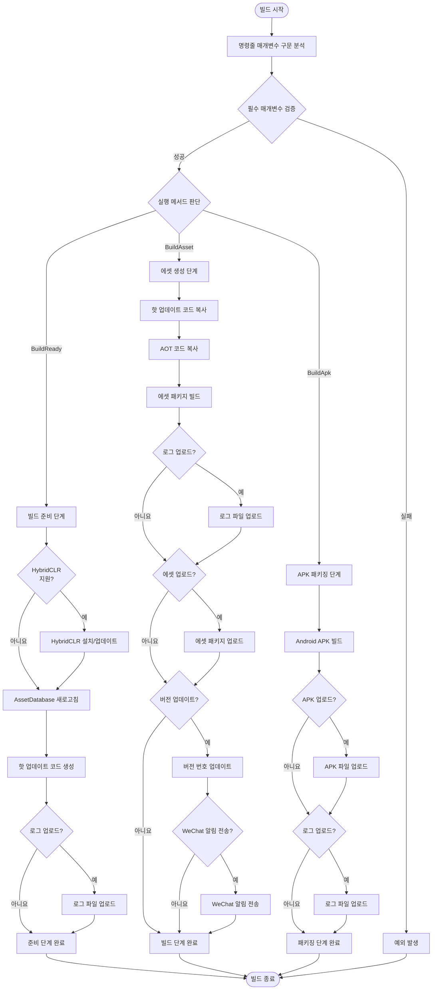

# 개요

GameFrameX Builder는 GameFrameX 게임 프레임워크의 Unity 자동화 빌드 모듈로, 완전한 CI/CD 빌드 프로세스를 지원합니다. 이 모듈은 명령줄 매개변수 기반 빌드 방식을 사용하여 Jenkins, GitLab CI, GitHub Actions 등 지속적 통합 플랫폼과 원활하게 통합할 수 있으며, 게임 프로젝트의 자동화된 패키징, 에셋 생성 및 버전 배포를 구현합니다.

## Overview

GameFrameX Builder는 GameFrameX 게임 프레임워크의 핵심 컴포넌트 중 하나로, Unity 게임 프로젝트의 자동화 빌드 문제 해결에 중점을 두고 있습니다. 게임 개발 과정에서 빈번한 버전 배포와 다중 채널 패키징은 시간이 많이 소요되고 오류가 발생하기 쉬운 작업입니다. Builder 모듈은 표준화된 명령줄 인터페이스와 모듈화된 빌드 프로세스 설계를 통해 이러한 반복 작업을 자동화하여 개발 효율성과 배포 품질을 크게 향상시킵니다.

이 모듈의 핵심 설계 철학은 빌드 프로세스를 여러 개의 독립적인 단계로 분리하여 각 단계가 특정 작업에 집중하도록 하는 것입니다. 이러한 설계는 코드 유지보수성을 높일 뿐만 아니라 빌드 프로세스를 프로젝트 요구에 따라 유연하게 구성할 수 있게 합니다. 기술적 구현 측면에서 Builder 모듈은 HybridCLR 핫 업데이트 솔루션, YooAsset 에셋 관리 시스템 및 다양한 클라우드 스토리지 서비스와 깊이 통합되어 완전한 게임 배포 솔루션을 구성합니다.

## 아키텍처 설계

GameFrameX Builder는 모듈화된 아키텍처 설계를 채택하여 빌드 프로세스의 다양한 기능을 독립적인 클래스로 분리하여 구현합니다. 이러한 설계 패턴을 통해 각 모듈의 책임이 명확하며 유지보수와 확장이 용이합니다. 다음은 Builder 모듈의 전체 아키텍처 다이어그램입니다:



아키텍처 다이어그램에서 볼 수 있듯이, Builder 모듈은 전체 빌드 프로세스의 핵심 위치에 있으며 외부 의존성 컴포넌트의 작업을 조정합니다. 명령줄 매개변수가 먼저 BuilderOptions 객체로 구문 분석된 다음, Builder 메인 클래스가 이러한 구성에 따라 해당 빌드 작업을 실행합니다. 빌드 과정에서 생성된 에셋 패키지는 클라우드 스토리지 서비스에 업로드될 수 있으며, 버전 업데이트 정보는 Enterprise WeChat을 통해 관련 담당자에게 자동으로 알림 전송됩니다.

## 핵심 기능

### 명령줄 빌드 지원

GameFrameX Builder는 완전히 명령줄 기반으로 실행되며, 모든 빌드 매개변수는 명령줄을 통해 전달됩니다. 이러한 설계는 빌드 프로세스를 완전 자동화하여 수동 개입이 필요 없습니다. Builder.cs의 `BuildParamsParse()` 메서드에서 명령줄 매개변수를 구문 분석하여 다양한 빌드 옵션을 BuilderOptions 객체에 저장합니다.

```csharp
private static void BuildParamsParse()
{
    var commandLineArgs = Environment.GetCommandLineArgs();
    _builderOptions = new BuilderOptions();
    for (var index = 0; index < commandLineArgs.Length; index++)
    {
        var commandLineArg = commandLineArgs[index];
        if (commandLineArg == "-logFile")
        {
            _builderOptions.LogFilePath = commandLineArgs[index + 1].Replace("/Unity/", "/");
        }
        else if (commandLineArg == "-executeMethod")
        {
            _builderOptions.ExecuteMethod = commandLineArgs[index + 1].Trim();
        }
        // ... 추가 매개변수 구문 분석
    }
}
```
> Source: [Builder.cs](https://github.com/GameFrameX/com.gameframex.unity.builder/blob/main/Editor/Builder.cs#L60-L74)

이러한 매개변수 구문 분석 메커니즘은 빌드 번호, 작업 이름, 패키지 이름, 버전 번호, 채널 이름 등을 포함한 다양한 빌드 옵션을 지원합니다. 개발 팀은 이러한 매개변수를 합리적으로 구성하여 완전한 사용자 정의 빌드 프로세스를 구현할 수 있습니다.

### 에셋 생성 및 패키징

Builder 모듈은 YooAsset 에셋 관리 시스템을 통합하여 강력한 에셋 생성 및 패키징 기능을 제공합니다. `BuildAsset()` 메서드에서 핫 업데이트 코드 복사, AOT 코드 처리, 에셋 패키지 빌드 등을 포함한 완전한 에셋 패키징 프로세스를 구현합니다.

```csharp
public static void BuildAsset()
{
    // 핫 업데이트 어셈블리 복사
    Debug.Log("BuildReady Start Copy Hotfix Code");
    BuildHotfixHelper.CopyHotfixCode();
    AssetDatabase.Refresh();
    
    // AOT 코드 복사
    Debug.Log("BuildReady Start Copy AOT Code");
    BuildHotfixHelper.CopyAOTCode();
    AssetDatabase.Refresh();
    
    // 에셋 패키지 빌드
    var buildInFileCopyParams = AssetBundleBuilderSetting.GetPackageBuildinFileCopyParams(_builderOptions.PackageName, EBuildPipeline.BuiltinBuildPipeline);
    BuiltinBuildPipeline pipeline = new BuiltinBuildPipeline();
    BuildParameters buildParameters = new BuildParameters();
    buildParameters.BuildMode = _builderOptions.IsIncrementalBuildPackage ? EBuildMode.IncrementalBuild : EBuildMode.ForceRebuild;
    // ... 추가 구성
    pipeline.Run(buildParameters, true);
}
```
> Source: [Builder.cs](https://github.com/GameFrameX/com.gameframex.unity.builder/blob/main/Editor/Builder.cs#L255-L296)

에셋 패키징은 증분 빌드와 전체 빌드라는 두 가지 모드를 지원하며, 개발자는 실제 요구에 따라 적절한 빌드 방식을 선택할 수 있습니다. 증분 빌드 모드는 빌드 시간을 크게 단축시키며 특히 개발 단계의 빈번한 패키징 요구에 적합합니다.

### 핫 업데이트 지원

Builder 모듈은 HybridCLR 핫 업데이트 솔루션을 기본 지원합니다. 빌드 준비 단계(`BuildReady()` 메서드)에서 시스템이 자동으로 HybridCLR 설치 상태를 확인하고 필요한 경우 자동 설치 및 구성을 수행합니다. 이 기능은 핫 업데이트를 지원하는 게임 프로젝트에 필수적입니다.

```csharp
public static void BuildReady()
{
#if ENABLE_GAME_FRAME_X_HYBRID_CLR
    Debug.Log("BuildReady Start HybridCLR");
    var installerController = new InstallerController();
    var isInstalled = installerController.HasInstalledHybridCLR();
    if (!isInstalled || installerController.InstalledLibil2cppVersion != installerController.PackageVersion)
    {
        installerController.InstallDefaultHybridCLR();
    }
    // 핫 업데이트 프록시 생성
    PrebuildCommand.GenerateAll();
#endif
    AssetDatabase.Refresh();
}
```
> Source: [Builder.cs](https://github.com/GameFrameX/com.gameframex.unity.builder/blob/main/Editor/Builder.cs#L215-L244)

조건부 컴파일 지시문 `ENABLE_GAME_FRAME_X_HYBRID_CLR`을 통해 개발자는 핫 업데이트 기능 활성화 여부를 유연하게 제어할 수 있습니다. 이 설계를 통해 모듈은 핫 업데이트가 필요한项目和 핫 업데이트가 필요하지 않은项目 모두의 요구를 동시에 만족시킬 수 있습니다.

### 클라우드 스토리지 통합

GameFrameX Builder는 칠리우 Cloud, Tencent Cloud, Ali Cloud 등 다양한 클라우드 스토리지 서비스 통합을 지원합니다. 통합 인터페이스 설계를 통해 다양한 클라우드 서비스 제공자 간의 전환이 용이합니다. 빌드 과정에서 생성된 에셋 패키지와 APK 파일을 지정된 클라우드 스토리지空間に 자동 업로드할 수 있습니다.

```csharp
#if ENABLE_GAME_FRAME_X_OBJECT_STORAGE
#if ENABLE_GAME_FRAME_X_OBJECT_STORAGE_QI_NIU
    ObjectStorageUploadManager = ObjectStorageUploadFactory.Create<QiNiuYunObjectStorageUploadManager>(_builderOptions.ObjectStorageKey, _builderOptions.ObjectStorageSecret, _builderOptions.ObjectStorageBucketName, _builderOptions.ObjectStorageEndPoint);
#endif

#if ENABLE_GAME_FRAME_X_OBJECT_STORAGE_TENCENT
    ObjectStorageUploadManager = ObjectStorageUploadFactory.Create<TencentCloudObjectStorageUploadManager>(_builderOptions.ObjectStorageKey, _builderOptions.ObjectStorageSecret, _builderOptions.ObjectStorageBucketName, _builderOptions.ObjectStorageEndPoint);
#endif

#if ENABLE_GAME_FRAME_X_OBJECT_STORAGE_A_LI_YUN
    ObjectStorageUploadManager = ObjectStorageUploadFactory.Create<ALiYunObjectStorageUploadManager>(_builderOptions.ObjectStorageKey, _builderOptions.ObjectStorageSecret, _builderOptions.ObjectStorageBucketName, _builderOptions.ObjectStorageEndPoint);
#endif
#endif
```
> Source: [Builder.cs](https://github.com/GameFrameX/com.gameframex.unity.builder/blob/main/Editor/Builder.cs#L32-L54)

클라우드 스토리지 업로드 기능은 `IObjectStorageUploadManager` 인터페이스를 통해 추상화되며 팩토리 모드를 사용하여 다양한 클라우드 서비스 제공자의 구체적인 구현을 생성합니다. 이 설계는 개방-폐쇄 원칙을 준수하며 향후 새로운 클라우드 스토리지 지원 추가가 용이합니다.

### 버전 관리 및 알림

Builder 모듈은 완전한 버전 관리 기능을 제공합니다. 빌드 완료 후 에셋 패키지 버전 번호를 자동으로 업데이트하고 Enterprise WeChat을 통해 빌드 알림을 전송할 수 있습니다. 이러한 기능은 팀 협업 효율성을 크게 향상시키며, 관련 담당자가 빌드 상태 및 버전 정보를 즉시 파악할 수 있습니다.

```csharp
if (_builderOptions.IsUpdateAssetPackageVersion)
{
    var result = BuilderUpdateAssetPackageVersionHelper.Run(buildParameters, _builderOptions);
    if (result)
    {
        WeChatNotifyWorkHelper.Run(buildParameters, _builderOptions);
    }
}
```
> Source: [Builder.cs](https://github.com/GameFrameX/com.gameframex.unity.builder/blob/main/Editor/Builder.cs#L335-L342)

버전 업데이트는 HTTP POST 요청을 통해 빌드 정보를 지정된 서버로 전송하고, WeChat 알림은 Enterprise WeChat의 Webhook 인터페이스를 사용하여 마크다운 형식의 빌드 보고서를 전송합니다.

## 빌드 프로세스

GameFrameX Builder의 빌드 프로세스는 여러 단계로 나뉘며, 각 단계는 명확한 목표와 책임이 있습니다. 다음은 완전한 빌드 프로세스 다이어그램입니다:



프로세스 다이어그램에서 볼 수 있듯이 Builder 모듈은 세 가지 주요 빌드 메서드를 지원합니다: 빌드 준비(BuildReady), 에셋 생성(BuildAsset), APK 패키징(BuildApk). 각 메서드는 독립적으로 실행하거나 완전한 빌드 파이프라인을 구성하기 위해 순서대로 결합할 수 있습니다.

## 구성 옵션

BuilderOptions 클래스는 사용 가능한 모든 빌드 매개변수를 정의하며, 이 매개변수는 명령줄을 통해 빌드 시스템에 전달됩니다. 주요 구성 옵션은 다음과 같습니다:

| 옵션 | 유형 | 기본값 | 설명 |
|------|------|--------|------|
| ExecuteMethod | string | - | **필수**. 실행할 빌드 메서드 지정 (BuildReady, BuildAsset, BuildApk) |
| BuildNumber | string | - | **필수**. 버전을 추적하기 위한 빌드 번호 |
| JobName | string | - | 작업 이름, 다양한 빌드 작업 구분용 |
| PackageName | string | "DefaultPackage" | 에셋 패키지 이름 |
| ChannelName | string | "default" | 채널 이름, 다중 채널 패키징 구분용 |
| BundleId | string | - | 패키지 이름, 비어 있으면 프로젝트 기본 패키지 이름 사용 |
| AppVersion | string | - | 프로그램 버전 번호, 비어 있으면 프로젝트 기본 버전 사용 |
| IsIncrementalBuildPackage | bool | false | 증분 빌드 사용 여부 |
| IsUploadAsset | bool | false | 에셋 패키지를 클라우드 스토리지에 업로드 여부 |
| IsUploadApk | bool | false | APK를 클라우드 스토리지에 업로드 여부 |
| IsUploadLogFile | bool | false | 로그 파일을 클라우드 스토리지에 업로드 여부 |
| IsUpdateAssetPackageVersion | bool | false | 에셋 패키지 버전 업데이트 여부 |
| UpdateAssetPackageVersionUrl | string | - | 버전 업데이트 서버 URL |
| UpdateAssetPackageVersionAuthorization | string | - | 버전 업데이트 요청의 인증 정보 |
| WeChatBotKey | string | - | Enterprise WeChat 봇의 Key |
| Language | string | "default" | 다국어 구성 |

## 사용 시나리오

GameFrameX Builder는 다양한 게임 개발 및 배포 시나리오에 적합합니다:

**지속적 통합 환경**: Jenkins, GitLab CI 또는 GitHub Actions에서 자동화 빌드 작업을 구성하고 코드 제출이나 메인 브랜치 병합 시 빌드 프로세스가 자동으로 트리거되도록 합니다. Builder의 명령줄 인터페이스는 이러한 CI 시스템과 쉽게 통합되어 완전 자동화된 빌드 및 배포 프로세스를 구현할 수 있습니다.

**다중 채널 패키징**: 다양한 ChannelName 및 PackageName 매개변수를 구성하여 다양한 채널용 게임 패키지를 빠르게 생성할 수 있습니다. 이 기능은 여러 플랫폼이나 채널에 게임을 배포해야 하는 프로젝트에 특히 중요합니다.

**핫 업데이트 배포**: HybridCLR 핫 업데이트 기능을 결합하면 게임을 다시 게시하지 않고도 게임 콘텐츠를 업데이트할 수 있습니다. Builder는 핫 업데이트 코드의 복사 및 패키징을 자동으로 처리하여 핫 업데이트 게시 프로세스를 단순화합니다.

**버전 관리**: 버전 업데이트 및 WeChat 알림 기능을 통해 팀원들이 각 빌드의 결과와 변경 내용을 즉시 파악할 수 있어 협업 효율성을 향상시킵니다.

## 관련 링크

- [설치](./2-installation) - Builder 모듈 설치 및 구성 방법
- [빠른 시작](./3-getting-started) - Builder 기본 사용법
- [사용 방법](./4-usage) - 상세 빌드 명령 및 사용법
- [구성 옵션](./5-configuration) - 완전한 구성 매개변수 참조
- [객체 스토리지](./6-object-storage) - 클라우드 스토리지 서비스 구성 가이드
- [문제 해결](./7-troubleshooting) - 일반적인 문제排查 및 해결책

- 공식 문서: https://gameframex.doc.alianblank.com
- GitHub 저장소: https://github.com/GameFrameX/com.gameframex.unity.builder