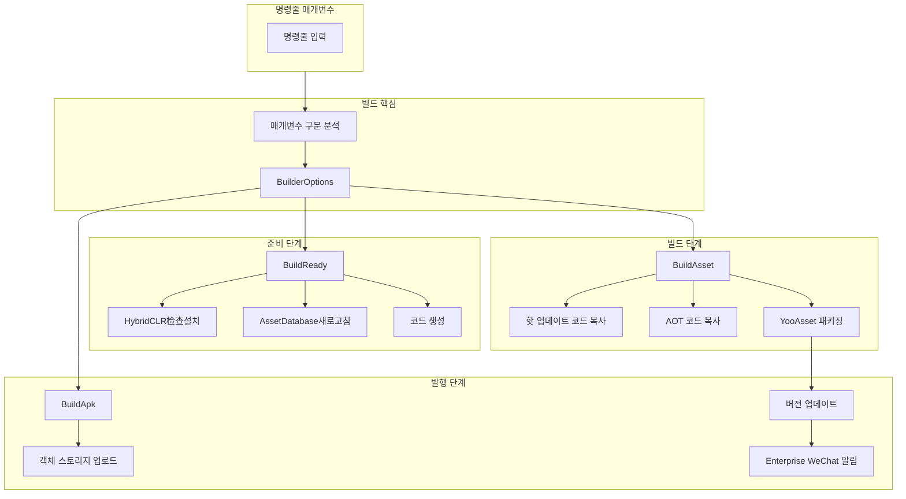
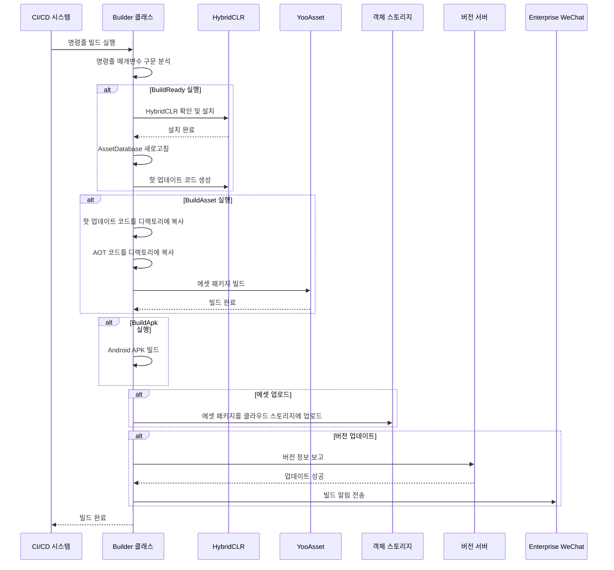

# 빠른 시작

GameFrameX Unity Builder는 Unity 프로젝트의 지속적 통합 및 자동화 패키징을 위한 강력한 자동화 빌드 시스템입니다. 명령줄 매개변수 기반으로 환경 준비, 에셋 패키징, APK 빌드까지의 전체 프로세스를 자동으로 완료할 수 있습니다.

## 개요

GameFrameX Builder는 GameFrameX 게임 프레임워크의 핵심 컴포넌트 중 하나로, Unity 프로젝트 자동화 빌드의 문제 해결에 중점을 두고 있습니다. 명령줄 매개변수를 구문 분석하여 빌드 프로세스를 구성하며, 다음 핵심 기능을 지원합니다:

- **패키지 준비 (BuildReady)**: HybridCLR 핫 업데이트 프레임워크를 자동으로 확인 및 설치하고 코드 생성 실행
- **에셋 패키징 (BuildAsset)**: YooAsset을 사용하여 게임 에셋 패키지를 빌드하고 증분 빌드 지원
- **APK 빌드 (BuildApk)**: Android 설치 패키지 자동 빌드
- **객체 스토리지 업로드**: Tencent Cloud, Ali Cloud, 칠리우 Cloud 등 주요 클라우드 스토리지 지원
- **버전 업데이트 알림**: Enterprise WeChat을 통해 자동으로 에셋 패키지 버전을 업데이트하고 알림 전송

## 아키텍처 개요



## 핵심 프로세스

### 빌드 프로세스 시퀀스 다이어그램



## 명령줄 매개변수

### 필수 매개변수

| 매개변수 | 설명 | 예시 |
|------|------|------|
| `-executeMethod` | 실행 메서드 | `GameFrameX.Builder.Editor.Builder.BuildAsset` |
| `-BUILD_NUMBER` | 빌드 번호 | `1001` |

### 빌드 구성 매개변수

| 매개변수 | 설명 | 기본값 |
|------|------|--------|
| `-JOB_NAME` | 작업 이름 | - |
| `-PackageName` | 에셋 패키지 이름 | `DefaultPackage` |
| `-ChannelName` | 채널 이름 | `default` |
| `-BundleId` | 패키지 이름 | 프로젝트 기본값 |
| `-AppVersion` | 프로그램 버전 번호 | 프로젝트 기본값 |
| `-IsIncrementalBuildPackage` | 증분 빌드 여부 | `false` |
| `-Language` | 언어 | `default` |

### 객체 스토리지 매개변수

| 매개변수 | 설명 |
|------|------|
| `-ObjectStorageKey` | 객체 스토리지 AccessKey |
| `-ObjectStorageSecret` | 객체 스토리지 SecretKey |
| `-ObjectStorageBucketName` | 스토리지 버킷 이름 |
| `-ObjectStorageEndPoint` | 리전 노드 |

### 업로드 제어 매개변수

| 매개변수 | 설명 |
|------|------|
| `-IsUploadLogFile` | 로그 파일 업로드 여부 |
| `-IsUploadAsset` | 에셋 패키지 업로드 여부 |
| `-IsUploadApk` | APK 업로드 여부 |
| `-IsUpdateAssetPackageVersion` | 에셋 패키지 버전 업데이트 여부 |
| `-UpdateAssetPackageVersionUrl` | 버전 업데이트 서버 URL |
| `-UpdateAssetPackageVersionAuthorization` | 버전 업데이트 인증 코드 |
| `-WeChatBotKey` | Enterprise WeChat 봇 Key |

## 사용 예시

### Jenkins 빌드 작업 구성

```groovy
// Jenkinsfile 예시
pipeline {
    agent any
    stages {
        stage('빌드') {
            steps {
                bat '''
                    Unity.exe -projectPath "${WORKSPACE}" ^
                    -executeMethod GameFrameX.Builder.Editor.Builder.BuildAsset ^
                    -BUILD_NUMBER "${BUILD_NUMBER}" ^
                    -JOB_NAME "${JOB_NAME}" ^
                    -PackageName "GamePackage" ^
                    -ChannelName "official" ^
                    -IsUploadLogFile true ^
                    -IsUploadAsset true ^
                    -logFile "../Logs/build_${BUILD_NUMBER}.log"
                '''
            }
        }
    }
}
```

> Source: [Builder.cs](https://github.com/GameFrameX/com.gameframex.unity.builder/blob/main/Editor/Builder.cs#L60-L181)

### 완전한 빌드 명령 예시

```bash
Unity.exe -projectPath "D:\UnityProject\MyGame" ^
-executeMethod GameFrameX.Builder.Editor.Builder.BuildAsset ^
-BUILD_NUMBER "1001" ^
-JOB_NAME "DailyBuild" ^
-PackageName "GamePackage" ^
-ChannelName "official" ^
-Language "zh-CN" ^
-ObjectStorageKey "your_access_key" ^
-ObjectStorageSecret "your_secret_key" ^
-ObjectStorageBucketName "game-assets" ^
-ObjectStorageEndPoint "ap-guangzhou" ^
-IsUploadLogFile true ^
-IsUploadAsset true ^
-IsUpdateAssetPackageVersion true ^
-UpdateAssetPackageVersionUrl "https://api.example.com/version" ^
-UpdateAssetPackageVersionAuthorization "Bearer token" ^
-WeChatBotKey "your_wechat_key" ^
-logFile "../Logs/build_1001.log"
```

### 다양한 빌드 단계

요구에 따라 다른 실행 메서드를 선택합니다:

```csharp
// 패키지 준비 - HybridCLR 설치, 핫 업데이트 코드 생성
-executeMethod GameFrameX.Builder.Editor.Builder.BuildReady

// 에셋 패키지 빌드
-executeMethod GameFrameX.Builder.Editor.Builder.BuildAsset

// APK 빌드 - 설치 패키지 패키징
-executeMethod GameFrameX.Builder.Editor.Builder.BuildApk
```

> Source: [Builder.cs](https://github.com/GameFrameX/com.gameframex.unity.builder/blob/main/Editor/Builder.cs#L183-L345)

## 빌드 옵션 구성

BuilderOptions 클래스는 모든 빌드 구성 옵션을 캡슐화합니다:

```csharp
public class BuilderOptions
{
    // 로그 파일 경로
    public string LogFilePath { get; set; }
    
    // 실행 메서드
    public string ExecuteMethod { get; set; }
    
    // 빌드 번호
    public string BuildNumber { get; set; }
    
    // 객체 스토리지 구성
    public string ObjectStorageKey { get; set; }
    public string ObjectStorageSecret { get; set; }
    public string ObjectStorageBucketName { get; set; }
    public string ObjectStorageEndPoint { get; set; }
    
    // 빌드 구성
    public string JobName { get; set; }
    public string ChannelName { get; set; } = "default";
    public string BundleId { get; set; }
    public string AppVersion { get; set; }
    public string PackageName { get; set; } = "DefaultPackage";
    public bool IsIncrementalBuildPackage { get; set; }
    
    // 업로드 제어
    public bool IsUploadLogFile { get; set; }
    public bool IsUploadAsset { get; set; }
    public bool IsUploadApk { get; set; }
    public bool IsUpdateAssetPackageVersion { get; set; }
    
    // 버전 업데이트
    public string UpdateAssetPackageVersionUrl { get; set; }
    public string UpdateAssetPackageVersionAuthorization { get; set; }
    
    // 알림
    public string Language { get; set; } = "default";
    public string WeChatBotKey { get; set; }
}
```

> Source: [BuilderOptions.cs](https://github.com/GameFrameX/com.gameframex.unity.builder/blob/main/Editor/BuilderOptions.cs#L5-L116)

## 기능 특성 설명

### 핫 업데이트 지원

빌드 시스템은 HybridCLR와 깊이 통합되어 다음을 지원합니다:
- HybridCLR 설치 상태 자동 확인
- HybridCLR 자동 설치 및 구성
- 핫 업데이트 코드 자동 생성

### 에셋 패키징

YooAsset을 사용하여 에셋 패키징:
- 증분 빌드 및 전체 빌드 지원
- 핫 업데이트 코드 및 AOT 코드 자동 복사
- 에셋 패키지 버전 번호 자동 생성 지원

### 객체 스토리지

다양한 클라우드 스토리지 서비스 지원:

| 클라우드 서비스 제공자 | 조건부 컴파일 심볼 | 설명 |
|---------|-------------|------|
| Tencent Cloud | `ENABLE_GAME_FRAME_X_OBJECT_STORAGE_TENCENT` | Tencent Cloud COS |
| Ali Cloud | `ENABLE_GAME_FRAME_X_OBJECT_STORAGE_A_LI_YUN` | Ali Cloud OSS |
| 칠리우 Cloud | `ENABLE_GAME_FRAME_X_OBJECT_STORAGE_QI_NIU` | 칠리우 Cloud Kodo |

> Source: [Builder.cs](https://github.com/GameFrameX/com.gameframex.unity.builder/blob/main/Editor/Builder.cs#L40-L53)

### 버전 업데이트 알림

빌드 완료 후 자동:
1. 버전 정보를 버전 서버에 보고
2. Enterprise WeChat을 통해 빌드 알림 전송

> Source: [BuilderUpdateAssetPackageVersionHelper.cs](https://github.com/GameFrameX/com.gameframex.unity.builder/blob/main/Editor/BuilderUpdateAssetPackageVersionHelper.cs#L51-L85)
> Source: [WeChatNotifyWorkHelper.cs](https://github.com/GameFrameX/com.gameframex.unity.builder/blob/main/Editor/WeChatNotifyWorkHelper.cs#L45-L71)

## 의존성

이 빌드 시스템은 다음 핵심 컴포넌트에 의존합니다:

| 의존성 패키지 | 설명 |
|--------|------|
| GameFrameX.Editor | 편집기 도구 기본 클래스 |
| GameFrameX.Runtime | 런타임 기본 라이브러리 |
| YooAsset | 에셋 관리 패키지 |
| HybridCLR | IL2CPP 핫 업데이트 솔루션 |

## 관련 링크

- [설치 가이드](./2-installation)
- [사용 방법](./4-usage)
- [구성 옵션](./5-configuration)
- [객체 스토리지 구성](./6-object-storage)
- [문제 해결](./7-troubleshooting)
- [GitHub 저장소](https://github.com/GameFrameX/com.gameframex.unity.builder.git)
- [공식 문서](https://gameframex.doc.alianblank.com)