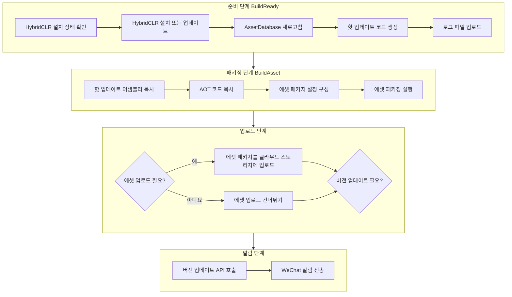

# 사용 방법

GameFrameX Builder는 완전한 Unity 자동화 빌드 솔루션을 제공하며, 명령줄 기반 빌드, 에셋 패키징, 객체 스토리지 통합 및 빌드 알림等功能을 지원합니다.

## 개요

GameFrameX Builder는 GameFrameX 프레임워크의 핵심 빌드 모듈로, Unity 프로젝트의 자동화 빌드 프로세스를 구현하도록 설계되었습니다. 이 모듈은 명령줄 매개변수를 통해 빌드 구성을 수신하며, 에셋 패키징, APK 빌드, 핫 업데이트 처리 등 다양한 빌드 시나리오를 지원합니다. 지속적 통합/지속적 배포(CI/CD) 환경에서 개발자는 Jenkins, GitLab CI 등을 통해 Builder를 호출하여 완전 자동화된 빌드 및 배포 프로세스를 구현할 수 있습니다.

Builder 모듈의 핵심 설계 철학은 복잡한 빌드 프로세스를 독립적이고 조합 가능한 단계로 분리하는 것입니다. 각 빌드 단계(BuildReady, BuildAsset, BuildApk)는 독립적으로 호출할 수 있으며, 이 설계는 빌드 프로세스에 높은 유연성을 제공합니다. 개발자는 프로젝트 요구에 따라 특정 단계를 선택적으로 실행하거나 여러 단계를 결합하여 완전한 빌드 파이프라인을 구성할 수 있습니다.

## 핵심 개념

### 빌드 매개변수

Builder는 명령줄 매개변수를 통해 빌드 구성을 전달하며, 이는主流 CI/CD 시스템과 완벽하게 호환됩니다. 모든 빌드 옵션은 명령줄 매개변수를 통해 지정되며, 빌드 대상, 패키지 이름, 채널, 버전 번호, 업로드 옵션 등을 포함합니다. 이러한 설계는 빌드 스크립트를 완전히 외부화하여 다양한 환경 간 재사용을 용이하게 합니다.

> Source: [Editor/BuilderOptions.cs](https://github.com/GameFrameX/com.gameframex.unity.builder/blob/main/Editor/BuilderOptions.cs#L1-L117)

### 빌드 메서드

Builder는 세 가지 주요 정적 메서드를 제공하며, 각각 다른 빌드 단계에 해당합니다:

- **BuildReady**: 빌드 준비 단계로, 빌드 환경 초기화 담당
- **BuildAsset**: 에셋 패키징 단계로, YooAsset을 사용하여 에셋 패키지 빌드
- **BuildApk**: APK 빌드 단계로, Android 설치 패키지 생성

> Source: [Editor/Builder.cs](https://github.com/GameFrameX/com.gameframex.unity.builder/blob/main/Editor/Builder.cs#L30-L346)

### 객체 스토리지

Builder는 칠리우 Cloud, Tencent Cloud, Ali Cloud 등 여러 객체 스토리지 서비스 제공자를 통합합니다. 빌드 완료 후 빌드 산출물(APK, 에셋 패키지, 로그 파일)을 자동으로 지정된 객체 스토리지 버킷에 업로드할 수 있습니다. 이 기능은 빌드 산출물의 배포 및 관리를 크게 용이하게 합니다.

## 빌드 프로세스

GameFrameX Builder의 빌드 프로세스는 표준 CI/CD 파이프라인 모드를 따르며, 준비, 패키징, 업로드, 알림의 네 가지 주요 단계로 구성됩니다. 각 단계는 명확한 책임 경계를 가지며, 매개변수 구성을 통해 유연한 프로세스 제어를 구현합니다.



### 준비 단계

준비 단계(BuildReady)는 빌드 프로세스의 초기화 단계로, 주로 다음 작업을 완료합니다:

먼저 HybridCLR이 설치되어 있는지 확인합니다. HybridCLR은 Unity 핫 업데이트 솔루션으로 C# 코드의 핫 배포를 구현할 수 있습니다. HybridCLR이 설치되어 있지 않거나 버전이 일치하지 않으면 시스템이 자동으로 설치 프로세스를 실행합니다. 이는 핫 업데이트 기능이 정상적으로 작동하도록 하는 핵심 단계입니다.

HybridCLR 처리 후 시스템이 Unity의 AssetDatabase를 새로고침하여 모든 에셋 변경 사항이 올바르게 인식되도록 합니다. 그런 다음 PrebuildCommand.GenerateAll()을 호출하여 핫 업데이트에 필요한 프록시 코드를 생성하며, 이 코드는 핫 업데이트 기능의 정상 작동에 필수적입니다.

로그 업로드 옵션(-IsUploadLogFile)이 구성되어 있으면 준비 단계 종료 시 빌드 로그를 객체 스토리지에 업로드하여 후속 문제 分析을 용이하게 합니다.

> Source: [Editor/Builder.cs](https://github.com/GameFrameX/com.gameframex.unity.builder/blob/main/Editor/Builder.cs#L215-L250)

### 패키징 단계

패키징 단계(BuildAsset)는 게임의 에셋 패키지를 생성하는 핵심环节으로, 전체 빌드 프로세스의 중심입니다. 이 단계는 먼저 핫 업데이트 어셈블리와 AOT 코드를 지정된 디렉토리에 복사한 다음 YooAsset을 사용하여 에셋 패키징을 실행합니다.

에셋 패키징 전 시스템은 에셋 패키지 파일 이름의 대소문자 설정을 대소문자 무관하게 설정(LocationToLower = true)하여 에셋 패키지가 다양한 플랫폼에서 일관되도록 합니다. 그런 다음 내장 빌드 파이프라인(BuiltinBuildPipeline)을 생성하여 빌드 매개변수(包括构建模式, 대상 플랫폼, 버전 번호 등)를 구성합니다.

빌드 완료 후 구성 옵션에 따라 에셋 패키지를 업로드할지 결정합니다. 에셋 업로드 기능이 활성화되면 시스템이 전체 출력 디렉토리를 객체 스토리지에 업로드합니다. 버전 업데이트 기능이 활성화되면 시스템이 버전 업데이트 API를 호출하여 게임 서버에 현재 에셋 패키지 정보를 알립니다.

> Source: [Editor/Builder.cs](https://github.com/GameFrameX/com.gameframex.unity.builder/blob/main/Editor/Builder.cs#L255-L345)

### APK 빌드 단계

APK 빌드 단계(BuildApk)는 Android 설치 패키지 생성을 위해 전용으로 사용됩니다. 이 단계는 BuildProductHelper.BuildPlayerAndroid()를 호출하여 네이티브 Android 빌드 프로세스를 실행하여 서명된 APK 파일을 생성합니다.

빌드 완료 후 APK 업로드 옵션(-IsUploadApk)이 구성되어 있으면 시스템이 생성된 APK 파일을 객체 스토리지에 업로드합니다. 동시에 로그 업로드 옵션을 선택할 수 있어 문제 分析을 용이하게 합니다.

> Source: [Editor/Builder.cs](https://github.com/GameFrameX/com.gameframex.unity.builder/blob/main/Editor/Builder.cs#L194-L210)

### 알림 단계

알림 단계는 빌드 완료 후 자동으로 실행되며, 버전 업데이트 알림과 Enterprise WeChat 알림의 두 가지 기능으로 구성됩니다.

버전 업데이트 기능은 지정된 HTTP 인터페이스에 현재 빌드의 버전 정보를 전송하며, 여기에는 애플리케이션 버전, 에셋 패키지 버전, 패키지 이름, 플랫폼, 채널, 언어 등의 정보가 포함됩니다. 이 정보는 게임 클라이언트가 에셋을 올바르게 로드하는 데 필수적입니다.

Enterprise WeChat 알림 기능은 빌드 완료 후 자동으로 빌드 결과 알림을 전송하며, 알림 내용에는 빌드 시간, 에셋 버전, 게임 버전, 패키지 이름, 에셋 패키지 이름, 플랫폼, 채널, 언어 등의 정보가 포함됩니다. 팀원들은 WeChat을 통해 빌드 상태를 즉시 파악할 수 있습니다.

> Source: [Editor/WeChatNotifyWorkHelper.cs](https://github.com/GameFrameX/com.gameframex.unity.builder/blob/main/Editor/WeChatNotifyWorkHelper.cs#L40-L72)

## 명령줄 매개변수

Builder는 명령줄 매개변수를 통해 빌드 구성을 수신합니다. 다음은 지원되는 모든 매개변수及其 설명입니다:

| 매개변수 | 유형 | 필수 | 기본값 | 설명 |
|------|------|------|--------|------|
| -executeMethod | string | 예 | - | 실행할 빌드 메서드, 예: GameFrameX.Builder.Editor.Builder.BuildAsset |
| -BUILD_NUMBER | string | 예 | - | 빌드 번호, 버전 식별용 |
| -logFile | string | 아니요 | 자동 생성 | 로그 파일 출력 경로 |
| -JOB_NAME | string | 아니요 | - | CI/CD 작업 이름 |
| -PackageName | string | 아니요 | DefaultPackage | 에셋 패키지 이름 |
| -ChannelName | string | 아니요 | default | 채널 이름 |
| -BundleId | string | 아니요 | 프로젝트 구성 | Android 패키지 이름 |
| -AppVersion | string | 아니요 | 프로젝트 구성 | 애플리케이션 버전 번호 |
| -IsIncrementalBuildPackage | flag | 아니요 | false | 증분 빌드 활성화 |
| -IsUploadLogFile | flag | 아니요 | false | 로그 파일을 클라우드 스토리지에 업로드 |
| -IsUploadAsset | flag | 아니요 | false | 에셋 패키지를 클라우드 스토리지에 업로드 |
| -IsUploadApk | flag | 아니요 | false | APK를 클라우드 스토리지에 업로드 |
| -IsUpdateAssetPackageVersion | flag | 아니요 | false | 버전 업데이트 API 호출 |
| -UpdateAssetPackageVersionUrl | string | 아니요 | - | 버전 업데이트 API 주소 |
| -UpdateAssetPackageVersionAuthorization | string | 아니요 | - | 버전 업데이트 API 인증 코드 |
| -Language | string | 아니요 | default | 에셋 언어 |
| -WeChatBotKey | string | 아니요 | - | Enterprise WeChat 봇 Key |
| -ObjectStorageKey | string | 아니요 | - | 객체 스토리지 액세스 Key |
| -ObjectStorageSecret | string | 아니요 | - | 객체 스토리지 액세스 비밀키 |
| -ObjectStorageBucketName | string | 아니요 | - | 객체 스토리지 버킷 이름 |
| -ObjectStorageEndPoint | string | 아니요 | - | 객체 스토리지 리전 노드 |

> Source: [Editor/Builder.cs](https://github.com/GameFrameX/com.gameframex.unity.builder/blob/main/Editor/Builder.cs#L60-L181)

## 사용 예시

### 기본 빌드 프로세스

Jenkins를 사용한 자동화 빌드의 완전한 예시:

```bash
# Unity 설치 디렉토리로 이동
cd /Applications/Unity/Hub/Editor/2021.3.0f1/Unity.app/Contents/MacOS

# 빌드 명령 실행
./Unity \
  -projectPath /path/to/your/project \
  -executeMethod GameFrameX.Builder.Editor.Builder.BuildAsset \
  -BUILD_NUMBER=1001 \
  -JobName=Game_Build \
  -PackageName=DefaultPackage \
  -ChannelName=official \
  -IsIncrementalBuildPackage \
  -logFile=/var/jenkins/workspace/logs/build_1001.log
```

> Source: [Editor/Builder.cs](https://github.com/GameFrameX/com.gameframex.unity.builder/blob/main/Editor/Builder.cs#L60-L80)

### 완전한 빌드 프로세스 (업로드 포함)

에셋 패키징, 업로드, 버전 업데이트를 포함한 완전한 CI/CD 빌드 프로세스 예시:

```bash
# 완전한 빌드 명령
./Unity \
  -projectPath /path/to/your/project \
  -executeMethod GameFrameX.Builder.Editor.Builder.BuildAsset \
  -BUILD_NUMBER=1001 \
  -JobName=Game_Build \
  -PackageName=DefaultPackage \
  -ChannelName=official \
  -AppVersion=1.2.3 \
  -BundleId=com.gameframex.mygame \
  -IsIncrementalBuildPackage \
  -IsUploadAsset \
  -IsUpdateAssetPackageVersion \
  -UpdateAssetPackageVersionUrl=https://api.example.com/version/update \
  -UpdateAssetPackageVersionAuthorization=Bearer_token_here \
  -WeChatBotKey=your_wechat_bot_key \
  -ObjectStorageKey=your_access_key \
  -ObjectStorageSecret=your_secret_key \
  -ObjectStorageBucketName=game-bucket \
  -ObjectStorageEndPoint=cn-bj \
  -Language=zh-CN \
  -logFile=/var/jenkins/workspace/logs/build_1001.log
```

### APK 빌드 프로세스

Android APK를 빌드해야 하는 경우 다음 명령을 사용합니다:

```bash
# APK 빌드 명령
./Unity \
  -projectPath /path/to/your/project \
  -executeMethod GameFrameX.Builder.Editor.Builder.BuildApk \
  -BUILD_NUMBER=1001 \
  -JobName=Game_APK_Build \
  -PackageName=DefaultPackage \
  -ChannelName=official \
  -AppVersion=1.2.3 \
  -BundleId=com.gameframex.mygame \
  -IsUploadApk \
  -ObjectStorageKey=your_access_key \
  -ObjectStorageSecret=your_secret_key \
  -ObjectStorageBucketName=game-bucket \
  -ObjectStorageEndPoint=cn-bj \
  -logFile=/var/jenkins/workspace/logs/apk_build_1001.log
```

### 빌드 준비 프로세스

일부 시나리오에서는 빌드 준비 작업만 실행해야 할 수 있습니다(예: HybridCLR 업데이트):

```bash
# 빌드 준비 명령
./Unity \
  -projectPath /path/to/your/project \
  -executeMethod GameFrameX.Builder.Editor.Builder.BuildReady \
  -BUILD_NUMBER=1001 \
  -JobName=Game_Prepare \
  -IsUploadLogFile \
  -logFile=/var/jenkins/workspace/logs/prepare_1001.log
```

## 객체 스토리지 구성

Builder는 세 가지主流 객체 스토리지 서비스를 지원합니다: 칠리우 Cloud, Tencent Cloud, Ali Cloud. 선택한 스토리지 서비스에 따라 빌드 명령에서 해당 매개변수를 구성해야 합니다.

### 칠리우 Cloud 구성

```bash
# 칠리우 Cloud 사용 시 구성
-ObjectStorageKey=your_qiniu_access_key \
-ObjectStorageSecret=your_qiniu_secret_key \
-ObjectStorageBucketName=your_bucket \
-ObjectStorageEndPoint=cn-bj
```

### Tencent Cloud 구성

```bash
# Tencent Cloud 사용 시 구성
-ObjectStorageKey=your_tencent_secret_id \
-ObjectStorageSecret=your_tencent_secret_key \
-ObjectStorageBucketName=your_bucket \
-ObjectStorageEndPoint=ap-beijing
```

### Ali Cloud 구성

```bash
# Ali Cloud 사용 시 구성
-ObjectStorageKey=your_aliyun_access_key \
-ObjectStorageSecret=your_aliyun_secret_key \
-ObjectStorageBucketName=your_bucket \
-ObjectStorageEndPoint=oss-cn-beijing
```

> Source: [Editor/Builder.cs](https://github.com/GameFrameX/com.gameframex.unity.builder/blob/main/Editor/Builder.cs#L40-L53)

## 버전 업데이트 및 알림

### 버전 업데이트 API 구성

버전 업데이트 기능을 활성화하면 Builder가 지정된 HTTP 인터페이스에 버전 정보를 전송합니다:

```bash
-IsUpdateAssetPackageVersion \
-UpdateAssetPackageVersionUrl=https://api.example.com/version/update \
-UpdateAssetPackageVersionAuthorization=Bearer_your_token
```

요청 콘텐츠 형식:

```json
{
  "AppVersion": "1.2.3",
  "PackageName": "com.gameframex.mygame",
  "AssetPackageVersion": "20240101120000",
  "AssetPackageName": "DefaultPackage",
  "Platform": "Android",
  "Language": "zh-CN",
  "Channel": "official"
}
```

> Source: [Editor/BuilderUpdateAssetPackageVersionHelper.cs](https://github.com/GameFrameX/com.gameframex.unity.builder/blob/main/Editor/BuilderUpdateAssetPackageVersionHelper.cs#L51-L85)

### WeChat 알림 구성

WeChat Enterprise 봇 구성 후 빌드 완료 시 자동으로 알림이 전송됩니다:

```bash
-WeChatBotKey=your_wechat_bot_key
```

알림 메시지는 Markdown 형식으로, 빌드 시간, 에셋 버전, 게임 버전, 패키지 이름, 에셋 패키지 이름, 플랫폼, 채널, 언어 등의 정보를 포함합니다.

> Source: [Editor/WeChatNotifyWorkHelper.cs](https://github.com/GameFrameX/com.gameframex.unity.builder/blob/main/Editor/WeChatNotifyWorkHelper.cs#L45-L71)

## GitLab CI 통합 예시

GitLab CI에 통합된 완전한 구성 예시:

```yaml
stages:
  - build
  - upload

build-android:
  stage: build
  image: unityci/editor:2021.3.0f1-android
  script:
    - |
      /opt/Unity/Editor/Unity \
        -projectPath ${CI_PROJECT_DIR} \
        -executeMethod GameFrameX.Builder.Editor.Builder.BuildAsset \
        -BUILD_NUMBER=${CI_PIPELINE_ID} \
        -JobName=${CI_JOB_NAME} \
        -PackageName=DefaultPackage \
        -ChannelName=official \
        -AppVersion=1.2.3 \
        -BundleId=com.gameframex.mygame \
        -IsIncrementalBuildPackage \
        -IsUploadAsset \
        -IsUpdateAssetPackageVersion \
        -UpdateAssetPackageVersionUrl=${VERSION_API_URL} \
        -UpdateAssetPackageVersionAuthorization=${API_TOKEN} \
        -WeChatBotKey=${WECHAT_BOT_KEY} \
        -ObjectStorageKey=${OSS_KEY} \
        -ObjectStorageSecret=${OSS_SECRET} \
        -ObjectStorageBucketName=game-bucket \
        -ObjectStorageEndPoint=cn-bj \
        -Language=zh-CN
  artifacts:
    paths:
      - Logs/
    expire_in: 7 days
```

## Jenkins Pipeline 통합 예시

Jenkins Pipeline의 구성 예시:

```groovy
pipeline {
    agent any
    
    parameters {
        string(name: 'PACKAGE_NAME', defaultValue: 'DefaultPackage', description: '에셋 패키지 이름')
        string(name: 'CHANNEL_NAME', defaultValue: 'official', description: '채널 이름')
        string(name: 'APP_VERSION', defaultValue: '1.2.3', description: '애플리케이션 버전')
        booleanParam(name: 'INCREMENTAL_BUILD', defaultValue: true, description: '증분 빌드')
        booleanParam(name: 'UPLOAD_ASSET', defaultValue: true, description: '에셋 업로드')
        booleanParam(name: 'UPDATE_VERSION', defaultValue: true, description: '버전 업데이트')
    }
    
    stages {
        stage('빌드') {
            steps {
                bat """
                    "${UNITY_PATH}\\Editor\\Unity.exe" \
                        -projectPath "${WORKSPACE}" \
                        -executeMethod GameFrameX.Builder.Editor.Builder.BuildAsset \
                        -BUILD_NUMBER=${BUILD_NUMBER} \
                        -JobName=${JOB_NAME} \
                        -PackageName=${params.PACKAGE_NAME} \
                        -ChannelName=${params.CHANNEL_NAME} \
                        -AppVersion=${params.APP_VERSION} \
                        ${params.INCREMENTAL_BUILD ? '-IsIncrementalBuildPackage' : ''} \
                        ${params.UPLOAD_ASSET ? '-IsUploadAsset' : ''} \
                        ${params.UPDATE_VERSION ? '-IsUpdateAssetPackageVersion' : ''} \
                        -UpdateAssetPackageVersionUrl=${VERSION_API_URL} \
                        -UpdateAssetPackageVersionAuthorization=${API_TOKEN} \
                        -WeChatBotKey=${WECHAT_BOT_KEY} \
                        -ObjectStorageKey=${OSS_KEY} \
                        -ObjectStorageSecret=${OSS_SECRET} \
                        -ObjectStorageBucketName=${OSS_BUCKET} \
                        -ObjectStorageEndPoint=cn-bj
                """
            }
        }
    }
}
```

## 관련 링크

- [구성 옵션](./5-configuration) - 모든 빌드 구성 옵션 상세
- [객체 스토리지](./6-object-storage) - 객체 스토리지 서비스 구성 및 사용
- [문제 해결](./7-troubleshooting) - 빌드 과정에서 흔한 문제 및 해결책
- [개요](./1-overview) - GameFrameX Builder 개요 및 아키텍처
- [설치](./2-installation) - 환경 구성 및 설치 가이드
- [빠른 시작](./3-getting-started) - 빠른 시작 튜토리얼