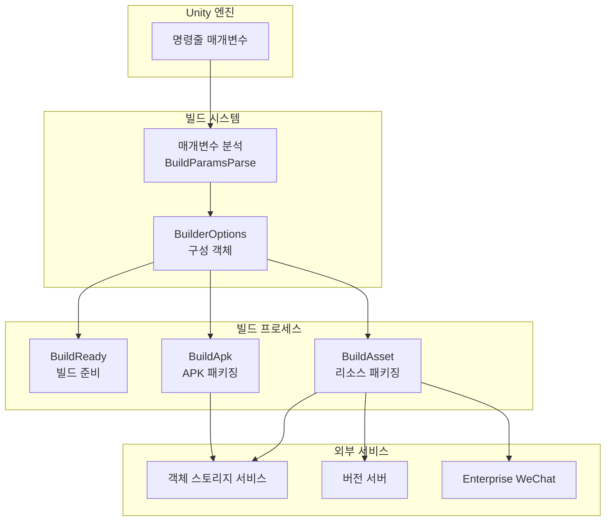
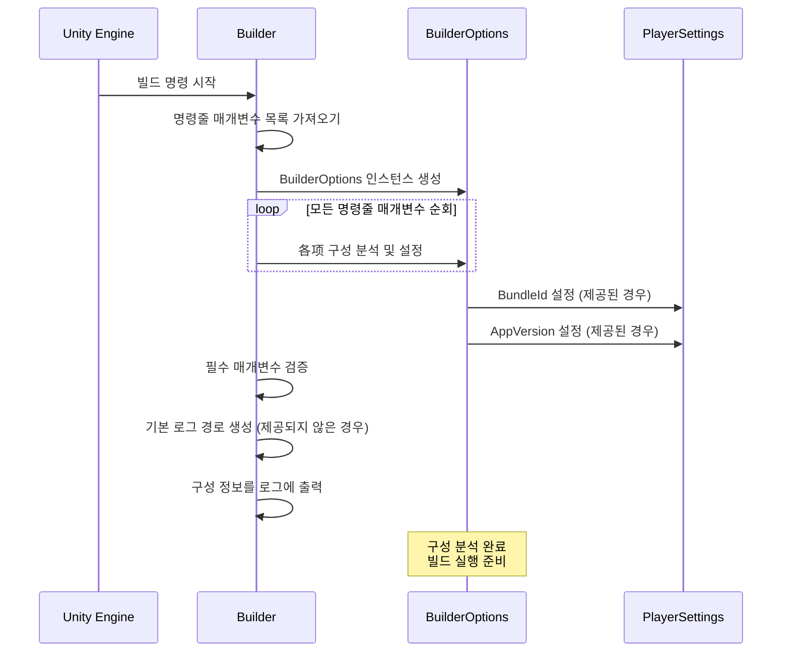

# 구성 옵션

GameFrameX Unity Builder는 명령줄 매개변수를 통해 빌드 구성을 수신하여 자동화된 빌드 프로세스를 구현합니다. 이 문서에서는 사용 가능한 모든 구성 옵션과 그 사용 방법을 상세히 설명합니다.

## 개요

BuilderOptions 클래스는 모든 빌드 관련 구성 옵션을 캡슐화하며, 이러한 옵션들은 Unity 명령줄을 통해 빌드 스크립트에 전달됩니다. 구성 옵션은 다음과 같이 분류됩니다:

- **기본 구성**: 로그 경로, 실행 메서드, 빌드 번호 등
- **버전 구성**: 패키지 이름, 프로그램 버전 번호, 리소스 패키지 버전 등
- **객체 스토리지 구성**: 클라우드 스토리지 키, 버킷 이름, 엔드포인트 등
- **빌드 동작 구성**: 증분 빌드 여부, 리소스 업로드 여부 등
- **알림 구성**: 리소스 버전 업데이트 URL, 위챗 봇 키 등

## 구성 옵션 상세

### 기본 구성

| 명령줄 매개변수 | 유형 | 기본값 | 설명 |
|-----------|------|--------|------|
| `-logFile` | string | 자동 생성 | 로그 파일 경로, 빌드 프로세스 중 로그 저장을 위함 |
| `-executeMethod` | string | 필수 | 실행할 빌드 메서드, 예: `GameFrameX.Builder.Editor.Builder.BuildApk` |
| `-BUILD_NUMBER` | string | 필수 | 빌드 번호, 본 빌드를 식별하는 데 사용 |
| `-JOB_NAME` | string | 필수 | 작업 이름, 서로 다른 빌드 작업을 구분하는 데 사용 |

### 버전 구성

| 명령줄 매개변수 | 유형 | 기본값 | 설명 |
|-----------|------|--------|------|
| `-BundleId` | string | 프로젝트 기본값 | 패키지 이름 (Bundle Identifier), 비어 있으면 프로젝트에 구성된 패키지 이름 사용 |
| `-AppVersion` | string | 프로젝트 기본값 | 프로그램 버전 번호, 비어 있으면 프로젝트에 구성된 버전 사용 |

### 채널 구성

| 명령줄 매개변수 | 유형 | 기본값 | 설명 |
|-----------|------|--------|------|
| `-ChannelName` | string | "default" | 채널 이름, 서로 다른 배포 채널의 빌드를 구분하는 데 사용 |

### 리소스 패키지 구성

다음 옵션은 `BuildAsset` 메서드 호출 시 유효합니다:

| 명령줄 매개변수 | 유형 | 기본값 | 설명 |
|-----------|------|--------|------|
| `-PackageName` | string | "DefaultPackage" | 리소스 패키지 이름, 빌드할 리소스 패키지를 식별 |
| `-IsIncrementalBuildPackage` | flag | false | 증분 빌드 방식을 사용하여 리소스 패키지를 빌드할지 여부 |

### 객체 스토리지 구성

객체 스토리지 서비스의 자격 증명 정보를 구성합니다:

| 명령줄 매개변수 | 유형 | 기본값 | 설명 |
|-----------|------|--------|------|
| `-ObjectStorageKey` | string | - | 객체 스토리지의 Access Key |
| `-ObjectStorageSecret` | string | - | 객체 스토리지의 Secret Key |
| `-ObjectStorageBucketName` | string | - | 객체 스토리지 버킷의 이름 |
| `-ObjectStorageEndPoint` | string | - | 객체 스토리지服务的 엔드포인트 주소 |

지원하는 클라우드 서비스 제공자:
- Alibaba Cloud (AliYun)
- Tencent Cloud (Tencent)
- Qiniu Cloud (QiNiu)

### 업로드 동작 구성

| 명령줄 매개변수 | 유형 | 기본값 | 설명 |
|-----------|------|--------|------|
| `-IsUploadLogFile` | flag | false | 빌드 로그 파일을 객체 스토리에 업로드할지 여부 |
| `-IsUploadAsset` | flag | false | 빌드된 리소스 패키지를 객체 스토리에 업로드할지 여부 |
| `-IsUploadApk` | flag | false | 생성된 APK 파일을 객체 스토리에 업로드할지 여부 (BuildApk만 해당) |

### 리소스 버전 업데이트 구성

| 명령줄 매개변수 | 유형 | 기본값 | 설명 |
|-----------|------|--------|------|
| `-IsUpdateAssetPackageVersion` | flag | false | 리소스 패키지 버전을 업데이트할지 여부 |
| `-UpdateAssetPackageVersionUrl` | string | - | 리소스 패키지 버전을 업데이트하는 HTTP 요청 URL |
| `-UpdateAssetPackageVersionAuthorization` | string | - | 리소스 패키지 버전 업데이트의 권한 정보 |

### 다국어 구성

| 명령줄 매개변수 | 유형 | 기본값 | 설명 |
|-----------|------|--------|------|
| `-Language` | string | "default" | 빌드 산출물의 언어 버전 |

### 위챗 알림 구성

| 명령줄 매개변수 | 유형 | 기본값 | 설명 |
|-----------|------|--------|------|
| `-WeChatBotKey` | string | - | Enterprise WeChat 봇의 Webhook 키 |

## 구성 아키텍처



## 구성 분석 프로세스



## 사용 예시

### 기본 Android APK 빌드

```bash
Unity.exe -projectPath "D:\MyGame" \
    -executeMethod GameFrameX.Builder.Editor.Builder.BuildApk \
    -BUILD_NUMBER "1001" \
    -JOB_NAME "daily_build" \
    -logFile "../Logs/BuildApk_1001.log"
```

### 리소스 패키지 빌드 및 업로드

```bash
Unity.exe -projectPath "D:\MyGame" \
    -executeMethod GameFrameX.Builder.Editor.Builder.BuildAsset \
    -BUILD_NUMBER "1001" \
    -JOB_NAME "asset_build" \
    -PackageName "HotUpdateResources" \
    -ChannelName "official" \
    -IsUploadAsset \
    -ObjectStorageKey "your_access_key" \
    -ObjectStorageSecret "your_secret_key" \
    -ObjectStorageBucketName "my-game-bucket" \
    -ObjectStorageEndPoint "https://s3.example.com"
```

### 완전한 빌드 프로세스 (버전 업데이트 및 위챗 알림 포함)

```bash
Unity.exe -projectPath "D:\MyGame" \
    -executeMethod GameFrameX.Builder.Editor.Builder.BuildAsset \
    -BUILD_NUMBER "1002" \
    -JOB_NAME "release_build" \
    -PackageName "GameResources" \
    -ChannelName "official" \
    -AppVersion "1.2.0" \
    -IsUploadAsset \
    -IsUpdateAssetPackageVersion \
    -UpdateAssetPackageVersionUrl "https://api.example.com/version/update" \
    -UpdateAssetPackageVersionAuthorization "Bearer token123" \
    -WeChatBotKey "your_wechat_bot_key" \
    -Language "zh-CN"
```

### 증분 빌드 리소스 패키지

```bash
Unity.exe -projectPath "D:\MyGame" \
    -executeMethod GameFrameX.Builder.Editor.Builder.BuildAsset \
    -BUILD_NUMBER "1003" \
    -JOB_NAME "incremental_build" \
    -PackageName "HotUpdateResources" \
    -IsIncrementalBuildPackage \
    -IsUploadAsset
```

## 구성 검증

Builder는 시작 시 다음 필수 매개변수를 검증합니다:

| 매개변수 | 검증 규칙 |
|------|----------|
| `executeMethod` | 비어 있을 수 없으며, 비어 있으면 예외 발생: `executeMethod is null` |
| `BUILD_NUMBER` | 비어 있을 수 없으며, 비어 있으면 예외 발생: `build number is null` |
| `LogFilePath` | 비어 있으면 executeMethod를 기반으로 자동으로 기본 경로 생성 |

## 환경 변수 및 구성 파일

모든 구성 옵션은 명령줄 매개변수를 통해 전달되며, 구성 파일 통한 설정은 지원하지 않습니다. 이러한 설계는 Builder가 다양한 CI/CD 시스템(Jenkins, GitLab CI, GitHub Actions 등)과 원활하게 통합될 수 있게 합니다.

## 관련 링크

- [빠른 시작](./3-getting-started) - 자동화 빌드 사용 시작 방법
- [사용 방법](./4-usage) - 빌드 프로세스 상세
- [객체 스토리지](./6-object-storage) - 객체 스토리지 통합에 대해 더 자세히 알아보기
- [문제 해결](./7-troubleshooting) - 일반적인 빌드 문제 해결