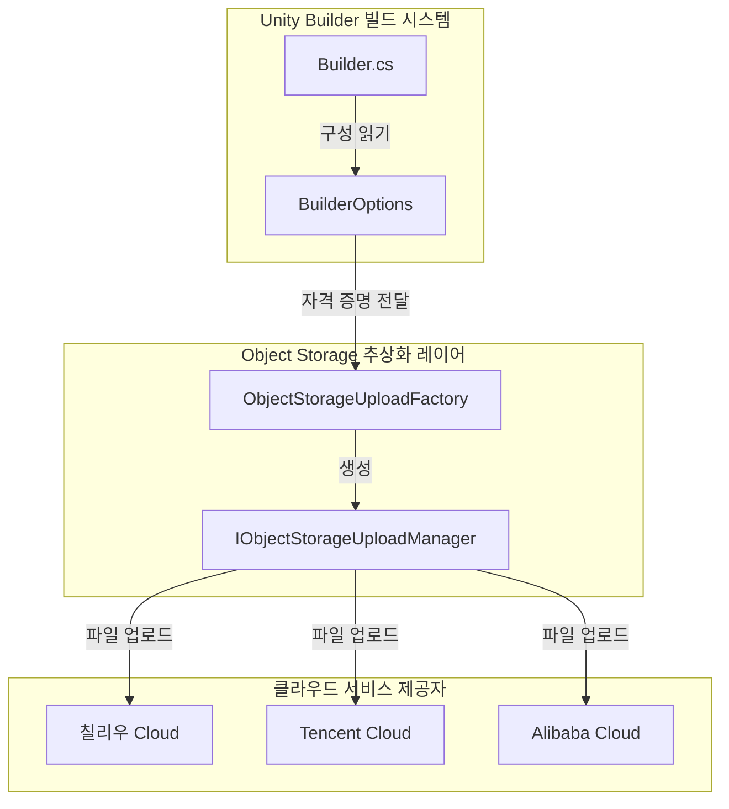
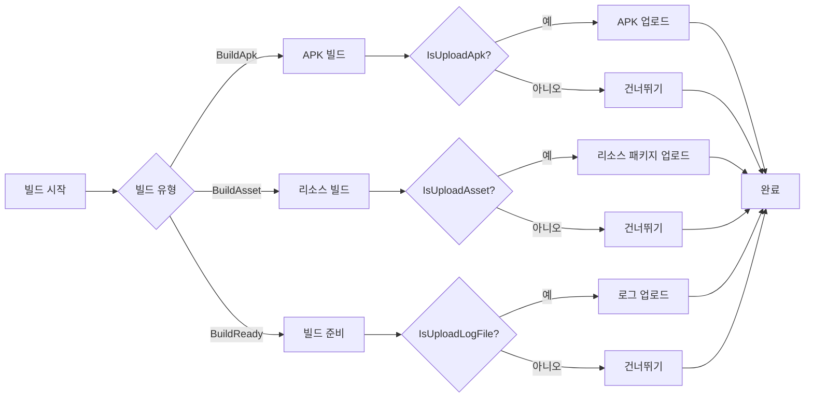

# 객체 스토리지

객체 스토리지 모듈은 Unity Builder가 빌드 산출물(APK, 로그 파일, 리소스 패키지)을 클라우드 객체 스토리지 서비스에 업로드할 수 있는 기능을 제공합니다. 외부 GameFrameX ObjectStorage 패키지를 통합하여 주요 클라우드 서비스 제공자를 지원합니다.

## 개요

객체 스토리지(Object Storage)는 Unity Builder의 핵심 기능 중 하나로, 자동화된 빌드 완료 후 빌드 산출물을 클라우드 스토리지 서비스에 업로드합니다. 이 기능은 지속적 통합/지속적 배포(CI/CD) 워크플로우에서 특히 중요하며, 다음과 같은 것을 구현할 수 있습니다:

- **APK 자동 업로드**: Android 빌드 완료 후 설치 패키지 자동 업로드
- **로그 파일 업로드**: 빌드 로그 실시간 업로드, 원격에서 빌드 상태 조회 용이
- **리소스 패키지 업로드**: AB 리소스 패키지 자동 업로드到 CDN 원본

현재 지원되는 클라우드 서비스 제공자:
- Tencent Cloud 객체 스토리지 (COS)
- Alibaba Cloud 객체 스토리지 (OSS)
- Qiniu Cloud 객체 스토리지 (Kodo)

> 참고: 객체 스토리지 기능은 외부 GameFrameX ObjectStorage 패키지에 의존하며, 프로젝트에서 관련 패키지를 올바르게 설치 및 구성해야 사용 가능합니다.

## 아키텍처



**아키텍처 설명:**

- **Builder**: 빌드 진입점, 명령줄 매개변수 분석 및 빌드 프로세스 트리거 담당
- **BuilderOptions**: 객체 스토리지 관련 구성(키, 시크릿, 버킷, 엔드포인트) 저장
- **ObjectStorageUploadFactory**: 팩토리 클래스, 컴파일 조건에 따라 클라우드 서비스 제공자에 해당하는 UploadManager 생성
- **IObjectStorageUploadManager**: 업로드 관리자 인터페이스, UploadFile 및 UploadDirectory 메서드 정의

## 핵심 기능

### 지원되는 클라우드 서비스 제공자

| 클라우드 서비스 제공자 | 패키지 이름 | 컴파일 매크로 |
|----------|--------|--------|
| 칠리우 Cloud | GameFrameX.ObjectStorage.QiNiu | ENABLE_GAME_FRAME_X_OBJECT_STORAGE_QI_NIU |
| Tencent Cloud | GameFrameX.ObjectStorage.Tencent | ENABLE_GAME_FRAME_X_OBJECT_STORAGE_TENCENT |
| Alibaba Cloud | GameFrameX.ObjectStorage.ALiYun | ENABLE_GAME_FRAME_X_OBJECT_STORAGE_A_LI_YUN |

### 업로드 유형

```csharp
// 단일 파일 업로드
ObjectStorageUploadManager.UploadFile(apkPath);

// 전체 디렉토리 업로드
ObjectStorageUploadManager.SetSavePath(savePath);
ObjectStorageUploadManager.UploadDirectory(uploadPath);
```

> Source: [Builder.cs](https://github.com/GameFrameX/com.gameframex.unity.builder/blob/main/Editor/Builder.cs#L200-L330)

### 업로드 트리거时机



## 구성 옵션

객체 스토리지는 `BuilderOptions` 클래스를 통해 구성되며, 다음 옵션을 지원합니다:

| 옵션 | 유형 | 기본값 | 설명 |
|------|------|--------|------|
| ObjectStorageKey | string | "" | 객체 스토리지의 AccessKey |
| ObjectStorageSecret | string | "" | 객체 스토리지의 SecretKey |
| ObjectStorageBucketName | string | "" | 스토리지 버킷 이름 |
| ObjectStorageEndPoint | string | "" | 스토리지 버킷 리전 노드 |
| IsUploadApk | bool | false | 빌드 완료 후 APK 업로드 여부 |
| IsUploadLogFile | bool | false | 빌드 완료 후 로그 파일 업로드 여부 |
| IsUploadAsset | bool | false | 빌드 완료 후 리소스 패키지 업로드 여부 |

> Source: [BuilderOptions.cs](https://github.com/GameFrameX/com.gameframex.unity.builder/blob/main/Editor/BuilderOptions.cs#L22-L40)

## 명령줄 매개변수

객체 스토리지는 명령줄 매개변수를 통해 구성을 전달하며, 일반적으로 사용되는 매개변수는 다음과 같습니다:

```bash
# 객체 스토리지 구성
-ObjectStorageKey "your_access_key"
-ObjectStorageSecret "your_secret_key"
-ObjectStorageBucketName "your_bucket_name"
-ObjectStorageEndPoint "ap-guangzhou"

# 업로드 제어
-IsUploadApk
-IsUploadLogFile
-IsUploadAsset
```

> Source: [Builder.cs](https://github.com/GameFrameX/com.gameframex.unity.builder/blob/main/Editor/Builder.cs#L83-L97)

### 매개변수 분석 예시

```csharp
// Builder.cs의 매개변수 분석 로직
else if (commandLineArg == "-ObjectStorageKey")
{
    _builderOptions.ObjectStorageKey = commandLineArgs[index + 1];
}
else if (commandLineArg == "-ObjectStorageSecret")
{
    _builderOptions.ObjectStorageSecret = commandLineArgs[index + 1];
}
else if (commandLineArg == "-ObjectStorageBucketName")
{
    _builderOptions.ObjectStorageBucketName = commandLineArgs[index + 1];
}
else if (commandLineArg == "-ObjectStorageEndPoint")
{
    _builderOptions.ObjectStorageEndPoint = commandLineArgs[index + 1];
}
```

## 사용 방법

### 1. 의존성 패키지 설치

Unity Package Manager에서 필요한 GameFrameX ObjectStorage 패키지를 설치합니다:

- 기본 패키지: `com.gameframex.unity.objectstorage`
- 칠리우 Cloud: `com.gameframex.unity.objectstorage.qiniu`
- Tencent Cloud: `com.gameframex.unity.objectstorage.tencent`
- Alibaba Cloud: `com.gameframex.unity.objectstorage.aliyun`

### 2. 컴파일 매크로 구성

프로젝트의 `GameFrameX.Builder.Editor.asmdef`에 버전 매크로가 이미 정의되어 있습니다:

```json
{
  "versionDefines": [
    {
      "name": "com.gameframex.unity.objectstorage",
      "define": "ENABLE_GAME_FRAME_X_OBJECT_STORAGE"
    },
    {
      "name": "com.gameframex.unity.objectstorage.tencent",
      "define": "ENABLE_GAME_FRAME_X_OBJECT_STORAGE_TENCENT"
    }
  ]
}
```

> Source: [GameFrameX.Builder.Editor.asmdef](https://github.com/GameFrameX/com.gameframex.unity.builder/blob/main/Editor/GameFrameX.Builder.Editor.asmdef#L24-L44)

### 3. 업로드 관리자 생성

선택한 클라우드 서비스 제공자에 따라 팩토리 클래스를 통해 해당하는 업로드 관리자를 생성합니다:

```csharp
#if ENABLE_GAME_FRAME_X_OBJECT_STORAGE
#if ENABLE_GAME_FRAME_X_OBJECT_STORAGE_QI_NIU
ObjectStorageUploadManager = ObjectStorageUploadFactory.Create<QiNiuYunObjectStorageUploadManager>(
    _builderOptions.ObjectStorageKey, 
    _builderOptions.ObjectStorageSecret, 
    _builderOptions.ObjectStorageBucketName, 
    _builderOptions.ObjectStorageEndPoint);
#endif

#if ENABLE_GAME_FRAME_X_OBJECT_STORAGE_TENCENT
ObjectStorageUploadManager = ObjectStorageUploadFactory.Create<TencentCloudObjectStorageUploadManager>(
    _builderOptions.ObjectStorageKey, 
    _builderOptions.ObjectStorageSecret, 
    _builderOptions.ObjectStorageBucketName, 
    _builderOptions.ObjectStorageEndPoint);
#endif

#if ENABLE_GAME_FRAME_X_OBJECT_STORAGE_A_LI_YUN
ObjectStorageUploadManager = ObjectStorageUploadFactory.Create<ALiYunObjectStorageUploadManager>(
    _builderOptions.ObjectStorageKey, 
    _builderOptions.ObjectStorageSecret, 
    _builderOptions.ObjectStorageBucketName, 
    _builderOptions.ObjectStorageEndPoint);
#endif

// 업로드 경로 설정
ObjectStorageUploadManager.SetSavePath($"builder/{PlayerSettings.productName}/{EditorUserBuildSettings.activeBuildTarget}/{_builderOptions.JobName}/{Application.version}/{_builderOptions.BuildNumber}");
#endif
```

> Source: [Builder.cs](https://github.com/GameFrameX/com.gameframex.unity.builder/blob/main/Editor/Builder.cs#L40-L52)

### 4. 업로드 실행

빌드 프로세스의 적절한 위치에서 업로드 메서드를 호출합니다:

```csharp
// APK 업로드
if (_builderOptions.IsUploadApk)
{
#if ENABLE_GAME_FRAME_X_OBJECT_STORAGE
    ObjectStorageUploadManager.UploadFile(apkPath);
#endif
}

// 리소스 패키지 업로드
if (_builderOptions.IsUploadAsset)
{
    string savePath = $"Bundles/{PlayerSettings.applicationIdentifier}/{EditorUserBuildSettings.activeBuildTarget}/{Application.version}/{_builderOptions.ChannelName}/{_builderOptions.PackageName}/{buildParameters.PackageVersion}";
    string uploadPath = $"{buildParameters.BuildOutputRoot}/{buildParameters.BuildTarget}/{Application.version}/{buildParameters.PackageName}/{buildParameters.PackageVersion}";
    
#if ENABLE_GAME_FRAME_X_OBJECT_STORAGE
    ObjectStorageUploadManager.SetSavePath(savePath);
    ObjectStorageUploadManager.UploadDirectory(uploadPath);
#endif
}
```

> Source: [Builder.cs](https://github.com/GameFrameX/com.gameframex.unity.builder/blob/main/Editor/Builder.cs#L321-L331)

## 일반적인 시나리오

### CI/CD 통합

Jenkins, GitLab CI 등 CI 시스템에서 사용:

```bash
# Jenkinsfile 예시
pipeline {
    stages {
        stage('Build') {
            steps {
                sh '''
                    unity -projectPath . \
                    -executeMethod GameFrameX.Builder.Editor.Builder.BuildApk \
                    -logFile "../Logs/build_${BUILD_NUMBER}.log" \
                    -BUILD_NUMBER "${BUILD_NUMBER}" \
                    -JobName "android" \
                    -ObjectStorageKey "${OSS_KEY}" \
                    -ObjectStorageSecret "${OSS_SECRET}" \
                    -ObjectStorageBucketName "my-bucket" \
                    -ObjectStorageEndPoint "ap-guangzhou" \
                    -IsUploadApk \
                    -IsUploadLogFile
                '''
            }
        }
    }
}
```

### 멀티 플랫폼 빌드

다른 플랫폼에 대해 다른 객체 스토리지를 구성합니다:

```bash
# Android 빌드
-executeMethod GameFrameX.Builder.Editor.Builder.BuildApk \
-ObjectStorageBucketName "android-bucket" \
-ObjectStorageEndPoint "ap-guangzhou" \
-IsUploadApk

# iOS 리소스 빌드
-executeMethod GameFrameX.Builder.Editor.Builder.BuildAsset \
-ObjectStorageBucketName "ios-bucket" \
-ObjectStorageEndPoint "ap-shanghai" \
-IsUploadAsset
```

## 관련 링크

- [사용 방법](./4-usage) - Builder의 완전한 사용 방법 알아보기
- [구성 옵션](./5-configuration) - 모든 빌드 구성 옵션 보기
- [GameFrameX 문서](https://gameframex.doc.alianblank.com) - 공식 문서
- [칠리우 Cloud 객체 스토리지](https://www.qiniu.com/products/kodo) - 칠리우 Cloud 공식 문서
- [Tencent Cloud 객체 스토리지](https://cloud.tencent.com/product/cos) - Tencent Cloud 공식 문서
- [Alibaba Cloud 객체 스토리지](https://www.aliyun.com/product/oss) - Alibaba Cloud 공식 문서