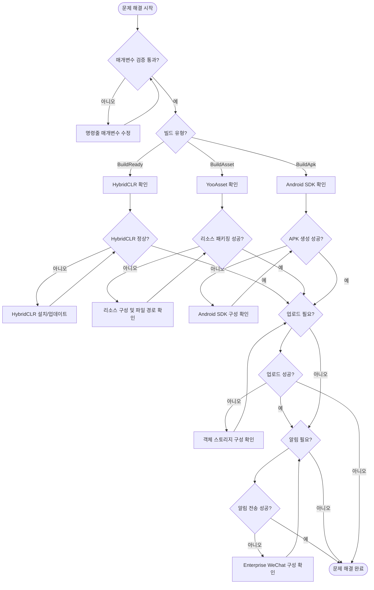

# 문제 해결

이 문서는 GameFrameX Unity Builder를 사용하여 자동화된 빌드 시 발생할 수 있는 일반적인 문제와 그 해결책을 정리합니다.

## 개요

GameFrameX Unity Builder는 자동화된 빌드 도구로, 다음 기능을 지원합니다:
- 명령줄 빌드 (CI/CD 통합 지원)
- 리소스 패키징 (YooAsset 기반)
- 핫 업데이트 지원 (HybridCLR 기반)
- 멀티 클라우드 객체 스토리지 업로드 (칠리우 Cloud, Tencent Cloud, Alibaba Cloud)
- Enterprise WeChat 빌드 알림

## 일반적인 문제 및 해결책

### 1. 매개변수 오류

#### 1.1 executeMethod가 비어 있음

**오류 정보:**
```
Exception: executeMethod is null
```

**원인:** 명령줄 매개변수에서 `-executeMethod`를 지정하지 않았습니다.

**해결책:** CI/CD 구성에 `-executeMethod` 매개변수가 포함되어 있는지 확인하고, 실행할 빌드 메서드를 지정합니다 (예: `GameFrameX.Builder.Editor.Builder.BuildAsset`).

```bash
-executeMethod GameFrameX.Builder.Editor.Builder.BuildAsset
```
> Source: [Builder.cs#L153-L156](https://github.com/GameFrameX/com.gameframex.unity.builder/blob/main/Editor/Builder.cs#L153-L156)

---

#### 1.2 buildNumber가 비어 있음

**오류 정보:**
```
Exception: build number is null
```

**원인:** 명령줄 매개변수에서 `-BUILD_NUMBER`를 지정하지 않았습니다.

**해결책:** CI/CD 구성에 `-BUILD_NUMBER` 매개변수가 포함되어 있는지 확인합니다.

```bash
-BUILD_NUMBER 1001
```
> Source: [Builder.cs#L158-L161](https://github.com/GameFrameX/com.gameframex.unity.builder/blob/main/Editor/Builder.cs#L158-L161)

---

### 2. 빌드 문제

#### 2.1 HybridCLR 설치 실패

**문제 설명:** 빌드 프로세스 중 HybridCLR 설치에 실패하거나 올바르게 설치되지 않았습니다.

**원인 분석:**
- HybridCLR 패키지가 올바르게 설치되지 않음
- il2cpp 버전이 HybridCLR 버전과 일치하지 않음

**해결책:**

빌드 전에 HybridCLR 설치 상태를 확인합니다. Builder는 `BuildReady` 단계에서 자동으로 확인 및 설치합니다:

```csharp
var installerController = new InstallerController();
var isInstalled = installerController.HasInstalledHybridCLR();
if (!isInstalled || installerController.InstalledLibil2cppVersion != installerController.PackageVersion)
{
    installerController.InstallDefaultHybridCLR();
}
```
> Source: [Builder.cs#L219-L232](https://github.com/GameFrameX/com.gameframex.unity.builder/blob/main/Editor/Builder.cs#L219-L232)

**排查步骤:**
1. Unity 프로젝트에 HybridCLR 패키지가 올바르게 설치되었는지 확인
2. il2cpp 버전이 HybridCLR과 호환되는지 확인
3. 빌드 로그에서 `BuildReady Check HybridCLR Install Status` 출력 확인

---

#### 2.2 리소스 패키징 실패

**문제 설명:** 리소스 패키징 과정에서 예외가 발생하여 빌드가 실패합니다.

**일반적인 원인:**
- YooAsset 구성 오류
- 리소스 파일 경로 문제
- 디스크 공간 부족

**해결책:**

Builder는 예외를捕获하고 상세 오류 로그를 출력합니다:

```csharp
try
{
    pipeline.Run(buildParameters, true);
    isSuccess = true;
}
catch (Exception e)
{
    Debug.LogException(e);
    Environment.Exit(1);
}
```
> Source: [Builder.cs#L298-L308](https://github.com/GameFrameX/com.gameframex.unity.builder/blob/main/Editor/Builder.cs#L298-L308)

**排查步骤:**
1. 빌드 로그의 상세 예외 정보 확인
2. YooAsset 구성 확인 (AssetBundleCollectorSetting)
3. 리소스 디렉토리 경로가 올바른지 확인
4. 디스크 공간이 충분한지 확인

---

#### 2.3 리소스 패키지 파일 이름 대소문자 문제

**문제 설명:** 일부 파일 시스템(대소문자 구문 없음)에서 리소스 패키지 파일 이름 충돌이 발생합니다.

**해결책:**

Builder는 모든 리소스 패키지 파일 이름을 소문자로 자동으로 변환합니다:

```csharp
foreach (var assetBundleCollectorPackage in AssetBundleCollectorSettingData.Setting.Packages)
{
    assetBundleCollectorPackage.LocationToLower = true;
}
AssetBundleCollectorSettingData.SaveFile();
```
> Source: [Builder.cs#L271-L278](https://github.com/GameFrameX/com.gameframex.unity.builder/blob/main/Editor/Builder.cs#L271-L278)

---

### 3. 객체 스토리지 문제

#### 3.1 객체 스토리지 업로드 실패

**문제 설명:** 빌드 완료 후 리소스 패키지 또는 APK가 객체 스토리지에 업로드되지 않습니다.

**원인 분석:**
- 구성된 키/시크릿 오류
- 버킷 이름 또는 엔드포인트 오류
- 네트워크 연결 문제

**해결책:**

명령줄 매개변수에서 객체 스토리지 관련 매개변수가 올바르게 구성되었는지 확인합니다:

| 매개변수 | 설명 | 예시 |
|------|------|------|
| `-ObjectStorageKey` | API 키 | AKIDxxxx |
| `-ObjectStorageSecret` | API 시크릿 | xxxxxxxxx |
| `-ObjectStorageBucketName` | 스토리지 버킷 이름 | my-bucket |
| `-ObjectStorageEndPoint` | 리전 노드 | ap-guangzhou |

코드에서 컴파일 매크로가 올바르게 활성화되어 있는지 확인합니다:
```csharp
#if ENABLE_GAME_FRAME_X_OBJECT_STORAGE
// 객체 스토리지 기능 코드
#endif
```

---

#### 3.2 객체 스토리지 기능이 활성화되지 않음

**문제 설명:** 코드에서 객체 스토리지 관련 기능을 사용하지만 컴파일 오류가 발생하거나 기능이 작동하지 않습니다.

**원인:** 프로젝트 스크립트 정의에 `ENABLE_GAME_FRAME_X_OBJECT_STORAGE` 컴파일 매크로가 활성화되지 않았습니다.

**해결책:**

Unity 편집기에서:
1. `Edit > Project Settings > Player` 열기
2. `Scripting Define Symbols` 찾기
3. `ENABLE_GAME_FRAME_X_OBJECT_STORAGE` 추가
4. 필요에 따라 클라우드 서비스 제공자에 해당하는 매크로 추가:
   - `ENABLE_GAME_FRAME_X_OBJECT_STORAGE_QI_NIU` (칠리우 Cloud)
   - `ENABLE_GAME_FRAME_X_OBJECT_STORAGE_TENCENT` (Tencent Cloud)
   - `ENABLE_GAME_FRAME_X_OBJECT_STORAGE_A_LI_YUN` (Alibaba Cloud)

---

### 4. 네트워크 알림 문제

#### 4.1 Enterprise WeChat 알림 전송 실패

**문제 설명:** 빌드는 성공했지만 Enterprise WeChat 알림을 받지 못했습니다.

**원인 분석:**
- WeChatBotKey 구성 오류
- Enterprise WeChat 봇 API 호출 실패

**해결책:**

올바른 Enterprise WeChat 봇 키가 구성되었는지 확인합니다:

```csharp
-WeChatBotKey xxxxx-xxxxx-xxxxx
```
> Source: [WeChatNotifyWorkHelper.cs#L49](https://github.com/GameFrameX/com.gameframex.unity.builder/blob/main/Editor/WeChatNotifyWorkHelper.cs#L49)

Builder는 예외를捕获하지만 빌드 프로세스를阻止하지 않습니다:

```csharp
try
{
    var httpResponseMessage = httpClient.PostAsync(url, stringContent).GetAwaiter().GetResult();
    var response = httpResponseMessage.Content.ReadAsStringAsync().GetAwaiter().GetResult();
    Debug.Log(response);
}
catch (Exception e)
{
    Debug.LogException(e);
}
```
> Source: [WeChatNotifyWorkHelper.cs#L59-L69](https://github.com/GameFrameX/com.gameframex.unity.builder/blob/main/Editor/WeChatNotifyWorkHelper.cs#L59-L69)

---

#### 4.2 리소스 버전 업데이트 API 호출 실패

**문제 설명:** 리소스 패키지 버전 업데이트 요청이 실패합니다.

**원인 분석:**
- `UpdateAssetPackageVersionUrl` 구성 오류
- `UpdateAssetPackageVersionAuthorization` 권한 정보 오류

**해결책:**

올바른 버전 업데이트 URL과 권한 정보를 구성합니다:

```csharp
-UpdateAssetPackageVersionUrl https://api.example.com/version
-UpdateAssetPackageVersionAuthorization Bearer xxxxxx
```
> Source: [BuilderUpdateAssetPackageVersionHelper.cs#L55-L56](https://github.com/GameFrameX/com.gameframex.unity.builder/blob/main/Editor/BuilderUpdateAssetPackageVersionHelper.cs#L55-L56)

---

### 5. 버전 및 패키지 이름 문제

#### 5.1 패키지 이름이 업데이트되지 않음

**문제 설명:** 빌드된 APK 패키지 이름이 명령줄에서 지정한 값을 사용하지 않습니다.

**원인:** `-BundleId` 매개변수가 구성된 경우에만 프로젝트 패키지 이름이 덮어씌워집니다.

**해결책:**

명령줄 매개변수에 `-BundleId`가 포함되어 있는지 확인합니다:

```bash
-BundleId com.example.myapp
```

이 매개변수가 구성되지 않은 경우 프로젝트의 원래 패키지 이름이 사용됩니다:
```csharp
if (!_builderOptions.BundleId.IsNullOrWhiteSpace())
{
    PlayerSettings.applicationIdentifier = _builderOptions.BundleId.Trim();
}
```
> Source: [Builder.cs#L172-L175](https://github.com/GameFrameX/com.gameframex.unity.builder/blob/main/Editor/Builder.cs#L172-L175)

---

#### 5.2 버전 번호가 업데이트되지 않음

**문제 설명:** 빌드된 APK 버전 번호가 명령줄에서 지정한 값을 사용하지 않습니다.

**원인:** `-AppVersion` 매개변수가 구성된 경우에만 프로젝트 버전 번호가 덮어씌워집니다.

**해결책:**

명령줄 매개변수에 `-AppVersion`이 포함되어 있는지 확인합니다:

```bash
-AppVersion 1.2.3
```

이 매개변수가 구성되지 않은 경우 프로젝트의 원래 버전 번호가 사용됩니다:
```csharp
if (!_builderOptions.AppVersion.IsNullOrWhiteSpace())
{
    PlayerSettings.bundleVersion = _builderOptions.AppVersion.Trim();
}
```
> Source: [Builder.cs#L177-L180](https://github.com/GameFrameX/com.gameframex.unity.builder/blob/main/Editor/Builder.cs#L177-L180)

---

### 6. 로그 관련 문제

#### 6.1 로그 파일 경로 문제

**문제 설명:** 빌드 로그 파일을 찾을 수 없습니다.

**원인:** 명령줄 매개변수에서 `-logFile` 경로를 지정하지 않았습니다.

**해결책:**

Builder는 기본 로그 경로를 자동으로 생성합니다 (지정되지 않은 경우):

```csharp
if (_builderOptions.LogFilePath.IsNullOrWhiteSpace())
{
    var split = _builderOptions.ExecuteMethod.Split(new[] { "." }, StringSplitOptions.RemoveEmptyEntries);
    _builderOptions.LogFilePath = $"../Logs/{split[split.Length - 1]}_{_builderOptions.BuildNumber}.log";
}
```
> Source: [Builder.cs#L163-L167](https://github.com/GameFrameX/com.gameframex.unity.builder/blob/main/Editor/Builder.cs#L163-L167)

로그 경로를 명시적으로 지정할 것을 권장합니다:
```bash
-logFile /path/to/build.log
```

---

## 빌드 프로세스 문제 해결

### 문제 해결 흐름도



---

## 일반적인 명령어 참고

### 완전한 빌드 명령 예시

```bash
Unity \
  -projectPath /path/to/project \
  -executeMethod GameFrameX.Builder.Editor.Builder.BuildAsset \
  -BUILD_NUMBER ${BUILD_NUMBER} \
  -JOB_NAME ${JOB_NAME} \
  -PackageName DefaultPackage \
  -ChannelName default \
  -BundleId com.example.game \
  -AppVersion 1.0.0 \
  -IsIncrementalBuildPackage false \
  -IsUploadAsset true \
  -IsUploadLogFile true \
  -ObjectStorageKey ${OSS_KEY} \
  -ObjectStorageSecret ${OSS_SECRET} \
  -ObjectStorageBucketName game-assets \
  -ObjectStorageEndPoint ap-guangzhou \
  -IsUpdateAssetPackageVersion true \
  -UpdateAssetPackageVersionUrl https://api.example.com/version \
  -UpdateAssetPackageVersionAuthorization "Bearer token" \
  -WeChatBotKey ${WECHAT_KEY} \
  -logFile ../Logs/build_${BUILD_NUMBER}.log
```
> Source: [Builder.cs#L60-L151](https://github.com/GameFrameX/com.gameframex.unity.builder/blob/main/Editor/Builder.cs#L60-L151)

---

## 관련 링크

- [개요](./1-overview) - 프로젝트 개요 및 아키텍처
- [설치](./2-installation) - 설치 가이드
- [빠른 시작](./3-getting-started) - 빠른 시작
- [사용 방법](./4-usage) - 상세 사용 방법
- [구성 옵션](./5-configuration) - 구성 옵션 설명
- [객체 스토리지](./6.object-storage) - 객체 스토리지 통합