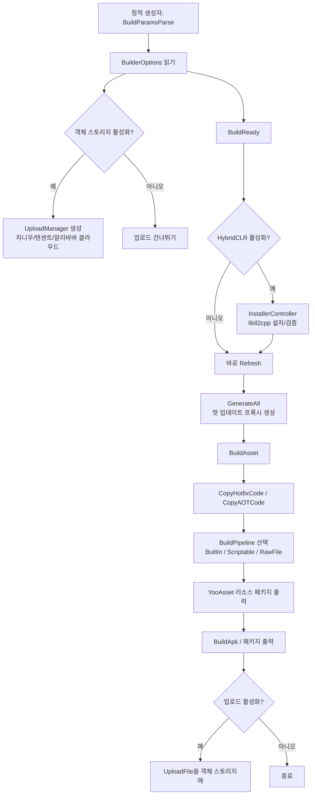

# 작업 원리: Builder 파이프라인

Builder 파이프라인은 GameFrameX Unity Builder가 Editor 측에서 순차적으로 트리거하는 일련의 패키징 진입점으로, `BuildReady` 환경 준비부터 `BuildAsset` YooAsset 리소스 패키지 구축, `BuildApk` 패키지 출력 및 선택적 객체 스토리지 업로드까지 담당합니다. 전체 파이프라인은 `Builder.cs`에서 `partial` 방식으로 파일별로 구성된 정적 메서드를 통해 연결되며, 각 메서드는 파이프라인의 한 단계에 해당합니다.

## 파이프라인 단계 개요

| 단계 | 진입 메서드 | 주요 작업 |
|------|---------|---------|
| 1. 매개변수 파싱 | `Builder.BuildParamsParse()`(정적 생성자에서 호출) | JSON 설정 파일을 파싱하여 `BuilderOptions` 채우기; 스크립트 매크로에 따라 `IObjectStorageUploadManager` 생성(치니우/텐센트 클라우드/알리바바 클라우드) |
| 2. 빌드 준비 | `Builder.BuildReady()` | HybridCLR 활성화 시 libil2cpp 설치/검증, `AssetDatabase` 새로 고침, 핫 업데이트 프록시 생성 |
| 3. 리소스 빌드 | `Builder.BuildAsset()` | 핫 업데이트 및 AOT 어셈블리 복사, 빌드 파이프라인 선택, YooAsset 호출하여 리소스 패키지 출력 |
| 4. 패키지 출력 | `Builder.BuildApk()`(기타 플랫폼은 유사한 메서드) | 플랫폼 빌더 호출, 선택적으로 APK와 로그를 객체 스토리지에 업로드 |

## 작업 원리 빠른 보기



## 단계 1: 매개변수 파싱

`Builder.cs`의 정적 생성자는 먼저 `BuildParamsParse()`를 호출하여 JSON 설정을 읽고 `_builderOptions`를 채운 다음, 스크립트 매크로에 따라 객체 스토리지 업로드 관리자를 인스턴스화할지 결정하고 저장 경로 템플릿을 설정합니다.

Source:[Editor/Builder.cs#L32-L49](https://github.com/GameFrameX/com.gameframex.unity.builder/blob/main/Editor/Builder.cs#L32-L49)

```csharp
static Builder()
{
    BuildParamsParse();
#if ENABLE_GAME_FRAME_X_OBJECT_STORAGE_QI_NIU
    ObjectStorageUploadManager = ObjectStorageUploadFactory.Create<QiNiuYunObjectStorageUploadManager>(
        _builderOptions.ObjectStorageKey, _builderOptions.ObjectStorageSecret,
        _builderOptions.ObjectStorageBucketName, _builderOptions.ObjectStorageEndPoint);
#endif
    /* ... 腾讯云 / 阿里云分支类似 ... */
    ObjectStorageUploadManager.SetSavePath($"builder/{PlayerSettings.productName}/{EditorUserBuildSettings.activeBuildTarget}/{_builderOptions.JobName}/{Application.version}/{_builderOptions.BuildNumber}");
}
```

## 단계 2: `BuildReady` 빌드 준비

`BuildReady`는 패키징을 시작하기 전에 환경을 일관되게 맞춥니다: HybridCLR이 활성화되면 libil2cpp를 검증/설치하고, AssetDatabase를 새로 고치며, HybridCLR 핫 업데이트 프록시를 생성합니다. 이후 로그 업로드가 활성화되어 있으면 로그를 먼저 한 번 업로드합니다.

Source:[Editor/Builder.BuildReady.cs#L15-L50](https://github.com/GameFrameX/com.gameframex.unity.builder/blob/main/Editor/Builder.BuildReady.cs#L15-L50)

```csharp
public static void BuildReady()
{
#if ENABLE_GAME_FRAME_X_HYBRID_CLR
    var installerController = new InstallerController();
    var isInstalled = installerController.HasInstalledHybridCLR();
    if (!isInstalled || installerController.InstalledLibil2cppVersion != installerController.PackageVersion)
    {
        installerController.InstallDefaultHybridCLR();
    }
    PrebuildCommand.GenerateAll();
#endif
    AssetDatabase.Refresh();
    if (_builderOptions.IsUploadLogFile)
    {
        ObjectStorageUploadManager.UploadFile(_builderOptions.LogFilePath);
    }
}
```

## 단계 3: `BuildAsset` 리소스 빌드

`BuildAsset`는 먼저 핫 업데이트/AOT 어셈블리를 런타임 디렉터리로 복사한 다음, `_builderOptions.BuildPipeline`에 따라 `BuiltinBuildPipeline`, `ScriptableBuildPipeline` 또는 `RawFileBuildPipeline`을 선택하고, 마지막으로 YooAsset을 호출하여 패키지를 출력합니다.

Source:[Editor/Builder.BuildAsset.cs#L15-L80](https://github.com/GameFrameX/com.gameframex.unity.builder/blob/main/Editor/Builder.BuildAsset.cs#L15-L80)

```csharp
BuildHotfixHelper.CopyHotfixCode();
AssetDatabase.Refresh();
BuildHotfixHelper.CopyAOTCode();
AssetDatabase.Refresh();

var buildPipeline = (EBuildPipeline)buildPipelineObj;
switch (buildPipeline)
{
    case EBuildPipeline.ScriptableBuildPipeline:
        pipeline = new ScriptableBuildPipeline();
        buildParameters = new ScriptableBuildParameters();
        break;
    case EBuildPipeline.RawFileBuildPipeline:
        pipeline = new RawFileBuildPipeline();
        buildParameters = new RawFileBuildParameters();
        break;
    default:
        pipeline = new BuiltinBuildPipeline();
        buildParameters = new BuiltinBuildParameters();
        break;
}
buildParameters.BuildMode = _builderOptions.IsIncrementalBuildPackage ? EBuildMode.IncrementalBuild : EBuildMode.ForceRebuild;
```

`EBuildPipeline` 문자열 설정이 잘못되면 `无效的构建管线类型` 메시지를 출력하고 바로 `return`하여 패키지 출력 단계로 넘어가지 않습니다.

## 단계 4: `BuildApk` 패키지 출력 및 업로드

`BuildApk`는 `BuildProductHelper.BuildPlayerAndroid()`에 위임하여 APK를 출력한 다음, `IsUploadApk` / `IsUploadLogFile` 옵션에 따라 결과물과 로그를 객체 스토리지에 업로드합니다.

Source:[Editor/Builder.cs#L62-L78](https://github.com/GameFrameX/com.gameframex.unity.builder/blob/main/Editor/Builder.cs#L62-L78)

```csharp
public static void BuildApk()
{
    var apkPath = BuildProductHelper.BuildPlayerAndroid();
    if (_builderOptions.IsUploadApk)
    {
        ObjectStorageUploadManager.UploadFile(apkPath);
    }
    if (_builderOptions.IsUploadLogFile)
    {
        ObjectStorageUploadManager.UploadFile(_builderOptions.LogFilePath);
    }
}
```

## 주요 설정 항목(`BuilderOptions`)

| 필드 | 용도 | 기본값 |
|------|------|--------|
| `BuildPipeline` | `BuiltinBuildPipeline` / `ScriptableBuildPipeline` / `RawFileBuildPipeline` 선택 | — |
| `PackageName` | YooAsset 리소스 패키지명 | — |
| `PackageVersion` | 리소스 패키지 버전 번호, 비어 있으면 `yyyyMMddHHmmss` 사용 | 빈 문자열 |
| `IsIncrementalBuildPackage` | `true`=증분 빌드, `false`=강제 재빌드 | — |
| `BuildinFileCopyOption` | 내장 파일 복사 옵션, 비어 있으면 `ClearAndCopyAll` 적용 | 빈 문자열 |
| `IsUploadApk` / `IsUploadLogFile` | APK / 로그 업로드 여부 | — |
| `ObjectStorageKey/Secret/BucketName/EndPoint` | 객체 스토리지 자격 증명 | 빈 문자열 |
| `JobName` / `BuildNumber` | 객체 스토리지 경로 `builder/{product}/{target}/{job}/{version}/{buildNumber}`에 결합 | 빈 문자열 |

Source:[Editor/BuilderOptions.cs#L1-L60](https://github.com/GameFrameX/com.gameframex.unity.builder/blob/main/Editor/BuilderOptions.cs#L1-L60)

## 업로드 경로 템플릿

객체 스토리지가 활성화되면 저장 경로는 다음과 같이 통일됩니다:

```text
builder/{PlayerSettings.productName}/{activeBuildTarget}/{JobName}/{Application.version}/{BuildNumber}
```

Source:[Editor/Builder.cs#L47](https://github.com/GameFrameX/com.gameframex.unity.builder/blob/main/Editor/Builder.cs#L47)

## 다음 단계

- 각 플랫폼 패키지 출력 메서드의 차이점은 《플랫폼 패키지 출력》 작업 페이지를 참조하세요(디렉터리에 존재하는 경우).
- `BuilderOptions` 필드의 전체 목록은 《빌드 옵션 빠른 참조》 페이지를 참조하세요.
- 빌드 실패 원인 분석은 《빌드 실패 시 대처법》 문제 해결 페이지를 참조하세요.