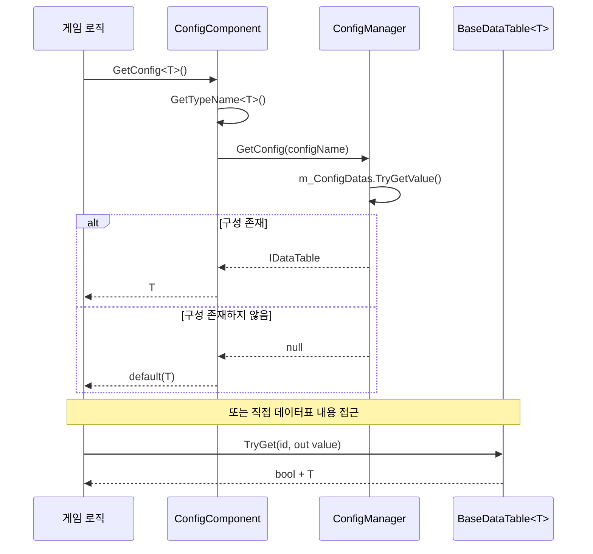

# 개요

GameFrameX Config 컴포넌트는 GameFrameX 프레임워크의 구성표 데이터 관리 핵심 모듈입니다. 통일된 구성 로딩, 저장 및 조회 메커니즘을 제공하여 구성 데이터 사용을 더욱 간편하고 효율적으로 만듭니다.

## 개요

GameFrameX Config 컴포넌트는 경량화된 고성능 Unity 구성 관리 솔루션으로, 게임 개발 시나리오에 맞춰 설계되었습니다. 이 컴포넌트는 모듈식 아키텍처를 채택하여 구성 데이터의 저장, 조회 및 관리 기능을 분리하고, 명확한 계층 구조를 제공합니다.

### 설계 목표

- **구성 접근 간소화**: 제네릭 인터페이스를 통해 강형 구성 접근 방식 제공
- **고성능 조회**: int, long, string等多种 ID 유형의 빠른 조회 지원
- **유연한 데이터 조작**: 다양한 데이터 조회 및 집계 메서드 제공
- **이벤트驱动**: 구성 로딩 성공/실패 이벤트 알림 지원

### 핵심 기능

1. **강형 지원**: 구성 데이터가 제네릭 `IDataTable<T>` 형태로 접근, 컴파일 시 유형 안전성 보장
2. **다중 키值 인덱스**: `int`, `long`, `string` 세 가지 주요 키 유형 조회 지원
3. **데이터 집계 기능**: Max, Min, Sum 등 집계 함수 내장
4. **비동기 로딩**: 구성 데이터는 비동기 로딩 모드 지원
5. **스레드 안전**: `ConcurrentDictionary`를 사용하여 다중 스레드 안전 보장

## 아키텍처 설계

Config 컴포넌트는 3단계 아키텍처 설계를 채택하여 각 계층의 책임이 명확하고 의존 관계가 명확합니다:

```mermaid
graph TD
    subgraph UnityComponent["Unity 컴포넌트 계층"]
        CC[ConfigComponent<br/>구성 컴포넌트]
    end

    subgraph ManagerLayer["관리자 계층"]
        ICM[IConfigManager<br/>구성 관리자 인터페이스]
        CM[ConfigManager<br/>구성 관리자 구현]
    end

    subgraph DataTableLayer["데이터표 계층"]
        IDataTable[IDataTable<br/>데이터표 인터페이스]
        IDataTableG[IDataTable&lt;T&gt;<br/>제네릭 데이터표 인터페이스]
        BDT[BaseDataTable&lt;T&gt;<br/>데이터표 베이스 클래스]
    end

    subgraph EventLayer["이벤트 계층"]
        LCSEA[LoadConfigSuccessEventArgs<br/>로딩 성공 이벤트]
        LCFA[LoadConfigFailureEventArgs<br/>로딩 실패 이벤트]
    end

    CC --> ICM
    ICM <|.. CM
    IDataTable <|.. IDataTableG
    IDataTableG <|.. BDT
    CM -.->|저장| BDT
```

### 각 계층 책임

| 계층 | 컴포넌트 | 책임 설명 |
|------|------|----------|
| Unity 컴포넌트 계층 | ConfigComponent | Unity 컴포넌트로 Scene에 노출하며 게임 로직 호출 진입점 제공 |
| 관리자 계층 | ConfigManager | 모든 구성표 데이터의 저장, 검색 및 수명 주기 관리 |
| 데이터표 계층 | `BaseDataTable<T>` | 구체적인 구성 데이터의 저장 및 조회 로직 구현 |
| 이벤트 계층 | EventArgs | 구성 로딩 상태의 이벤트 알림 제공 |

## 핵심 개념

### 구성 컴포넌트 (ConfigComponent)

`ConfigComponent`는 Unity Scene에 직접 마운트되는 컴포넌트로, `GameFrameworkComponent`를 상속받습니다. 다음을 담당합니다:

- `ConfigManager` 모듈 초기화
- 게임 로직에 대한 구성 접근 인터페이스 제공
- 유형에서 구성 이름으로의 매핑 유지

> Source: [ConfigComponent.cs](https://github.com/GameFrameX/com.gameframex.unity.config/blob/main/Runtime/Config/ConfigComponent.cs#L46-L185)

### 구성 관리자 (ConfigManager)

`ConfigManager`는 프레임워크 내부의 구성 관리 모듈로, `IConfigManager` 인터페이스를 구현합니다. `ConcurrentDictionary<string, IDataTable>`를 사용하여 모든 구성표 데이터를 저장합니다.

### 데이터표 인터페이스 (IDataTable)

데이터표 인터페이스는 두 개의 계층으로 나뉩니다:

- **IDataTable**: 비제네릭 베이스 인터페이스, 공통 비동기 로딩 메서드 정의
- **`IDataTable<T>`**: 제네릭 인터페이스, `IDataTable`를 상속하며 강형 데이터 접근 메서드 제공

> Source: [IDataTable.cs](https://github.com/GameFrameX/com.gameframex.unity.config/blob/main/Runtime/Config/Config/IDataTable.cs#L39-L355)

### 데이터표 베이스 클래스 (`BaseDataTable<T>`)

`BaseDataTable<T>`는 모든 구체적인 구성 데이터표의 추상 베이스 클래스로, 다음을 제공합니다:

- 내부적으로 `Dictionary<long, T>`와 `Dictionary<string, T>`를 사용하여 서로 다른 주요 키 유형의 데이터 저장
- 안전한 조회를 위한 `TryGet` 시리즈 메서드 구현
- `table[id]` 방식의 직접 접근을 지원하는 인덱서 제공
- `FirstOrDefault`, `LastOrDefault`, `All` 등의 편의 속성 구현
- `Find`, `FindList`, `FindListArray` 등의 조회 메서드 제공
- `Max`, `Min`, `Sum` 등의 집계 계산 메서드 내장

> Source: [BaseDataTable.cs](https://github.com/GameFrameX/com.gameframex.unity.config/blob/main/Runtime/Config/Config/BaseDataTable.cs#L40-L520)

## 데이터 접근 흐름

구성 데이터의 생성에서 접근까지의 완전한 흐름은 다음과 같습니다:



## 빠른 시작

### 기본 사용 단계

1. **데이터표 클래스 생성**: `BaseDataTable<T>`를 상속하고 `LoadAsync` 메서드 구현
2. **컴포넌트 마운트**: Unity Scene에서 `ConfigComponent` 컴포넌트 마운트
3. **구성 가져오기**: `ConfigComponent.GetConfig<T>()`를 통해 구성 인스턴스 가져오기

### 코드 예시

```csharp
// 1. 구성 데이터 유형 정의
public class ItemData
{
    public int Id { get; set; }
    public string Name { get; set; }
    public string Description { get; set; }
}

// 2. 구체적인 데이터표 구현 생성
public class ItemTable : BaseDataTable<ItemData>
{
    public override async Task LoadAsync()
    {
        // 여기서 파일 또는 네트워크에서 데이터를 로드하는 로직 구현
        // 로드 완료 후 데이터를 사전에 추가
        LongDataMaps.Add(1, new ItemData { Id = 1, Name = "무기", Description = "초보자 무기" });
        LongDataMaps.Add(2, new ItemData { Id = 2, Name = "방어구", Description = "초보자 방어구" });
        DataList.AddRange(LongDataMaps.Values);
    }
}

// 3. 게임 로직에서 구성 사용
public class GameManager : MonoBehaviour
{
    private ConfigComponent _configComponent;
    
    private async void Start()
    {
        _configComponent = UnityEngine.Component.FindObjectOfType<ConfigComponent>();
        
        // 구성 로드
        var itemTable = new ItemTable();
        await itemTable.LoadAsync();
        _configComponent.Add("ItemTable", itemTable);
        
        // 구성 데이터 접근 - TryGet으로 안전하게 가져오기
        if (itemTable.TryGet(1, out var item))
        {
            Debug.Log($"아이템 이름: {item.Name}");
        }
        
        // 인덱서로 접근
        var item2 = itemTable[2];
        
        // 조건 조회
        var foundItems = itemTable.FindList(x => x.Name.Contains("방"));
    }
}
```

> Source: [ConfigComponent.cs](https://github.com/GameFrameX/com.gameframex.unity.config/blob/main/Runtime/Config/ConfigComponent.cs#L108-L127)

## API 개요

### ConfigComponent 핵심 메서드

| 메서드 | 설명 |
|------|------|
| `GetConfig<T>()` | 지정된 유형의 구성표 인스턴스 가져오기 |
| `HasConfig<T>()` | 지정된 유형의 구성이 존재하는지 확인 |
| `RemoveConfig<T>()` | 지정된 유형의 구성 제거 |
| `RemoveAllConfigs()` | 모든 구성 제거 |
| `Add(string, IDataTable)` | 새 구성표 추가 |

### `IDataTable<T>` 핵심 멤버

| 멤버 | 설명 |
|------|------|
| `TryGet(int/long/string, out T)` | 주요 키로 데이터 가져오기 시도 |
| `this[int/long/string id]` | 주요 키로 직접 접근하는 인덱서 |
| `FirstOrDefault` | 첫 번째 데이터 요소 가져오기 |
| `LastOrDefault` | 마지막 데이터 요소 가져오기 |
| `All` | 모든 데이터 요소 가져오기 |
| `Find(Func<T, bool>)` | 첫 번째 일치 요소 찾기 |
| `FindList(Func<T, bool>)` | 모든 일치 요소 찾기 |
| `ForEach(Action<T>)` | 모든 요소 순회 |
| `Max/Min<Tk>()` | 최대값/최소값 가져오기 |
| `Sum()` | 합계 계산 |

## 의존 관계

Config 컴포넌트는 다음 GameFrameX 핵심 모듈에 의존합니다:

| 의존 모듈 | 최소 버전 | 용도 설명 |
|----------|----------|----------|
| com.gameframex.unity | 1.1.1 | 핵심 프레임워크 기본 |
| com.gameframex.unity.asset | 1.0.6 | 리소스 로딩 지원 |
| com.gameframex.unity.event | 1.0.0 | 이벤트 시스템 |

> 상세 의존 요구사항은 [의존 요구](./5.dependencies) 문서를 참고하세요

## 관련 링크

- [기능 특성](./04.features) - Config 컴포넌트의 완전한 기능 목록 알아보기
- [설치 방식](./2.installation) - 컴포넌트의 올바른 설치 단계 마스터
- [기초 사용](./3.getting-started) - 구성 컴포넌트 사용 빠르게 시작
- [데이터표 정의](./8.data-table-definition) - 자신만의 데이터표 정의 방법 학습
- [ConfigComponent 상세](./10.config-component) - ConfigComponent 심층 분석
- [ConfigManager 상세](./9.config-manager) - ConfigManager 구현 세부사항
- [IDataTable 인터페이스 상세](./7.idata-table) - 데이터표 인터페이스 완전한 문서