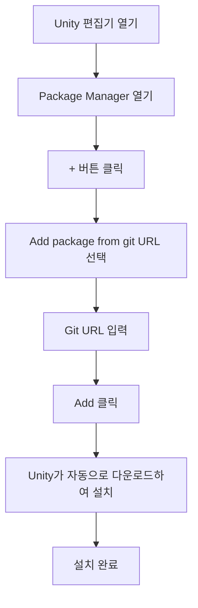

# 설치 방식

이 문서는 GameFrameX Config 구성 컴포넌트의 다양한 설치 방식을 소개하며, 개발자가 Unity 프로젝트에서 해당 컴포넌트를 빠르게 통합할 수 있도록 도와줍니다.

## 개요

GameFrameX Config는 GameFrameX 프레임워크의 구성표 컴포넌트로, 구성표 관련 인터페이스를 제공하여 구성 기능 사용을 더욱 간단하고 효율적으로 만듭니다. 이 컴포넌트를 사용하기 전에 Unity 프로젝트에 올바르게 설치해야 합니다.

> **현재 버전**: 1.1.3  
> **Unity 버전 요구**: 2019.4 이상

## 의존 요구

Config 컴포넌트를 설치하기 전에 프로젝트에 다음 의존 패키지가 설치되어 있는지 확인해야 합니다:

| 의존 패키지 | 최소 버전 | 설명 |
|--------|----------|------|
| com.gameframex.unity | 1.1.1 | GameFrameX 핵심 프레임워크 |
| com.gameframex.unity.asset | 1.0.6 | 리소스 관리 모듈 |
| com.gameframex.unity.event | 1.0.0 | 이벤트 시스템 모듈 |

Config 컴포넌트는 의존 패키지의 설치를 자동으로 처리하며, Package Manager를 사용하여 설치할 때 모든 의존이 자동으로 설치됩니다.

## 설치 방식

### 방식 1: manifest.json을 통한 설치 (권장)

가장 권장되는 설치 방식으로, 버전 관리 및 팀 협업에 편리합니다.

1. Unity 프로젝트의 `Packages` 폴더에서 `manifest.json` 파일을 열기
2. `dependencies` 노드에서 다음 내용을 추가합니다:

```json
{
  "dependencies": {
    "com.gameframex.unity.config": "https://github.com/GameFrameX/com.gameframex.unity.config.git"
  }
}
```

4. 파일을 저장하면 Unity가 자동으로 다운로드하여 의존 패키지를 설치합니다

> **주의**: Git URL 방식으로 설치하면 Unity가 자동으로 모든 의존 항목을 분석하여 설치합니다.

### 방식 2: Unity Package Manager를 통한 설치

1. Unity 편집기를 열기
2. 메뉴 **Window** → **Package Manager**를 차례로 클릭
3. Package Manager 창에서 왼쪽 상단의 **+** 버튼을 클릭
4. **Add package from git URL...** 옵션을 선택
5. 입력창에 다음 주소를 붙여넣기:

```
https://github.com/GameFrameX/com.gameframex.unity.config.git
```

6. **Add** 버튼을 클릭하면 Unity가 자동으로 패키지 및 의존을 다운로드하여 설치합니다



### 방식 3: Packages 디렉토리에 직접 배치

소스 코드 수정이나 심층 사용자 정의가 필요한 시나리오에 적합합니다.

1. 저장소 복제 또는 다운로드:

```bash
git clone https://github.com/GameFrameX/com.gameframex.unity.config.git
```

2. 다운로드한 저장소 폴더를 Unity 프로젝트의 `Packages` 디렉토리에 복사
3. Unity가 자동으로 패키지를 인식하여 로드합니다

> **주의**: 이 방식으로 설치한 패키지는 자동 업데이트를 수신하지 않으며, 수동으로 업데이트해야 합니다.

## 설치 검증

설치 완료 후 다음 방법으로 Config 컴포넌트가 올바르게 설치되었는지 검증할 수 있습니다:

1. **Package Manager 확인**: Package Manager에서 "Game Frame X Config"가 표시되는지 확인
2. **Assembly Definition 확인**: `GameFrameX.Config.Runtime.asmdef`가 올바르게 컴파일되었는지 확인
3. **컴포넌트 사용**: Scene에서 `ConfigComponent`를 추가하여 정상적으로 작동하는지 확인

```csharp
// 설치 검증 - 코드에서 Config 컴포넌트가 사용 가능한지 확인
using GameFrameX.Runtime;

var configComponent = UnityEngine.GameObject.FindObjectOfType<ConfigComponent>();
if (configComponent != null)
{
    UnityEngine.Debug.Log("Config 컴포넌트 설치 성공!");
}
```

## 업그레이드 및 업데이트

### 자동 업데이트 (방식 1 및 2)

Package Manager로 설치한 패키지는 다음 방법으로 업데이트할 수 있습니다:

1. Package Manager에서 GameFrameX Config 선택
2. 버전 번호 옆의 드롭다운 화살표 클릭
3. 최신 버전 선택 또는 "See all versions"를 클릭하여 사용 가능한 버전 확인

### 수동 업데이트 (방식 3)

Packages 디렉토리에 직접 배치한 설치 방식의 경우:

1. 기존 패키지 폴더 삭제
2. 최신 버전 다시 다운로드
3. Packages 디렉토리에 복사

## 일반적인 설치 문제

### Git URL에 접근할 수 없음

Git URL에 접근할 수 없는 문제가 발생하면 다음을 시도할 수 있습니다:
- 프록시 사용
- 저장소를 자신의 GitHub 계정으로 포크
- ZIP 패키지를 다운로드하여 Packages 디렉토리에 압축 해제

### 의존 패키지 버전 충돌

의존 패키지 버전 충돌이 발생하면:
1. 각 의존 패키지의 버전 요구사항 확인
2. 모든 GameFrameX 컴포넌트를 동일한 주 버전에 통일
3. [의존 요구](./5.dependencies) 문서 참고

### Unity 버전 호환성 문제

Unity 편집기 버전이 요구사항(2019.4+)에 적합한지 확인하고, 오래된 버전은 Unity 편집기를 업그레이드해야 합니다.

## 관련 링크

- [의존 요구](./5.dependencies) - 컴포넌트 의존 관계 상세히 알아보기
- [빠른 시작](./3.getting-started) - 컴포넌트의 기본 사용 알아보기
- [Config 컴포넌트 소개](./1.overview) - Config 컴포넌트 기능 알아보기
- [GitHub 저장소](https://github.com/GameFrameX/com.gameframex.unity.config.git) - 최신 버전 획득
- [공식 문서](https://gameframex.doc.alianblank.com) - 완전한 문서 보기