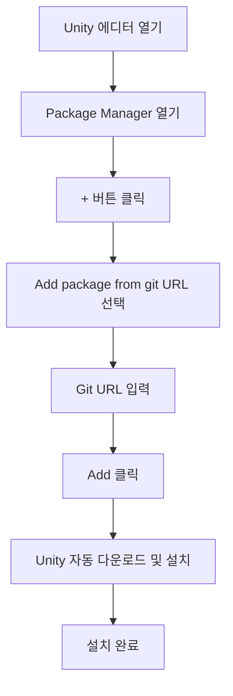

# 설치 방법

이 문서는 GameFrameX Config 구성 컴포넌트의 다양한 설치 방법을 소개하여 개발자가 Unity 프로젝트에 빠르게 컴포넌트를 통합할 수 있도록 돕습니다.

## 개요

GameFrameX Config는 GameFrameX 프레임워크의 구성 테이블 컴포넌트로, 구성 테이블 관련 인터페이스를 제공하여 구성 기능을 더 간단하고 효율적으로 사용할 수 있게 합니다. 이 컴포넌트를 사용하기 전에 Unity 프로젝트에 올바르게 설치해야 합니다.

> **현재 버전**: 1.1.3
> **Unity 버전 요구 사항**: 2019.4 이상

## 종속 요구 사항

Config 컴포넌트를 설치하기 전에 프로젝트에 다음 종속 패키지가 설치되어 있는지 확인하십시오:

| 종속 패키지 | 최소 버전 | 설명 |
|--------|----------|------|
| com.gameframex.unity | 1.1.1 | GameFrameX 핵심 프레임워크 |
| com.gameframex.unity.asset | 1.0.6 | 리소스 관리 모듈 |
| com.gameframex.unity.event | 1.0.0 | 이벤트 시스템 모듈 |

Config 컴포넌트는 종속 패키지의 설치를 자동으로 처리하며, Package Manager를 사용하여 설치하면 모든 종속 패키지가 자동으로 설치됩니다.

## 설치 방법

### 방법 1: manifest.json을 통한 설치 (권장)

가장 권장되는 설치 방법으로, 버전 관리와 팀 협업에 편리합니다.

1. Unity 프로젝트의 `Packages` 폴더를 엽니다
2. `manifest.json` 파일을 찾아 편집합니다
3. `dependencies` 노드 아래에 다음 내용을 추가합니다:

```json
{
  "dependencies": {
    "com.gameframex.unity.config": "https://github.com/GameFrameX/com.gameframex.unity.config.git"
  }
}
```

4. 파일을 저장하면 Unity가 종속 패키지를 자동으로 다운로드하고 설치합니다

> **참고**: Git URL 방식으로 설치하면 Unity가 모든 종속 항목을 자동으로 분석하고 설치합니다.

### 방법 2: Unity Package Manager를 통한 설치

1. Unity 에디터를 엽니다
2. 메뉴에서 **Window** → **Package Manager**를 차례로 클릭합니다
3. Package Manager 창에서 좌측 상단의 **+** 버튼을 클릭합니다
4. **Add package from git URL...** 옵션을 선택합니다
5. 입력란에 다음 주소를 붙여넣습니다:

```
https://github.com/GameFrameX/com.gameframex.unity.config.git
```

6. **Add** 버튼을 클릭하면 Unity가 패키지 및 종속 항목을 자동으로 다운로드하고 설치합니다



### 방법 3: Packages 디렉토리에 직접 배치

소스 코드를 수정하거나 심층적으로 사용자 정의해야 하는 시나리오에 적합합니다.

1. 저장소를 복제하거나 다운로드합니다:

```bash
git clone https://github.com/GameFrameX/com.gameframex.unity.config.git
```

2. 다운로드한 저장소 폴더를 Unity 프로젝트의 `Packages` 디렉토리에 복사합니다
3. Unity가 자동으로 패키지를 인식하고 로드합니다

> **참고**: 이 방식으로 설치한 패키지는 업데이트를 자동으로 받지 않으므로 수동으로 업데이트해야 합니다.

## 설치 확인

설치가 완료되면 다음 방법으로 Config 컴포넌트가 올바르게 설치되었는지 확인할 수 있습니다:

1. **Package Manager 확인**: Package Manager에서 "Game Frame X Config"가 표시되는지 확인합니다
2. **Assembly Definition 확인**: `GameFrameX.Config.Runtime.asmdef`가 올바르게 컴파일되었는지 확인합니다
3. **컴포넌트 사용**: 씬에서 `ConfigComponent`를 추가하여 정상 작동하는지 확인합니다

```csharp
// 설치 확인 - 코드에서 Config 컴포넌트 사용 가능 여부 확인
using GameFrameX.Runtime;

var configComponent = UnityEngine.GameObject.FindObjectOfType<ConfigComponent>();
if (configComponent != null)
{
    UnityEngine.Debug.Log("Config 컴포넌트가 성공적으로 설치되었습니다!");
}
```

## 업그레이드 및 업데이트

### 자동 업데이트 (방법 1 및 2)

Package Manager로 설치한 패키지는 다음 방법으로 업데이트할 수 있습니다:

1. Package Manager에서 GameFrameX Config를 선택합니다
2. 버전 번호 옆의 드롭다운 화살표를 클릭합니다
3. 최신 버전을 선택하거나 "See all versions"를 클릭하여 사용 가능한 버전을 확인합니다

### 수동 업데이트 (방법 3)

Packages 디렉토리에 직접 배치한 설치 방식의 경우:

1. 기존 패키지 폴더를 삭제합니다
2. 최신 버전을 다시 다운로드합니다
3. Packages 디렉토리에 복사합니다

## 일반적인 설치 문제

### Git URL에 접근할 수 없는 경우

Git URL에 접근할 수 없는 문제가 발생하면 다음을 시도해 보십시오:
- 프록시를 사용합니다
- 저장소를 자신의 GitHub 계정으로 포크합니다
- ZIP 패키지를 다운로드한 후 압축을 풀어 Packages 디렉토리에 배치합니다

### 종속 패키지 버전 충돌

종속 패키지 버전 충돌이 발생한 경우:
1. 각 종속 패키지의 버전 요구 사항을 확인합니다
2. 모든 GameFrameX 컴포넌트를 동일한 주 버전으로 통일합니다
3. [종속 요구 사항](./2-installation.dependencies) 문서를 참조합니다

### Unity 버전 비호환

Unity 에디터 버전이 요구 사항(2019.4+)을 충족하는지 확인하십시오. 이전 버전의 경우 Unity 에디터를 업그레이드해야 할 수 있습니다.

## 관련 링크

- [종속 요구 사항](./2-installation.dependencies) - 컴포넌트 종속 관계 자세히 알아보기
- [빠른 시작](./3-getting-started.basic-usage) - 컴포넌트의 기본 사용법 알아보기
- [Config 컴포넌트 소개](./1-overview.introduction) - Config 컴포넌트 기능 알아보기
- [GitHub 저장소](https://github.com/GameFrameX/com.gameframex.unity.config.git) - 최신 버전 받기
- [공식 문서](https://gameframex.doc.alianblank.com) - 전체 문서 보기
