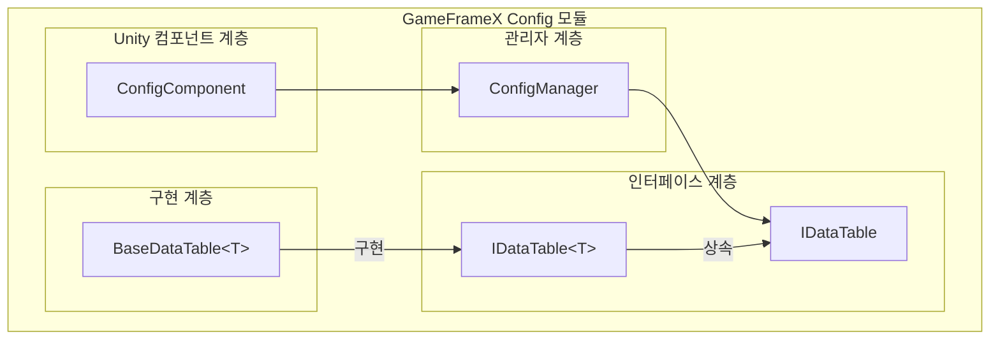

# 기초 사용

Config 컴포넌트는 GameFrameX 프레임워크에서 게임 구성 데이터를 관리하는 핵심 모듈로, 효율적이고 유형 안전한 구성 데이터 저장 및 접근 메커니즘을 제공합니다. Config 컴포넌트를 통해 개발자는 게임의 다양한 구성표(아이템표, 캐릭터표, 레벨표 등)를 간편하게 로드 및 관리하고, 강형 인터페이스를 통해 구성 데이터를 빠르게 조회할 수 있습니다.

## 개요

Config 컴포넌트의 설계 목표는 게임 개발을 위한 통일된 구성 데이터 관리 솔루션을 제공하는 것입니다. 게임 개발에서 구성 데이터는 일반적으로 Excel, CSV 또는 JSON 등의 형식으로 저장된 구성표에 있으며, 런타임에 빠르게 조회 및 접근되어야 합니다. Config 컴포넌트는 다음 특성을 통해 이 수요를 충족합니다:

- **유형 안전성**: 제네릭 인터페이스를 통해 컴파일 시 유형 검사 제공, 런타임 오류 감소
- **효율적 조회**: 내부는 Dictionary 저장소를 사용하여 O(1) 시간 복잡도의 데이터 검색 지원
- **유연한 주요 키 지원**: int, long, string 세 가지 주요 키 유형 지원, 다양한 구성표 수요에 적합
- **풍부한 조회 조작**: Find, Max, Min, Sum 등 일반적인 조회 메서드 제공

### 핵심 컴포넌트 아키텍처



### 데이터 접근 흐름

```mermaid
sequenceDiagram
    participant Dev as 개발자 코드
    participant CC as ConfigComponent
    participant CM as ConfigManager
    participant DT as IDataTable&lt;T&gt;

    Dev->>CC: GetConfig&lt;TDataTable&gt;()
    CC->>CM: GetConfig(configName)
    CM->>DT: IDataTable 인스턴스 반환
    DT-->>Dev: TDataTable 데이터표 객체
    Dev->>DT: TryGet(id, out value)
    DT-->>Dev: 조회 결과 반환
```

## 데이터표 생성

Config 컴포넌트를 사용하려면 먼저 사용자 정의 데이터표 클래스를 생성해야 합니다. 데이터표 클래스는 `BaseDataTable<T>` 추상 클래스를 상속하고, 구성 데이터를 로드하기 위한 `LoadAsync` 메서드를 구현해야 합니다.

### 데이터 모델 정의

먼저 구성 데이터의 모델 클래스를 정의해야 합니다. 예를 들어, 아이템 구성 데이터 모델을 생성합니다:

```csharp
using GameFrameX.Config.Runtime;

[Serializable]
public class ItemData
{
    public int Id { get; set; }
    public string Name { get; set; }
    public string Description { get; set; }
    public int Quality { get; set; }
    public int Price { get; set; }
}
```
> Source: [예시 코드](https://github.com/GameFrameX/com.gameframex.unity.config/blob/main/README.md)

### 데이터표 클래스 생성

`BaseDataTable<T>`를 상속하고 `LoadAsync` 메서드를 구현합니다:

```csharp
using System.Collections.Generic;
using System.Threading.Tasks;
using GameFrameX.Config.Runtime;

public class ItemDataTable : BaseDataTable<ItemData>
{
    public override async Task LoadAsync()
    {
        // 구성 소스에서 데이터 로드
        // 여기서는 파일, 네트워크 또는 리소스 시스템에서 로드할 수 있음
        var items = new List<ItemData>
        {
            new ItemData { Id = 1001, Name = "생명 포션", Description = "100 생명 회복", Quality = 1, Price = 50 },
            new ItemData { Id = 1002, Name = "마법 포션", Description = "50 마력 회복", Quality = 1, Price = 30 },
            new ItemData { Id = 1003, Name = "보라색 장비", Description = "고품질 장비", Quality = 5, Price = 1000 }
        };

        // 데이터를 사전에 추가
        foreach (var item in items)
        {
            LongDataMaps.Add(item.Id, item);
            DataList.Add(item);
        }
        
        await Task.CompletedTask;
    }
}
```
> Source: [BaseDataTable.cs](https://github.com/GameFrameX/com.gameframex.unity.config/blob/main/Runtime/Config/Config/BaseDataTable.cs#L48-L69)

`BaseDataTable<T>` 클래스는 데이터 저장을 위해 두 개의 주요 내부 사전을 제공합니다:
- `LongDataMaps`: 정수 주요 키 데이터 저장용
- `StringDataMaps`: 문자열 주요 키 데이터 저장용
- `DataList`: 모든 데이터 객체를 순서대로 저장

## 데이터표 등록 및 사용

### ConfigComponent 추가

Unity Scene에서 빈 객체를 생성하고 ConfigComponent 컴포넌트를 추가합니다:

1. Unity 편집기에서 Hierarchy 패널을 우클릭
2. `GameObject` → `Create Empty` 선택
3. Inspector 패널에서 `Add Component` 클릭
4. `ConfigComponent`(GameFrameX/Config 메뉴 아래)를 검색하여 추가

```csharp
// 코드으로도 추가 가능
var configEntity = new GameObject("ConfigSystem");
var configComponent = configEntity.AddComponent<GameFrameX.Config.Runtime.ConfigComponent>();
```
> Source: [ConfigComponent.cs](https://github.com/GameFrameX/com.gameframex.unity.config/blob/main/Runtime/Config/ConfigComponent.cs#L46-L48)

### 데이터표 등록

생성한 데이터표를 ConfigComponent에 등록합니다:

```csharp
using GameFrameX.Config.Runtime;
using UnityEngine;

public class GameStart : MonoBehaviour
{
    private ConfigComponent _configComponent;

    private void Start()
    {
        // ConfigComponent 인스턴스 가져오기
        _configComponent = GetComponent<ConfigComponent>();
        
        if (_configComponent == null)
        {
            _configComponent = gameObject.AddComponent<ConfigComponent>();
        }

        // 데이터표 생성 및 등록
        var itemDataTable = new ItemDataTable();
        _configComponent.Add("ItemDataTable", itemDataTable);

        // 데이터 비동기 로드
        _ = LoadDataAsync();
    }

    private async Task LoadDataAsync()
    {
        var itemDataTable = _configComponent.GetConfig<ItemDataTable>();
        if (itemDataTable != null)
        {
            await itemDataTable.LoadAsync();
            Debug.Log($"아이템표 로드 완료, {itemDataTable.Count}개 데이터");
        }
    }
}
```
> Source: [ConfigComponent.cs](https://github.com/GameFrameX/com.gameframex.unity.config/blob/main/Runtime/Config/ConfigComponent.cs#L108-L127)

### 제네릭 메서드로 간편하게 접근

ConfigComponent는 데이터표 가져오기를 간소화하는 제네릭 메서드를 제공합니다:

```csharp
// 지정된 유형의 데이터표 존재 여부 확인
bool hasTable = _configComponent.HasConfig<ItemDataTable>();

// 데이터표 인스턴스 가져오기
var itemDataTable = _configComponent.GetConfig<ItemDataTable>();

// 데이터표 제거
_configComponent.RemoveConfig<ItemDataTable>();

// 모든 데이터표 비우기
_configComponent.RemoveAllConfigs();
```
> Source: [ConfigComponent.cs](https://github.com/GameFrameX/com.gameframex.unity.config/blob/main/Runtime/Config/ConfigComponent.cs#L129-L170)

## 데이터 조회

`IDataTable<T>` 인터페이스는 다양한 조회 시나리오를 지원하는 풍부한 데이터 조회 메서드를 제공합니다.

### 기본 조회

인덱서 또는 TryGet 메서드로 데이터를 조회합니다:

```csharp
var itemDataTable = _configComponent.GetConfig<ItemDataTable>();

// 인덱서로 조회 (권장)
ItemData item1 = itemDataTable[1001];

// TryGet 메서드로 조회 (더 안전)
if (itemDataTable.TryGet(1001, out ItemData item))
{
    Debug.Log($"아이템 찾음: {item.Name}");
}
```
> Source: [BaseDataTable.cs](https://github.com/GameFrameX/com.gameframex.unity.config/blob/main/Runtime/Config/Config/BaseDataTable.cs#L119-L162)

### 조건 조회

Find 메서드로 조건 조회를 수행합니다:

```csharp
var itemDataTable = _configComponent.GetConfig<ItemDataTable>();

// 첫 번째 일치 객체 찾기
ItemData highQualityItem = itemDataTable.Find(item => item.Quality >= 5);

// 모든 일치 객체 찾기 (배열 반환)
ItemData[] allHighQualityItems = itemDataTable.FindListArray(item => item.Quality >= 3);

// 모든 일치 객체 찾기 (리스트 반환)
List<ItemData> expensiveItems = itemDataTable.FindList(item => item.Price > 100);
```
> Source: [BaseDataTable.cs](https://github.com/GameFrameX/com.gameframex.unity.config/blob/main/Runtime/Config/Config/BaseDataTable.cs#L296-L336)

### 집계 조회

Max, Min, Sum 메서드로 집계 계산을 수행합니다:

```csharp
var itemDataTable = _configComponent.GetConfig<ItemDataTable>();

// 지정 속성의 최대값 가져오기
int maxPrice = itemDataTable.Max(item => item.Price);

// 지정 속성의 최소값 가져오기
int minPrice = itemDataTable.Min(item => item.Price);

// 속성 합계 계산
int totalPrice = itemDataTable.Sum(item => item.Price);

// 요소 수统计
int count = itemDataTable.Count;

// 모든 데이터 가져오기
ItemData[] allItems = itemDataTable.All;
```
> Source: [BaseDataTable.cs](https://github.com/GameFrameX/com.gameframex.unity.config/blob/main/Runtime/Config/Config/BaseDataTable.cs#L351-L449)

### 순회 조작

ForEach 메서드로 모든 데이터를 순회합니다:

```csharp
var itemDataTable = _configComponent.GetConfig<ItemDataTable>();

// 모든 데이터 순회
itemDataTable.ForEach(item =>
{
    Debug.Log($"아이템: {item.Name}, 가격: {item.Price}");
});
```
> Source: [BaseDataTable.cs](https://github.com/GameFrameX/com.gameframex.unity.config/blob/main/Runtime/Config/Config/BaseDataTable.cs#L338-L349)

### 첫/마지막 요소 가져오기

```csharp
var itemDataTable = _configComponent.GetConfig<ItemDataTable>();

// 첫 번째 요소 가져오기
ItemData first = itemDataTable.FirstOrDefault;

// 마지막 요소 가져오기
ItemData last = itemDataTable.LastOrDefault;
```
> Source: [BaseDataTable.cs](https://github.com/GameFrameX/com.gameframex.unity.config/blob/main/Runtime/Config/Config/BaseDataTable.cs#L223-L255)

## 완전한 사용 예시

다음은 구성 시스템의 완전한 사용 예시입니다:

```csharp
using System.Collections.Generic;
using System.Threading.Tasks;
using GameFrameX.Config.Runtime;
using UnityEngine;

// 1. 데이터 모델 정의
[System.Serializable]
public class ItemData
{
    public int Id { get; set; }
    public string Name { get; set; }
    public string Description { get; set; }
    public int Quality { get; set; }
    public int Price { get; set; }
}

// 2. 데이터표 클래스 생성
public class ItemDataTable : BaseDataTable<ItemData>
{
    public override async Task LoadAsync()
    {
        // 파일 또는 네트워크에서 데이터 로드 시뮬레이션
        var items = new List<ItemData>
        {
            new ItemData { Id = 1001, Name = "생명 포션", Description = "100 생명 회복", Quality = 1, Price = 50 },
            new ItemData { Id = 1002, Name = "마법 포션", Description = "50 마력 회복", Quality = 1, Price = 30 },
            new ItemData { Id = 1003, Name = "금색 무기", Description = "금색 전설 무기", Quality = 5, Price = 10000 }
        };

        foreach (var item in items)
        {
            LongDataMaps.Add(item.Id, item);
            DataList.Add(item);
        }
        
        await Task.CompletedTask;
    }
}

// 3. 게임 시작 스크립트
public class GameConfigManager : MonoBehaviour
{
    private ConfigComponent _configComponent;

    private void Awake()
    {
        // Scene에 ConfigComponent가 있는지 확인
        _configComponent = GetComponent<ConfigComponent>();
        if (_configComponent == null)
        {
            _configComponent = gameObject.AddComponent<ConfigComponent>();
        }
    }

    private async void Start()
    {
        // 데이터표 등록
        var itemTable = new ItemDataTable();
        _configComponent.Add("ItemDataTable", itemTable);

        // 데이터 로드
        await itemTable.LoadAsync();

        // 데이터 조회
        QueryData();
    }

    private void QueryData()
    {
        var itemTable = _configComponent.GetConfig<ItemDataTable>();
        
        // 기본 조회
        var item = itemTable[1001];
        Debug.Log($"조회 결과: {item?.Name}");

        // 조건 조회
        var highQualityItems = itemTable.FindListArray(x => x.Quality >= 3);
        Debug.Log($"고품질 아이템 수: {highQualityItems.Length}");

        // 집계 조회
        var totalValue = itemTable.Sum(x => x.Price);
        Debug.Log($"아이템 총 가치: {totalValue}");
    }
}
```
> Source: [BaseDataTable.cs](https://github.com/GameFrameX/com.gameframex.unity.config/blob/main/Runtime/Config/Config/BaseDataTable.cs#L48-L69)

## 구성 데이터 형식

Config 컴포넌트는 다양한 형식의 구성 파일에서 데이터를 로드할 수 있습니다:

### 텍스트 형식 (TSV)

기본적으로 Tab으로 구분된 텍스트 형식을 지원합니다:

```
# 형식: Id    Name    Description    Quality    Price
1001    생명 포션    100 생명 회복    1    50
1002    마법 포션    50 마력 회복    1    30
```

각 행은 Tab 키로 구분된 4개의 열을 포함합니다.

### 바이너리 형식

바이너리 형식의 구성 파일도 로드를 지원하며, 일반적으로 `.bytes` 확장자를 사용합니다.

> 상세 구성 형식 설명은 [데이터표 정의](./8.data-table-definition) 문서를 참고하세요.

## 모범 사례

### 데이터표 명명 규범

- 데이터표 클래스 이름은 PascalCase 명명 사용
- 데이터표 인스턴스 이름은 의미 있는 이름 사용
- 데이터표 접근은 싱글톤 패턴 사용 권장

### 비동기 로딩

모든 데이터 로드 조작은 비동기方式进行主线程 차단을 피합니다:

```csharp
// 권장: 비동기 로딩
await itemDataTable.LoadAsync();

// 또는 비동기 호출 사용
_ = itemDataTable.LoadAsync();
```

### null 값 확인

TryGet 메서드로 안전한 null 값 확인:

```csharp
// 권장写法
if (itemDataTable.TryGet(1001, out ItemData item))
{
    // 찾은 데이터 처리
    Debug.Log(item.Name);
}

// 비권장: 데이터가 없으면 null 반환
var item = itemDataTable[1001];
if (item != null)
{
    // 데이터 처리
}
```

## 관련 링크

- [Config 컴포넌트 소개](./1.overview)
- [기능 특성](./04.features)
- [데이터표 정의](./8.data-table-definition)
- [ConfigComponent 구성 컴포넌트](./10.config-component)
- [ConfigManager 구성 관리자](./9.config-manager)
- [IDataTable 데이터표 인터페이스](./7.idata-table)
- [API 참고](./06.interfaces)
- [이벤트 매개변수](./12.event-args)