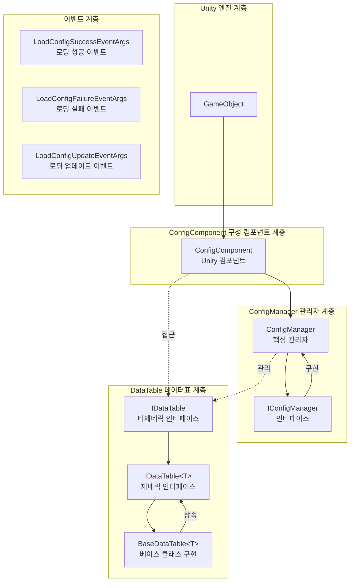
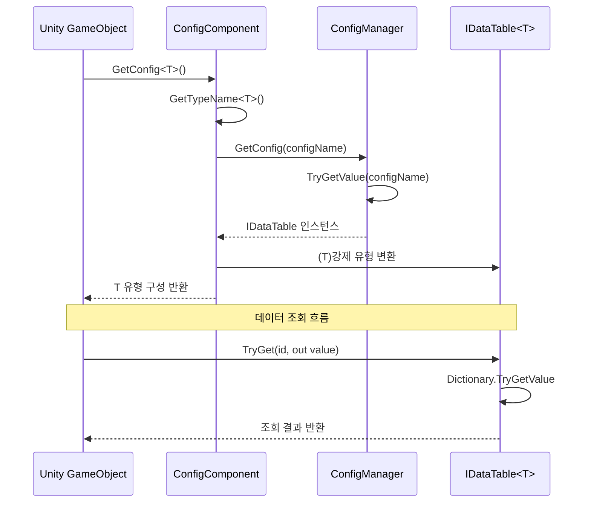

# 기능 특성

Config 구성표 컴포넌트는 GameFrameX 프레임워크의 핵심 모듈 중 하나로, 완전한 데이터 구성 관리 솔루션을 제공합니다. 이 컴포넌트는 다중 데이터 형식(텍스트 및 바이너리), 유연한 데이터표 조회, 유형 안전한 데이터 접근 및 완전한 이벤트 시스템을 지원합니다.

## 개요

Config 구성표 컴포넌트는 Unity 게임 개발을 위한 효율적인 구성 데이터 관리 능력을 제공하며, 주요 특성은 다음과 같습니다:

- **통일된 구성 관리**: ConfigManager를 통해 모든 구성 데이터표 중앙 관리
- **유형 안전한 데이터 접근**: 제네릭 기반 데이터표 인터페이스, 컴파일 시 유형 검사 제공
- **다중 데이터 형식 지원**: 텍스트 형식(Tab 구분)과 바이너리 형식 구성표 지원
- **고성능 조회**: 사전 구조를 사용한 O(1) 시간 복잡도의 데이터 검색
- **유연한 데이터 조작**: 풍부한 조회, 필터링, 집계 메서드 제공
- **이벤트驱动 아키텍처**: 로딩 성공, 실패, 업데이트 등의 이벤트 콜백 제공

## 아키텍처 설계

Config 컴포넌트는 계층화된 아키텍처 설계를 채택하여 각 컴포넌트의 책임이 명확하고, 공동으로 작동합니다:



### 핵심 컴포넌트 설명

| 컴포넌트 | 네임스페이스 | 설명 |
|------|----------|------|
| ConfigComponent | GameFrameX.Config.Runtime | Unity 컴포넌트, 런타임 구성 접근 진입점 제공 |
| ConfigManager | GameFrameX.Config.Runtime | 핵심 구성 관리자, IConfigManager 인터페이스 구현 |
| IConfigManager | GameFrameX.Config.Runtime | 구성 관리자 인터페이스, 구성 관리 작업 정의 |
| IDataTable | GameFrameX.Config.Runtime | 데이터표 베이스 인터페이스 |
| IDataTable<T> | GameFrameX.Config.Runtime | 제네릭 데이터표 인터페이스, 유형 안전 접근 제공 |
| BaseDataTable<T> | GameFrameX.Config.Runtime | 데이터표 베이스 클래스, 구체적 구현 제공 |

## 핵심 기능

### 1. 구성 데이터 저장 및 관리

ConfigManager는 스레드 안전한 `ConcurrentDictionary`를 사용하여 구성 데이터를 저장하며, 구성 추가, 조회, 제거 및 비우기 작업을 지원합니다.

```csharp
// ConfigManager.cs - 구성 관리자 핵심 구현
public sealed partial class ConfigManager : GameFrameworkModule, IConfigManager
{
    private readonly ConcurrentDictionary<string, IDataTable> m_ConfigDatas;

    public ConfigManager()
    {
        m_ConfigDatas = new ConcurrentDictionary<string, IDataTable>(StringComparer.Ordinal);
    }

    public bool HasConfig(string configName)
    {
        return m_ConfigDatas.TryGetValue(configName, out _);
    }

    public void AddConfig(string configName, IDataTable configValue)
    {
        m_ConfigDatas.TryAdd(configName, configValue);
    }

    public IDataTable GetConfig(string configName)
    {
        return m_ConfigDatas.TryGetValue(configName, out var value) ? value : null;
    }

    public bool RemoveConfig(string configName)
    {
        return m_ConfigDatas.TryRemove(configName, out _);
    }

    public void RemoveAllConfigs()
    {
        m_ConfigDatas.Clear();
    }
}
```
> Source: [ConfigManager.cs](https://github.com/GameFrameX/com.gameframex.unity.config/blob/main/Runtime/Config/Config/ConfigManager.cs#L46-L166)

### 2. 제네릭 데이터표 인터페이스

`IDataTable<T>` 인터페이스는 유형 안전한 데이터 접근 방식을 정의하며, int, long, string等多种 키 유형의 데이터 조회를 지원합니다:

```csharp
// IDataTable.cs - 제네릭 데이터표 인터페이스 정의
public interface IDataTable<T> : IDataTable where T : class
{
    // 정수 ID로 객체 가져오기 시도
    bool TryGet(int id, out T value);

    // long 정수 ID로 객체 가져오기 시도
    bool TryGet(long id, out T value);

    // 문자열 ID로 객체 가져오기 시도
    bool TryGet(string id, out T value);

    // 인덱서 - 다중 키 유형 지원
    T this[int id] { get; }
    T this[long id] { get; }
    T this[string id] { get; }

    // 첫/마지막 요소 가져오기
    T FirstOrDefault { get; }
    T LastOrDefault { get; }

    // 모든 데이터 가져오기
    T[] All { get; }
    T[] ToArray();
    List<T> ToList();

    // 조회 메서드
    T Find(Func<T, bool> func);
    T[] FindListArray(Func<T, bool> func);
    List<T> FindList(Func<T, bool> func);
    void ForEach(Action<T> func);

    // 집계 메서드
    Tk Max<Tk>(Func<T, Tk> func) where Tk : IComparable<Tk>;
    Tk Min<Tk>(Func<T, Tk> func) where Tk : IComparable<Tk>;
    int Sum(Func<T, int> func);
    long Sum(Func<T, long> func);
    float Sum(Func<T, float> func);
    double Sum(Func<T, double> func);
    decimal Sum(Func<T, decimal> func);
}
```
> Source: [IDataTable.cs](https://github.com/GameFrameX/com.gameframex.unity.config/blob/main/Runtime/Config/Config/IDataTable.cs#L76-L265)

### 3. 데이터표 베이스 클래스 구현

`BaseDataTable<T>`는 완전한 제네릭 데이터표 구현을 제공하며, 내부적으로 이중 사전 구조(LongDataMaps 및 StringDataMaps)를 사용하여 long 및 문자열 키 데이터를 각각 저장합니다:

```csharp
// BaseDataTable.cs - 데이터표 베이스 클래스 구현
public abstract class BaseDataTable<T> : IDataTable<T> where T : class
{
    private const int DefaultSize = 1024 * 8;
    protected readonly Dictionary<long, T> LongDataMaps = new Dictionary<long, T>(DefaultSize);
    protected readonly Dictionary<string, T> StringDataMaps = new Dictionary<string, T>(DefaultSize);
    protected readonly List<T> DataList = new List<T>(DefaultSize);

    // 캐시 최적화
    private bool _cacheInitialized;
    private T _firstOrDefaultCache;
    private T _lastOrDefaultCache;

    public bool TryGet(int id, out T value)
    {
        return LongDataMaps.TryGetValue(id, out value);
    }

    public bool TryGet(long id, out T value)
    {
        return LongDataMaps.TryGetValue(id, out value);
    }

    public bool TryGet(string id, out T value)
    {
        return StringDataMaps.TryGetValue(id, out value);
    }

    // 인덱서로 접근
    public T this[int id] => TryGet(id, out var value) ? value : null;
    public T this[long id] => TryGet(id, out var value) ? value : null;
    public T this[string id] => TryGet(id, out var value) ? value : null;

    // 조회 메서드
    public T Find(Func<T, bool> func)
    {
        return DataList.FirstOrDefault(func);
    }

    public T[] FindListArray(Func<T, bool> func)
    {
        return DataList.Where(func).ToArray();
    }
}
```
> Source: [BaseDataTable.cs](https://github.com/GameFrameX/com.gameframex.unity.config/blob/main/Runtime/Config/Config/BaseDataTable.cs#L46-L165)

### 4. Unity 컴포넌트 통합

`ConfigComponent`는 Unity 컴포넌트로, GameObject에 추가하여 구성 접근의 편의 인터페이스를 제공합니다:

```csharp
// ConfigComponent.cs - Unity 컴포넌트
[DisallowMultipleComponent]
[AddComponentMenu("GameFrameX/Config")]
public sealed class ConfigComponent : GameFrameworkComponent
{
    private IConfigManager m_ConfigManager = null;
    private ConcurrentDictionary<Type, string> m_ConfigNameTypeMap = new ConcurrentDictionary<Type, string>();

    protected override void Awake()
    {
        base.Awake();
        m_ConfigManager = GameFrameworkEntry.GetModule<IConfigManager>();
    }

    // 제네릭 메서드로 구성 가져오기
    public T GetConfig<T>() where T : IDataTable
    {
        var configName = GetTypeName<T>();
        var config = m_ConfigManager.GetConfig(configName);
        return config != null ? (T)config : default;
    }

    // 구성 존재 여부 확인
    public bool HasConfig<T>() where T : IDataTable
    {
        var configName = GetTypeName<T>();
        return m_ConfigManager.HasConfig(configName);
    }

    // 구성 제거
    public bool RemoveConfig<T>() where T : IDataTable
    {
        var configName = GetTypeName<T>();
        return m_ConfigManager.RemoveConfig(configName);
    }

    // 구성 추가
    public void Add(string configName, IDataTable dataTable)
    {
        m_ConfigManager.AddConfig(configName, dataTable);
    }
}
```
> Source: [ConfigComponent.cs](https://github.com/GameFrameX/com.gameframex.unity.config/blob/main/Runtime/Config/ConfigComponent.cs#L46-L185)

### 5. 이벤트 시스템

Config 컴포넌트는 완전한 이벤트 시스템을 제공하여 구성 로딩 상태를监听합니다:

```csharp
// 로딩 성공 이벤트
public sealed class LoadConfigSuccessEventArgs : GameEventArgs
{
    public static readonly string EventId = typeof(LoadConfigSuccessEventArgs).FullName;
    public string ConfigAssetName { get; private set; }  // 구성 자원 이름
    public float Duration { get; private set; }          // 로딩 소요 시간
    public object UserData { get; private set; }          // 사용자 데이터

    public static LoadConfigSuccessEventArgs Create(string dataAssetName, float duration, object userData)
    {
        // 이벤트 인스턴스 생성
    }
}

// 로딩 실패 이벤트
public sealed class LoadConfigFailureEventArgs : GameEventArgs
{
    public static readonly string EventId = typeof(LoadConfigFailureEventArgs).FullName;
    public string ConfigAssetName { get; private set; }  // 구성 자원 이름
    public string ErrorMessage { get; private set; }     // 오류 정보
    public object UserData { get; private set; }          // 사용자 데이터
}

// 로딩 업데이트 이벤트 (진행률)
public sealed class LoadConfigUpdateEventArgs : GameEventArgs
{
    public static readonly string EventId = typeof(LoadConfigUpdateEventArgs).FullName;
    public string ConfigAssetName { get; private set; }  // 구성 자원 이름
    public float Progress { get; private set; }           // 로딩 진행률 (0.0 - 1.0)
    public object UserData { get; private set; }          // 사용자 데이터
}
```
> Sources:
> - [LoadConfigSuccessEventArgs.cs](https://github.com/GameFrameX/com.gameframex.unity.config/blob/main/Runtime/EventArgs/LoadConfigSuccessEventArgs.cs#L43-L137)
> - [LoadConfigFailureEventArgs.cs](https://github.com/GameFrameX/com.gameframex.unity.config/blob/main/Runtime/EventArgs/LoadConfigFailureEventArgs.cs#L43-L137)
> - [LoadConfigUpdateEventArgs.cs](https://github.com/GameFrameX/com.gameframex.unity.config/blob/main/Runtime/EventArgs/LoadConfigUpdateEventArgs.cs#L43-L137)

## 데이터 접근 흐름

다음 흐름도는 Unity 컴포넌트에서 데이터표까지의 데이터 접근 과정을 보여줍니다:



## 사용 예시

### 기본 구성 가져오기

```csharp
// 구성 컴포넌트 가져오기
var configComponent = GameEntry.GetComponent<ConfigComponent>();

// 구성 존재 여부 확인
if (configComponent.HasConfig<PlayerConfig>())
{
    // 구성 데이터표 가져오기
    var playerConfig = configComponent.GetConfig<PlayerConfig>();
    
    // 인덱서로 데이터 조회
    var player = playerConfig[1001];  // ID로 조회
    
    // TryGet 메서드로 안전하게 조회
    if (playerConfig.TryGet(1001, out var playerData))
    {
        Debug.Log($"플레이어 이름: {playerData.Name}");
    }
}
```

### 데이터 조회 및 필터링

```csharp
var config = configComponent.GetConfig<MonsterConfig>();

// 모든 조건을 충족하는 객체 조회
var bossMonsters = config.FindList(m => m.Type == MonsterType.Boss);

// 집계 함수 사용
var maxLevel = config.Max(m => m.Level);
var totalHP = config.Sum(m => m.HP);

// 모든 데이터 순회
config.ForEach(monster => {
    Debug.Log($"몬스터: {monster.Name}, 레벨: {monster.Level}");
});
```

## 구성 형식 지원

Config 컴포넌트는 두 가지 구성표 형식을 지원합니다:

### 1. 텍스트 형식 (Tab 구분)

텍스트 형식 구성은 Tab 문자를 열 구분자로 사용하며, 편집기 미리보기 및 디버깅에 적합합니다:

```
# 형식: ID    이름    설명    값
1    config1 구성1   100
2    config2 구성2   200
```

### 2. 바이너리 형식 (.bytes)

바이너리 형식 구성 파일은 `.bytes` 확장자를 사용하며, 프로덕션 환경 로드에 적합하고 더 작은 볼륨과 더 빠른 파싱 속도를 가집니다.

> 바이너리 구성표에 대한详细内容은 [바이너리 구성표](./11.binary-config) 문서를 참고하세요.

## 관련 링크

- [Config 컴포넌트 소개](./1.overview) - Config 컴포넌트 개요 및 설치
- [설치 방식](./2.installation) - 컴포넌트 설치 가이드
- [의존 요구](./5.dependencies) - 프로젝트 의존 설명
- [ConfigComponent 구성 컴포넌트](./10.config-component) - Unity 컴포넌트 상세
- [ConfigManager 구성 관리자](./9.config-manager) - 핵심 관리자 상세
- [IDataTable 데이터표 인터페이스](./7.idata-table) - 데이터표 인터페이스 정의
- [API 참고](./06.interfaces) - 완전한 인터페이스 문서
- [이벤트 매개변수](./12.event-args) - 이벤트 매개변수 상세
- [스크립트 매크로 정의](./13.scripting-define-symbols) - 컴파일 심볼 구성