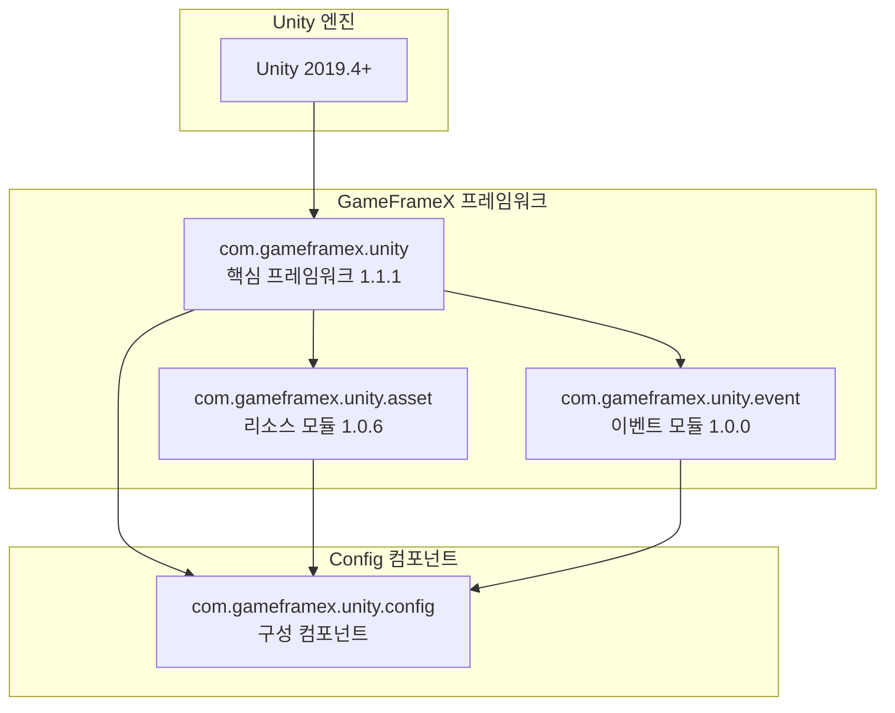

# 의존 요구

이 문서는 Config 구성 컴포넌트의 의존 요구를 상세히 소개하며, Unity 버전 요구, GameFrameX 핵심 패키지 의존 및 내부 어셈블리 참조 관계를 포함합니다.

## 개요

Config 구성 컴포넌트는 GameFrameX 프레임워크의 핵심 모듈 중 하나로, 게임의 구성 데이터표 관리에 사용됩니다. 이 컴포넌트는 GameFrameX 핵심 프레임워크의 다른 모듈에 의존하며, 특정 버전 요구를 충족하는 Unity 환경에서 실행되어야 하고 관련 의존 패키지가 올바르게 구성되어야만 정상적으로 작동합니다.

## 의존 아키텍처



## Unity 버전 요구

| 항목 | 요구 |
|------|------|
| 최소 버전 | Unity 2019.4 |
| 권장 버전 | Unity 2020.3 LTS 이상 |
| 스크립트 런타임 | .NET Standard 2.0+ |

> Source: [package.json](https://github.com/GameFrameX/com.gameframex.unity.config/blob/main/package.json#L7)

Unity 버전 요구는 `package.json` 파일의 `unity` 필드에 정의되어 있으며, 프로젝트가 호환되는 Unity 버전을 사용하고 있는지 확인하여야 합니다.

## GameFrameX 핵심 패키지 의존

Config 컴포넌트는 다음 GameFrameX 공식 패키지에 의존하며, 이러한 의존은 `package.json`에서 선언됩니다:

### 의존 패키지 목록

| 패키지명 | 최소 버전 | 용도 설명 |
|------|----------|----------|
| com.gameframex.unity | 1.1.1 | 핵심 프레임워크, 기본 컴포넌트 및 모듈 관리 기능 제공 |
| com.gameframex.unity.asset | 1.0.6 | 리소스 로딩 모듈, 구성표 파일의 비동기 로딩에 사용 |
| com.gameframex.unity.event | 1.0.0 | 이벤트 시스템, 구성 로딩 성공/실패 등 이벤트 알림에 사용 |

```json
{
  "dependencies": {
    "com.gameframex.unity": "1.1.1",
    "com.gameframex.unity.asset": "1.0.6",
    "com.gameframex.unity.event": "1.0.0"
  }
}
```

> Source: [package.json](https://github.com/GameFrameX/com.gameframex.unity.config/blob/main/package.json#L21-L25)

### 의존 관계 설명

**com.gameframex.unity (핵심 프레임워크)**
- `GameFrameworkComponent` 기본 클래스를 제공하며, ConfigComponent는 이 클래스를 상속합니다
- 모듈 관리 시스템을 제공하며, `GameFrameworkEntry`를 통해 각 모듈 인스턴스를 획득합니다
- 어셈블리 도구 `Utility.Assembly`를 제공하여 유형 리플렉션에 사용됩니다

**com.gameframex.unity.asset (리소스 모듈)**
- 비동기 리소스 로딩 능력을 제공하며, ConfigManager는 `GameFrameX.Asset.Runtime` 네임스페이스를 사용합니다
- 구성표 바이너리 파일 또는 JSON/XML 구성 파일 로드에 사용됩니다
- 구성표의 필요 시 로딩 및 캐시 관리 지원을 제공합니다

**com.gameframex.unity.event (이벤트 모듈)**
- 이벤트 시스템을 제공하여 구성 로딩 상태를 알리는 데 사용됩니다
- 다음 이벤트 매개변수 클래스를 정의합니다:
  - `LoadConfigSuccessEventArgs`: 구성 로딩 성공 이벤트
  - `LoadConfigFailureEventArgs`: 구성 로딩 실패 이벤트
  - `LoadConfigUpdateEventArgs`: 구성 로딩 업데이트 이벤트

## 내부 어셈블리 참조

Config 컴포넌트의 런타임 어셈블리 `GameFrameX.Config.Runtime.asmdef`는 다음 어셈블리 참조를 정의합니다:

```csharp
// Runtime/GameFrameX.Config.Runtime.asmdef
{
    "references": [
        "GameFrameX.Runtime",
        "GameFrameX.Event.Runtime",
        "GameFrameX.Asset.Runtime"
    ]
}
```

> Source: [Runtime/GameFrameX.Config.Runtime.asmdef](https://github.com/GameFrameX/com.gameframex.unity.config/blob/main/Runtime/GameFrameX.Config.Runtime.asmdef#L3-L6)

### 어셈블리 참조 상세

| 어셈블리 | 네임스페이스 | 기능 설명 |
|--------|----------|----------|
| GameFrameX.Runtime | `GameFrameX.Runtime` | 핵심 런타임, GameFrameworkComponent, GameFrameworkModule, IConfigManager 인터페이스 제공 |
| GameFrameX.Event.Runtime | `GameFrameX.Event.Runtime` | 이벤트 시스템 기본 인터페이스 및 구현 |
| GameFrameX.Asset.Runtime | `GameFrameX.Asset.Runtime` | 리소스 로딩 인터페이스 및 구현 |

### 주요 유형 의존

Config 컴포넌트에서 사용되는 주요 유형 및 그 출처:

```csharp
using GameFrameX.Runtime;           // GameFrameworkComponent, GameFrameworkModule
using GameFrameX.Asset.Runtime;      // 리소스 로딩 관련 인터페이스
using GameFrameX.Event.Runtime;     // 이벤트 매개변수 기본 클래스

// ConfigComponent 상속 관계
public sealed class ConfigComponent : GameFrameworkComponent

// ConfigManager 상속 관계  
public sealed class ConfigManager : GameFrameworkModule, IConfigManager
```

> Source: [Runtime/Config/ConfigComponent.cs](https://github.com/GameFrameX/com.gameframex.unity.config/blob/main/Runtime/Config/ConfigComponent.cs#L48)
> Source: [Runtime/Config/Config/ConfigManager.cs](https://github.com/GameFrameX/com.gameframex.unity.config/blob/main/Runtime/Config/Config/ConfigManager.cs#L47)

## 의존 설치

### 자동 설치 (권장)

Unity Package Manager로 패키지를 추가하면 의존 패키지가 자동으로 설치됩니다:

1. Unity 프로젝트의 `Packages/manifest.json` 파일 열기
2. `dependencies`에서 Config 컴포넌트 추가:

```json
{
  "dependencies": {
    "com.gameframex.unity.config": "https://github.com/GameFrameX/com.gameframex.unity.config.git"
  }
}
```

3. Unity가 자동으로 모든 필수 의존 패키지를 분석하여 설치합니다

### 수동 설치

수동으로 설치해야 하는 경우, 다음 순서로 의존을 설치하도록 합니다:

1. **핵심 프레임워크 설치**
   ```json
   { "com.gameframex.unity": "1.1.1" }
   ```

2. **리소스 모듈 설치**
   ```json
   { "com.gameframex.unity.asset": "1.0.6" }
   ```

3. **이벤트 모듈 설치**
   ```json
   { "com.gameframex.unity.event": "1.0.0" }
   ```

4. **마지막으로 Config 컴포넌트 설치**
   ```json
   { "com.gameframex.unity.config": "1.1.3" }
   ```

## 의존 버전 호환성

| Config 버전 | Unity 버전 | 핵심 프레임워크 버전 | 리소스 모듈 버전 | 이벤트 모듈 버전 |
|------------|------------|--------------|--------------|--------------|
| 1.1.3 | 2019.4+ | 1.1.1 | 1.0.6 | 1.0.0 |
| 1.1.2 | 2019.4+ | 1.1.0 | 1.0.5 | 1.0.0 |
| 1.1.1 | 2019.4+ | 1.1.0 | 1.0.5 | 1.0.0 |

항상 최신 버전의 의존 패키지를 사용하여 최적의 호환성 및 새 기능 지원을 획득할 것을 권장합니다.

## 일반적인 의존 문제

### 문제 1: 핵심 프레임워크 의존 누락

**증상**: 컴파일 시 `GameFrameworkComponent` 유형을 찾을 수 없음 오류 발생

**해결책**: `com.gameframex.unity` 핵심 프레임워크 패키지가 설치되었는지 확인합니다

### 문제 2: 이벤트 시스템 미초기화

**증상**: 구성 로딩 이벤트가 트리거되지 않음

**해결책**: `com.gameframex.unity.event`가 올바르게 설치되었는지 확인하고 Scene에서 이벤트 시스템이 초기화되었는지 확인합니다

### 문제 3: 리소스 로딩 실패

**증상**: 구성표 파일을 로드할 수 없음

**해결책**: `com.gameframex.unity.asset` 버전이 요구와 일치하는지 확인하고 리소스 경로 구성을 점검합니다

## 관련 링크

- [설치 방식](./02.installation) - 다양한 설치 방법 알아보기
- [ConfigComponent 구성 컴포넌트](./10.config-component) - 컴포넌트 사용 알아보기
- [ConfigManager 구성 관리자](./09.config-manager) - 관리자 기능 알아보기
- [IDataTable 데이터표 인터페이스](./07.idata-table) - 데이터표 인터페이스 정의 알아보기
- [공식 문서](https://gameframex.doc.alianblank.com/) - GameFrameX 완전한 문서