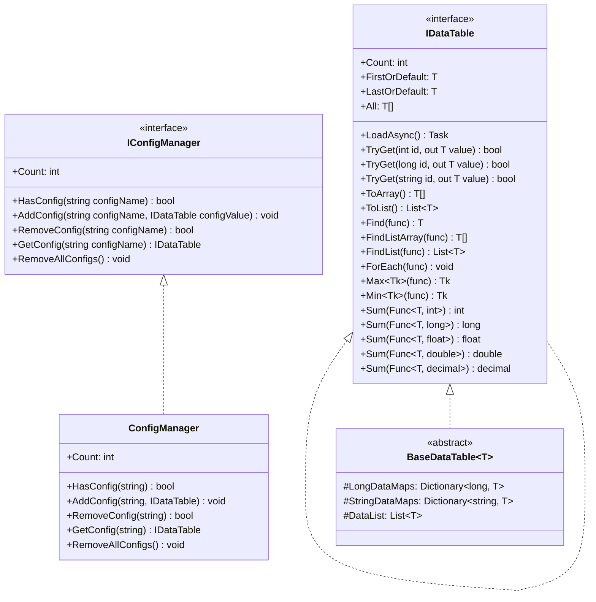
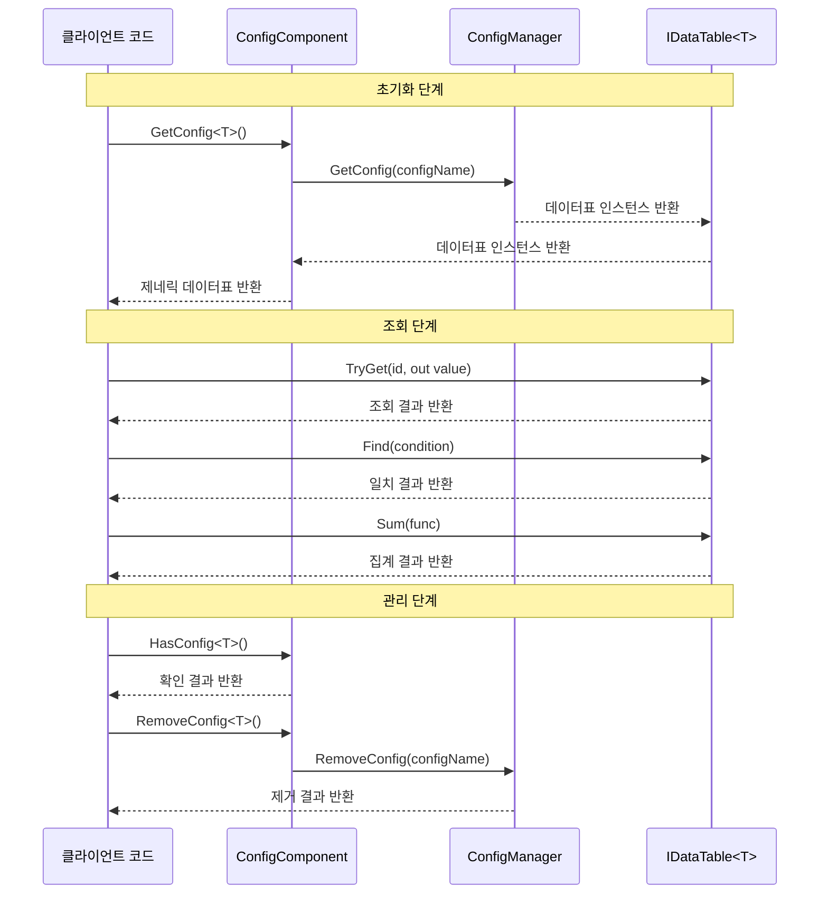

# 인터페이스 정의

이 문서는 GameFrameX Config 구성 모듈에서 정의된 핵심 인터페이스를 상세히 소개하며, 데이터표 인터페이스 IDataTable, 제네릭 데이터표 인터페이스 IDataTable<T> 및 전역 구성 관리자 인터페이스 IConfigManager를 포함합니다. 이러한 인터페이스는 구성 시스템에 대한 통일된 추상 계층을 제공하여 개발자가 유형 안전한 방식으로 게임 구성 데이터에 접근하고 관리할 수 있게 합니다.

## 개요

GameFrameX Config 구성 모듈은 인터페이스 중심 설계를 채택하고, 명확한 인터페이스 계약 통해 구성 데이터의 해제된 관리 구현을 달성합니다. 인터페이스 설계는 다음 핵심 원칙을 따릅니다:

- **유형 안전성**: 제네릭 인터페이스 IDataTable<T>를 통해 컴파일 시 유형 검사 보장
- **유연한 조회**: 다양한 데이터 조회 방식 제공, 주요 키 조회, 조건 조회, 집계运算 등 포함
- **비동기 로딩**: 모든 데이터 로딩 조작이 비동기 모드 지원, 게임 메인 스레드 차단을 피함
- **이벤트驱动**: 이벤트 매개변수 클래스를 통해 로딩 상태의 정확한 알림 구현

## 인터페이스 계층 구조



상기 그림에서 볼 수 있듯이, 인터페이스 간에는 명확한 상속 및 구현 관계가 있습니다. IDataTable<T>는 IDataTable를 상속하여 강형 데이터 접근 메서드를 추가합니다. BaseDataTable<T>는 IDataTable<T> 인터페이스를 구현하여 데이터 저장 및 조회 베이스 클래스를 제공합니다. ConfigManager는 IConfigManager 인터페이스를 구현하여 모든 구성 데이터표 인스턴스 관리 담당합니다.

## IDataTable 비제네릭 인터페이스

IDataTable는 데이터표의 비제네릭 베이스 인터페이스로, 모든 데이터표가 구현해야 할 핵심 기능을 정의합니다. 이 인터페이스는 Runtime/Config/Config/IDataTable.cs 파일에 위치합니다.

> Source: [IDataTable.cs](https://github.com/GameFrameX/com.gameframex.unity.config/blob/main/Runtime/Config/Config/IDataTable.cs#L46-L67)

### 인터페이스 정의

```csharp
[Preserve]
public interface IDataTable
{
    [Preserve]
    Task LoadAsync();

    [Preserve]
    int Count { get; }
}
```

### 멤버 설명

**LoadAsync 메서드**
- **시그니처**: `Task LoadAsync()`
- **설명**: 데이터표 내용 비동기 로딩. 이 메서드는 구체적인 구현 클래스에서 구현되며, 바이너리 파일, JSON, XML 등 다양한 데이터 소스에서 구성 데이터 로드에 사용됩니다
- **반환값**: 비동기 작업을 나타내는 태스크 객체

**Count 속성**
- **시그니처**: `int Count { get; }`
- **설명**: 데이터표에 포함된 데이터 객체 수량 획득
- **반환값**: 데이터 항목 총수를 나타내는 음수가 아닌 정수

## IDataTable<T> 제네릭 인터페이스

IDataTable<T>는 데이터표의 제네릭 인터페이스로, IDataTable 인터페이스를 상속하여 강형 데이터 접근 및 조회 능력을 제공합니다. 이 인터페이스는 동일하게 Runtime/Config/Config/IDataTable.cs 파일에 위치합니다.

> Source: [IDataTable.cs](https://github.com/GameFrameX/com.gameframex.unity.config/blob/main/Runtime/Config/Config/IDataTable.cs#L77-L355)

### 인터페이스 정의

```csharp
[Preserve]
public interface IDataTable<T> : IDataTable where T : class
{
    // 주요 키 조회 메서드
    [Obsolete("Please use TryGet method")]
    [Preserve]
    T Get(int id);

    [Obsolete("Please use TryGet method")]
    [Preserve]
    T Get(long id);

    [Obsolete("Please use TryGet method")]
    [Preserve]
    T Get(string id);

    [Preserve]
    bool TryGet(int id, out T value);

    [Preserve]
    bool TryGet(long id, out T value);

    [Preserve]
    bool TryGet(string id, out T value);

    // 인덱서
    [Preserve]
    T this[int id] { get; }

    [Preserve]
    T this[long id] { get; }

    [Preserve]
    T this[string id] { get; }

    // 편의 접근 속성
    [Preserve]
    T FirstOrDefault { get; }

    [Preserve]
    T LastOrDefault { get; }

    [Preserve]
    T[] All { get; }

    // 집합 변환 메서드
    [Preserve]
    T[] ToArray();

    [Preserve]
    List<T> ToList();

    // 조회 메서드
    [Preserve]
    T Find(System.Func<T, bool> func);

    [Preserve]
    T[] FindListArray(System.Func<T, bool> func);

    [Preserve]
    List<T> FindList(Func<T, bool> func);

    [Preserve]
    void ForEach(Action<T> func);

    // 집계 메서드
    [Preserve]
    Tk Max<Tk>(Func<T, Tk> func) where Tk : IComparable<Tk>;

    [Preserve]
    Tk Min<Tk>(Func<T, Tk> func) where Tk : IComparable<Tk>;

    [Preserve]
    int Sum(Func<T, int> func);

    [Preserve]
    long Sum(Func<T, long> func);

    [Preserve]
    float Sum(Func<T, float> func);

    [Preserve]
    double Sum(Func<T, double> func);

    [Preserve]
    decimal Sum(Func<T, decimal> func);
}
```

### 멤버 상세 설명

#### 주요 키 조회 메서드

**TryGet 메서드 오버로드**
- **설명**: 지정된 주요 키에 따라 데이터 객체를 가져오기 시도. 폐지된 Get 메서드보다 TryGet 메서드가 더 안전하여 예외를 던지지 않습니다
- **매개변수**:
  - `id`: 데이터 객체의 주요 키, int, long, string 세 가지 유형 지원
  - `value`: 출력 매개변수, 주요 키에 해당하는 데이터를 찾으면 해당 데이터 객체를 반환하고, 그렇지 않으면 기본값 반환
- **반환값**: 주요 키에 해당하는 데이터를 찾으면 true, 그렇지 않으면 false

```csharp
// TryGet 메서드로 안전하게 데이터 가져오기
if (dataTable.TryGet(1001, out var item))
{
    Debug.Log($"데이터 찾음: {item.Name}");
}
else
{
    Debug.LogWarning("지정된 데이터 찾지 못함");
}
```

> Source: [BaseDataTable.cs](https://github.com/GameFrameX/com.gameframex.unity.config/blob/main/Runtime/Config/Config/BaseDataTable.cs#L119-L162)

#### 인덱서

**설명**: 데이터 접근을 위한 세 가지 유형의 인덱서 제공. 인덱서 내부에서 TryGet 메서드를 호출하여 구현되며, 데이터를 찾지 못하면 null 반환

```csharp
// 인덱서로 데이터 접근
var item1 = dataTable[1001];      // int 유형 주요 키
var item2 = dataTable[10001L];     // long 유형 주요 키
var item3 = dataTable["item_001"]; // string 유형 주요 키
```

> Source: [BaseDataTable.cs](https://github.com/GameFrameX/com.gameframex.unity.config/blob/main/Runtime/Config/Config/BaseDataTable.cs#L164-L204)

#### 편의 접근 속성

**FirstOrDefault 속성**
- **유형**: `T`
- **설명**: 데이터표의 첫 번째 데이터 객체를 가져오며, 데이터표가 비어 있으면 null 반환

**LastOrDefault 속성**
- **유형**: `T`
- **설명**: 데이터표의 마지막 데이터 객체를 가져오며, 데이터표가 비어 있으면 null 반환

**All 속성**
- **유형**: `T[]`
- **설명**: 데이터표의 모든 데이터 객체 배열 복사본을 가져오기

```csharp
// 편의 속성으로 데이터 접근
var first = dataTable.FirstOrDefault;
var last = dataTable.LastOrDefault;
var allItems = dataTable.All;
```

> Source: [BaseDataTable.cs](https://github.com/GameFrameX/com.gameframex.unity.config/blob/main/Runtime/Config/Config/BaseDataTable.cs#L223-L268)

#### 조회 메서드

**Find 메서드**
- **시그니처**: `T Find(Func<T, bool> func)`
- **설명**: 지정된 조건에 따라 첫 번째 일치 데이터 객체 찾기
- **매개변수**: `func` - 일치 조건을 정의하는 위임 함수
- **반환값**: 첫 번째 일치 객체, 찾지 못하면 null 반환

**FindListArray 메서드**
- **시그니처**: `T[] FindListArray(Func<T, bool> func)`
- **설명**: 지정된 조건에 따라 모든 일치 데이터 객체를 찾고 배열 반환

**FindList 메서드**
- **시그니처**: `List<T> FindList(Func<T, bool> func)`
- **설명**: 지정된 조건에 따라 모든 일치 데이터 객체를 찾고 리스트 반환

**ForEach 메서드**
- **시그니처**: `void ForEach(Action<T> func)`
- **설명**: 데이터표의 각 데이터 객체에 대해 지정된 조작 수행

```csharp
// 조회 메서드 사용
var found = dataTable.Find(item => item.Level > 10);
var matched = dataTable.FindList(item => item.Rarity == "SSR");
var arrayMatched = dataTable.FindListArray(item => item.IsAvailable);

dataTable.ForEach(item => Debug.Log(item.Name));
```

> Source: [BaseDataTable.cs](https://github.com/GameFrameX/com.gameframex.unity.config/blob/main/Runtime/Config/Config/BaseDataTable.cs#L296-L349)

#### 집계 메서드

**Max 메서드**
- **시그니처**: `Tk Max<Tk>(Func<T, Tk> func) where Tk : IComparable<Tk>`
- **설명**: 데이터표의 지정 속성 최대값 획득
- **제네릭 제약**: Tk는 반드시 IComparable<Tk> 인터페이스를 구현해야 함

**Min 메서드**
- **시그니처**: `Tk Min<Tk>(Func<T, Tk> func) where Tk : IComparable<Tk>`
- **설명**: 데이터표의 지정 속성 최소값 획득
- **제네릭 제약**: Tk는 반드시 IComparable<Tk> 인터페이스를 구현해야 함

**Sum 메서드 오버로드**
- **설명**: 데이터표의 지정 수치 속성 합계 계산, int, long, float, double, decimal 다섯 가지 수치 유형 지원
- **시그니처**: 
  - `int Sum(Func<T, int> func)`
  - `long Sum(Func<T, long> func)`
  - `float Sum(Func<T, float> func)`
  - `double Sum(Func<T, double> func)`
  - `decimal Sum(Func<T, decimal> func)`

```csharp
// 집계 메서드 사용
var maxLevel = dataTable.Max(item => item.Level);
var minPrice = dataTable.Min(item => item.Price);
var totalDamage = dataTable.Sum(item => item.BaseDamage);
```

> Source: [BaseDataTable.cs](https://github.com/GameFrameX/com.gameframex.unity.config/blob/main/Runtime/Config/Config/BaseDataTable.cs#L351-L449)

## IConfigManager 전역 구성 관리자 인터페이스

IConfigManager 인터페이스는 전역 구성 관리자의 핵심 기능을 정의하며, 모든 구성 데이터표 인스턴스 관리 담당합니다. 이 인터페이스는 Runtime/Config/Config/IConfigManager.cs 파일에 위치합니다.

> Source: [IConfigManager.cs](https://github.com/GameFrameX/com.gameframex.unity.config/blob/main/Runtime/Config/Config/IConfigManager.cs#L34-L99)

### 인터페이스 정의

```csharp
public interface IConfigManager
{
    /// <summary>
    /// 전역 구성 항목 수량 획득
    /// </summary>
    int Count { get; }

    /// <summary>
    /// 지정 전역 구성 항목 존재 여부 확인
    /// </summary>
    bool HasConfig(string configName);

    /// <summary>
    /// 지정 전역 구성 항목 추가
    /// </summary>
    void AddConfig(string configName, IDataTable configValue);

    /// <summary>
    /// 지정 전역 구성 항목 제거
    /// </summary>
    bool RemoveConfig(string configName);

    /// <summary>
    /// 지정 전역 구성 항목 획득
    /// </summary>
    IDataTable GetConfig(string configName);

    /// <summary>
    /// 모든 전역 구성 항목 비우기
    /// </summary>
    void RemoveAllConfigs();
}
```

### 멤버 상세 설명

**Count 속성**
- **유형**: `int`
- **설명**: 현재 로드된 전역 구성 항목 수량 획득

**HasConfig 메서드**
- **시그니처**: `bool HasConfig(string configName)`
- **설명**: 지정된 이름의 전역 구성 항목 존재 여부 확인
- **매개변수**: `configName` - 확인할 구성 항목 이름
- **반환값**: 존재하면 true, 그렇지 않으면 false

**AddConfig 메서드**
- **시그니처**: `void AddConfig(string configName, IDataTable configValue)`
- **설명**: 새 전역 구성 항목 추가
- **매개변수**:
  - `configName` - 구성 항목 이름, 이후 검색에 사용
  - `configValue` - 구성 항목의 데이터표 인스턴스

**RemoveConfig 메서드**
- **시그니처**: `bool RemoveConfig(string configName)`
- **설명**: 지정된 이름의 전역 구성 항목 제거
- **매개변수**: `configName` - 제거할 구성 항목 이름
- **반환값**: 제거 성공하면 true, 그렇지 않으면 false

**GetConfig 메서드**
- **시그니처**: `IDataTable GetConfig(string configName)`
- **설명**: 지정된 이름의 전역 구성 항목 획득
- **매개변수**: `configName` - 획득할 구성 항목 이름
- **반환값**: 구성 항목의 데이터표 인스턴스, 존재하지 않으면 null 반환

**RemoveAllConfigs 메서드**
- **시그니처**: `void RemoveAllConfigs()`
- **설명**: 로드된 모든 전역 구성 항목 제거

## 인터페이스 사용 흐름



순서도에 나타난 바와 같이, 인터페이스 사용의 기본 흐름은 세 단계로 나뉩니다: 초기화 단계에서 ConfigComponent를 통해 제네릭 데이터표 인스턴스를 획득합니다; 조회 단계에서 IDataTable<T> 인터페이스 제공 메서드로 데이터 접근을 수행합니다; 관리 단계에서 ConfigComponent 또는 ConfigManager를 통해 구성 항목의 확인 및 제거 작업을 수행합니다.

## ConfigComponent 컴포넌트 인터페이스 캡슐화

ConfigComponent는 Unity 컴포넌트로, IConfigManager 인터페이스에 대해 Unity 지향적 캡슐화를 제공하며, 더욱 편리한 제네릭 접근 방식을 제공합니다. 이 컴포넌트는 Runtime/Config/ConfigComponent.cs 파일에 위치합니다.

> Source: [ConfigComponent.cs](https://github.com/GameFrameX/com.gameframex.unity.config/blob/main/Runtime/Config/ConfigComponent.cs#L40-L185)

### 핵심 메서드

**GetConfig<T> 메서드**
- **시그니처**: `T GetConfig<T>() where T : IDataTable`
- **설명**: 지정된 유형의 전역 구성 항목 획득, 강형 제네릭 데이터표 반환
- **반환값**: 제네릭 데이터표 인스턴스, 존재하지 않으면 기본값 반환

**HasConfig<T> 메서드**
- **시그니처**: `bool HasConfig<T>() where T : IDataTable`
- **설명**: 지정된 유형의 전역 구성 항목 존재 여부 확인

**RemoveConfig<T> 메서드**
- **시그니처**: `bool RemoveConfig<T>() where T : IDataTable`
- **설명**: 지정된 유형의 전역 구성 항목 제거

**Add 메서드**
- **시그니처**: `void Add(string configName, IDataTable dataTable)`
- **설명**: 새 전역 구성 항목 추가

```csharp
// ConfigComponent 사용 예시
public class MyGameController : MonoBehaviour
{
    private ConfigComponent configComponent;
    
    private void Start()
    {
        configComponent = GetComponent<ConfigComponent>();
        
        // 구성 존재 여부 확인
        if (configComponent.HasConfig<WeaponDataTable>())
        {
            // 구성 획득
            var weaponTable = configComponent.GetConfig<WeaponDataTable>();
            
            // 데이터 조회
            var weapon = weaponTable[1001];
            var fireWeapons = weaponTable.FindList(w => w.Type == WeaponType.Fire);
        }
    }
}
```

## 관련 링크

- [ConfigComponent 구성 컴포넌트](./10.config-component) - ConfigComponent 컴포넌트의 상세 정보 알아보기
- [ConfigManager 구성 관리자](./09.config-manager) - ConfigManager 구현 세부사항 알아보기
- [IDataTable 데이터표 인터페이스](./07.idata-table) - 데이터표 인터페이스의 핵심 개념 알아보기
- [이벤트 매개변수](./12.event-args) - 구성 로딩 관련 이벤트 매개변수 알아보기
- [기초 사용](./03.getting-started) - 구성 모듈 사용 빠르게 시작
- [데이터표 정의](./08.data-table-definition) - 데이터표 정의 방법 알아보기