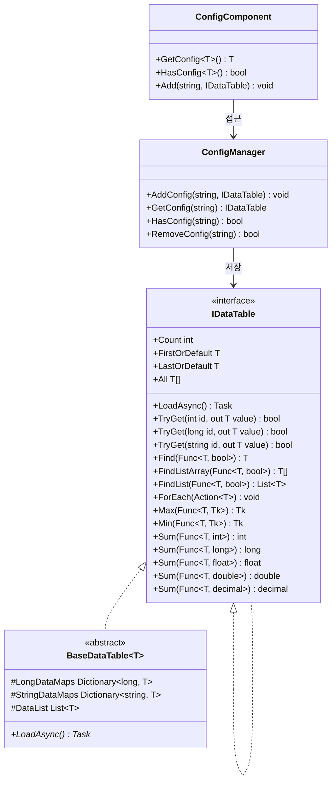
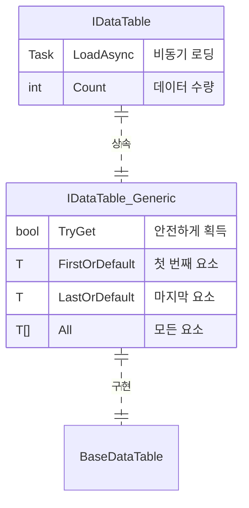

# IDataTable 데이터표 인터페이스

IDataTable는 GameFrameX Config 모듈의 핵심 인터페이스로, 구성 데이터표에 대한 통일된 접근 방식을 제공합니다. 이 인터페이스는 다중 주요 키 유형(int, long, string)을 지원하며, 풍부한 데이터 조회 및 집계 조작을 제공합니다.

## 개요

IDataTable 인터페이스는 구성 데이터표의 베이스 추상 계층으로, 게임 개발에서 정적 구성 데이터 관리 설계를 위해 사용됩니다. 제네릭 설계를 채택하여 강형 데이터 접근을 지원하면서 유연한 조회 능력도 유지합니다.

이 인터페이스는 이중 계층 구조 설계를 채택합니다:
- **IDataTable**: 비제네릭 베이스 인터페이스, 공통 로딩 및 데이터 수량 기능 정의
- **IDataTable<T>**: 제네릭 인터페이스, IDataTable를 상속하여 풍부한 데이터 접근 및 조회 메서드 제공

### 설계 의도

IDataTable 인터페이스 설계는 다음 원칙을 따릅니다:

1. **유형 안전성**: 제네릭 인터페이스를 통해 컴파일 시 유형 검사 보장
2. **통일 접근**: 다중 주요 키 유형의 접근 방식 제공, 서로 다른 구성 데이터 구조에 적응
3. **유연한 조회**: LINQ 스타일 조건 조회 및 집계 계산 지원
4. **비동기 로딩**: 데이터 비동기 로딩 지원, 게임 시작 성능 향상

## 아키텍처

다음은 Config 시스템에서 IDataTable의 아키텍처 관계입니다:



### 핵심 컴포넌트 설명

| 컴포넌트 | 책임 |
|------|------|
| **IDataTable** | 비제네릭 베이스 인터페이스, 로딩 및 수량 기능 정의 |
| **IDataTable<T>** | 제네릭 인터페이스, 강형 데이터 접근 메서드 제공 |
| **BaseDataTable<T>** | 추상 베이스 클래스, 핵심 저장 로직(사전+리스트) 구현 |
| **ConfigManager** | 전역 구성 관리자, 모든 IDataTable 인스턴스 저장 및 관리 담당 |
| **ConfigComponent** | Unity 컴포넌트 캡슐화, 사용자에게 편리한 접근 방법 제공 |

## 데이터표 상속 구조

IDataTable<T> 인터페이스는 IDataTable를 상속하여 완전한 인터페이스 체계를 형성합니다:



## 사용 예시

### 기초 사용

다음 예시는 BaseDataTable을 상속하는 데이터표 클래스를 정의하는 방법을 보여줍니다:

```csharp
using GameFrameX.Config.Runtime;

// 데이터표 요소 유형 정의
public class ItemData
{
    public int Id { get; set; }
    public string Name { get; set; }
    public int Level { get; set; }
    public int Price { get; set; }
}

// 데이터표 구현 클래스 정의
public class ItemDataTable : BaseDataTable<ItemData>
{
    public override async Task LoadAsync()
    {
        // 여기서 데이터 로딩 로직 구현
        // 예: 구성 파일에서 데이터를 로드하고 LongDataMaps와 StringDataMaps에 채우기
        var dataList = new List<ItemData>
        {
            new ItemData { Id = 1, Name = "무기", Level = 1, Price = 100 },
            new ItemData { Id = 2, Name = "방어구", Level = 1, Price = 80 },
            new ItemData { Id = 3, Name = "포션", Level = 1, Price = 10 }
        };
        
        foreach (var data in dataList)
        {
            LongDataMaps[data.Id] = data;
            StringDataMaps[data.Name] = data;
            DataList.Add(data);
        }
    }
}
```
> Source: [IDataTable.cs](https://github.com/GameFrameX/com.gameframex.unity.config/blob/main/Runtime/Config/Config/IDataTable.cs#L46-L77)
> Source: [BaseDataTable.cs](https://github.com/GameFrameX/com.gameframex.unity.config/blob/main/Runtime/Config/Config/BaseDataTable.cs#L46-L70)

### 데이터 조회

데이터표 로드 후 다양한 방식으로 데이터를 조회할 수 있습니다:

```csharp
// 데이터표 인스턴스 획득 (ConfigComponent를 통해)
var configComponent = UnityEngine.GameObject.FindObjectOfType<ConfigComponent>();
var itemDataTable = configComponent.GetConfig<ItemDataTable>();

// 정수 주요 키로 획득 (TryGet 사용 권장)
ItemData item1 = itemDataTable[1];

// 문자열 키로 획득
ItemData item2 = itemDataTable["무기"];

// 안전하게 획득 (권장, null 참조 예외 피함)
if (itemDataTable.TryGet(1, out ItemData item3))
{
    UnityEngine.Debug.Log($"아이템 찾음: {item3.Name}");
}

// 첫 번째 및 마지막 요소 획득
ItemData first = itemDataTable.FirstOrDefault;
ItemData last = itemDataTable.LastOrDefault;

// 모든 요소 획득
ItemData[] allItems = itemDataTable.All;
```
> Source: [BaseDataTable.cs](https://github.com/GameFrameX/com.gameframex.unity.config/blob/main/Runtime/Config/Config/BaseDataTable.cs#L119-L204)

### 조건 조회

LINQ 스타일 조건 조회 사용:

```csharp
// 첫 번째 일치 요소 찾기
ItemData found = itemDataTable.Find(item => item.Level == 1);

// 모든 일치 요소 찾기 (배열)
ItemData[] level1Items = itemDataTable.FindListArray(item => item.Level == 1);

// 모든 일치 요소 찾기 (리스트)
List<ItemData> cheapItems = itemDataTable.FindList(item => item.Price < 50);

// 모든 요소 순회
itemDataTable.ForEach(item => 
{
    UnityEngine.Debug.Log($"아이템: {item.Name}, 가격: {item.Price}");
});
```
> Source: [BaseDataTable.cs](https://github.com/GameFrameX/com.gameframex.unity.config/blob/main/Runtime/Config/Config/BaseDataTable.cs#L296-L349)

### 집계 조작

데이터표는 다양한 집계 계산을 지원합니다:

```csharp
// 합계 계산
int totalPrice = itemDataTable.Sum(item => item.Price);

// 최대값 획득
int maxLevel = itemDataTable.Max(item => item.Level);

// 최소값 획득
int minPrice = itemDataTable.Min(item => item.Price);

// 요소 수량 획득
int count = itemDataTable.Count;
```
> Source: [BaseDataTable.cs](https://github.com/GameFrameX/com.gameframex.unity.config/blob/main/Runtime/Config/Config/BaseDataTable.cs#L351-L449)

## API 참고

### IDataTable 인터페이스

비제네릭 베이스 인터페이스, 데이터표 기본 기능 정의.

#### `Task LoadAsync()`

데이터표 비동기 로딩.

**반환:** 비동기 작업을 나타내는 태스크

```csharp
await itemDataTable.LoadAsync();
```

#### `int Count { get; }`

데이터표에 있는 객체 수량 획득.

**반환:** 데이터표에 있는 객체 수량

---

### IDataTable<T> 인터페이스

제네릭 인터페이스, 강형 데이터 접근 및 조회 기능 제공.

#### `bool TryGet(int id, out T value)`

정수 ID에 따라 객체 가져오기 시도.

**매개변수:**
- `id` (int): 가져올 객체의 정수 ID
- `value` (out T): 해당 ID의 객체를 찾으면 반환하고, 그렇지 않으면 기본값 반환

**반환:** 해당 ID의 객체를 찾으면 `true`; 그렇지 않으면 `false`

#### `bool TryGet(long id, out T value)`

long 정수 ID에 따라 객체 가져오기 시도.

**매개변수:**
- `id` (long): 가져올 객체의 long 정수 ID
- `value` (out T): 해당 ID의 객체를 찾으면 반환하고, 그렇지 않으면 기본값 반환

**반환:** 해당 ID의 객체를 찾으면 `true`; 그렇지 않으면 `false`

#### `bool TryGet(string id, out T value)`

문자열 ID에 따라 객체 가져오기 시도.

**매개변수:**
- `id` (string): 가져올 객체의 문자열 ID
- `value` (out T): 해당 ID의 객체를 찾으면 반환하고, 그렇지 않으면 기본값 반환

**반환:** 해당 ID의 객체를 찾으면 `true`; 그렇지 않으면 `false`

#### `T this[int id] { get; }`

정수 주요 키에 따라 데이터표의 객체 획득.

**매개변수:**
- `id` (int): 가져올 객체의 정수 주요 키

**반환:** 지정 주요 키에 연관된 데이터 객체; 찾지 못하면 `null` 반환

#### `T this[long id] { get; }`

long 정수 주요 키에 따라 데이터표의 객체 획득.

**매개변수:**
- `id` (long): 가져올 객체의 long 정수 주요 키

**반환:** 지정 주요 키에 연관된 데이터 객체; 찾지 못하면 `null` 반환

#### `T this[string id] { get; }`

문자열 키에 따라 데이터표의 객체 획득.

**매개변수:**
- `id` (string): 가져올 객체의 문자열 키

**반환:** 지정 키에 연관된 데이터 객체; 찾지 못하면 `null` 반환

#### `T FirstOrDefault { get; }`

데이터표의 첫 번째 객체 획득.

**반환:** 데이터표가 비어 있으면 `null`; 그렇지 않으면 첫 번째 객체

#### `T LastOrDefault { get; }`

데이터표의 마지막 객체 획득.

**반환:** 데이터표가 비어 있으면 `null`; 그렇지 않으면 마지막 객체

#### `T[] All { get; }`

데이터표의 모든 객체 획득.

**반환:** 데이터표의 모든 객체를 포함하는 배열

#### `T[] ToArray()`

데이터표의 모든 객체를 새 배열에 복사.

**반환:** 데이터표의 모든 객체를 포함하는 새 배열

#### `List<T> ToList()`

데이터표의 모든 객체를 새 리스트에 복사.

**반환:** 데이터표의 모든 객체를 포함하는 새 리스트

#### `T Find(Func<T, bool> func)`

조건에 따라 첫 번째 일치 객체 찾기.

**매개변수:**
- `func` (Func<T, bool>): 일치 조건을 정의하는 함수

**반환:** 일치 객체를 찾으면 해당 객체 반환; 찾지 못하면 `null`

#### `T[] FindListArray(Func<T, bool> func)`

조건에 따라 모든 일치 객체를 찾고 배열 반환.

**매개변수:**
- `func` (Func<T, bool>): 일치 조건을 정의하는 함수

**반환:** 모든 일치 객체를 포함하는 배열

#### `List<T> FindList(Func<T, bool> func)`

조건에 따라 모든 일치 객체를 찾고 리스트 반환.

**매개변수:**
- `func` (Func<T, bool>): 일치 조건을 정의하는 함수

**반환:** 모든 일치 객체를 포함하는 리스트

#### `void ForEach(Action<T> func)`

데이터표의 각 요소에 대해 지정된 조작 실행.

**매개변수:**
- `func` (Action<T>): 각 요소에 대해 실행할 조작

#### `Tk Max<Tk>(Func<T, Tk> func) where Tk : IComparable<Tk>`

데이터표의 지정 속성 최대값 획득.

**매개변수:**
- `func` (Func<T, Tk>): 비교값을 획득하는 함수

**유형 매개변수:**
- `Tk`: 비교값 유형, 반드시 `IComparable<Tk>` 인터페이스를 구현해야 함

**반환:** 지정 속성의 최대값

#### `Tk Min<Tk>(Func<T, Tk> func) where Tk : IComparable<Tk>`

데이터표의 지정 속성 최소값 획득.

**매개변수:**
- `func` (Func<T, Tk>): 비교값을 획득하는 함수

**유형 매개변수:**
- `Tk`: 비교값 유형, 반드시 `IComparable<Tk>` 인터페이스를 구현해야 함

**반환:** 지정 속성의 최소값

#### `int Sum(Func<T, int> func)`

데이터표의 지정 `int` 속성 합계 계산.

**매개변수:**
- `func` (Func<T, int>): 합산값을 획득하는 함수

**반환:** 지정 속성의 합계

#### `long Sum(Func<T, long> func)`

데이터표의 지정 `long` 속성 합계 계산.

**매개변수:**
- `func` (Func<T, long>): 합산값을 획득하는 함수

**반환:** 지정 속성의 합계

#### `float Sum(Func<T, float> func)`

데이터표의 지정 `float` 속성 합계 계산.

**매개변수:**
- `func` (Func<T, float>): 합산값을 획득하는 함수

**반환:** 지정 속성의 합계

#### `double Sum(Func<T, double> func)`

데이터표의 지정 `double` 속성 합계 계산.

**매개변수:**
- `func` (Func<T, double>): 합산값을 획득하는 함수

**반환:** 지정 속성의 합계

#### `decimal Sum(Func<T, decimal> func)`

데이터표의 지정 `decimal` 속성 합계 계산.

**매개변수:**
- `func` (Func<T, decimal>): 합산값을 획득하는 함수

**반환:** 지정 속성의 합계

## 관련 링크

- [ConfigComponent 구성 컴포넌트](./10.config-component)
- [ConfigManager 구성 관리자](./09.config-manager)
- [API 참고](./06.interfaces)
- [데이터표 정의](./08.data-table-definition)